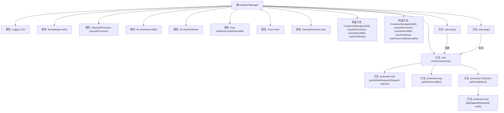

# 基础信息

|      |      |
|------|------|
| 名称 | ContainerManager |
| 编码语言 | .java |
| 代码路径 | zookeeper/zookeeper-server/src/main/java/org/apache/zookeeper/server/ContainerManager.java |
| 包名 | org.apache.zookeeper.server |
| 依赖项 | ['java.util.Collection', 'java.util.HashSet', 'java.util.Set', 'java.util.Timer', 'java.util.TimerTask', 'java.util.concurrent.TimeUnit', 'java.util.concurrent.atomic.AtomicReference', 'org.apache.zookeeper.DeleteContainerRequest', 'org.apache.zookeeper.ZooDefs', 'org.apache.zookeeper.common.Time', 'org.slf4j.Logger', 'org.slf4j.LoggerFactory'] |
| 概述说明 | ContainerManager类管理ZK容器，定时检查并删除空容器，支持设置检查间隔、每分钟最大删除数和未使用容器保留时间。提供启动、停止和手动检查功能。 |

# 说明

ContainerManager类负责管理容器删除任务，通过定时检查并删除符合条件的容器。主要功能包括：初始化时设置检查间隔、每分钟最大删除数和未使用容器保留时间；启动或停止定时任务；手动检查容器并发送删除请求；筛选待删除容器候选列表，包括空容器和过期TTL节点。通过日志记录操作状态，确保删除操作可控且避免集中删除导致的系统负载。

# 类列表 Class Summary

| 名称   | 类型  | 说明 |
|-------|------|-------------|
| ContainerManager | class | ContainerManager管理ZK容器，定时检查并删除空容器，支持设置检查间隔、每分钟最大删除数和未使用容器保留时间。提供启动、停止和手动检查功能。 |


## 类 ContainerManager

|      |      |
|------|------|
| 访问范围 | public |
| 类型 | class |
| 名称 | ContainerManager |
| 说明 | ContainerManager管理ZK容器，定时检查并删除空容器，支持设置检查间隔、每分钟最大删除数和未使用容器保留时间。提供启动、停止和手动检查功能。 |


### UML类图

```mermaid
classDiagram
    class ContainerManager {
        -Logger LOG
        -ZKDatabase zkDb
        -RequestProcessor requestProcessor
        -int checkIntervalMs
        -int maxPerMinute
        -long maxNeverUsedIntervalMs
        -Timer timer
        -AtomicReference~TimerTask~ task
        +ContainerManager(ZKDatabase zkDb, RequestProcessor requestProcessor, int checkIntervalMs, int maxPerMinute)
        +ContainerManager(ZKDatabase zkDb, RequestProcessor requestProcessor, int checkIntervalMs, int maxPerMinute, long maxNeverUsedIntervalMs)
        +void start()
        +void stop()
        +void checkContainers() throws InterruptedException
        #void postDeleteRequest(Request request) throws RequestProcessor.RequestProcessorException
        #long getMinIntervalMs()
        #Collection~String~ getCandidates()
        #long getElapsed(DataNode node)
    }

    class ZKDatabase {
        +DataTree getDataTree()
    }

    class RequestProcessor {
        <<Interface>>
        +void processRequest(Request request) throws RequestProcessorException
    }

    class DataTree {
        +Set~String~ getContainers()
        +Set~String~ getTtls()
        +DataNode getNode(String path)
    }

    class DataNode {
        -Stat stat
        +Set~String~ getChildren()
    }

    class Timer {
        +void scheduleAtFixedRate(TimerTask task, long delay, long period)
        +void cancel()
    }

    class TimerTask {
        <<Abstract>>
        +void run()
        +void cancel()
    }

    class Request {
        +Request(Object sessionId, int xid, int type, int opCode, RequestRecord record, Object authInfo)
    }

    class DeleteContainerRequest {
        +DeleteContainerRequest(String containerPath)
    }

    class EphemeralType {
        <<Enumeration>>
        +TTL
        +get(int ephemeralOwner)
        +getValue(int ephemeralOwner)
    }

    ContainerManager --> ZKDatabase : 使用
    ContainerManager --> RequestProcessor : 依赖
    ContainerManager --> Timer : 包含
    ContainerManager --> TimerTask : 包含
    ZKDatabase --> DataTree : 包含
    DataTree --> DataNode : 包含
    RequestProcessor <|.. ContainerManager : 实现
    TimerTask <|-- ContainerManager$1 : 匿名实现
    Request <-- ContainerManager : 创建
    DeleteContainerRequest <-- ContainerManager : 创建
    DataNode --> Stat : 包含
    DataNode --> EphemeralType : 使用
```

这段代码展示了一个容器管理系统，主要用于定期检查和删除符合条件的容器节点。ContainerManager类通过ZKDatabase访问数据，使用RequestProcessor处理删除请求，并通过Timer实现定时任务。系统支持配置检查间隔、最大删除速率和未使用容器的保留时间，通过复杂的候选容器筛选逻辑确保删除操作的合理性。类图清晰地展示了各组件间的依赖关系和职责划分，体现了高内聚低耦合的设计原则。


### 内部方法调用关系图



流程图描述：该流程图展示了ContainerManager类的结构和主要方法调用关系。类包含8个私有属性和7个核心方法，其中checkContainers()是核心业务逻辑，会调用postDeleteRequest()、getMinIntervalMs()和getCandidates()等方法。start()方法通过定时器触发checkContainers()执行，stop()方法则终止定时任务。getCandidates()方法内部会调用getElapsed()来计算节点存活时间，整个流程实现了容器定期检查和清理的功能。

### 字段列表 Field List

| 名称  | 类型  | 说明 |
|-------|-------|------|
| checkIntervalMs | int | 私有整型常量checkIntervalMs，表示检查间隔毫秒数。 |
| zkDb | ZKDatabase | 私有不可变的ZKDatabase实例变量zkDb。 |
| maxPerMinute | int | 私有整型变量maxPerMinute，限制每分钟最大次数。 |
| maxNeverUsedIntervalMs | long | 私有长整型变量maxNeverUsedIntervalMs，表示最大未使用间隔时间（毫秒）。 |
| task = new AtomicReference<>(null) | AtomicReference<TimerTask> | 私有原子引用变量task，初始值为null，用于线程安全地管理TimerTask对象。 |
| LOG = LoggerFactory.getLogger(ContainerManager.class) | Logger | 声明ContainerManager类的私有静态日志常量LOG。 |
| timer | Timer | 私有定时器变量timer。 |
| requestProcessor | RequestProcessor | 私有不可变的请求处理器实例。 |

### 方法列表 Method List

| 名称  | 类型  | 说明 |
|-------|-------|------|
| start | void | 方法start()检查task是否为空，若空则创建定时任务TimerTask，定期执行checkContainers()。处理中断和异常，成功设置任务后启动定时调度。 |
| checkContainers | void | 方法checkContainers遍历候选容器路径，依次发送删除请求并记录耗时。若操作间隔未达最小时间要求，则休眠补足。异常时记录日志但继续执行。 |
| getCandidates | Collection<String> | 获取待删除候选节点：空容器节点（创建后无子节点且cversion>0，或超时未使用）和过期TTL节点（无子节点且超过TTL时间）。 |
| stop | void | 停止定时任务：获取并清空当前任务，若存在则取消；最后取消定时器。 |
| postDeleteRequest | void | Java方法postDeleteRequest处理删除请求，调用requestProcessor处理请求，可能抛出RequestProcessorException异常。 |
| getMinIntervalMs | long | 方法返回每分钟最小间隔毫秒数，计算方式为1分钟毫秒数除以每分钟最大次数。 |
| getElapsed | long | 方法getElapsed计算节点当前时间与修改时间的差值，返回时间间隔。 |


