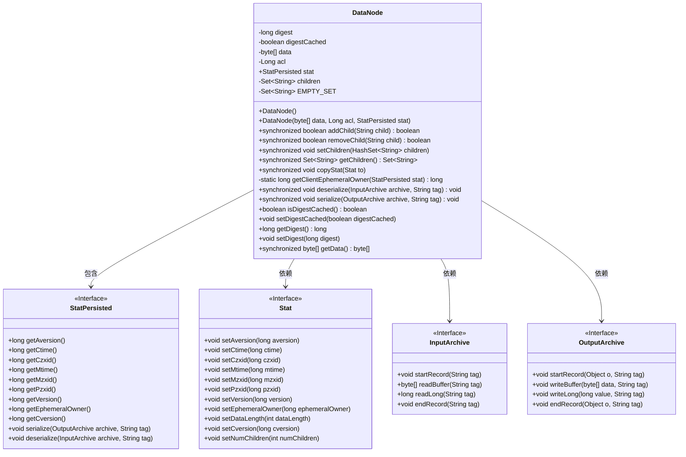

# 基础信息

|      |      |
|------|------|
| 名称 | DataNode |
| 编码语言 | .java |
| 代码路径 | zookeeper/zookeeper-server/src/main/java/org/apache/zookeeper/server/DataNode.java |
| 包名 | org.apache.zookeeper.server |
| 依赖项 | ['edu.umd.cs.findbugs.annotations.SuppressFBWarnings', 'java.io.IOException', 'java.util.Collections', 'java.util.HashSet', 'java.util.Set', 'org.apache.jute.InputArchive', 'org.apache.jute.OutputArchive', 'org.apache.jute.Record', 'org.apache.zookeeper.data.Stat', 'org.apache.zookeeper.data.StatPersisted'] |
| 概述说明 | DataNode类表示数据节点，包含数据、ACL、状态和子节点集合。提供同步方法管理子节点，支持序列化和反序列化操作。摘要缓存优化性能。 |

# 说明

DataNode类是一个记录节点数据的实现，包含摘要值、数据、ACL、状态和子节点集合。摘要值用于优化性能，数据以字节数组存储，ACL为长整型，状态由StatPersisted对象管理。子节点通过同步方法进行增删改查，确保线程安全。提供序列化和反序列化方法，支持数据持久化。摘要缓存状态可查询和设置，数据访问也通过同步方法保证一致性。该类还包含状态拷贝方法，用于将内部状态转换为外部Stat对象。

# 类列表 Class Summary

| 名称   | 类型  | 说明 |
|-------|------|-------------|
| DataNode | class | DataNode类表示数据节点，包含数据、ACL、状态和子节点集合。提供同步方法管理子节点，支持序列化和反序列化操作。 |

## 类 DataNode

|      |      |
|------|------|
| 访问范围 | @SuppressFBWarnings({"EI_EXPOSE_REP", "EI_EXPOSE_REP2"});public |
| 类型 | class |
| 名称 | DataNode |
| 说明 | DataNode类表示数据节点，包含数据、ACL、状态和子节点集合。提供同步方法管理子节点，支持序列化和反序列化操作。 |

### UML类图

这段代码定义了一个`DataNode`类，实现了`Record`接口，用于表示数据节点。该类包含数据内容、访问控制列表(ACL)、节点状态(stat)和子节点集合等核心属性，提供了子节点管理、状态复制、序列化/反序列化等功能。通过同步方法确保线程安全，使用`volatile`关键字保证`digest`和`digestCached`的可见性。类图中展示了`DataNode`与`StatPersisted`、`Stat`等接口的关系，以及其依赖的序列化接口`InputArchive`和`OutputArchive`。

### 内部方法调用关系图

```mermaid
graph TD
    A["类DataNode"]
    B["属性: long digest"]
    C["属性: boolean digestCached"]
    D["属性: byte[] data"]
    E["属性: Long acl"]
    F["属性: StatPersisted stat"]
    G["属性: Set<String> children"]
    H["常量: EMPTY_SET"]
    I["构造方法: DataNode()"]
    J["构造方法: DataNode(byte[] data, Long acl, StatPersisted stat)"]
    K["方法: addChild(String child)"]
    L["方法: removeChild(String child)"]
    M["方法: setChildren(HashSet<String> children)"]
    N["方法: getChildren()"]
    O["方法: copyStat(Stat to)"]
    P["方法: getClientEphemeralOwner(StatPersisted stat)"]
    Q["方法: deserialize(InputArchive archive, String tag)"]
    R["方法: serialize(OutputArchive archive, String tag)"]
    S["方法: isDigestCached()"]
    T["方法: setDigestCached(boolean digestCached)"]
    U["方法: getDigest()"]
    V["方法: setDigest(long digest)"]
    W["方法: getData()"]

    A --> B
    A --> C
    A --> D
    A --> E
    A --> F
    A --> G
    A --> H
    A --> I
    A --> J
    A --> K
    A --> L
    A --> M
    A --> N
    A --> O
    O --> P
    A --> Q
    A --> R
    A --> S
    A --> T
    A --> U
    A --> V
    A --> W
```

这段代码定义了一个DataNode类，实现了Record接口，主要用于管理节点的数据、权限、状态和子节点。类中包含多个同步方法用于操作子节点集合，以及序列化和反序列化方法用于数据持久化。digest和digestCached属性用于优化性能，通过缓存摘要值减少计算开销。copyStat方法用于复制节点状态信息，包含版本控制和时间戳等元数据。整体设计注重线程安全，通过synchronized关键字保证并发操作的正确性。

### 字段列表 Field List

| 名称  | 类型  | 说明 |
|-------|-------|------|
| digest | long | 私有可变长整型摘要变量。 |
| children = null | Set<String> | 私有字符串集合children初始化为空。 |
| acl | Long | 访问控制列表（ACL）用于管理网络流量，通过规则允许或拒绝数据包传输，确保网络安全。 |
| data | byte[] | 字节数组数据存储变量。 |
| EMPTY_SET = Collections.emptySet() | Set<String> | 声明一个不可变的空字符串集合常量EMPTY_SET。 |
| digestCached | boolean | 声明一个易变的布尔变量digestCached。 |
| stat | StatPersisted | 声明一个名为stat的静态持久化变量，类型为StatPersisted。 |

### 方法列表 Method List

| 名称  | 类型  | 说明 |
|-------|-------|------|
| setDigest | void | 设置长整型digest值的方法。 |
| getDigest | long | 获取digest值的公开方法，返回类型为long。 |
| isDigestCached | boolean | 方法isDigestCached返回布尔值digestCached，表示摘要是否已缓存。 |
| getChildren | Set<String> | 同步方法返回不可修改的子集，若子集为空则返回空集合。 |
| addChild | boolean | 同步方法`addChild`向HashSet集合`children`添加子节点，初始容量为8。成功添加返回true，否则false。 |
| setChildren | void | 同步方法设置子节点集合，将输入HashSet赋值给成员变量children。 |
| getData | byte[] | 同步方法返回字节数组data。 |
| deserialize | void | 同步方法反序列化节点数据：读取数据、ACL和状态信息，完成记录解析。 |
| setDigestCached | void | 方法setDigestCached用于设置digestCached的布尔值状态。 |
| serialize | void | 同步方法serialize将节点数据序列化到输出存档，包括数据、ACL和状态信息，使用指定标签标记记录。 |
| getClientEphemeralOwner | long | 方法`getClientEphemeralOwner`检查`stat`的临时类型，若非`NORMAL`则返回0，否则返回`stat`的临时所有者ID。 |
| removeChild | boolean | 同步方法removeChild移除指定子节点，成功返回true，失败或子节点列表为空返回false。 |
| copyStat | void | 同步方法copyStat将源Stat对象属性复制到目标对象，包括版本、时间戳、数据长度等，并计算子节点数量及调整Cversion值。 |

