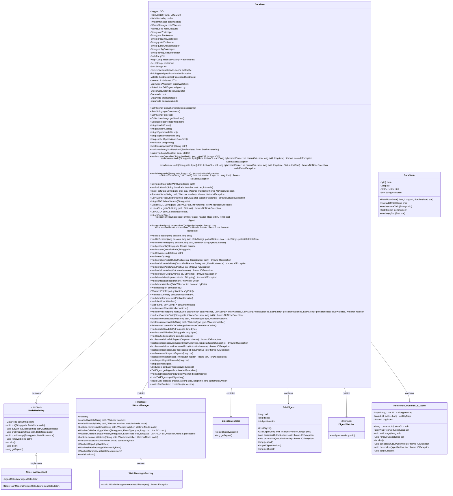
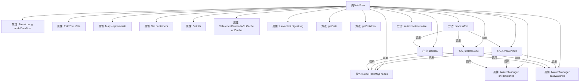

# 基础信息

|      |      |
|------|------|
| 名称 | DataTree |
| 编码语言 | .java |
| 代码路径 | zookeeper/zookeeper-server/src/main/java/org/apache/zookeeper/server/DataTree.java |
| 包名 | org.apache.zookeeper.server |
| 依赖项 | ['java.io.EOFException', 'java.io.IOException', 'java.io.PrintWriter', 'java.util.ArrayList', 'java.util.Collection', 'java.util.Collections', 'java.util.HashMap', 'java.util.HashSet', 'java.util.LinkedList', 'java.util.List', 'java.util.Map', 'java.util.Map.Entry', 'java.util.Set', 'java.util.concurrent.ConcurrentHashMap', 'java.util.concurrent.atomic.AtomicLong', 'java.util.function.Supplier', 'org.apache.jute.InputArchive', 'org.apache.jute.OutputArchive', 'org.apache.jute.Record', 'org.apache.zookeeper.DigestWatcher', 'org.apache.zookeeper.KeeperException', 'org.apache.zookeeper.KeeperException.Code', 'org.apache.zookeeper.KeeperException.NoNodeException', 'org.apache.zookeeper.KeeperException.NodeExistsException', 'org.apache.zookeeper.Quotas', 'org.apache.zookeeper.StatsTrack', 'org.apache.zookeeper.WatchedEvent', 'org.apache.zookeeper.Watcher', 'org.apache.zookeeper.Watcher.Event', 'org.apache.zookeeper.Watcher.Event.EventType', 'org.apache.zookeeper.Watcher.Event.KeeperState', 'org.apache.zookeeper.Watcher.WatcherType', 'org.apache.zookeeper.ZooDefs', 'org.apache.zookeeper.ZooDefs.OpCode', 'org.apache.zookeeper.audit.AuditConstants', 'org.apache.zookeeper.audit.AuditEvent.Result', 'org.apache.zookeeper.audit.ZKAuditProvider', 'org.apache.zookeeper.common.PathTrie', 'org.apache.zookeeper.common.PathUtils', 'org.apache.zookeeper.data.ACL', 'org.apache.zookeeper.data.Stat', 'org.apache.zookeeper.data.StatPersisted', 'org.apache.zookeeper.server.watch.IWatchManager', 'org.apache.zookeeper.server.watch.WatchManagerFactory', 'org.apache.zookeeper.server.watch.WatcherMode', 'org.apache.zookeeper.server.watch.WatcherOrBitSet', 'org.apache.zookeeper.server.watch.WatchesPathReport', 'org.apache.zookeeper.server.watch.WatchesReport', 'org.apache.zookeeper.server.watch.WatchesSummary', 'org.apache.zookeeper.txn.CheckVersionTxn', 'org.apache.zookeeper.txn.CloseSessionTxn', 'org.apache.zookeeper.txn.CreateContainerTxn', 'org.apache.zookeeper.txn.CreateTTLTxn', 'org.apache.zookeeper.txn.CreateTxn', 'org.apache.zookeeper.txn.DeleteTxn', 'org.apache.zookeeper.txn.ErrorTxn', 'org.apache.zookeeper.txn.MultiTxn', 'org.apache.zookeeper.txn.SetACLTxn', 'org.apache.zookeeper.txn.SetDataTxn', 'org.apache.zookeeper.txn.Txn', 'org.apache.zookeeper.txn.TxnDigest', 'org.apache.zookeeper.txn.TxnHeader', 'org.apache.zookeeper.util.ServiceUtils', 'org.slf4j.Logger', 'org.slf4j.LoggerFactory'] |
| 概述说明 | DataTree是ZooKeeper的核心数据结构，用于存储所有节点数据。主要功能包括：节点增删改查、ACL管理、配额控制、会话管理、数据变更监听。关键特性：支持临时节点、容器节点、TTL节点；通过哈希表快速查找节点；维护节点大小统计；提供数据校验机制；支持事务处理与快照序列化。 |

# 说明

DataTree类是ZooKeeper中用于管理所有数据节点的核心数据结构。它使用哈希表快速查找节点，同时维护树形结构作为数据源。主要功能包括：节点创建/删除、数据读写、ACL管理、配额控制、临时节点管理、容器/TTL节点管理等。关键特性有：1) 使用NodeHashMap实现快速节点查找；2) 维护数据节点大小统计；3) 支持多种节点类型(普通/临时/容器/TTL)；4) 实现配额管理机制；5) 提供数据校验功能；6) 支持事务处理与数据序列化；7) 管理数据变更监听器。类中还包含特殊路径处理(/zookeeper)、会话管理、数据一致性检查等功能，是ZooKeeper数据存储的核心实现。

# 类列表 Class Summary

| 名称   | 类型  | 说明 |
|-------|------|-------------|
| DataTree | class | DataTree是ZooKeeper的核心数据结构，用于存储所有节点数据。主要功能包括：节点增删改查、ACL管理、配额控制、临时节点管理、数据变更监听和事务处理。关键组件包含节点哈希表、配额路径树、ACL缓存和会话临时节点映射。支持数据序列化、快照恢复和一致性校验，通过摘要算法保障数据完整性。 |

## 类 DataTree

|      |      |
|------|------|
| 访问范围 | public |
| 类型 | class |
| 名称 | DataTree |
| 说明 | DataTree是ZooKeeper的核心数据结构，用于存储所有节点数据。主要功能包括：节点增删改查、ACL管理、配额控制、临时节点管理、数据变更监听和事务处理。关键组件包含节点哈希表、配额路径树、ACL缓存和会话临时节点映射。支持数据序列化、快照恢复和一致性校验，通过摘要算法保障数据完整性。 |

### UML类图

这段代码定义了一个ZooKeeper的核心数据结构DataTree，它维护了一个树形结构的节点集合，提供了节点的增删改查、ACL管理、配额管理、会话管理等功能。DataTree使用NodeHashMap来存储节点，支持快速查找，同时通过IWatchManager管理数据变更的监听器。ReferenceCountedACLCache用于高效管理ACL权限，DigestCalculator和ZxidDigest用于数据一致性的校验。整个类设计复杂，处理了各种边缘情况如会话过期、配额检查、数据序列化等，是ZooKeeper实现分布式协调服务的核心组件。

### 内部方法调用关系图

这段代码实现了一个ZooKeeper的核心数据结构DataTree，用于维护所有Znode节点的层级关系和状态。主要功能包括节点创建/删除、数据读写、ACL管理、事务处理、序列化/反序列化等。通过NodeHashMap快速查找节点，使用PathTrie管理配额路径，通过WatchManager处理监听事件，并实现了数据校验机制。代码结构清晰，通过同步块保证线程安全，处理了各种边界情况如节点不存在、配额更新等。

### 字段列表 Field List

| 名称  | 类型  | 说明 |
|-------|-------|------|
| rootZookeeper = "/" | String | 私有静态常量字符串rootZookeeper被赋值为根路径"/"。 |
| DIGEST_LOG_INTERVAL = 128 | int | 静态常量DIGEST_LOG_INTERVAL值为128，用于日志摘要间隔。 |
| quotaDataNode = new DataNode(new byte[0], -1L, new StatPersisted()) | DataNode | 私有final变量quotaDataNode初始化为空字节数组、-1长整型和StatPersisted实例的新DataNode对象。 |
| procDataNode = new DataNode(new byte[0], -1L, new StatPersisted()) | DataNode | 私有数据节点procDataNode初始化为空字节数组，大小为-1，包含持久化状态统计信息。 |
| digestLog = new LinkedList<>() | LinkedList<ZxidDigest> | 私有链表变量digestLog，存储ZxidDigest类型元素。 |
| quotaZookeeper = Quotas.quotaZookeeper | String | 私有静态常量quotaZookeeper引用Quotas类的quotaZookeeper字段。 |
| firstMismatchTxn = true | boolean | 变量firstMismatchTxn初始化为true，用于标识首次交易不匹配。 |
| pTrie = new PathTrie() | PathTrie | 私有路径树实例pTrie，使用PathTrie类初始化。 |
| LOG = LoggerFactory.getLogger(DataTree.class) | Logger | 定义DataTree类的私有静态日志对象LOG，使用LoggerFactory创建。 |
| quotaChildZookeeper = quotaZookeeper.substring(procZookeeper.length() + 1) | String | 从quotaZookeeper截取procZookeeper长度加1后的子字符串赋值给quotaChildZookeeper。 |
| ttls = Collections.newSetFromMap(new ConcurrentHashMap<>()) | Set<String> | 私有并发集合ttls，使用ConcurrentHashMap实现线程安全，存储字符串元素。 |
| ephemerals = new ConcurrentHashMap<>() | Map<Long, HashSet<String>> | 私有并发映射，键为长整型，值为字符串哈希集，用于临时存储。 |
| root = new DataNode(new byte[0], -1L, new StatPersisted()) | DataNode | 初始化一个私有DataNode实例root，包含空字节数组、长整型-1和StatPersisted对象。 |
| nodes | NodeHashMap | 私有成员变量nodes，类型为NodeHashMap。 |
| lastProcessedZxidDigest | ZxidDigest | 私有易变变量lastProcessedZxidDigest，类型为ZxidDigest。 |
| STAT_OVERHEAD_BYTES = (6 * 8) + (5 * 4) | int | 定义静态常量STAT_OVERHEAD_BYTES，值为6个8字节和5个4字节之和，共68字节。 |
| procZookeeper = Quotas.procZookeeper | String | 私有静态常量procZookeeper引用Quotas类的procZookeeper字段。 |
| lastProcessedZxid = 0 | long | 变量lastProcessedZxid是公开可变的64位长整型，初始值为0。 |
| DIGEST_LOG_LIMIT = 1024 | int | 定义常量DIGEST_LOG_LIMIT，值为1024，表示日志摘要长度限制。 |
| procChildZookeeper = procZookeeper.substring(1) | String | 代码片段将procZookeeper字符串去掉首字符后赋值给procChildZookeeper。 |
| RATE_LOGGER = new RateLogger(LOG, 15 * 60 * 1000) | RateLogger | 私有常量RATE_LOGGER记录日志，间隔15分钟。 |
| configChildZookeeper = configZookeeper.substring(procZookeeper.length() + 1) | String | 从configZookeeper截取procZookeeper之后的部分赋值给configChildZookeeper。 |
| nodeDataSize = new AtomicLong(0) | AtomicLong | 私有原子长整型变量nodeDataSize，初始值为0，用于线程安全的数据大小统计。 |
| configZookeeper = ZooDefs.CONFIG_NODE | String | 私有静态常量configZookeeper引用ZooDefs.CONFIG_NODE配置节点。 |
| digestCalculator | DigestCalculator | 私有不可变的摘要计算器实例。 |
| childWatches | IWatchManager | 私有变量childWatches，类型为IWatchManager。 |
| aclCache = new ReferenceCountedACLCache() | ReferenceCountedACLCache | 私有引用计数ACL缓存实例化。 |
| digestWatchers = new ArrayList<>() | List<DigestWatcher> | 私有列表digestWatchers，用于存储DigestWatcher对象，初始化为空ArrayList。 |
| containers = Collections.newSetFromMap(new ConcurrentHashMap<>()) | Set<String> | 私有并发容器集合，使用ConcurrentHashMap实现线程安全。 |
| digestFromLoadedSnapshot | ZxidDigest | 私有变量digestFromLoadedSnapshot，类型为ZxidDigest，用于存储加载快照的摘要信息。 |
| dataWatches | IWatchManager | 私有变量dataWatches，类型为IWatchManager。 |

### 方法列表 Method List

| 名称  | 类型  | 说明 |
|-------|-------|------|
| getNode | DataNode | 获取指定路径对应的数据节点。方法通过路径从节点映射中直接返回对应节点。 |
| dumpWatchesSummary | void | 同步方法dumpWatchesSummary将dataWatches内容输出到PrintWriter。 |
| serializeNode | void | 方法serializeNode将节点数据序列化到输出存档。检查节点存在后，复制节点状态和子节点列表，序列化节点数据。递归处理每个子节点，重用路径缓冲区以提高效率。 |
| approximateDataSize | long | 

该方法计算所有数据节点总大小，遍历节点并同步加锁，累加各节点大小后返回结果。 |
| serializeNodeData | void | 方法serializeNodeData将路径和节点数据序列化到输出存档，参数包括输出存档oa、路径path和节点node，可能抛出IOException异常。 |
| getEphemerals | Map<Long, Set<String>> | 方法getEphemerals返回一个线程安全的Map副本，其中每个键对应的HashSet通过同步块确保复制时的线程安全。 |
| cachedApproximateDataSize | long | 方法返回节点数据的近似大小，通过nodeDataSize.get()获取长整型值。 |
| getWatchCount | int | 方法返回数据监视和子监视的总数量。 |
| setupQuota | void | 方法setupQuota检查配额路径节点是否存在，存在则遍历该节点。 |
| removeCnxn | void | 该方法移除指定观察者在数据和子节点监听列表中的注册。 |
| deleteNode | void | 删除节点方法：解析路径，检查父节点存在，同步移除子节点并更新pzxid，处理ACL和配额，触发监视事件。 |
| processTxn | ProcessTxnResult | 处理交易并验证摘要：调用processTxn处理交易，用compareDigest验证摘要，返回结果。 |
| getEphemerals | Set<String> | 方法getEphemerals根据sessionId返回临时数据集合，若不存在则返回空集，返回前进行同步克隆确保线程安全。 |
| compareDigest | boolean | 比较事务摘要的方法：检查ZooKeeper摘要功能是否启用、快照状态、版本一致性及实际与日志摘要是否匹配。不匹配时记录错误并返回false，匹配则记录日志并返回true。 |
| getTtls | Set<String> | Java方法：返回ttls集合的副本，类型为Set<String>。 |
| copyStatPersisted | void | 将StatPersisted对象的属性从源对象复制到目标对象，包括版本、时间戳、ID等关键字段。 |
| getNodeSize | long | 计算节点大小的方法，路径长度加数据长度，空值视为0。 |
| processTxn | ProcessTxnResult | 这是一个Java方法，处理事务并返回结果，调用内部重载方法，默认参数为false。 |
| deserializeLastProcessedZxid | boolean | 方法`deserializeLastProcessedZxid`从输入存档读取最后处理的zxid，若未启用序列化或读取失败返回false，成功返回true。处理异常时记录警告日志。 |
| setData | Stat | 方法setData更新节点数据，检查路径是否存在，同步更新节点状态、配额统计和触发数据变更事件。返回节点状态。 |
| dumpWatches | void | 同步方法dumpWatches将监视数据按路径或默认方式输出到指定写入器。 |
| getAllChildrenNumber | int | 方法统计指定路径下的子节点数量。根路径返回总节点数减2，其他路径返回以该路径开头的节点数。使用并行流提高效率。 |
| getData | byte[] | 获取指定路径节点数据，若无节点抛出异常。同步复制节点状态，添加监视器后返回数据。更新读取统计。 |
| getSessions | Collection<Long> | 该方法返回一个长整型集合，包含所有临时会话的键值。 |
| serialize | void | Java方法serialize将ACLs和节点序列化到输出存档，可能抛出IO异常。 |
| getEphemeralsCount | int | 该方法统计并返回所有临时集合中的元素总数，遍历每个集合并累加其大小。 |
| traverseNode | void | 遍历节点路径，检查是否为叶子节点。若是配额限制节点，则更新配额并记录路径。否则递归处理子节点。 |
| getCounts | void | 私有方法`getCounts`递归统计路径下节点数及数据总长度。若节点不存在则返回，否则同步获取子节点数组和数据长度，累加到计数器，并递归处理子节点。 |
| getDigestFromLoadedSnapshot | ZxidDigest | 方法返回已加载快照的摘要信息。 |
| updateReadStat | void | 更新读取统计：根据路径获取命名空间，计算总字节数（路径长度+字节数+固定开销），并更新对应命名空间的读取指标。 |
| containsWatcher | boolean | 检查指定路径和类型的监听器是否存在。根据类型调用不同监听器集合的检查方法，包括子节点、数据、持久化等模式，最终返回是否存在的结果。 |
| serializeAcls | void | 序列化ACL缓存至输出归档，可能抛出IO异常。 |
| setACL | Stat | 方法setACL用于设置节点ACL权限，检查节点存在性，同步更新ACL缓存和节点状态，返回新状态。若节点不存在抛出NoNodeException。 |
| updateQuotaStat | void | 方法updateQuotaStat更新配额统计：根据lastPrefix获取节点路径，检查节点存在性后，同步更新节点的字节数和计数差值。 |
| getACL | List<ACL> | 获取指定路径的ACL列表，若无节点则抛出异常。同步处理节点状态，返回ACL列表副本。 |
| getContainers | Set<String> | 该方法返回容器集合的副本，使用HashSet确保返回结果独立于原始集合。 |
| dumpEphemerals | void | 方法dumpEphemerals输出临时节点信息，先打印会话数量，再遍历每个会话ID及其关联路径集合并同步打印路径，格式为十六进制ID加缩进路径。 |
| getWatchesByPath | WatchesPathReport | 这是一个同步方法，返回路径监控报告。方法名为getWatchesByPath，调用dataWatches对象的getWatchesByPath方法获取结果。 |
| addConfigNode | void | 方法`addConfigNode`检查是否存在`/zookeeper`节点，存在则添加子节点`configChildZookeeper`，否则断言失败。随后创建`configZookeeper`节点并设置访问权限，若节点不存在则断言失败。 |
| setWatches | void | 方法设置节点监视器，处理数据变更、创建、删除及子节点变更事件，支持持久化和递归监视。根据节点状态触发对应事件或添加监视器。 |
| removeWatch | boolean | 方法根据监视类型移除指定路径的监视器，返回是否成功。处理子节点、数据、持久化等不同模式。 |
| getLastProcessedZxidDigest | ZxidDigest | 方法返回最后处理的ZxidDigest对象。 |
| getWatches | WatchesReport | 同步方法getWatches返回dataWatches中的WatchesReport对象。 |
| setCversionPzxid | void | 方法setCversionPzxid更新节点版本和事务ID。若路径以/结尾则移除。检查节点存在性，同步更新版本号（默认+1）和事务ID，确保新版本大于当前值。 |
| serializeZxidDigest | boolean | 检查ZooKeeper摘要功能是否启用，若启用则序列化最后处理的Zxid摘要，否则返回空摘要。成功返回true，失败返回false。 |
| getWatchesSummary | WatchesSummary | 这是一个同步方法，返回数据手表对象的汇总信息。 |
| createNode | void | 该方法用于在ZooKeeper中创建节点，处理路径解析、权限检查、节点数据存储及配额更新等操作。首先验证父节点存在，检查节点是否已存在，更新父节点版本信息，创建新节点并设置ACL。同时处理临时节点、容器节点和TTL节点的特殊逻辑，触发相关事件监听，并更新配额统计信息。 |
| shutdownWatcher | void | 关闭数据监视器和子监视器。 |
| aclCacheSize | int | 该方法返回ACL缓存的大小。 |
| serializeNodes | void | 序列化节点方法，将节点数据写入输出存档，检查根节点是否存在并写入路径标记。 |
| deleteNodes | void | 删除临时节点方法，遍历路径列表，尝试删除并记录日志，成功或失败均审计。 |
| getTreeDigest | long | 该方法返回树结构的摘要值，通过调用nodes对象的getDigest方法实现。 |
| deserializeZxidDigest | boolean | 方法检查ZooKeeper摘要功能是否启用，若启用则从输入反序列化摘要数据。若摘要有效且ZXID不小于快照起始ZXID则存储，否则忽略。处理异常时返回失败。 |
| getChildren | List<String> | 方法获取指定路径的子节点列表。检查节点存在性，同步更新状态和添加监视器。统计子节点总字节数并更新读取状态，最后返回子节点列表。 |
| processTxn | ProcessTxnResult | 处理事务方法，根据不同类型执行创建、删除、设置数据等操作，处理错误并更新状态，确保数据一致性。 |
| deserialize | void | 该方法从输入反序列化数据树，处理节点路径、ACL缓存和配额。遍历路径构建父子关系，处理临时节点，最后更新配额和清理未使用的ACL。 |
| killSession | void | 该方法用于终止会话，从临时节点移除会话并调用重载方法处理，无需同步操作，仅由FinalRequestProcessor顺序调用。 |
| createNode | void | 创建节点方法，参数包括路径、数据、ACL列表、临时所有者、父节点版本、事务ID和时间，可抛出无节点或节点存在异常。 |
| reportDigestMismatch | void | 报告摘要不匹配，增加计数并记录日志，通知所有监视器处理该zxid。 |
| logZxidDigest | void | 私有方法记录zxid和摘要：创建ZxidDigest对象并更新lastProcessedZxidDigest。当zxid为DIGEST_LOG_INTERVAL倍数时，同步添加至digestLog队列，若超限则移除最早条目。 |
| copyStat | void | 将Stat对象from的属性值复制到to对象，包括版本、时间、ID、所有者、数据长度和子节点数等关键字段。 |
| getReferenceCountedAclCache | ReferenceCountedACLCache | 获取引用计数的ACL缓存对象。 |
| killSession | void | 该方法用于终止会话并删除相关路径。首先处理事务中的路径删除，然后处理本地路径删除，避免重复操作。若本地路径未完全包含在事务路径中，记录警告日志。最后执行本地路径删除操作。 |
| serializeLastProcessedZxid | boolean | 方法检查是否启用序列化，若启用则将lastProcessedZxid写入输出流并返回true，否则返回false。 |
| getMaxPrefixWithQuota | String | 方法getMaxPrefixWithQuota查找路径path的最大前缀。若前缀为空或为根节点则返回null，否则返回该前缀。 |
| isSpecialPath | boolean | 检查路径是否为特殊路径，即是否匹配根、进程、配额或配置路径。 |
| addWatch | void | 
添加监视器方法，根据模式将监视器加入dataWatches和childWatches列表，非持久递归模式时也加入childWatches。 |
| updateWriteStat | void | 更新指定路径的写入统计信息。获取路径的顶级命名空间，若存在则累加路径长度和字节数到对应命名空间的写入指标。 |
| compareSnapshotDigests | void | 方法比较快照摘要：若zxid匹配但摘要版本不同则跳过比较；若摘要不匹配则报告错误；若zxid大于快照摘要的zxid则记录事务不存在。 |
| getACL | List<ACL> | 方法getACL获取节点的访问控制列表，使用同步块确保线程安全，通过aclCache转换节点ACL长整型数据后返回。 |
| statNode | Stat | 方法statNode根据路径获取节点状态，可添加监视器。若无节点则抛异常，否则同步复制节点状态到Stat对象并更新读取统计，最后返回Stat。 |
| getNodeCount | int | 该方法返回节点集合的大小，即节点数量。 |
| updateQuotaForPath | void | 更新路径配额：统计路径字节数和文件数，生成配额数据节点。若节点不存在则警告；存在则同步更新节点数据。 |
| addDigestWatcher | void | 方法addDigestWatcher用于将DigestWatcher实例添加到digestWatchers集合中。 |
| getDigestLog | List<ZxidDigest> | 同步获取digestLog的副本，确保线程安全。 |
| createStat | StatPersisted | 创建StatPersisted对象，设置时间、zxid、版本和临时所有者属性，返回该对象。 |
| createStat | StatPersisted | 创建StatPersisted对象并初始化默认值，包括时间、zxid、版本等字段，返回该对象。 |

