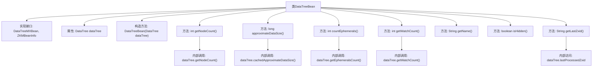

# 基础信息

|      |      |
|------|------|
| 名称 | DataTreeBean |
| 编码语言 | .java |
| 代码路径 | zookeeper/zookeeper-server/src/main/java/org/apache/zookeeper/server/DataTreeBean.java |
| 包名 | org.apache.zookeeper.server |
| 依赖项 | ['org.apache.zookeeper.jmx.ZKMBeanInfo'] |
| 概述说明 | DataTreeBean类实现DataTreeMXBean和ZKMBeanInfo接口，封装DataTree操作，提供节点数、数据大小、临时节点数、监视数等统计信息，并返回名称、可见性和最后处理的Zxid。 |

# 说明

DataTreeBean是一个实现了DataTreeMXBean和ZKMBeanInfo接口的类，用于管理ZooKeeper的DataTree数据结构。它通过构造函数接收DataTree实例，并提供多个方法获取相关信息：节点数量、近似数据大小、临时节点数量、监视器数量、名称（固定为"InMemoryDataTree"）、可见性（非隐藏）以及最后处理的Zxid（以十六进制格式返回）。所有方法均直接调用底层DataTree实例的对应功能。

# 类列表 Class Summary

| 名称   | 类型  | 说明 |
|-------|------|-------------|
| DataTreeBean | class | DataTreeBean类实现DataTreeMXBean和ZKMBeanInfo接口，封装DataTree操作，提供节点数、数据大小、临时节点数、监视数等统计信息，并返回名称、可见性和最后处理的Zxid。 |


## 类 DataTreeBean

|      |      |
|------|------|
| 访问范围 | public |
| 类型 | class |
| 名称 | DataTreeBean |
| 说明 | DataTreeBean类实现DataTreeMXBean和ZKMBeanInfo接口，封装DataTree操作，提供节点数、数据大小、临时节点数、监视数等统计信息，并返回名称、可见性和最后处理的Zxid。 |


### UML类图

```mermaid
classDiagram
    class DataTreeBean {
        -DataTree dataTree
        +DataTreeBean(DataTree dataTree)
        +int getNodeCount()
        +long approximateDataSize()
        +int countEphemerals()
        +int getWatchCount()
        +String getName()
        +boolean isHidden()
        +String getLastZxid()
    }
    <<Interface>> DataTreeMXBean
    <<Interface>> ZKMBeanInfo
    DataTreeBean ..|> DataTreeMXBean : 实现
    DataTreeBean ..|> ZKMBeanInfo : 实现
    DataTreeBean --> DataTree : 持有引用
```

这段类图展示了DataTreeBean类实现了DataTreeMXBean和ZKMBeanInfo两个接口，并持有一个DataTree类型的私有成员。DataTreeBean提供了多个公有方法用于获取ZooKeeper数据树的相关统计信息，包括节点数量、近似数据大小、临时节点数、监视器数量等。该类还实现了接口中定义的名称查询和隐藏状态检查功能，同时提供了获取最后处理的事务ID的方法。整体结构体现了JMX管理Bean的典型设计模式，通过组合方式委托DataTree实例完成核心功能。


### 内部方法调用关系图



该流程图展示了DataTreeBean类的完整结构，包括其实现的接口、构造方法和7个核心方法。类通过组合方式持有DataTree实例，所有业务方法均委托给该实例执行，包括获取节点数量、估算数据大小、统计临时节点等操作。特别展示了getLastZxid方法对dataTree.lastProcessedZxid字段的访问关系，以及各方法到DataTree实例的具体调用路径，清晰呈现了类与内部数据结构的交互方式。

### 字段列表 Field List

| 名称  | 类型  | 说明 |
|-------|-------|------|
| dataTree | DataTree | 数据树结构对象。 |

### 方法列表 Method List

| 名称  | 类型  | 说明 |
|-------|-------|------|
| countEphemerals | int | 该方法返回数据树中临时节点的数量。 |
| getName | String | 这是一个Java方法，返回字符串"InMemoryDataTree"，表示内存中的数据树名称。 |
| isHidden | boolean | 方法isHidden返回false，表示对象未被隐藏。 |
| getLastZxid | String | 方法返回数据树最后处理的ZXID，格式为十六进制字符串"0x"前缀。 |
| getNodeCount | int | 该方法返回数据树的节点数量。 |
| getWatchCount | int | 获取监视计数的方法，返回dataTree中的监视计数。 |
| approximateDataSize | long | 该方法返回数据树的近似大小，通过调用dataTree的缓存近似大小计算功能实现。 |


