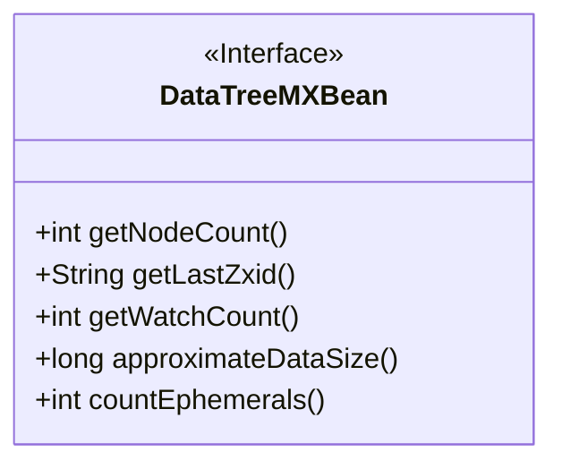
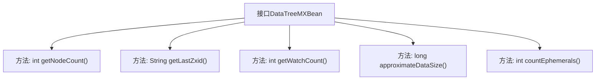

# 基础信息

|      |      |
|------|------|
| 名称 | DataTreeMXBean |
| 编码语言 | .java |
| 代码路径 | zookeeper/zookeeper-server/src/main/java/org/apache/zookeeper/server/DataTreeMXBean.java |
| 包名 | org.apache.zookeeper.server |
| 依赖项 | [] |
| 概述说明 | DataTreeMXBean接口提供数据树节点数、最新zxid、监视数、数据大小和临时节点数的方法。 |

# 说明

DataTreeMXBean是一个公开接口，定义了数据树的管理方法。它包含五个关键方法：getNodeCount返回数据树中znode节点的数量；getLastZxid返回数据树最近处理的zxid；getWatchCount返回设置的监视器数量；approximateDataSize返回数据树占用的字节大小，包括znode路径和值；countEphemerals返回数据树中临时节点的数量。这些方法提供了对数据树状态的全面监控能力。

# 类列表 Class Summary

| 名称   | 类型  | 说明 |
|-------|------|-------------|
| DataTreeMXBean | interface | DataTreeMXBean接口提供数据树信息，包括节点数、最新zxid、监视数、数据大小和临时节点数。 |

## 类 DataTreeMXBean

|      |      |
|------|------|
| 访问范围 | public |
| 类型 | interface |
| 名称 | DataTreeMXBean |
| 说明 | DataTreeMXBean接口提供数据树信息，包括节点数、最新zxid、监视数、数据大小和临时节点数。 |

### UML类图

这段类图描述了一个名为DataTreeMXBean的接口，该接口定义了数据树管理的核心监控功能。接口包含5个公有方法：getNodeCount()用于获取节点数量，getLastZxid()返回最后处理的zxid，getWatchCount()统计监视器数量，approximateDataSize()估算数据树内存占用，countEphemerals()计算临时节点数量。这些方法共同提供了对ZooKeeper数据树状态的全面监控能力，适用于JMX管理场景。

### 内部方法调用关系图

该流程图展示了DataTreeMXBean接口的结构，包含5个关键方法：getNodeCount()获取节点数、getLastZxid()获取最新事务ID、getWatchCount()统计监视器数量、approximateDataSize()估算数据大小、countEphemerals()计算临时节点数。每个方法都通过箭头与接口主体关联，形成清晰的层级关系，完整呈现了该JMX管理接口的核心监控功能。

### 字段列表 Field List

| 名称  | 类型  | 说明 |
|-------|-------|------|

### 方法列表 Method List

| 名称  | 类型  | 说明 |
|-------|-------|------|
| getWatchCount | int | 获取观看次数的整型函数。 |
| countEphemerals | int | 计算临时对象数量。 |
| approximateDataSize | long | 该代码定义了一个名为`approximateDataSize`的函数，用于估算数据大小。 |
| getLastZxid | String | 获取最后的事务ID。 |
| getNodeCount | int | 获取节点数量的函数。 |

