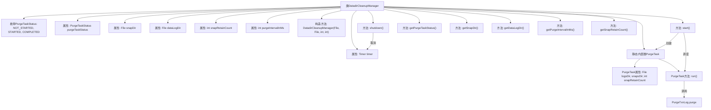

# 基础信息

|      |      |
|------|------|
| 名称 | DatadirCleanupManager |
| 编码语言 | .java |
| 代码路径 | zookeeper/zookeeper-server/src/main/java/org/apache/zookeeper/server/DatadirCleanupManager.java |
| 包名 | org.apache.zookeeper.server |
| 依赖项 | ['java.io.File', 'java.util.Timer', 'java.util.TimerTask', 'org.slf4j.Logger', 'org.slf4j.LoggerFactory'] |
| 概述说明 | DatadirCleanupManager类管理数据目录清理任务，通过定时器定期删除旧快照和日志，保留指定数量的最新快照。提供启动、关闭和状态查询功能。 |

# 说明

DatadirCleanupManager是一个用于管理数据目录清理任务的类，主要功能是定期清理快照和事务日志目录。该类包含一个枚举PurgeTaskStatus表示清理任务状态（未开始、进行中、已完成）。构造函数接收快照目录、事务日志目录、保留的快照数量和清理间隔作为参数。start方法验证配置并启动定时清理任务，若清理间隔为0或负数则不启动。shutdown方法用于停止清理任务。内部类PurgeTask执行实际清理操作，调用PurgeTxnLog.purge方法保留指定数量的快照并删除其余文件。该类还提供多个getter方法用于获取任务状态、目录路径和配置参数。

# 类列表 Class Summary

| 名称   | 类型  | 说明 |
|-------|------|-------------|
| DatadirCleanupManager | class | DatadirCleanupManager管理数据目录清理任务，定时删除旧快照和日志，保留指定数量快照。支持启动、关闭和状态查询。 |


## 类 DatadirCleanupManager

|      |      |
|------|------|
| 访问范围 | public |
| 类型 | class |
| 名称 | DatadirCleanupManager |
| 说明 | DatadirCleanupManager管理数据目录清理任务，定时删除旧快照和日志，保留指定数量快照。支持启动、关闭和状态查询。 |


### UML类图

```mermaid
classDiagram
    class DatadirCleanupManager {
        -LOG : Logger
        -purgeTaskStatus : PurgeTaskStatus
        -snapDir : File
        -dataLogDir : File
        -snapRetainCount : int
        -purgeIntervalInMs : int
        -timer : Timer
        +DatadirCleanupManager(File snapDir, File dataLogDir, int snapRetainCount, int purgeIntervalInMs)
        +start() void
        +shutdown() void
        +getPurgeTaskStatus() PurgeTaskStatus
        +getSnapDir() File
        +getDataLogDir() File
        +getPurgeIntervalInMs() int
        +getSnapRetainCount() int
    }

    class PurgeTask {
        -logsDir : File
        -snapsDir : File
        -snapRetainCount : int
        +PurgeTask(File dataDir, File snapDir, int count)
        +run() void
    }

    class PurgeTxnLog {
        <<static>>
        +purge(File logsDir, File snapsDir, int snapRetainCount) void
    }

    class Timer {
        +Timer(String name, boolean isDaemon)
        +scheduleAtFixedRate(TimerTask task, long delay, long period) void
        +cancel() void
    }

    class TimerTask {
        <<abstract>>
        +run() void
    }

    enum PurgeTaskStatus {
        NOT_STARTED
        STARTED
        COMPLETED
    }

    DatadirCleanupManager --> PurgeTaskStatus : 使用
    DatadirCleanupManager --> Timer : 依赖
    DatadirCleanupManager --> PurgeTask : 包含
    PurgeTask --> PurgeTxnLog : 调用
    PurgeTask --|> TimerTask : 继承
```

这段代码描述了一个数据目录清理管理器(DatadirCleanupManager)，它通过定时任务定期清理过期的快照和事务日志文件。核心功能包括：1) 通过PurgeTaskStatus枚举跟踪清理任务状态；2) 使用Timer和PurgeTask实现定时清理；3) 通过PurgeTxnLog执行实际清理操作。该类提供了完整的生命周期管理(start/shutdown)和配置获取功能，确保在指定时间间隔内保留指定数量的快照文件，同时清理旧文件。系统通过日志记录操作过程和错误信息，并防止重复启动任务。


### 内部方法调用关系图



该流程图展示了DatadirCleanupManager类的完整结构，包含枚举定义、属性字段、构造方法、主要功能方法（start/shutdown）和内部PurgeTask类。核心流程是通过start()方法初始化定时任务，由PurgeTask执行日志清理，shutdown()可终止任务。所有getter方法提供状态查询，PurgeTask通过run()方法调用PurgeTxnLog.purge实现实际清理逻辑，形成完整的数据目录维护生命周期管理。

### 字段列表 Field List

| 名称  | 类型  | 说明 |
|-------|-------|------|
| timer | Timer | 声明一个私有计时器变量timer。 |
| snapDir | File | 私有常量snapDir，类型为File。 |
| snapRetainCount | int | 私有整型变量，记录快照保留数量。 |
| purgeIntervalInMs | int | 私有整型变量purgeIntervalInMs，单位为毫秒。 |
| dataLogDir | File | 私有终态文件数据日志目录。 |
| purgeTaskStatus = PurgeTaskStatus.NOT_STARTED | PurgeTaskStatus | 私有变量purgeTaskStatus初始状态设为NOT_STARTED。 |
| LOG = LoggerFactory.getLogger(DatadirCleanupManager.class) | Logger | 私有静态日志常量LOG，用于DatadirCleanupManager类的日志记录。 |

### 方法列表 Method List

| 名称  | 类型  | 说明 |
|-------|-------|------|
| getSnapDir | File | 这是一个Java方法，返回名为snapDir的文件对象。 |
| getSnapRetainCount | int | 方法getSnapRetainCount返回整型变量snapRetainCount的值。 |
| getPurgeIntervalInMs | int | 该方法返回清理间隔的毫秒数值。 |
| start | void | 方法start()检查清理任务状态和间隔，若任务已运行或间隔无效则退出；否则创建定时任务并标记为已启动。 |
| getPurgeTaskStatus | PurgeTaskStatus | 获取当前清理任务状态的方法，返回purgeTaskStatus值。 |
| getDataLogDir | File | 获取数据日志目录文件对象的方法。 |
| shutdown | void | 该方法用于关闭清理任务。若任务已启动，则取消定时器并标记为完成；若未启动，则忽略并记录警告。 |


