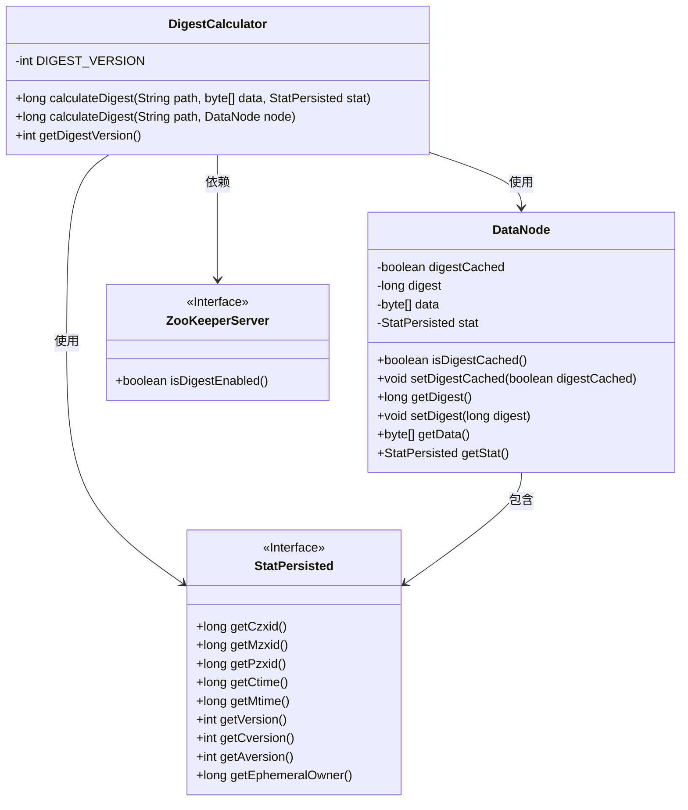
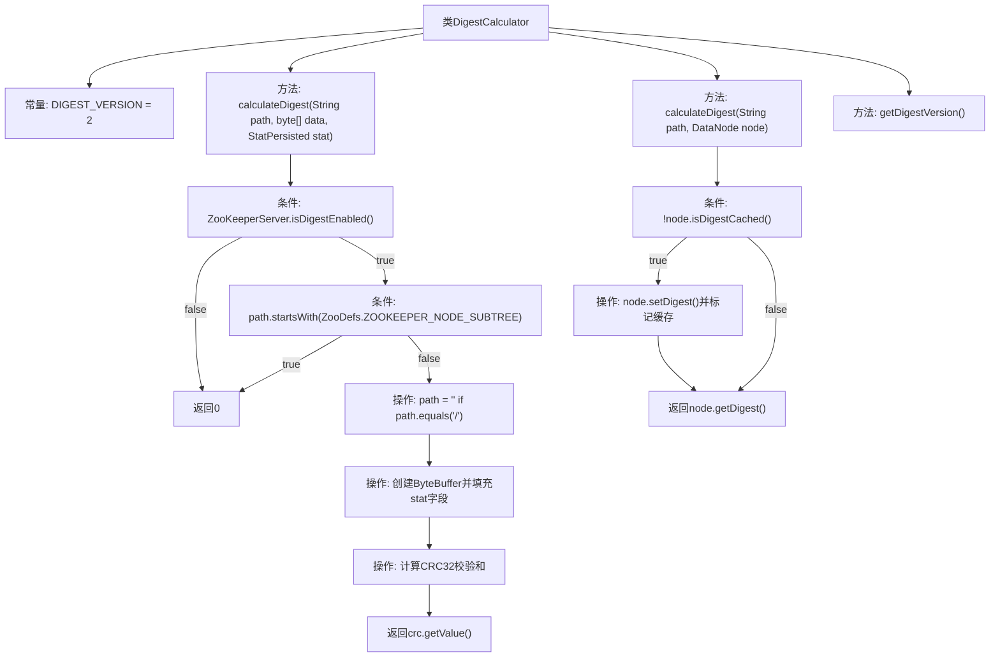

# 基础信息

|      |      |
|------|------|
| 名称 | DigestCalculator |
| 编码语言 | .java |
| 代码路径 | zookeeper/zookeeper-server/src/main/java/org/apache/zookeeper/server/DigestCalculator.java |
| 包名 | org.apache.zookeeper.server |
| 依赖项 | ['java.nio.ByteBuffer', 'java.util.zip.CRC32', 'org.apache.zookeeper.ZooDefs', 'org.apache.zookeeper.data.StatPersisted'] |
| 概述说明 | DigestCalculator类用于计算节点摘要，包含路径、数据和状态字段，使用CRC32校验和。支持版本控制，对特定路径禁用摘要检查。 |

# 说明

DigestCalculator类用于计算节点数据的摘要值。摘要版本号为2，当摘要方法或字段变更时需更新。calculateDigest方法根据路径、数据和节点状态信息计算摘要，包含czxid、mzxid等9个状态字段共60字节。路径为根目录时映射为空字符串，/zookeeper/子树节点和未启用摘要时返回0。使用CRC32算法生成摘要值，包含路径、数据和状态字段。DataNode节点的摘要值会被缓存以提高性能。提供getDigestVersion方法获取当前摘要版本。

# 类列表 Class Summary

| 名称   | 类型  | 说明 |
|-------|------|-------------|
| DigestCalculator | class | DigestCalculator类用于计算节点摘要，包含版本控制、路径处理及数据校验。支持禁用摘要、特殊路径处理，使用CRC32校验路径、数据和状态字段。摘要版本可更新，确保兼容性。 |

## 类 DigestCalculator

|      |      |
|------|------|
| 访问范围 | public |
| 类型 | class |
| 名称 | DigestCalculator |
| 说明 | DigestCalculator类用于计算节点摘要，包含版本控制、路径处理及数据校验。支持禁用摘要、特殊路径处理，使用CRC32校验路径、数据和状态字段。摘要版本可更新，确保兼容性。 |

### UML类图

类图描述：该图展示了DigestCalculator类与相关组件的关系。DigestCalculator负责计算数据节点的摘要值，依赖于StatPersisted接口获取节点状态信息，并与DataNode交互来缓存摘要值。DataNode包含状态信息和数据，而ZooKeeperServer接口提供摘要功能是否启用的判断。整个结构体现了摘要计算的流程和关键数据依赖关系。

### 内部方法调用关系图

该流程图展示了DigestCalculator类的核心逻辑，主要包含两个重载的calculateDigest方法。第一个方法处理原始数据校验和计算，包含路径规范化处理、状态字段字节缓冲区的构建以及CRC32校验和计算；第二个方法通过DataNode对象进行带缓存的校验和计算。流程中严格处理了ZooKeeper特殊路径的过滤、根路径别名转换等边界情况，并通过版本号控制实现算法可升级性。所有条件分支和数据处理步骤都通过清晰箭头连接，反映了完整的校验和生成逻辑链。

### 字段列表 Field List

| 名称  | 类型  | 说明 |
|-------|-------|------|
| DIGEST_VERSION = 2 | int | 私有静态常量DIGEST_VERSION值为2，用于标识摘要版本。 |

### 方法列表 Method List

| 名称  | 类型  | 说明 |
|-------|-------|------|
| calculateDigest | long | 计算ZooKeeper节点摘要：若未启用摘要或路径为/zookeeper/则返回0；路径"/"映射为空；组合节点状态数据后，用CRC32计算路径、数据和状态的校验值。 |
| calculateDigest | long | 计算节点摘要：若未缓存则计算并存储摘要，最后返回摘要值。 |
| getDigestVersion | int | 获取摘要版本号的方法，返回常量DIGEST_VERSION的值。 |

