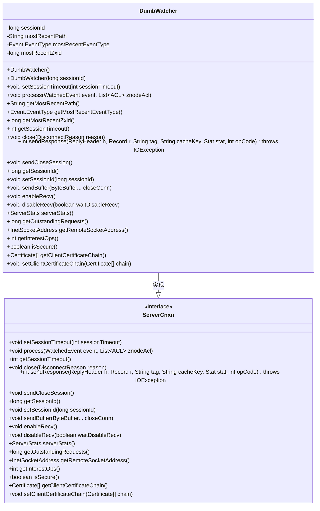

# 基础信息

|      |      |
|------|------|
| 名称 | DumbWatcher |
| 编码语言 | .java |
| 代码路径 | zookeeper/zookeeper-server/src/main/java/org/apache/zookeeper/server/DumbWatcher.java |
| 包名 | org.apache.zookeeper.server |
| 依赖项 | ['java.io.IOException', 'java.net.InetSocketAddress', 'java.nio.ByteBuffer', 'java.security.cert.Certificate', 'java.util.List', 'org.apache.jute.Record', 'org.apache.zookeeper.WatchedEvent', 'org.apache.zookeeper.data.ACL', 'org.apache.zookeeper.data.Stat', 'org.apache.zookeeper.proto.ReplyHeader'] |
| 概述说明 | DumbWatcher类继承ServerCnxn，记录最近事件路径、类型和zxid，提供空实现方法，用于测试或简单监控场景。 |

# 说明

DumbWatcher类继承自ServerCnxn，是一个简化版的服务器连接监视器。它包含会话ID、最近路径、事件类型和ZXID等关键属性。构造函数支持默认和带会话ID两种初始化方式。主要功能包括处理监视事件并记录相关信息，提供获取最近事件路径、类型和ZXID的方法。其他方法多为空实现或返回默认值，如会话超时设置、关闭连接、发送响应等操作均无实际功能。该类主要用于测试或简单场景下的基本监视功能。

# 类列表 Class Summary

| 名称   | 类型  | 说明 |
|-------|------|-------------|
| DumbWatcher | class | DumbWatcher类继承ServerCnxn，记录会话ID、事件类型、路径和zxid，提供获取方法，其他方法为空实现或返回默认值。 |

## 类 DumbWatcher

|      |      |
|------|------|
| 访问范围 | public |
| 类型 | class |
| 名称 | DumbWatcher |
| 说明 | DumbWatcher类继承ServerCnxn，记录会话ID、事件类型、路径和zxid，提供获取方法，其他方法为空实现或返回默认值。 |

### UML类图

这段代码展示了一个`DumbWatcher`类，它继承自`ServerCnxn`接口。`DumbWatcher`主要用于跟踪ZooKeeper事件，记录最近的事件路径、类型和ZXID。它实现了`ServerCnxn`的所有方法，但大部分方法为空实现或返回默认值，表明这是一个简化版的观察者实现。类中维护了会话ID和最近事件信息，并通过`process`方法更新这些状态。整体设计体现了对ZooKeeper服务器连接的基本模拟功能。

### 内部方法调用关系图

这段代码定义了一个名为DumbWatcher的类，继承自ServerCnxn，主要用于监控事件并记录最近的事件类型、路径和zxid。该类包含多个属性和方法，包括构造方法、事件处理方法以及多个重写自父类的方法，用于处理会话超时、关闭连接、发送响应等操作。整体设计简洁，专注于事件监控功能，同时保留了父类的接口实现。

### 字段列表 Field List

| 名称  | 类型  | 说明 |
|-------|-------|------|
| sessionId | long | 私有长整型会话ID。 |
| mostRecentZxid = WatchedEvent.NO_ZXID | long | 私有长整型变量mostRecentZxid初始化为WatchedEvent.NO_ZXID。 |
| mostRecentEventType | Event.EventType | 私有变量mostRecentEventType，类型为Event.EventType，记录最近事件类型。 |
| mostRecentPath | String | 私有字符串变量，存储最新路径。 |

### 方法列表 Method List

| 名称  | 类型  | 说明 |
|-------|-------|------|
| getRemoteSocketAddress | InetSocketAddress | Java方法重写，返回空远程套接字地址。 |
| getMostRecentZxid | long | 获取最新的Zxid值。 |
| sendCloseSession | void | 重写sendCloseSession方法，方法体为空。 |
| disableRecv | void | 重写方法disableRecv，参数waitDisableRecv，当前为空实现。 |
| close | void | 重写close方法，接收DisconnectReason参数，无具体实现。 |
| process | void | 该代码重写process方法，记录ZooKeeper事件类型、事务ID和路径到成员变量。 |
| getOutstandingRequests | long | 重写方法getOutstandingRequests，始终返回0。 |
| getMostRecentEventType | Event.EventType | 获取最近事件类型的方法，返回值为Event.EventType类型。 |
| enableRecv | void | 方法重写，空实现。 |
| setSessionTimeout | void | 重写setSessionTimeout方法，参数为sessionTimeout，当前为空实现。 |
| getInterestOps | int | 重写getInterestOps方法，返回固定值0。 |
| isSecure | boolean | 重写方法isSecure，固定返回false。 |
| getClientCertificateChain | Certificate[] | 方法getClientCertificateChain返回空，表示无客户端证书链。 |
| setClientCertificateChain | void | 重写方法setClientCertificateChain，接收证书数组chain，当前为空实现。 |
| sendResponse | int | Java方法重写，发送响应并返回0，参数包括回复头、记录、标签、缓存键、状态和操作码。 |
| getMostRecentPath | String | 获取最近路径的方法，返回字符串类型变量mostRecentPath。 |
| sendBuffer | void | 重写sendBuffer方法，接收可变数量ByteBuffer参数，方法体为空。 |
| setSessionId | void | 重写setSessionId方法，参数为long类型sessionId，方法体为空。 |
| getSessionTimeout | int | 重写getSessionTimeout方法，返回超时时间为0。 |
| serverStats | ServerStats | 重写serverStats方法，返回空值。 |
| getSessionId | long | 重写getSessionId方法，直接返回私有变量sessionId的值。 |

