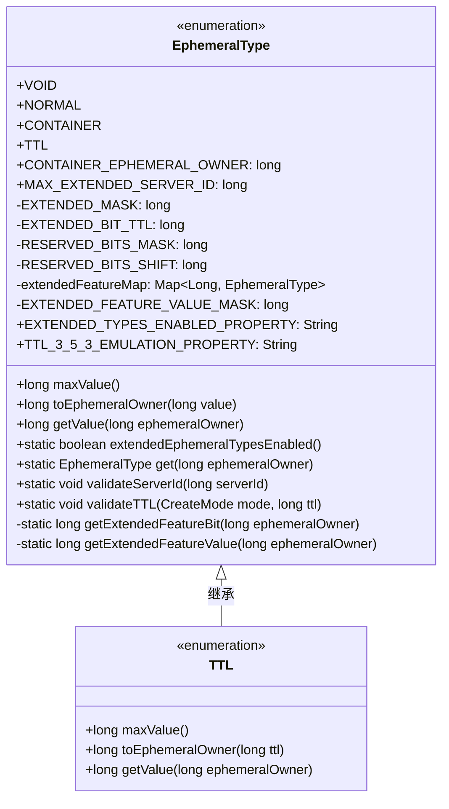
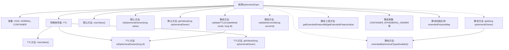

# 基础信息

|      |      |
|------|------|
| 名称 | EphemeralType |
| 编码语言 | .java |
| 代码路径 | zookeeper/zookeeper-server/src/main/java/org/apache/zookeeper/server/EphemeralType.java |
| 包名 | org.apache.zookeeper.server |
| 依赖项 | ['edu.umd.cs.findbugs.annotations.SuppressFBWarnings', 'java.util.Collections', 'java.util.HashMap', 'java.util.Map', 'org.apache.zookeeper.CreateMode'] |
| 概述说明 | EphemeralType枚举定义节点临时类型：VOID非临时，NORMAL标准临时，CONTAINER容器节点，TTL带TTL的节点（最长34年）。支持扩展类型检查、服务器ID验证及TTL校验。 |

# 说明

EphemeralType枚举定义了四种节点类型：VOID（非临时）、NORMAL（标准临时）、CONTAINER（容器节点）和TTL（带生存时间的节点）。TTL类型支持最大34年的生存时间，并提供了值转换和校验方法。枚举包含静态工具方法，用于处理扩展类型启用状态校验、服务器ID验证、TTL合法性检查等。通过位掩码操作管理扩展特性标识，并维护不可修改的扩展类型映射表。系统属性控制扩展类型和353版本TTL节点的模拟行为。

# 类列表 Class Summary

| 名称   | 类型  | 说明 |
|-------|------|-------------|
| EphemeralType | enum | EphemeralType枚举定义了临时节点类型，包括VOID、NORMAL、CONTAINER和TTL，支持TTL验证和扩展类型检查，含相关工具方法和常量。 |

## 类 EphemeralType

|      |      |
|------|------|
| 访问范围 | public |
| 类型 | enum |
| 名称 | EphemeralType |
| 说明 | EphemeralType枚举定义了临时节点类型，包括VOID、NORMAL、CONTAINER和TTL，支持TTL验证和扩展类型检查，含相关工具方法和常量。 |

### UML类图

该类图展示了一个枚举类型`EphemeralType`及其子类型`TTL`的结构。`EphemeralType`定义了四种枚举值（VOID/NORMAL/CONTAINER/TTL），其中TTL通过重写方法实现了特殊逻辑。类包含多个静态常量和方法，用于处理与ZooKeeper临时节点相关的功能，包括类型判断、服务器ID验证和TTL校验等。通过extendedFeatureMap维护扩展特性映射，使用位运算处理扩展标志位。整体设计支持灵活的临时节点类型管理，特别是对TTL节点的特殊处理。

### 内部方法调用关系图

该流程图展示了EphemeralType枚举的核心结构，包含4个基础枚举值(VOID/NORMAL/CONTAINER/TTL)及其关系。其中TTL是特殊枚举值，重写了三个核心方法(maxValue/toEphemeralOwner/getValue)。类还包含多个静态工具方法和常量，用于处理扩展的临时节点类型验证和转换。静态初始化块创建了不可修改的extendedFeatureMap映射表。整体设计采用枚举模式实现不同类型的临时节点处理逻辑，支持通过系统属性控制扩展功能。

### 字段列表 Field List

| 名称  | 类型  | 说明 |
|-------|-------|------|

### 方法列表 Method List

| 名称  | 类型  | 说明 |
|-------|-------|------|

