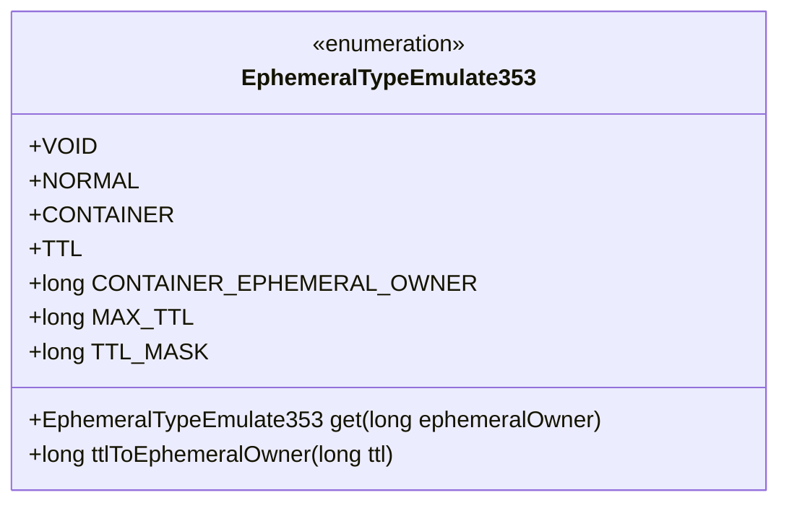
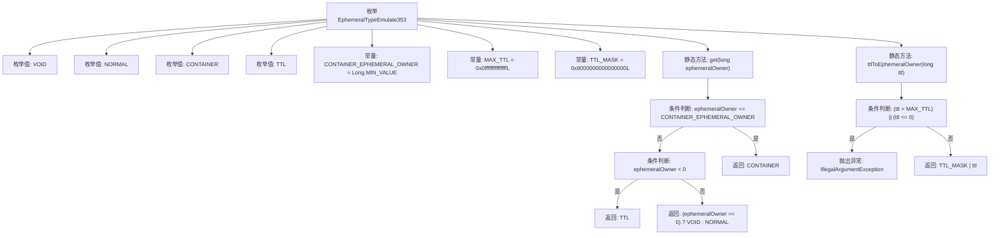

# 基础信息

|      |      |
|------|------|
| 名称 | EphemeralTypeEmulate353 |
| 编码语言 | .java |
| 代码路径 | zookeeper/zookeeper-server/src/main/java/org/apache/zookeeper/server/EphemeralTypeEmulate353.java |
| 包名 | org.apache.zookeeper.server |
| 依赖项 | [] |
| 概述说明 | EphemeralTypeEmulate353枚举定义四种节点类型：非临时(VOID)、标准临时(NORMAL)、容器(CONTAINER)和TTL节点。提供方法根据所有者ID判断类型，及TTL值转换方法。包含常量MAX_TTL和掩码TTL_MASK。 |

# 说明

该枚举定义了四种节点临时类型：VOID表示非临时节点，NORMAL表示标准临时节点，CONTAINER表示容器节点，TTL表示带生存时间的节点。包含三个静态常量：CONTAINER_EPHEMERAL_OWNER标识容器节点，MAX_TTL设定最大生存时间值，TTL_MASK用于TTL类型掩码。提供两个静态方法：get通过所有者ID判断节点类型，ttlToEphemeralOwner将TTL值转换为所有者ID并进行合法性校验。

# 类列表 Class Summary

| 名称   | 类型  | 说明 |
|-------|------|-------------|
| EphemeralTypeEmulate353 | enum | EphemeralTypeEmulate353枚举定义四种节点类型：非临时(VOID)、标准临时(NORMAL)、容器节点(CONTAINER)和TTL节点(TTL)。提供方法根据所有者ID判断类型，以及将TTL转换为所有者ID。关键常量包括容器标识、最大TTL值和掩码。 |

## 类 EphemeralTypeEmulate353

|      |      |
|------|------|
| 访问范围 | public |
| 类型 | enum |
| 名称 | EphemeralTypeEmulate353 |
| 说明 | EphemeralTypeEmulate353枚举定义四种节点类型：非临时(VOID)、标准临时(NORMAL)、容器节点(CONTAINER)和TTL节点(TTL)。提供方法根据所有者ID判断类型，以及将TTL转换为所有者ID。关键常量包括容器标识、最大TTL值和掩码。 |

### UML类图

该枚举类定义了四种节点类型(VOID/NORMAL/CONTAINER/TTL)，用于模拟Zookeeper 3.5.3版本的临时节点特性。它包含三个重要的静态常量(CONTAINER_EPHEMERAL_OWNER/MAX_TTL/TTL_MASK)和两个核心方法：get()根据所有者ID判断节点类型，ttlToEphemeralOwner()将TTL时间转换为特殊的所有者ID格式。这种设计主要用于处理不同类型的临时节点标识和TTL转换逻辑。

### 内部方法调用关系图

该流程图展示了EphemeralTypeEmulate353枚举的结构和逻辑流程。枚举定义了4种类型(VOID/NORMAL/CONTAINER/TTL)和3个常量，核心逻辑集中在两个静态方法：get()根据输入参数判断返回对应的枚举类型，包含三层条件判断；ttlToEphemeralOwner()方法先验证TTL值有效性，然后通过位运算返回组合值。流程图清晰呈现了所有可能的执行路径和异常情况处理。

### 字段列表 Field List

| 名称  | 类型  | 说明 |
|-------|-------|------|

### 方法列表 Method List

| 名称  | 类型  | 说明 |
|-------|-------|------|

