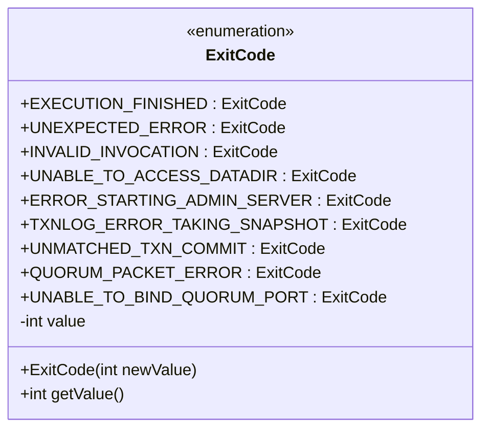

# 基础信息

|      |      |
|------|------|
| 名称 | ExitCode |
| 编码语言 | .java |
| 代码路径 | zookeeper/zookeeper-server/src/main/java/org/apache/zookeeper/server/ExitCode.java |
| 包名 | org.apache.zookeeper.server |
| 依赖项 | [] |
| 概述说明 | ExitCode枚举定义了程序退出代码：0正常结束，1意外错误，2无效参数，3无法访问数据目录，4启动管理服务器失败，10快照IO错误，12事务提交不匹配，13仲裁包错误，14无法绑定仲裁端口。 |

# 说明

该内容定义了一个名为ExitCode的公共枚举类，用于表示程序执行的不同退出状态及其对应的整数值。枚举包含多个状态，如正常执行完成（0）、意外错误（1）、无效调用参数（2）、无法访问数据目录（3）、启动管理服务器失败（4）、快照IO严重错误（10）、事务提交不匹配（12）、仲裁包错误（13）以及无法绑定仲裁端口（14）。每个枚举值都有一个关联的整数值，通过构造函数初始化，并可通过getValue方法获取。该枚举类主要用于标识程序退出的具体原因，便于调试和错误处理。

# 类列表 Class Summary

| 名称   | 类型  | 说明 |
|-------|------|-------------|
| ExitCode | enum | 枚举ExitCode定义了程序退出码：0正常结束，1意外错误，2无效参数，3无法访问数据目录，4启动管理服务器失败，10快照IO错误，12事务提交不匹配，13仲裁包错误，14无法绑定仲裁端口。每个枚举值对应一个整数值。 |

## 类 ExitCode

|      |      |
|------|------|
| 访问范围 | public |
| 类型 | enum |
| 名称 | ExitCode |
| 说明 | 枚举ExitCode定义了程序退出码：0正常结束，1意外错误，2无效参数，3无法访问数据目录，4启动管理服务器失败，10快照IO错误，12事务提交不匹配，13仲裁包错误，14无法绑定仲裁端口。每个枚举值对应一个整数值。 |

### UML类图

这段代码定义了一个枚举类`ExitCode`，用于表示程序执行的不同退出状态码。每个枚举常量都关联一个整数值，通过构造函数初始化并通过`getValue()`方法获取。枚举常量涵盖了正常执行、参数错误、IO异常、服务器启动失败等场景，为系统提供了标准化的退出状态标识。该设计便于统一管理错误码，增强代码可读性和维护性。

### 内部方法调用关系图

```mermaid
graph TD
    A["枚举ExitCode"]
    B["枚举常量: EXECUTION_FINISHED(0)"]
    C["枚举常量: UNEXPECTED_ERROR(1)"]
    D["枚举常量: INVALID_INVOCATION(2)"]
    E["枚举常量: UNABLE_TO_ACCESS_DATADIR(3)"]
    F["枚举常量: ERROR_STARTING_ADMIN_SERVER(4)"]
    G["枚举常量: TXNLOG_ERROR_TAKING_SNAPSHOT(10)"]
    H["枚举常量: UNMATCHED_TXN_COMMIT(12)"]
    I["枚举常量: QUORUM_PACKET_ERROR(13)"]
    J["枚举常量: UNABLE_TO_BIND_QUORUM_PORT(14)"]
    K["私有属性: final int value"]
    L["构造方法: ExitCode(int newValue)"]
    M["公有方法: int getValue()"]

    A --> B
    A --> C
    A --> D
    A --> E
    A --> F
    A --> G
    A --> H
    A --> I
    A --> J
    A --> K
    A --> L
    A --> M
```

该流程图展示了ExitCode枚举的结构，包含9个预定义的错误状态常量(如执行完成、意外错误等)，每个常量关联特定整数值。枚举包含一个不可变的value属性和两个核心方法：构造方法用于初始化value，getValue()用于获取枚举值。该设计常用于系统状态码管理，通过类型安全的方式表示不同错误场景。

### 字段列表 Field List

| 名称  | 类型  | 说明 |
|-------|-------|------|

### 方法列表 Method List

| 名称  | 类型  | 说明 |
|-------|-------|------|

