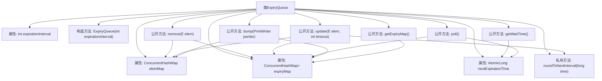

# 基础信息

|      |      |
|------|------|
| 名称 | ExpiryQueue |
| 编码语言 | .java |
| 代码路径 | zookeeper/zookeeper-server/src/main/java/org/apache/zookeeper/server/ExpiryQueue.java |
| 包名 | org.apache.zookeeper.server |
| 依赖项 | ['java.io.PrintWriter', 'java.util.ArrayList', 'java.util.Collections', 'java.util.Map', 'java.util.Set', 'java.util.concurrent.ConcurrentHashMap', 'java.util.concurrent.atomic.AtomicLong', 'org.apache.zookeeper.common.Time'] |
| 概述说明 | ExpiryQueue是一个基于时间间隔的过期队列，使用两个ConcurrentHashMap分别存储元素与过期时间、过期时间与元素集合。提供添加、移除、更新元素过期时间功能，并通过轮询机制清理过期元素。 |

# 说明

ExpiryQueue是一个基于时间间隔的过期队列实现，使用两个ConcurrentHashMap分别存储元素到过期时间的映射和过期时间到元素集合的映射。构造函数接收一个expirationInterval参数，用于将时间分桶。提供添加/更新元素过期时间的update方法，自动处理新旧时间桶的转移；remove方法用于移除元素；poll方法获取并移除当前过期的元素集合；getWaitTime返回距离下次过期的时间。内部采用线程安全设计，通过原子操作和并发集合保证多线程环境下的正确性。dump方法可打印队列状态，getExpiryMap提供不可修改的过期映射视图。

# 类列表 Class Summary

| 名称   | 类型  | 说明 |
|-------|------|-------------|
| ExpiryQueue | class | ExpiryQueue是一个基于时间间隔的并发过期队列，使用ConcurrentHashMap存储元素和过期时间，支持添加、移除、更新和轮询过期元素，确保线程安全。 |


## 类 ExpiryQueue

|      |      |
|------|------|
| 访问范围 | public |
| 类型 | class |
| 名称 | ExpiryQueue |
| 说明 | ExpiryQueue是一个基于时间间隔的并发过期队列，使用ConcurrentHashMap存储元素和过期时间，支持添加、移除、更新和轮询过期元素，确保线程安全。 |


### UML类图

```mermaid
classDiagram
    class ExpiryQueue~E~ {
        -ConcurrentHashMap~E, Long~ elemMap
        -ConcurrentHashMap~Long, Set~E~~ expiryMap
        -AtomicLong nextExpirationTime
        -int expirationInterval
        +ExpiryQueue(int expirationInterval)
        -long roundToNextInterval(long time)
        +Long remove(E elem)
        +Long update(E elem, int timeout)
        +long getWaitTime()
        +Set~E~ poll()
        +void dump(PrintWriter pwriter)
        +Map~Long, Set~E~~ getExpiryMap()
    }
    // ExpiryQueue使用两个ConcurrentHashMap分别维护元素-过期时间映射和过期时间-元素集合映射
    // 通过原子操作处理并发修改，采用时间分桶策略管理过期元素
```

类图描述：
ExpiryQueue是一个泛型队列，用于高效管理具有过期时间的元素。它通过两个ConcurrentHashMap实现线程安全，elemMap存储元素到过期时间的映射，expiryMap按时间分桶存储过期元素集合。核心功能包括添加/更新元素过期时间(update)、移除元素(remove)、获取即将过期元素(poll)等，采用原子操作保证并发安全，并通过时间分桶策略优化过期检测性能。


### 内部方法调用关系图



该流程图展示了ExpiryQueue类的完整结构，包含4个核心属性和7个主要方法。通过两个ConcurrentHashMap（elemMap和expiryMap）实现元素与过期时间的双向映射，AtomicLong记录下次过期时间。关键方法包括元素增删改查（update/remove）、过期检测（poll/getWaitTime）和状态输出（dump）。所有操作都采用线程安全设计，特别注重处理并发场景下的数据一致性，如使用putIfAbsent和compareAndSet等原子操作。

### 字段列表 Field List

| 名称  | 类型  | 说明 |
|-------|-------|------|
| expiryMap = new ConcurrentHashMap<>() | ConcurrentHashMap<Long, Set<E>> | 私有并发哈希映射，键为长整型，值为集合，用于存储过期数据。 |
| elemMap = new ConcurrentHashMap<>() | ConcurrentHashMap<E, Long> | 私有并发哈希映射，键为泛型E，值为长整型，线程安全。 |
| expirationInterval | int | 私有整型变量expirationInterval，表示过期时间间隔。 |
| nextExpirationTime = new AtomicLong() | AtomicLong | 私有原子长整型变量nextExpirationTime，用于线程安全地存储下一个过期时间。 |

### 方法列表 Method List

| 名称  | 类型  | 说明 |
|-------|-------|------|
| getWaitTime | long | 获取当前等待时间：计算当前时间与下次过期时间的差值，若未过期返回剩余时间，否则返回0。 |
| poll | Set<E> | 检查当前时间是否达到过期时间，未达到返回空集。若达到则更新过期时间并移除对应元素，无元素则返回空集。 |
| update | Long | 方法更新元素过期时间：若新旧时间相同则返回null；否则将元素加入新时间桶，并发安全处理集合操作，并清理旧时间桶的引用。返回新过期时间。 |
| remove | Long | 从映射中移除元素并返回过期时间，同时清理相关过期映射中的元素引用。 |
| roundToNextInterval | long | 方法计算下一个间隔时间点：当前时间除以间隔加1后乘间隔。 |
| dump | void | 该方法将过期映射和元素映射信息输出到PrintWriter，显示集合数量及每个过期时间的元素详情。 |
| getExpiryMap | Map<Long, Set<E>> | 该方法返回一个不可修改的Map，键为Long类型，值为Set<E>类型，内容来自expiryMap。 |


