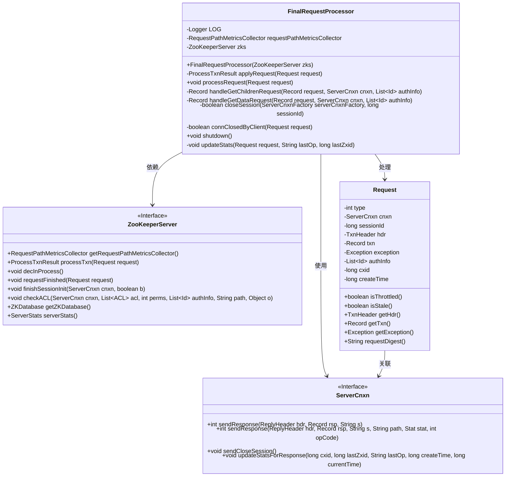
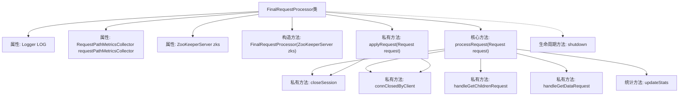
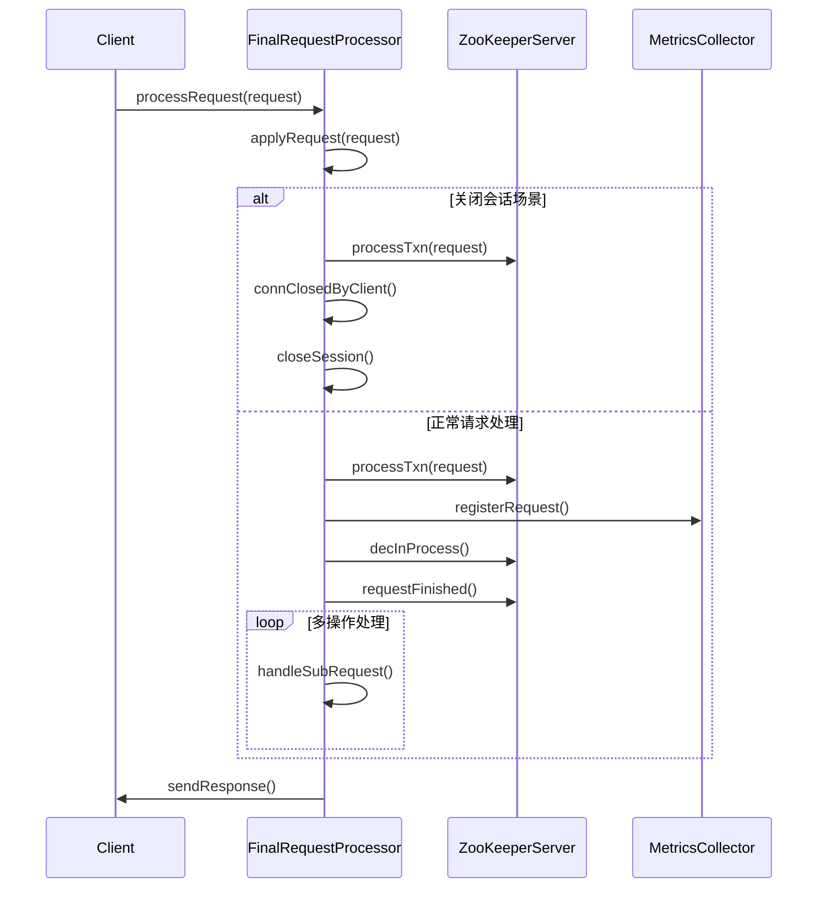

# 基础信息

|      |      |
|------|------|
| 名称 | FinalRequestProcessor |
| 编码语言 | .java |
| 代码路径 | zookeeper/zookeeper-server/src/main/java/org/apache/zookeeper/server/FinalRequestProcessor.java |
| 包名 | org.apache.zookeeper.server |
| 依赖项 | ['java.nio.charset.StandardCharsets.UTF_8', 'java.io.IOException', 'java.util.ArrayList', 'java.util.Collections', 'java.util.List', 'java.util.Locale', 'java.util.Set', 'org.apache.jute.Record', 'org.apache.zookeeper.ClientCnxn', 'org.apache.zookeeper.KeeperException', 'org.apache.zookeeper.KeeperException.Code', 'org.apache.zookeeper.KeeperException.SessionMovedException', 'org.apache.zookeeper.MultiOperationRecord', 'org.apache.zookeeper.MultiResponse', 'org.apache.zookeeper.Op', 'org.apache.zookeeper.OpResult', 'org.apache.zookeeper.OpResult.CheckResult', 'org.apache.zookeeper.OpResult.CreateResult', 'org.apache.zookeeper.OpResult.DeleteResult', 'org.apache.zookeeper.OpResult.ErrorResult', 'org.apache.zookeeper.OpResult.GetChildrenResult', 'org.apache.zookeeper.OpResult.GetDataResult', 'org.apache.zookeeper.OpResult.SetDataResult', 'org.apache.zookeeper.Watcher.WatcherType', 'org.apache.zookeeper.ZooDefs', 'org.apache.zookeeper.ZooDefs.OpCode', 'org.apache.zookeeper.audit.AuditHelper', 'org.apache.zookeeper.common.Time', 'org.apache.zookeeper.data.ACL', 'org.apache.zookeeper.data.Id', 'org.apache.zookeeper.data.Stat', 'org.apache.zookeeper.proto.AddWatchRequest', 'org.apache.zookeeper.proto.CheckWatchesRequest', 'org.apache.zookeeper.proto.Create2Response', 'org.apache.zookeeper.proto.CreateResponse', 'org.apache.zookeeper.proto.ErrorResponse', 'org.apache.zookeeper.proto.ExistsRequest', 'org.apache.zookeeper.proto.ExistsResponse', 'org.apache.zookeeper.proto.GetACLRequest', 'org.apache.zookeeper.proto.GetACLResponse', 'org.apache.zookeeper.proto.GetAllChildrenNumberRequest', 'org.apache.zookeeper.proto.GetAllChildrenNumberResponse', 'org.apache.zookeeper.proto.GetChildren2Request', 'org.apache.zookeeper.proto.GetChildren2Response', 'org.apache.zookeeper.proto.GetChildrenRequest', 'org.apache.zookeeper.proto.GetChildrenResponse', 'org.apache.zookeeper.proto.GetDataRequest', 'org.apache.zookeeper.proto.GetDataResponse', 'org.apache.zookeeper.proto.GetEphemeralsRequest', 'org.apache.zookeeper.proto.GetEphemeralsResponse', 'org.apache.zookeeper.proto.RemoveWatchesRequest', 'org.apache.zookeeper.proto.ReplyHeader', 'org.apache.zookeeper.proto.SetACLResponse', 'org.apache.zookeeper.proto.SetDataResponse', 'org.apache.zookeeper.proto.SetWatches', 'org.apache.zookeeper.proto.SetWatches2', 'org.apache.zookeeper.proto.SyncRequest', 'org.apache.zookeeper.proto.SyncResponse', 'org.apache.zookeeper.proto.WhoAmIResponse', 'org.apache.zookeeper.server.DataTree.ProcessTxnResult', 'org.apache.zookeeper.server.quorum.QuorumZooKeeperServer', 'org.apache.zookeeper.server.util.AuthUtil', 'org.apache.zookeeper.server.util.RequestPathMetricsCollector', 'org.apache.zookeeper.txn.ErrorTxn', 'org.slf4j.Logger', 'org.slf4j.LoggerFactory'] |
| 概述说明 | FinalRequestProcessor是ZooKeeper的请求处理器，处理各类操作如创建、删除节点等，包含会话管理、ACL检查、性能统计等功能，确保请求正确执行并返回响应。 |

# 说明

FinalRequestProcessor是ZooKeeper服务器的最终请求处理器，负责处理各类客户端请求。它包含请求处理的核心逻辑，如会话管理、事务处理、ACL验证、监控操作等。处理器通过applyRequest方法执行事务，处理会话关闭等特殊情况，并收集传播延迟指标。processRequest方法处理各类操作码（如PING、CREATE、DELETE等），执行相应操作并返回响应。它还处理多操作请求（multi/multiRead）和各类监控相关操作。处理器会记录请求统计信息，并在出错时发送适当错误响应。此外，它还负责会话移动检测和资源释放。

# 类列表 Class Summary

| 名称   | 类型  | 说明 |
|-------|------|-------------|
| FinalRequestProcessor | class | FinalRequestProcessor是ZooKeeper的请求处理器，处理各类操作请求如创建、删除、读取节点等，管理会话、权限检查及响应生成，确保数据一致性和正确性。 |

## 类 FinalRequestProcessor

|      |      |
|------|------|
| 访问范围 | public |
| 类型 | class |
| 名称 | FinalRequestProcessor |
| 说明 | FinalRequestProcessor是ZooKeeper的请求处理器，处理各类操作请求如创建、删除、读取节点等，管理会话、权限检查及响应生成，确保数据一致性和正确性。 |

### UML类图

该代码是ZooKeeper中FinalRequestProcessor的实现，作为请求处理链的最后一环，负责实际执行事务请求和生成响应。类图展示了核心类之间的关系：FinalRequestProcessor依赖ZooKeeperServer进行事务处理，处理Request对象并通过ServerCnxn发送响应。其中包含对多种操作类型（如create、delete、getData等）的处理逻辑，以及会话管理、ACL检查等关键功能。设计上遵循了职责分离原则，通过接口隔离降低了耦合度。

### 内部方法调用关系图

该流程图展示了ZooKeeper FinalRequestProcessor的核心处理逻辑，包含请求处理主流程和12个关键方法。类结构分为属性管理、请求处理（含事务应用和子请求处理）、连接管理、统计监控三大部分。时序图重点呈现了两种典型场景：关闭会话时的特殊处理流程和常规请求的标准处理路径，体现了对连接状态检查、事务处理、指标收集的完整生命周期管理。处理器通过zks对象协调数据库操作，同时维护请求级统计指标，最终通过ServerCnxn返回响应。

### 字段列表 Field List

| 名称  | 类型  | 说明 |
|-------|-------|------|
| LOG = LoggerFactory.getLogger(FinalRequestProcessor.class) | Logger | 类FinalRequestProcessor中定义了一个私有静态日志记录器LOG。 |
| requestPathMetricsCollector | RequestPathMetricsCollector | 私有终态请求路径指标收集器实例。 |
| zks | ZooKeeperServer | ZooKeeper服务器实例zks。 |

### 方法列表 Method List

| 名称  | 类型  | 说明 |
|-------|-------|------|
| connClosedByClient | boolean | 检查请求连接是否被客户端关闭，若连接对象为空则返回真。 |
| closeSession | boolean | 关闭指定会话ID的服务器连接，若连接工厂为空则返回失败。 |
| processRequest | void | 处理请求的ZooKeeper服务器逻辑，包括日志记录、请求类型判断、事务处理、错误处理和响应发送。支持多种操作类型如PING、CREATE、DELETE等，并处理会话、ACL和监视器相关操作。 |
| handleGetDataRequest | Record | 处理获取数据请求：验证节点存在性，检查读取权限，返回节点数据及状态信息。若节点不存在则抛出异常。 |
| handleGetChildrenRequest | Record | 处理获取子节点请求：检查路径有效性、节点存在性及权限，返回子节点列表。若节点不存在或权限不足则抛出异常。 |
| applyRequest | ProcessTxnResult | 处理请求时，若为关闭会话且客户端已断开连接，则尝试关闭会话；记录领导者请求的传播延迟。 |
| shutdown | void | 方法shutdown()完成请求处理器关闭，记录日志信息。 |
| updateStats | void | 该方法用于更新请求统计信息。若请求连接为空则直接返回，否则计算当前时间，更新服务器延迟统计，并更新连接响应统计，包括请求ID、最后操作ID、最后ZXID、创建时间和当前时间。 |

