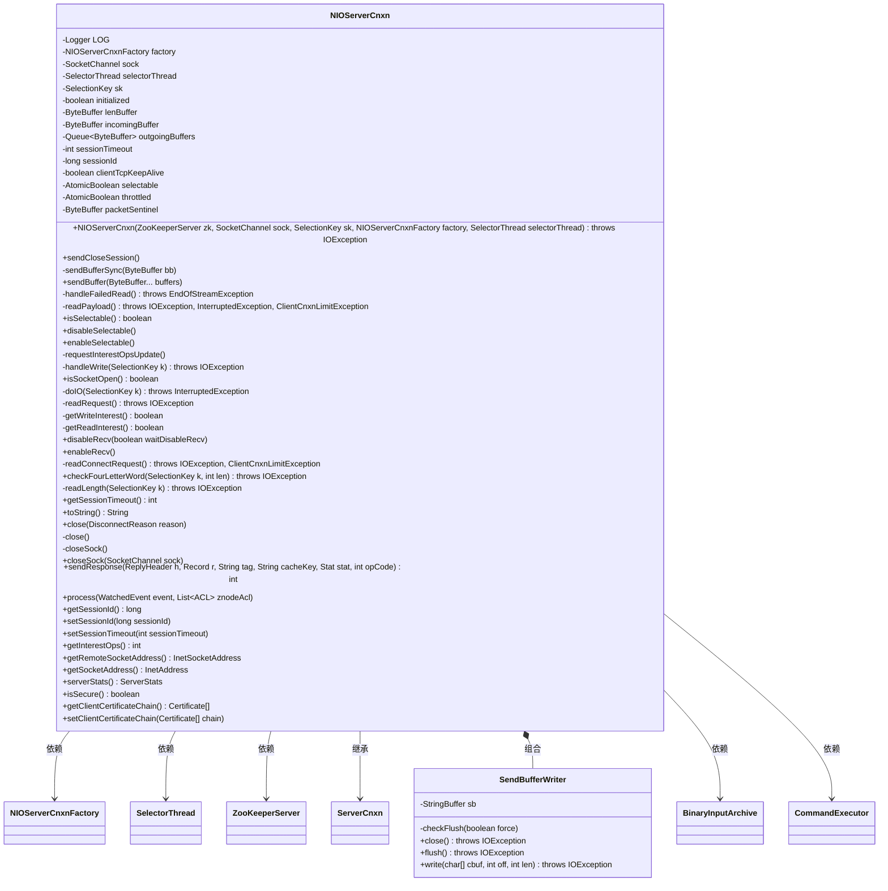
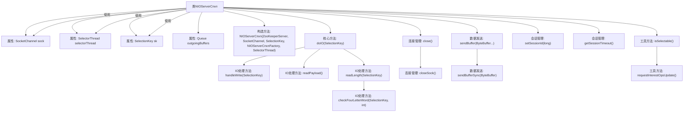

# 基础信息

|      |      |
|------|------|
| 名称 | NIOServerCnxn |
| 编码语言 | .java |
| 代码路径 | zookeeper/zookeeper-server/src/main/java/org/apache/zookeeper/server/NIOServerCnxn.java |
| 包名 | org.apache.zookeeper.server |
| 依赖项 | ['java.nio.charset.StandardCharsets.UTF_8', 'java.io.BufferedWriter', 'java.io.IOException', 'java.io.PrintWriter', 'java.io.Writer', 'java.net.InetAddress', 'java.net.InetSocketAddress', 'java.nio.ByteBuffer', 'java.nio.channels.CancelledKeyException', 'java.nio.channels.SelectionKey', 'java.nio.channels.SocketChannel', 'java.security.cert.Certificate', 'java.util.List', 'java.util.Queue', 'java.util.concurrent.LinkedBlockingQueue', 'java.util.concurrent.atomic.AtomicBoolean', 'org.apache.jute.BinaryInputArchive', 'org.apache.jute.Record', 'org.apache.zookeeper.ClientCnxn', 'org.apache.zookeeper.KeeperException', 'org.apache.zookeeper.WatchedEvent', 'org.apache.zookeeper.ZooDefs', 'org.apache.zookeeper.data.ACL', 'org.apache.zookeeper.data.Id', 'org.apache.zookeeper.data.Stat', 'org.apache.zookeeper.proto.ConnectRequest', 'org.apache.zookeeper.proto.ReplyHeader', 'org.apache.zookeeper.proto.RequestHeader', 'org.apache.zookeeper.proto.WatcherEvent', 'org.apache.zookeeper.server.NIOServerCnxnFactory.SelectorThread', 'org.apache.zookeeper.server.command.CommandExecutor', 'org.apache.zookeeper.server.command.FourLetterCommands', 'org.apache.zookeeper.server.command.NopCommand', 'org.apache.zookeeper.server.command.SetTraceMaskCommand', 'org.slf4j.Logger', 'org.slf4j.LoggerFactory'] |
| 概述说明 | NIOServerCnxn是ZooKeeper的NIO连接处理类，管理客户端通信，包括读写请求、会话超时和连接关闭。核心功能包括异步IO处理、四字命令响应、会话管理和安全控制。 |

# 说明

NIOServerCnxn是ZooKeeper服务器中处理客户端NIO连接的类，继承自ServerCnxn。它管理SocketChannel、SelectorThread和SelectionKey，处理读写IO操作。关键功能包括：异步发送数据缓冲队列、处理连接请求和会话超时、支持四字命令、实现选择器状态管理（selectable标志）。类包含连接初始化、数据读写、错误处理、资源关闭等方法，同时维护会话ID和超时设置。通过工厂模式管理连接生命周期，集成SASL认证，但不支持SSL。提供统计和监控接口，处理客户端请求和事件通知。

# 类列表 Class Summary

| 名称   | 类型  | 说明 |
|-------|------|-------------|
| NIOServerCnxn | class | NIOServerCnxn是ZooKeeper的NIO连接处理类，管理客户端通信、请求处理和响应发送，支持异步IO、会话超时及连接关闭。 |

## 类 NIOServerCnxn

|      |      |
|------|------|
| 访问范围 | public |
| 类型 | class |
| 名称 | NIOServerCnxn |
| 说明 | NIOServerCnxn是ZooKeeper的NIO连接处理类，管理客户端通信、请求处理和响应发送，支持异步IO、会话超时及连接关闭。 |

### UML类图

这段代码定义了一个NIO服务器连接类`NIOServerCnxn`，用于处理ZooKeeper服务器的客户端连接。它继承自`ServerCnxn`，实现了网络通信的核心功能，包括读写数据、处理请求、管理会话超时等。类中使用了NIO的非阻塞IO机制，通过`SelectorThread`和`SelectionKey`来管理多个客户端连接。`SendBufferWriter`是内部类，用于分块发送大响应数据。该类还处理了各种异常情况，如连接断开、IO错误等，并提供了丰富的状态管理方法。整体设计体现了高性能网络服务器的特点，适合处理大量并发连接。

### 内部方法调用关系图

该流程图展示了NIOServerCnxn类的核心结构和主要方法调用关系。这个类是一个NIO实现的服务器连接处理器，主要负责管理客户端连接、处理网络IO操作（包括读写数据）、会话管理以及连接关闭等核心功能。图中清晰地展示了从构造方法到IO处理（doIO）、数据发送（sendBuffer）、连接关闭（close）等关键方法的调用路径，以及它们与底层SocketChannel、SelectorThread等组件的关系，体现了该类作为ZooKeeper服务器网络层核心组件的完整生命周期管理能力。

### 字段列表 Field List

| 名称  | 类型  | 说明 |
|-------|-------|------|
| sk | SelectionKey | 私有不可变的SelectionKey对象sk。 |
| incomingBuffer = lenBuffer | ByteBuffer | 声明一个受保护的ByteBuffer变量incomingBuffer，初始化为lenBuffer。 |
| sessionTimeout | int | 私有整型变量sessionTimeout，用于会话超时设置。 |
| initialized | boolean | 私有布尔变量initialized，表示初始化状态。 |
| sessionId | long | 私有长整型会话ID变量。 |
| factory | NIOServerCnxnFactory | 私有NIOServerCnxnFactory工厂实例。 |
| clientTcpKeepAlive = Boolean.getBoolean("zookeeper.clientTcpKeepAlive") | boolean | 私有布尔变量clientTcpKeepAlive，通过系统属性"zookeeper.clientTcpKeepAlive"获取值。 |
| selectorThread | SelectorThread | 私有成员变量selectorThread，类型为SelectorThread。 |
| sock | SocketChannel | 
私有不可变的SocketChannel套接字通道对象。 |
| outgoingBuffers = new LinkedBlockingQueue<>() | Queue<ByteBuffer> | 私有队列outgoingBuffers，使用LinkedBlockingQueue存储ByteBuffer对象。 |
| throttled = new AtomicBoolean(false) | AtomicBoolean | 私有原子布尔变量throttled，初始值为false，用于线程安全的状态控制。 |
| selectable = new AtomicBoolean(true) | AtomicBoolean | 私有原子布尔变量selectable初始值为true，确保线程安全操作。 |
| packetSentinel = ByteBuffer.allocate(0) | ByteBuffer | 私有静态常量ByteBuffer，初始化为空分配。 |
| lenBuffer = ByteBuffer.allocate(4) | ByteBuffer | 私有字节缓冲区lenBuffer，分配4字节空间。 |
| LOG = LoggerFactory.getLogger(NIOServerCnxn.class) | Logger | NIOServerCnxn类中定义了一个私有静态日志常量LOG，用于记录日志信息。 |

### 方法列表 Method List

| 名称  | 类型  | 说明 |
|-------|-------|------|
| enableSelectable | void | 启用可选功能，将selectable属性设为true。 |
| sendBuffer | void | 方法sendBuffer将ByteBuffer数组添加到outgoingBuffers队列，同步操作确保线程安全，每次添加后附加标记并请求更新I/O操作。日志记录调试信息。 |
| isSecure | boolean | Java方法重写，返回false表示不安全。 |
| disableRecv | void | 方法disableRecv通过原子操作设置throttled标志为true，并请求更新interestOps。参数waitDisableRecv未使用。 |
| getSessionId | long | 重写getSessionId方法，返回sessionId值。 |
| disableSelectable | void | 禁用选择功能，将selectable设为false。 |
| sendResponse | int | Java方法sendResponse：序列化响应数据并发送，处理异常，返回响应大小。 |
| getWriteInterest | boolean | 检查是否有待发送数据，返回缓冲区非空状态。 |
| handleFailedRead | void | 处理读取失败：标记状态，记录连接断开，抛出异常提示客户端可能关闭了连接，包含地址和会话ID。 |
| requestInterestOpsUpdate | void | 方法请求更新兴趣操作，若可选则向选择器线程添加更新请求。 |
| close | void | 重写close方法，设置断开原因后调用原close方法。 |
| setSessionId | void | 重写setSessionId方法，设置sessionId并调用factory.addSession添加当前实例。 |
| readPayload | void | 方法readPayload读取网络数据，处理剩余字节，若读取失败调用handleFailedRead。读完长度字节后，根据初始化状态执行readConnectRequest或readRequest，最后重置缓冲区。 |
| readLength | boolean | 方法readLength读取数据长度，检查合法性，包括长度范围、ZK服务状态及请求大小，通过后分配缓冲区。异常时抛出IO错误。 |
| closeSock | void | 关闭未打开的socket连接，记录客户端地址和会话ID（若有），并执行关闭操作。 |
| doIO | void | 处理Socket IO操作，包括读写异常处理，如空Socket、读写错误、连接限制等，并记录日志和关闭会话。 |
| readRequest | void | Java方法readRequest读取请求数据，解析请求头和记录，交由zkServer处理。 |
| enableRecv | void | 方法enableRecv通过原子操作将throttled从true设为false，成功后触发requestInterestOpsUpdate更新操作。 |
| isSocketOpen | boolean | 检查套接字是否打开的方法，返回布尔值表示状态。 |
| closeSock | void | 关闭SocketChannel的方法，需依次关闭输出、输入、socket和socketChannel，忽略常见IO异常。 |
| handleWrite | void | 处理写操作的函数，检查输出缓冲区，若无数据则返回。使用直接或非直接缓冲区发送数据，更新缓冲区位置，处理关闭请求和标记包，移除已发送数据。 |
| sendBufferSync | void | 同步发送缓冲区数据：若缓冲区非关闭连接且套接字开启，则设为阻塞模式并写入数据，成功则标记发送；异常时记录错误日志。 |
| sendCloseSession | void | 发送关闭会话指令，调用sendBuffer方法传递关闭连接参数。 |
| getReadInterest | boolean | 方法getReadInterest返回布尔值，表示读取兴趣状态，当throttled为false时返回true。 |
| toString | String | Java方法重写toString，返回远程IP地址和十六进制会话ID。 |
| getSessionTimeout | int | 获取会话超时时间的方法，返回整型变量sessionTimeout的值。 |
| checkFourLetterWord | boolean | 检查四字母命令：验证命令是否已知且启用，取消选择键防止netcat问题。若命令未启用记录日志并返回true；处理setTraceMask命令或执行其他命令。 |
| process | void | 方法处理ZooKeeper事件，检查ACL权限后发送响应。若无权限则记录日志并返回。有权限则构造响应头，记录日志，转换事件类型并通过网络发送，统计响应大小。 |
| readConnectRequest | void | 方法检查ZooKeeper服务是否运行，读取连接请求并处理，标记初始化完成。异常时抛出错误。 |
| isSelectable | boolean | 方法isSelectable检查两个条件：sk是否有效和selectable是否为真，两者都满足时返回true。 |
| close | void | 关闭连接方法：标记过期、从工厂移除连接、清理服务器和选择器资源、关闭套接字，异常时忽略。 |
| setSessionTimeout | void | 重写setSessionTimeout方法，设置会话超时时间并触发factory的touchCnxn操作。 |
| getInterestOps | int | 该方法返回当前通道的兴趣操作集。若不可选返回0，否则根据读写兴趣设置合并OP_READ和OP_WRITE标志位。 |
| getRemoteSocketAddress | InetSocketAddress | 该代码重写方法，获取远程套接字地址。若套接字未打开返回null，否则返回远程地址。 |
| getSocketAddress | InetAddress | 获取套接字地址，若未打开返回空，否则返回套接字的网络地址。 |
| serverStats | ServerStats | 重写serverStats方法，检查zkServer非空后返回其统计信息，否则返回null。 |
| getClientCertificateChain | Certificate[] | 重写方法getClientCertificateChain，抛出异常表示NIOServerCnxn不支持SSL。 |
| setClientCertificateChain | void | NIOServerCnxn不支持SSL，设置客户端证书链时会抛出异常。 |

