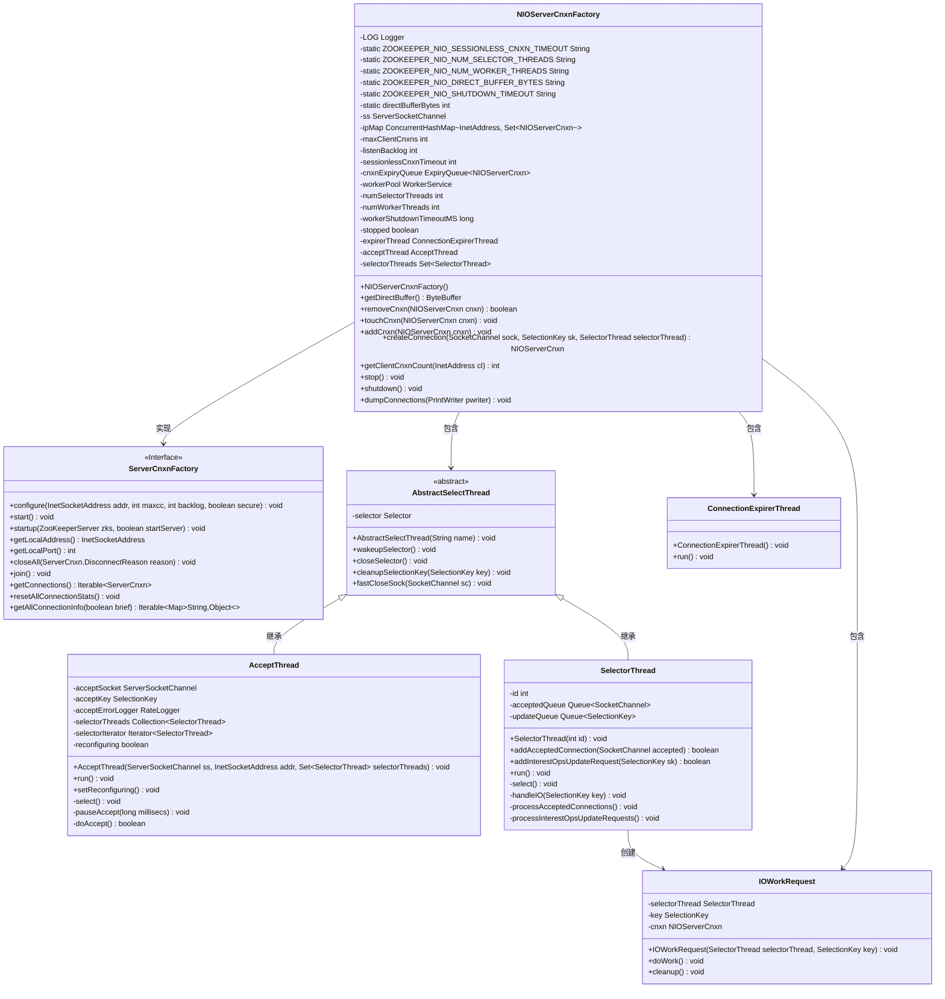
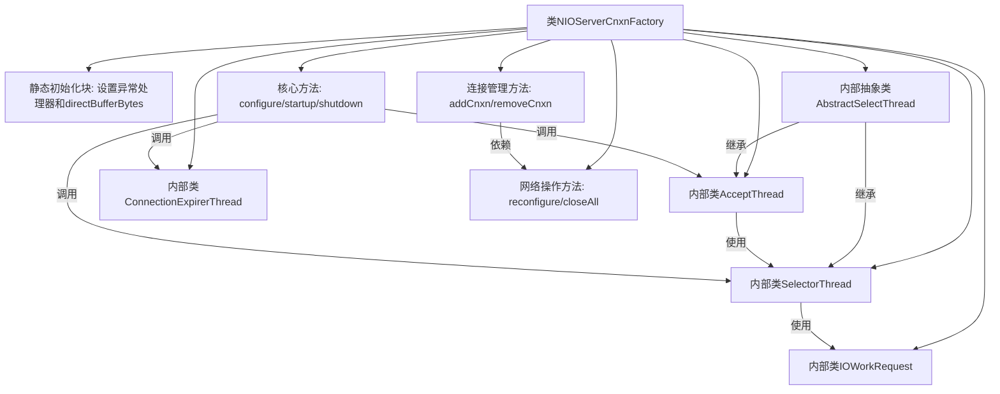
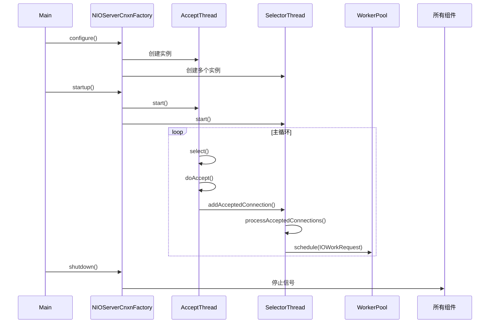

# 基础信息

|      |      |
|------|------|
| 名称 | NIOServerCnxnFactory |
| 编码语言 | .java |
| 代码路径 | zookeeper/zookeeper-server/src/main/java/org/apache/zookeeper/server/NIOServerCnxnFactory.java |
| 包名 | org.apache.zookeeper.server |
| 依赖项 | ['java.io.IOException', 'java.io.PrintWriter', 'java.net.InetAddress', 'java.net.InetSocketAddress', 'java.net.SocketException', 'java.nio.ByteBuffer', 'java.nio.channels.SelectionKey', 'java.nio.channels.Selector', 'java.nio.channels.ServerSocketChannel', 'java.nio.channels.SocketChannel', 'java.util.ArrayList', 'java.util.Collection', 'java.util.Collections', 'java.util.HashSet', 'java.util.Iterator', 'java.util.Map', 'java.util.Queue', 'java.util.Set', 'java.util.concurrent.ConcurrentHashMap', 'java.util.concurrent.LinkedBlockingQueue', 'org.slf4j.Logger', 'org.slf4j.LoggerFactory'] |
| 概述说明 | NIOServerCnxnFactory是ZooKeeper的NIO连接工厂类，负责管理客户端连接。核心功能包括：1. 使用AcceptThread接收新连接并分配给SelectorThread；2. SelectorThread处理I/O事件；3. 支持连接数限制和超时管理；4. 可配置线程数和缓冲区大小。 |

# 说明

NIOServerCnxnFactory是ZooKeeper的NIO连接工厂类，负责管理客户端连接。核心组件包括：AcceptThread处理新连接并分配给SelectorThread，SelectorThread负责I/O就绪检查和工作分发，ConnectionExpirerThread清理过期连接。支持配置项包括会话超时时间、选择器线程数（默认基于核心数计算）、工作线程数（默认2倍核心数）、直接缓冲区大小（默认64KB）等。通过轮询策略分配连接，维护IP连接数限制，使用线程池处理I/O工作请求，并提供连接统计、关闭和重启功能。工厂还包含连接过期队列和线程安全机制确保高并发场景稳定性。

# 类列表 Class Summary

| 名称   | 类型  | 说明 |
|-------|------|-------------|
| NIOServerCnxnFactory | class | NIOServerCnxnFactory是ZooKeeper的NIO连接工厂类，负责管理客户端连接。核心功能包括：1. 使用AcceptThread接收新连接并分配给SelectorThread处理；2. 通过SelectorThread进行IO事件监听和任务分发；3. 支持连接数限制和过期管理；4. 可配置线程池和缓冲区大小。关键参数：会话超时、选择器线程数、工作线程数等。 |

## 类 NIOServerCnxnFactory

|      |      |
|------|------|
| 访问范围 | public |
| 类型 | class |
| 名称 | NIOServerCnxnFactory |
| 说明 | NIOServerCnxnFactory是ZooKeeper的NIO连接工厂类，负责管理客户端连接。核心功能包括：1. 使用AcceptThread接收新连接并分配给SelectorThread处理；2. 通过SelectorThread进行IO事件监听和任务分发；3. 支持连接数限制和过期管理；4. 可配置线程池和缓冲区大小。关键参数：会话超时、选择器线程数、工作线程数等。 |

### UML类图

这段代码是ZooKeeper的NIO服务器连接工厂实现，主要处理客户端连接的建立、管理和调度。NIOServerCnxnFactory继承自ServerCnxnFactory接口，使用NIO模型处理网络连接，包含AcceptThread接收新连接、SelectorThread处理I/O事件、WorkerService线程池处理具体任务，以及ConnectionExpirerThread管理连接过期。通过多个内部类的协作，实现了高性能、可扩展的客户端连接管理机制，支持连接数限制、负载均衡和过期清理等功能。

### 内部方法调用关系图

该流程图展示了NIOServerCnxnFactory的核心架构，这是一个基于NIO的ZooKeeper服务器连接工厂实现。主要包含接受线程(AcceptThread)、选择器线程(SelectorThread)和工作者线程池的三层处理模型，通过抽象类AbstractSelectThread实现公共选择器操作。时序图则演示了从配置启动到请求处理的完整生命周期，突出显示了新连接接受、IO事件分发和异步处理的协作流程。整个设计实现了高性能的网络连接管理，支持可配置的线程模型和连接限制策略。

### 字段列表 Field List

| 名称  | 类型  | 说明 |
|-------|-------|------|
| sessionlessCnxnTimeout | int | 会话无关连接超时变量。 |
| workerShutdownTimeoutMS | long | 私有长整型变量workerShutdownTimeoutMS，用于设置工作线程关闭超时时间（毫秒）。 |
| ss | ServerSocketChannel | 创建ServerSocketChannel对象ss用于服务器端网络通信。 |
| cnxnExpiryQueue | ExpiryQueue<NIOServerCnxn> | 私有成员变量cnxnExpiryQueue，类型为ExpiryQueue<NIOServerCnxn>，用于管理NIOServerCnxn对象的过期队列。 |
| ZOOKEEPER_NIO_DIRECT_BUFFER_BYTES = "zookeeper.nio.directBufferBytes" | String | ZOOKEEPER_NIO_DIRECT_BUFFER_BYTES是ZooKeeper配置参数，用于设置NIO直接缓冲区字节数。 |
| ZOOKEEPER_NIO_NUM_WORKER_THREADS = "zookeeper.nio.numWorkerThreads" | String | 这是一个ZooKeeper配置常量，用于设置NIO工作线程数量。 |
| selectorThreads = new HashSet<>() | Set<SelectorThread> | 私有集合变量selectorThreads，用于存储SelectorThread对象，初始化为HashSet实例。 |
| listenBacklog = -1 | int | 监听队列长度未初始化，默认值为-1。 |
| acceptThread | AcceptThread | 私有线程对象acceptThread。 |
| expirerThread | ConnectionExpirerThread | 私有连接过期线程expirerThread。 |
| maxClientCnxns = 60 | int | 受保护的整数变量maxClientCnxns，默认值为60，用于限制最大客户端连接数。 |
| ipMap = new ConcurrentHashMap<>() | ConcurrentHashMap<InetAddress, Set<NIOServerCnxn>> | 私有并发哈希映射，键为InetAddress，值为NIOServerCnxn集合，线程安全。 |
| ZOOKEEPER_NIO_SHUTDOWN_TIMEOUT = "zookeeper.nio.shutdownTimeout" | String | Zookeeper的NIO关闭超时配置参数。 |
| stopped = true | boolean | 私有易变布尔变量stopped初始值为true。 |
| workerPool | WorkerService | 保护类型的WorkerService workerPool变量。 |
| directBuffer = new ThreadLocal<ByteBuffer>() {        @Override        protected ByteBuffer initialValue() {            return ByteBuffer.allocateDirect(directBufferBytes);        }    } | ThreadLocal<ByteBuffer> | 私有静态线程局部变量directBuffer，初始时分配直接字节缓冲区。 |
| LOG = LoggerFactory.getLogger(NIOServerCnxnFactory.class) | Logger | 声明一个静态不可变日志对象LOG，用于NIOServerCnxnFactory类的日志记录。 |
| numWorkerThreads | int | 私有整型变量，用于记录工作线程数量。 |
| ZOOKEEPER_NIO_NUM_SELECTOR_THREADS = "zookeeper.nio.numSelectorThreads" | String | ZOOKEEPER_NIO_NUM_SELECTOR_THREADS是ZooKeeper配置参数，用于设置NIO选择器线程数量。 |
| numSelectorThreads | int | 私有整型变量numSelectorThreads，用于记录选择器线程数量。 |
| directBufferBytes | int | 私有静态整型变量directBufferBytes。 |
| ZOOKEEPER_NIO_SESSIONLESS_CNXN_TIMEOUT = "zookeeper.nio.sessionlessCnxnTimeout" | String | 这是一个ZooKeeper静态常量，定义了无会话连接的超时配置参数名。 |

### 方法列表 Method List

| 名称  | 类型  | 说明 |
|-------|-------|------|
| touchCnxn | void | 更新连接会话超时时间。 |
| configure | void | 配置NIO连接处理器，设置会话超时、选择器和工作线程数，初始化连接队列，绑定端口并启动接收线程。不支持SSL。 |
| start | void | 启动服务：初始化工作线程池，启动选择器线程、接收线程和过期处理线程（若未启动）。确保线程仅启动一次。 |
| stop | void | 停止服务方法：关闭监听套接字，终止接收线程和选择器线程，中断过期线程，停止工作池。异常时记录警告。 |
| resetAllConnectionStats | void | 重写方法resetAllConnectionStats，遍历并发哈希表cnxns中的ServerCnxn对象并调用resetStats()方法。无需同步。 |
| getAllConnectionInfo | Iterable<Map<String, Object>> | Java方法：获取所有连接信息，参数brief控制详情，返回Map集合，线程安全。 |
| closeAll | void | 该方法关闭所有服务器连接，处理异常并记录日志。 |
| reconfigure | void | 方法reconfigure用于重新配置服务器端口：关闭旧连接，创建新ServerSocketChannel，绑定新地址，启动新接收线程。异常时记录错误并关闭旧连接。 |
| join | void | 线程等待方法：主线程等待acceptThread、selectorThreads和workerPool线程结束。若workerPool存在，设置超时等待。 |
| shutdown | void | 关闭服务流程：停止监听、等待线程结束、关闭所有连接、登录模块关闭，异常处理并最终关闭zkServer。 |
| tryClose | void | 方法tryClose用于关闭ServerSocketChannel，捕获并记录可能的IO异常。 |
| getClientCnxnCount | int | 获取指定IP客户端连接数，若无则返回0。 |
| getSocketListenBacklog | int | 获取socket监听队列长度的方法，返回listenBacklog值。 |
| getMaxClientCnxnsPerHost | int | 方法返回每个主机的最大客户端连接数。 |
| getLocalAddress | InetSocketAddress | 重写方法返回本地套接字地址，通过ss.socket()获取并转换为InetSocketAddress类型。 |
| getConnections | Iterable<ServerCnxn> | Java方法重写，返回服务器连接的迭代集合cnxns。 |
| createConnection | NIOServerCnxn | 创建NIOServerCnxn连接实例，传入zkServer、sock、sk、当前对象及selectorThread参数。 |
| addCnxn | void | 方法`addCnxn`用于添加网络连接。检查地址有效性后，通过`ConcurrentHashMap`管理连接集合，确保线程安全。若地址不存在则创建新集合，否则使用现有集合。最后更新连接状态。 |
| removeCnxn | boolean | 该方法从连接池移除指定连接，包括从主列表、过期队列、会话映射和IP映射中删除，并取消JMX注册。成功返回true，失败返回false。 |
| getLocalPort | int | 重写getLocalPort方法，返回ss.socket()的本地端口号。 |
| startup | void | 重写startup方法，启动服务并初始化ZooKeeperServer，根据参数决定是否启动数据和服务。 |
| setMaxClientCnxnsPerHost | void | 设置每个主机的最大客户端连接数。参数max指定最大连接数。 |
| getDirectBuffer | ByteBuffer | 获取直接缓冲区：若字节数大于0则返回缓冲区实例，否则返回空。 |
| dumpConnections | void | 该方法用于输出连接信息，将"Connections"字符串及连接过期队列内容写入指定PrintWriter。 |

