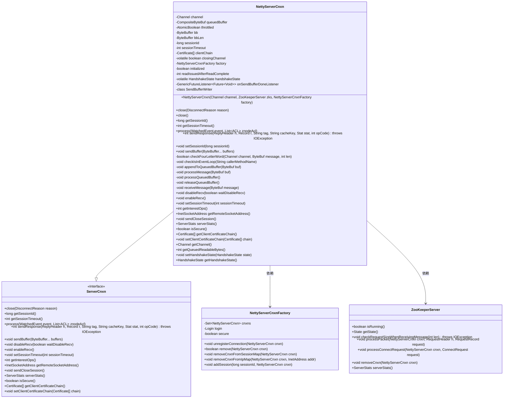
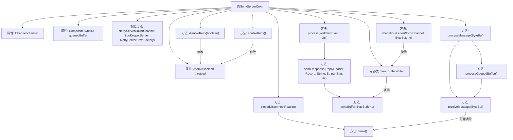

# 基础信息

|      |      |
|------|------|
| 名称 | NettyServerCnxn |
| 编码语言 | .java |
| 代码路径 | zookeeper/zookeeper-server/src/main/java/org/apache/zookeeper/server/NettyServerCnxn.java |
| 包名 | org.apache.zookeeper.server |
| 依赖项 | ['java.nio.charset.StandardCharsets.UTF_8', 'io.netty.buffer.ByteBuf', 'io.netty.buffer.ByteBufUtil', 'io.netty.buffer.CompositeByteBuf', 'io.netty.buffer.Unpooled', 'io.netty.channel.Channel', 'io.netty.channel.ChannelFuture', 'io.netty.channel.ChannelFutureListener', 'io.netty.util.concurrent.Future', 'io.netty.util.concurrent.GenericFutureListener', 'java.io.BufferedWriter', 'java.io.IOException', 'java.io.PrintWriter', 'java.io.Writer', 'java.net.InetAddress', 'java.net.InetSocketAddress', 'java.nio.ByteBuffer', 'java.nio.channels.SelectionKey', 'java.security.cert.Certificate', 'java.util.Arrays', 'java.util.List', 'java.util.concurrent.atomic.AtomicBoolean', 'org.apache.jute.BinaryInputArchive', 'org.apache.jute.Record', 'org.apache.zookeeper.ClientCnxn', 'org.apache.zookeeper.KeeperException', 'org.apache.zookeeper.WatchedEvent', 'org.apache.zookeeper.ZooDefs', 'org.apache.zookeeper.data.ACL', 'org.apache.zookeeper.data.Id', 'org.apache.zookeeper.data.Stat', 'org.apache.zookeeper.proto.ConnectRequest', 'org.apache.zookeeper.proto.ReplyHeader', 'org.apache.zookeeper.proto.RequestHeader', 'org.apache.zookeeper.proto.WatcherEvent', 'org.apache.zookeeper.server.command.CommandExecutor', 'org.apache.zookeeper.server.command.FourLetterCommands', 'org.apache.zookeeper.server.command.NopCommand', 'org.apache.zookeeper.server.command.SetTraceMaskCommand', 'org.slf4j.Logger', 'org.slf4j.LoggerFactory'] |
| 概述说明 | NettyServerCnxn是ZooKeeper的Netty连接实现类，管理客户端连接、消息处理、流量控制及会话状态。核心功能包括消息接收/发送、连接关闭、四字命令处理、SSL握手状态管理，并集成到NettyServerCnxnFactory进行统一管理。 |

# 说明

NettyServerCnxn是ZooKeeper中基于Netty的网络连接实现类，继承自ServerCnxn。它管理客户端会话，处理消息收发、流量控制和安全认证。核心功能包括：1) 使用Channel进行网络通信，支持消息队列(CompositeByteBuf)和节流控制(AtomicBoolean throttled)；2) 处理握手状态(HandshakeState枚举)和会话管理(sessionId/timeout)；3) 实现四种字母命令检查和ACL权限验证；4) 提供SSL证书链(clientChain)管理；5) 包含连接关闭流程，确保数据完整性和资源释放。通过事件循环线程保证线程安全，集成指标统计和日志跟踪。

# 类列表 Class Summary

| 名称   | 类型  | 说明 |
|-------|------|-------------|
| NettyServerCnxn | class | NettyServerCnxn是ZooKeeper的Netty连接实现类，管理客户端连接、消息处理、流量控制及会话生命周期。核心功能包括消息接收/发送、连接关闭、四字命令处理、SSL握手状态管理及缓冲区控制。 |

## 类 NettyServerCnxn

|      |      |
|------|------|
| 访问范围 | public |
| 类型 | class |
| 名称 | NettyServerCnxn |
| 说明 | NettyServerCnxn是ZooKeeper的Netty连接实现类，管理客户端连接、消息处理、流量控制及会话生命周期。核心功能包括消息接收/发送、连接关闭、四字命令处理、SSL握手状态管理及缓冲区控制。 |

### UML类图

这段代码定义了一个NettyServerCnxn类，它继承自ServerCnxn接口，用于处理Netty框架下的ZooKeeper服务器连接。该类管理网络连接状态、会话信息、消息缓冲和处理逻辑，包括消息的接收、处理和发送，以及连接的生命周期管理。NettyServerCnxn与NettyServerCnxnFactory和ZooKeeperServer紧密协作，前者管理连接集合和会话映射，后者处理具体的ZooKeeper协议逻辑。代码中包含了丰富的状态管理和错误处理机制，确保在高并发场景下的稳定性和可靠性。

### 内部方法调用关系图

这段代码是NettyServerCnxn类的实现，主要用于处理ZooKeeper服务器与客户端之间的网络连接。流程图展示了类的主要结构和关键方法调用关系，包括连接关闭处理（close）、消息处理（processMessage/receiveMessage）、流量控制（disableRecv/enableRecv）和四字命令处理（checkFourLetterWord）等核心功能。该类通过Channel与客户端通信，使用queuedBuffer缓存消息，并通过throttled标志实现流量控制，整体设计体现了Netty异步IO和ZooKeeper协议处理的结合。

### 字段列表 Field List

| 名称  | 类型  | 说明 |
|-------|-------|------|
| channel | Channel | 私有且不可变的Channel类型变量channel。 |
| onSendBufferDoneListener = f -> {        if (f.isSuccess()) {            packetSent();        }    } | GenericFutureListener<Future<Void>> | 私有监听器onSendBufferDoneListener在Future<Void>成功时调用packetSent()方法。 |
| throttled = new AtomicBoolean(false) | AtomicBoolean | 私有原子布尔变量throttled初始值为false，用于线程安全的状态控制。 |
| clientChain | Certificate[] | 客户端证书链数组 |
| closingChannel | boolean | 私有易变布尔变量，标记通道是否正在关闭。 |
| handshakeState = HandshakeState.NONE | HandshakeState | 私有易变握手状态变量，初始值为NONE。 |
| sessionTimeout | int | 私有整型变量sessionTimeout，用于会话超时控制。 |
| initialized | boolean | 私有布尔变量，标记是否已初始化。 |
| readIssuedAfterReadComplete | int | 变量readIssuedAfterReadComplete记录读取完成后发出的读取操作次数，类型为公共整型。 |
| factory | NettyServerCnxnFactory | 私有成员变量factory，类型为NettyServerCnxnFactory。 |
| bbLen = ByteBuffer.allocate(4) | ByteBuffer | 私有字节缓冲区bbLen，分配4字节空间。 |
| bb | ByteBuffer | 私有字节缓冲区bb。 |
| queuedBuffer | CompositeByteBuf | 私有变量queuedBuffer，类型为CompositeByteBuf。 |
| sessionId | long | 私有长整型会话ID。 |
| LOG = LoggerFactory.getLogger(NettyServerCnxn.class) | Logger | NettyServerCnxn类中定义了一个私有静态日志记录器LOG，用于记录日志信息。 |

### 方法列表 Method List

| 名称  | 类型  | 说明 |
|-------|-------|------|
| appendToQueuedBuffer | void | 私有方法`appendToQueuedBuffer`将ByteBuf添加到队列缓冲区。检查是否在事件循环中，若缓冲区组件数达上限则合并现有组件，添加新组件并更新指标。 |
| getSessionTimeout | int | 重写getSessionTimeout方法，直接返回sessionTimeout变量值。 |
| getSessionId | long | 重写getSessionId方法，返回sessionId值。 |
| getHandshakeState | HandshakeState | 获取当前握手状态的方法，返回handshakeState属性值。 |
| releaseQueuedBuffer | void | 释放队列缓冲区的私有方法：检查事件循环，若存在缓冲区则释放并置空。 |
| isSecure | boolean | 该方法检查工厂的安全标志并返回其布尔值。 |
| checkFourLetterWord | boolean | 检查四字母命令：验证命令是否已知且启用，禁用自动读取，执行对应操作或返回错误信息。 |
| sendResponse | int | 该方法发送响应，检查通道状态，序列化数据后发送，并返回响应大小。若通道关闭则返回0。缓存功能未实现。 |
| sendBuffer | void | 方法sendBuffer处理缓冲区发送：若缓冲区为关闭连接信号则关闭连接，否则通过channel发送合并的缓冲区并添加监听器。 |
| setSessionId | void | 重写setSessionId方法，设置sessionId并调用factory.addSession将其加入工厂。 |
| sendCloseSession | void | 重写sendCloseSession方法，调用sendBuffer发送关闭连接指令。 |
| setSessionTimeout | void | 重写setSessionTimeout方法，设置sessionTimeout变量值。 |
| getClientCertificateChain | Certificate[] | 该方法返回客户端证书链的副本。若证书链为空则返回null，否则返回完整副本以确保安全性。 |
| getRemoteSocketAddress | InetSocketAddress | 重写方法，返回通道远程地址的InetSocketAddress对象。 |
| setHandshakeState | void | 方法setHandshakeState用于设置握手状态，将参数state赋值给成员变量handshakeState。 |
| close | void | 重写close方法，设置断开原因后调用原close方法。 |
| getChannel | Channel | 获取channel对象的方法，返回私有成员变量channel。 |
| process | void | 方法处理ZooKeeper事件，检查ACL权限后发送响应。若无权限则记录日志并返回，否则转换事件类型并通过网络发送，记录响应大小或异常。 |
| processQueuedBuffer | void | 处理队列缓冲区：检查事件循环，处理非空缓冲区并记录日志，接收消息后根据状态释放或保留剩余数据，空队列时记录日志。 |
| close | void | 关闭会话连接，标记为关闭状态，注销连接防止泄漏。若连接未关闭则移除相关映射并确保数据写入后关闭通道，否则释放缓冲区。 |
| processMessage | void | 处理消息函数：检查事件循环，记录日志。若关闭中则丢弃消息；若限流则缓存消息；否则处理消息或缓存剩余数据。 |
| checkIsInEventLoop | void | 检查是否在事件循环线程中，否则抛出异常。 |
| serverStats | ServerStats | 重写serverStats方法，检查zkServer非空后返回其状态，否则返回null。 |
| getQueuedReadableBytes | int | 该方法返回队列中可读字节数。若队列缓冲区存在，返回其可读字节数；否则返回0。需在事件循环线程中调用。 |
| getInterestOps | int | 方法`getInterestOps`返回通道的操作兴趣集。若通道未打开或为空，返回0。未限流时添加`OP_READ`标志；通道不可写时添加`OP_WRITE`标志。主要用于Netty实现中的连接信息打印。 |
| enableRecv | void | 重写enableRecv方法：若throttled从true变为false，则记录日志并触发通道的ENABLE读事件。 |
| setClientCertificateChain | void | 重写方法setClientCertificateChain，处理证书链参数：若为null则置空，否则复制数组存储。 |
| disableRecv | void | 方法disableRecv用于禁用接收功能，通过原子操作设置throttled标志为true，触发管道事件ReadEvent.DISABLE。 |
| receiveMessage | void | 接收消息处理逻辑：检查事件循环，读取消息到缓冲区，处理ZooKeeper请求或连接请求，处理异常情况如IO错误或客户端限流。 |

