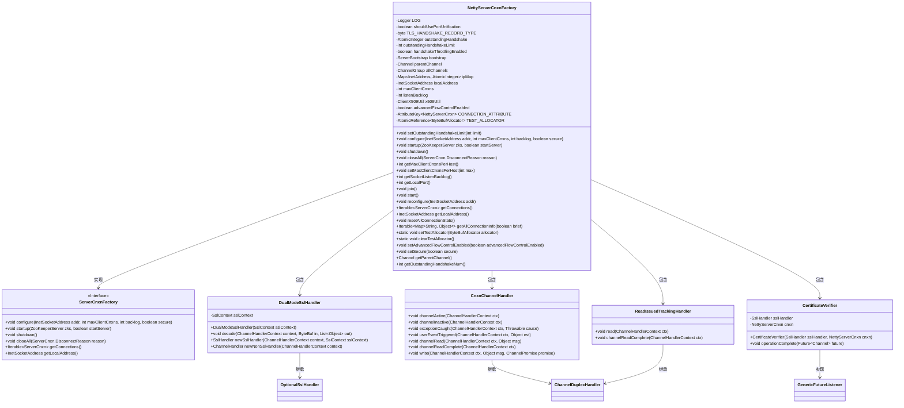

# 基础信息

|      |      |
|------|------|
| 名称 | NettyServerCnxnFactory |
| 编码语言 | .java |
| 代码路径 | zookeeper/zookeeper-server/src/main/java/org/apache/zookeeper/server/NettyServerCnxnFactory.java |
| 包名 | org.apache.zookeeper.server |
| 依赖项 | ['io.netty.bootstrap.ServerBootstrap', 'io.netty.buffer.ByteBuf', 'io.netty.buffer.ByteBufAllocator', 'io.netty.channel.Channel', 'io.netty.channel.ChannelDuplexHandler', 'io.netty.channel.ChannelFuture', 'io.netty.channel.ChannelHandler', 'io.netty.channel.ChannelHandler.Sharable', 'io.netty.channel.ChannelHandlerContext', 'io.netty.channel.ChannelInitializer', 'io.netty.channel.ChannelOption', 'io.netty.channel.ChannelPipeline', 'io.netty.channel.ChannelPromise', 'io.netty.channel.EventLoopGroup', 'io.netty.channel.group.ChannelGroup', 'io.netty.channel.group.ChannelGroupFuture', 'io.netty.channel.group.DefaultChannelGroup', 'io.netty.channel.socket.SocketChannel', 'io.netty.handler.ssl.OptionalSslHandler', 'io.netty.handler.ssl.SslContext', 'io.netty.handler.ssl.SslHandler', 'io.netty.util.AttributeKey', 'io.netty.util.ReferenceCountUtil', 'io.netty.util.concurrent.DefaultEventExecutor', 'io.netty.util.concurrent.Future', 'io.netty.util.concurrent.GenericFutureListener', 'java.io.IOException', 'java.net.InetAddress', 'java.net.InetSocketAddress', 'java.net.SocketAddress', 'java.util.HashSet', 'java.util.List', 'java.util.Map', 'java.util.Objects', 'java.util.Set', 'java.util.concurrent.ConcurrentHashMap', 'java.util.concurrent.atomic.AtomicInteger', 'java.util.concurrent.atomic.AtomicReference', 'javax.net.ssl.SSLEngine', 'javax.net.ssl.SSLException', 'javax.net.ssl.SSLPeerUnverifiedException', 'javax.net.ssl.SSLSession', 'org.apache.zookeeper.KeeperException', 'org.apache.zookeeper.common.ClientX509Util', 'org.apache.zookeeper.common.NettyUtils', 'org.apache.zookeeper.common.X509Exception', 'org.apache.zookeeper.common.X509Exception.SSLContextException', 'org.apache.zookeeper.common.ZKConfig', 'org.apache.zookeeper.server.NettyServerCnxn.HandshakeState', 'org.apache.zookeeper.server.auth.ProviderRegistry', 'org.apache.zookeeper.server.auth.X509AuthenticationProvider', 'org.apache.zookeeper.server.quorum.QuorumPeerConfig', 'org.slf4j.Logger', 'org.slf4j.LoggerFactory'] |
| 概述说明 | NettyServerCnxnFactory是ZooKeeper的Netty网络连接工厂，支持SSL/TLS和明文连接，提供连接管理、流量控制和证书验证功能。 |

# 说明

NettyServerCnxnFactory是一个基于Netty框架实现的服务器连接工厂类，用于管理ZooKeeper服务器的客户端连接。它支持SSL/TLS加密通信和明文通信，通过DualModeSslHandler实现端口统一化处理，可同时接受两种连接方式。工厂类包含连接限流机制，通过outstandingHandshakeLimit控制并发握手连接数，并提供了IP连接数统计功能。核心组件包括CnxnChannelHandler处理连接生命周期事件、CertificateVerifier验证客户端证书、ReadIssuedTrackingHandler实现高级流量控制。工厂支持动态配置监听地址、最大连接数等参数，并提供了连接统计、优雅关闭等功能。内部使用ChannelGroup管理所有活跃连接，通过ConcurrentHashMap跟踪每个IP的连接数。

# 类列表 Class Summary

| 名称   | 类型  | 说明 |
|-------|------|-------------|
| NettyServerCnxnFactory | class | NettyServerCnxnFactory是ZooKeeper的Netty网络连接工厂类，支持SSL/TLS加密和明文连接，提供连接管理、流量控制和握手限流功能。关键特性包括端口统一化、证书验证、连接数限制及高级流量控制。 |

## 类 NettyServerCnxnFactory

|      |      |
|------|------|
| 访问范围 | public |
| 类型 | class |
| 名称 | NettyServerCnxnFactory |
| 说明 | NettyServerCnxnFactory是ZooKeeper的Netty网络连接工厂类，支持SSL/TLS加密和明文连接，提供连接管理、流量控制和握手限流功能。关键特性包括端口统一化、证书验证、连接数限制及高级流量控制。 |

### UML类图

这段代码是NettyServerCnxnFactory的实现，主要用于处理ZooKeeper服务器的网络连接。它继承自ServerCnxnFactory接口，通过Netty框架管理客户端连接，支持SSL/TLS加密和端口统一化配置。核心功能包括连接限制管理、握手过程控制、证书验证和流量控制等。类图中展示了主要组件及其关系：工厂类包含多个处理器（DualModeSslHandler处理SSL/明文双模式，CnxnChannelHandler管理连接生命周期，CertificateVerifier验证证书），这些组件协同工作实现安全可靠的网络通信。系统通过配置参数控制连接数限制、握手并发等行为，并提供了完整的连接管理生命周期方法。

### 内部方法调用关系图

```mermaid
graph TD
    A["类NettyServerCnxnFactory"]
    B["属性: Logger LOG"]
    C["属性: boolean shouldUsePortUnification"]
    D["属性: AtomicInteger outstandingHandshake"]
    E["属性: ServerBootstrap bootstrap"]
    F["属性: ChannelGroup allChannels"]
    G["方法: setOutstandingHandshakeLimit"]
    H["方法: configure"]
    I["方法: start"]
    J["方法: shutdown"]
    K["方法: closeAll"]
    L["内部类: DualModeSslHandler"]
    M["内部类: CnxnChannelHandler"]
    N["内部类: CertificateVerifier"]
    O["内部类: ReadIssuedTrackingHandler"]

    A --> B
    A --> C
    A --> D
    A --> E
    A --> F
    A --> G
    A --> H
    A --> I
    A --> J
    A --> K
    A --> L
    A --> M
    A --> N
    A --> O

    L --> P["方法: decode"]
    L --> Q["方法: handleNonSsl"]
    L --> R["方法: newSslHandler"]
    L --> S["方法: newNonSslHandler"]

    M --> T["方法: channelActive"]
    M --> U["方法: channelInactive"]
    M --> V["方法: exceptionCaught"]
    M --> W["方法: userEventTriggered"]
    M --> X["方法: channelRead"]
    M --> Y["方法: channelReadComplete"]
    M --> Z["方法: write"]

    N --> AA["方法: operationComplete"]

    O --> AB["方法: read"]
    O --> AC["方法: channelReadComplete"]
```

该流程图展示了NettyServerCnxnFactory类的主要结构和关键方法调用关系。核心功能包括SSL/TLS连接处理（通过DualModeSslHandler）、通道事件管理（通过CnxnChannelHandler）和证书验证（通过CertificateVerifier）。工厂类通过ServerBootstrap管理Netty服务端连接，支持端口统一化配置和握手限流机制，同时维护所有活跃连接的ChannelGroup。内部类协作处理网络事件的生命周期，包括连接建立/关闭、异常处理、读写事件和SSL握手验证等关键流程。

### 字段列表 Field List

| 名称  | 类型  | 说明 |
|-------|-------|------|
| killed | boolean | 私有布尔变量，表示是否被终止。 |
| allChannels = new DefaultChannelGroup("zkServerCnxns", new DefaultEventExecutor()) | ChannelGroup | 私有ChannelGroup变量allChannels，使用DefaultChannelGroup初始化，命名为zkServerCnxns，并指定DefaultEventExecutor。 |
| bootstrap | ServerBootstrap | 私有不可变的服务器启动对象。 |
| channelHandler = new CnxnChannelHandler() | CnxnChannelHandler | 创建CnxnChannelHandler实例channelHandler。 |
| TEST_ALLOCATOR = new AtomicReference<>(null) | AtomicReference<ByteBufAllocator> | 定义静态原子引用TEST_ALLOCATOR，初始值为null，用于线程安全操作ByteBufAllocator对象。 |
| OUTSTANDING_HANDSHAKE_LIMIT = "zookeeper.netty.server.outstandingHandshake.limit" | String | ZooKeeper Netty服务器配置项，用于限制未完成握手连接的最大数量。 |
| NETTY_ADVANCED_FLOW_CONTROL = "zookeeper.netty.advancedFlowControl.enabled" | String | 这是一个Java静态常量，定义Netty高级流控制的配置键，用于ZooKeeper中启用或禁用该功能。 |
| handshakeThrottlingEnabled | boolean | 私有布尔变量，用于控制握手限流功能是否启用。 |
| outstandingHandshakeLimit | int | 私有整型变量，用于限制未完成握手数量。 |
| ipMap = new ConcurrentHashMap<>() | Map<InetAddress, AtomicInteger> | 私有并发映射，键为IP地址，值为原子整数计数器。 |
| readIssuedTrackingHandler = new ReadIssuedTrackingHandler() | ReadIssuedTrackingHandler | 创建ReadIssuedTrackingHandler类的新实例。 |
| x509Util | ClientX509Util | 私有成员变量x509Util，类型为ClientX509Util。 |
| shouldUsePortUnification | boolean | 私有布尔变量，决定是否使用端口统一。 |
| maxClientCnxns = 60 | int | 私有整型变量maxClientCnxns，默认值60。 |
| localAddress | InetSocketAddress | 私有变量localAddress，类型为InetSocketAddress。 |
| CONNECTION_ATTRIBUTE = AttributeKey.valueOf("NettyServerCnxn") | AttributeKey<NettyServerCnxn> | 定义Netty服务器连接的静态常量属性键，用于标识连接对象。 |
| listenBacklog = -1 | int | 定义整型变量listenBacklog并初始化为-1。 |
| PORT_UNIFICATION_KEY = "zookeeper.client.portUnification" | String | 这是一个Java静态常量，定义了一个字符串键"zookeeper.client.portUnification"，用于ZooKeeper客户端的端口统一配置。 |
| LOG = LoggerFactory.getLogger(NettyServerCnxnFactory.class) | Logger | NettyServerCnxnFactory类中定义了一个私有静态日志常量LOG，用于记录日志信息。 |
| EARLY_DROP_SECURE_CONNECTION_HANDSHAKES = "zookeeper.netty.server.earlyDropSecureConnectionHandshakes" | String | 这是一个ZooKeeper Netty服务器的静态常量，用于控制是否提前丢弃安全连接握手。 |
| outstandingHandshake = new AtomicInteger() | AtomicInteger | 私有原子整型变量outstandingHandshake，用于线程安全计数。 |
| parentChannel | Channel | 私有父频道变量声明。 |
| TLS_HANDSHAKE_RECORD_TYPE = 0x16 | byte | TLS握手记录类型定义为0x16的静态常量字节。 |
| CLIENT_CERT_RELOAD_KEY = "zookeeper.client.certReload" | String | 客户端证书重载配置键，用于ZooKeeper客户端证书动态更新。 |
| advancedFlowControlEnabled = false | boolean | 高级流量控制功能未启用。 |

### 方法列表 Method List

| 名称  | 类型  | 说明 |
|-------|-------|------|
| removeCnxnFromIpMap | void | 从IP映射中移除连接，若地址不存在则报错；计数减1，若归零则移除条目。 |
| shutdown | void | 方法实现服务关闭流程：检查状态、关闭X509和登录模块、停止事件循环组、关闭所有通道、关闭ZK服务，最后标记为已关闭并通知。 |
| getLocalPort | int | 重写getLocalPort方法，返回localAddress的端口号。 |
| getSocketListenBacklog | int | 获取socket监听队列长度的方法，返回listenBacklog值。 |
| getLocalAddress | InetSocketAddress | 重写getLocalAddress方法，返回本地地址localAddress。 |
| start | void | Java方法重写，设置SO_BACKLOG参数并绑定端口，绑定后更新本地地址信息，记录绑定前后的端口日志。 |
| closeAll | void | 关闭所有连接，处理异常并记录日志。 |
| startup | void | 重写startup方法，启动服务并初始化ZooKeeperServer，可选执行数据加载和启动流程。 |
| getClientCnxnCount | int | 获取指定IP地址的客户端连接数，若无记录则返回0。 |
| resetAllConnectionStats | void | 重置所有连接的统计信息，遍历并发哈希表中的连接并逐个调用重置方法。 |
| getAllConnectionInfo | Iterable<Map<String, Object>> | 该方法返回所有连接的简要或详细信息集合，使用线程安全的ConcurrentHashMap存储，无需同步处理。 |
| setTestAllocator | void | 静态方法setTestAllocator用于设置测试用的ByteBufAllocator，通过线程局部变量TEST_ALLOCATOR存储。 |
| clearTestAllocator | void | 清除测试分配器，将TEST_ALLOCATOR设为null。 |
| setAdvancedFlowControlEnabled | void | 设置高级流量控制启用状态的公共方法，参数为布尔值。 |
| setSecure | void | 设置安全标志的方法，参数为布尔值secure，用于更新对象的安全状态。 |
| getParentChannel | Channel | 获取父频道对象的方法，返回parentChannel变量。 |
| getOutstandingHandshakeNum | int | 该方法返回当前未完成的握手数量，通过调用outstandingHandshake的get()方法实现。 |
| updateHandshakeCountIfStarted | void | 更新握手状态：若连接非空且状态为STARTED，则设为FINISHED并减少未完成握手计数。 |
| getMaxClientCnxnsPerHost | int | 该方法返回每个主机的最大客户端连接数，直接返回变量maxClientCnxns的值。 |
| setMaxClientCnxnsPerHost | void | 设置每个主机的最大客户端连接数为指定值。 |
| initSSL | void | 私有方法initSSL初始化SSL，根据系统属性创建Netty SSL上下文，支持纯文本模式则添加DualModeSslHandler，否则添加普通SSL处理器。 |
| getConnections | Iterable<ServerCnxn> | Java方法重写，返回服务器连接的迭代对象cnxns。 |
| configure | void | 重写方法配置网络参数，包括地址、最大连接数、队列长度和安全设置，初始化SASL登录和最大连接数，记录配置日志。 |
| configureBootstrapAllocator | ServerBootstrap | 配置ServerBootstrap的ByteBufAllocator选项，若存在测试分配器则设置父子通道分配器，否则返回原对象。 |
| setOutstandingHandshakeLimit | void | 设置握手限制方法：更新限制值并启用节流功能，条件为安全或端口统一且限制大于0，记录日志状态。 |
| addCnxn | void | 私有方法`addCnxn`将Netty连接加入集合，统计远程IP的连接数。使用原子计数器确保线程安全。 |
| join | void | Java方法`join()`使用同步块和`wait()`循环检查`killed`标志，未终止时持续等待。 |
| reconfigure | void | 方法reconfigure用于重新绑定网络端口。若新地址与原地址相同则跳过。绑定成功后更新本地地址，关闭旧通道，异常时记录错误。 |

