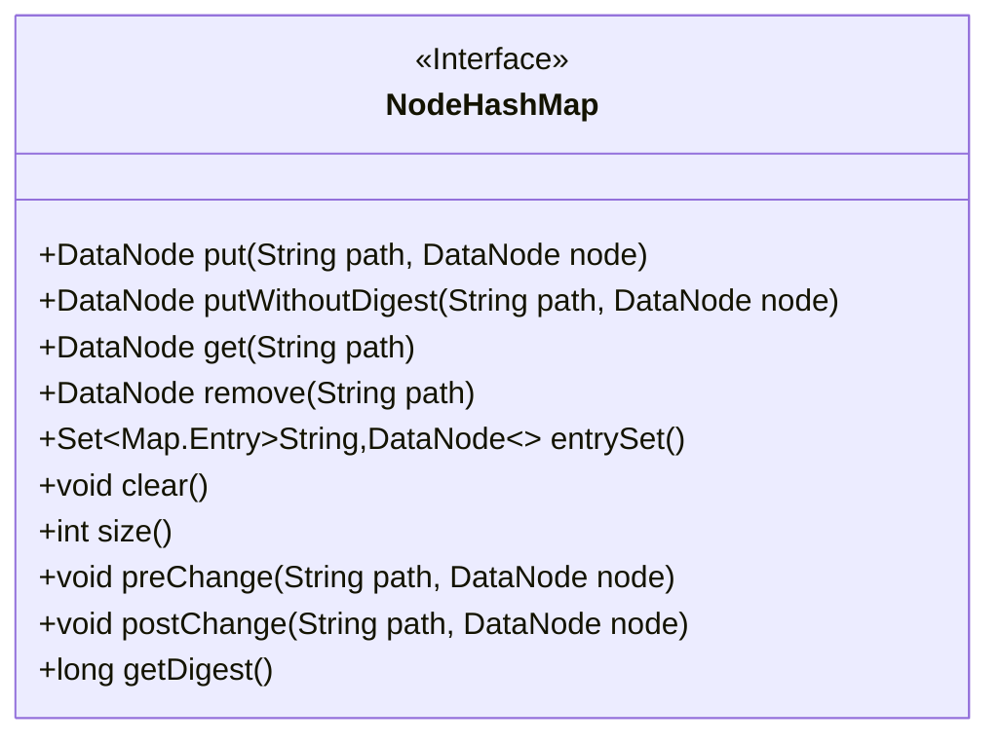
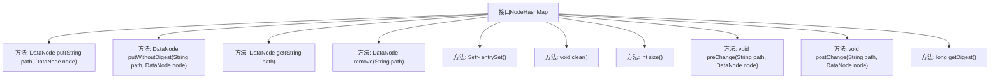

# 基础信息

|      |      |
|------|------|
| 名称 | NodeHashMap |
| 编码语言 | .java |
| 代码路径 | zookeeper/zookeeper-server/src/main/java/org/apache/zookeeper/server/NodeHashMap.java |
| 包名 | org.apache.zookeeper.server |
| 依赖项 | ['java.util.Map', 'java.util.Set'] |
| 概述说明 | NodeHashMap接口提供节点管理功能，包括增删查改、清空、获取大小和条目集合，支持带/不带摘要更新，提供变更前后钩子及摘要获取。 |

# 说明

NodeHashMap是一个接口，定义了节点映射的操作方法。它支持通过路径添加节点（put）或添加节点但不更新摘要（putWithoutDigest），获取节点（get），移除节点（remove），获取所有条目（entrySet），清空映射（clear），获取映射大小（size）。还提供了在节点变更前后调用的方法（preChange和postChange），用于管理摘要状态，并支持获取摘要值（getDigest）。

# 类列表 Class Summary

| 名称   | 类型  | 说明 |
|-------|------|-------------|
| NodeHashMap | interface | NodeHashMap接口提供节点路径映射管理，支持增删查改、清空、获取大小和条目集，包含更新摘要的预变更和后变更方法，以及获取摘要值功能。 |

## 类 NodeHashMap

|      |      |
|------|------|
| 访问范围 | public |
| 类型 | interface |
| 名称 | NodeHashMap |
| 说明 | NodeHashMap接口提供节点路径映射管理，支持增删查改、清空、获取大小和条目集，包含更新摘要的预变更和后变更方法，以及获取摘要值功能。 |

### UML类图

这段代码定义了一个名为`NodeHashMap`的接口，它主要用于管理路径(`String`)与数据节点(`DataNode`)之间的映射关系，并提供了对节点变更的预处理(`preChange`)和后处理(`postChange`)方法，以及计算和获取摘要值(`getDigest`)的功能。接口包含基本的CRUD操作(`put`, `get`, `remove`)、集合操作(`entrySet`, `clear`, `size`)和两种特殊的节点更新方式(`putWithoutDigest`)。该设计适用于需要跟踪节点变更并维护数据一致性的场景，如版本控制系统或分布式数据存储。

### 内部方法调用关系图

该流程图展示了NodeHashMap接口的所有方法定义。接口主要提供对数据节点的增删改查操作，包含带/不带摘要更新的节点插入方法(preChange/postChange)、节点访问方法(get/entrySet)和状态管理方法(clear/size)。核心特点是支持通过路径管理DataNode，并在变更时维护摘要状态(digest)，适用于需要数据版本控制的场景。

### 字段列表 Field List

| 名称  | 类型  | 说明 |
|-------|-------|------|

### 方法列表 Method List

| 名称  | 类型  | 说明 |
|-------|-------|------|
| remove | DataNode | 删除指定路径的DataNode节点。 |
| get | DataNode | 获取指定路径的数据节点。 |
| postChange | void | 方法postChange在路径path的数据节点node发生变更时被调用。 |
| entrySet | Set<Map.Entry<String, DataNode>> | 获取键值对集合，包含字符串键和DataNode值。 |
| clear | void | 清除所有内容。 |
| preChange | void | 方法preChange在路径path的DataNode节点变更前被调用。 |
| putWithoutDigest | DataNode | 方法putWithoutDigest用于将DataNode节点存入指定路径path，不进行摘要校验。 |
| size | int | 获取容器或数组的大小。 |
| put | DataNode | DataNode的put方法用于在指定路径存储节点，返回操作后的节点。 |
| getDigest | long | 获取摘要信息的方法。 |

