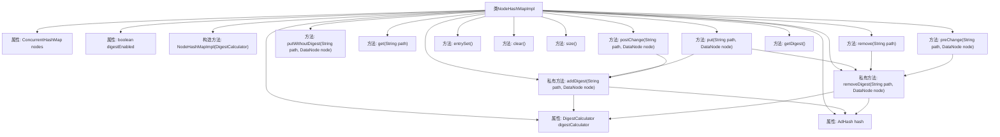

# 基础信息

|      |      |
|------|------|
| 名称 | NodeHashMapImpl |
| 编码语言 | .java |
| 代码路径 | zookeeper/zookeeper-server/src/main/java/org/apache/zookeeper/server/NodeHashMapImpl.java |
| 包名 | org.apache.zookeeper.server |
| 依赖项 | ['java.util.Map', 'java.util.Set', 'java.util.concurrent.ConcurrentHashMap', 'org.apache.zookeeper.ZooDefs', 'org.apache.zookeeper.server.util.AdHash'] |
| 概述说明 | NodeHashMapImpl实现基于ConcurrentHashMap的节点存储，支持摘要计算功能，提供增删改查及摘要更新方法，排除特定路径的摘要处理。 |

# 说明

NodeHashMapImpl是一个实现了NodeHashMap接口的类，使用ConcurrentHashMap存储路径与DataNode的映射关系。它支持摘要计算功能，通过DigestCalculator计算节点摘要并维护在AdHash中。摘要功能可通过ZooKeeperServer配置启用或禁用。类提供了基本的增删查改方法，如put、get、remove等，并确保在操作时同步更新摘要。对于以/zookeeper/开头的路径，不参与摘要计算。摘要相关操作包括添加、移除及获取当前哈希值。此外，还提供了preChange和postChange方法，在节点变更前后处理摘要状态。

# 类列表 Class Summary

| 名称   | 类型  | 说明 |
|-------|------|-------------|
| NodeHashMapImpl | class | NodeHashMapImpl基于ConcurrentHashMap实现节点存储，支持摘要计算功能，提供增删改查及清空操作，并排除/zookeeper/路径下的节点摘要计算。 |


## 类 NodeHashMapImpl

|      |      |
|------|------|
| 访问范围 | public |
| 类型 | class |
| 名称 | NodeHashMapImpl |
| 说明 | NodeHashMapImpl基于ConcurrentHashMap实现节点存储，支持摘要计算功能，提供增删改查及清空操作，并排除/zookeeper/路径下的节点摘要计算。 |


### UML类图

```mermaid
classDiagram
    class NodeHashMapImpl {
        -ConcurrentHashMap~String, DataNode~ nodes
        -boolean digestEnabled
        -DigestCalculator digestCalculator
        -AdHash hash
        +NodeHashMapImpl(DigestCalculator digestCalculator)
        +DataNode put(String path, DataNode node)
        +DataNode putWithoutDigest(String path, DataNode node)
        +DataNode get(String path)
        +DataNode remove(String path)
        +Set~Map.Entry~String, DataNode~~ entrySet()
        +void clear()
        +int size()
        +void preChange(String path, DataNode node)
        +void postChange(String path, DataNode node)
        +long getDigest()
        -void addDigest(String path, DataNode node)
        -void removeDigest(String path, DataNode node)
    }

    <<Interface>> NodeHashMap {
        <<Interface>>
        +DataNode put(String path, DataNode node)
        +DataNode putWithoutDigest(String path, DataNode node)
        +DataNode get(String path)
        +DataNode remove(String path)
        +Set~Map.Entry~String, DataNode~~ entrySet()
        +void clear()
        +int size()
        +void preChange(String path, DataNode node)
        +void postChange(String path, DataNode node)
        +long getDigest()
    }

    class DataNode {
        -boolean digestCached
    }

    class DigestCalculator {
        <<Interface>>
        +long calculateDigest(String path, DataNode node)
    }

    class AdHash {
        +void addDigest(long digest)
        +void removeDigest(long digest)
        +long getHash()
        +void clear()
    }

    NodeHashMapImpl ..|> NodeHashMap : 实现
    NodeHashMapImpl --> DigestCalculator : 依赖
    NodeHashMapImpl --> AdHash : 组合
    DigestCalculator --> DataNode : 使用
    NodeHashMapImpl --> DataNode : 聚合
```

这段类图展示了NodeHashMapImpl类及其相关组件的关系。NodeHashMapImpl实现了NodeHashMap接口，使用ConcurrentHashMap存储路径与DataNode的映射，并通过AdHash管理数据摘要。当digestEnabled为true时，会通过DigestCalculator计算摘要并更新AdHash。类图中清晰地呈现了接口实现、依赖关系和组合关系，特别是摘要计算相关的协作流程。


### 内部方法调用关系图



这段代码实现了一个基于ConcurrentHashMap的节点映射表NodeHashMapImpl，支持带摘要校验和不带摘要的操作。流程图展示了类结构、属性关系和方法调用链，核心是通过digestCalculator计算节点摘要并维护在AdHash中，特别处理/zookeeper/路径下的节点。主要操作包括节点的增删改查，每次修改都会同步更新摘要状态，通过digestEnabled开关控制摘要功能。

### 字段列表 Field List

| 名称  | 类型  | 说明 |
|-------|-------|------|
| nodes | ConcurrentHashMap<String, DataNode> | 私有最终并发哈希映射，键为字符串，值为数据节点。 |
| hash | AdHash | 私有不可变的AdHash哈希对象。 |
| digestCalculator | DigestCalculator | 私有不可变的摘要计算器实例。 |
| digestEnabled | boolean | 私有布尔变量digestEnabled，表示是否启用摘要功能。 |

### 方法列表 Method List

| 名称  | 类型  | 说明 |
|-------|-------|------|
| entrySet | Set<Map.Entry<String, DataNode>> | 重写entrySet方法，直接返回nodes的entrySet集合。 |
| put | DataNode | 重写put方法：存入新节点并更新摘要，移除旧节点摘要，返回旧节点。 |
| addDigest | void | 该代码片段为ZooKeeper添加摘要功能，排除/zookeeper/路径下的节点，仅在启用摘要时计算并添加摘要。 |
| postChange | void | 方法postChange在路径path的DataNode节点变更后，清除节点缓存标记digestCached并重新计算摘要。 |
| size | int | 重写size方法，返回nodes集合的大小。 |
| putWithoutDigest | DataNode | 重写putWithoutDigest方法，直接存储节点到指定路径，不处理摘要。 |
| remove | DataNode | 重写remove方法：移除指定路径的DataNode，若存在则清除摘要信息并返回被移除节点。 |
| preChange | void | 重写preChange方法，在变更前移除指定路径和节点的摘要信息。 |
| clear | void | 重写clear方法，清空nodes和hash两个集合。 |
| get | DataNode | 重写get方法，通过路径从nodes获取并返回对应的DataNode。 |
| removeDigest | void | 该方法用于移除指定路径的摘要。若路径以/zookeeper/开头则跳过。启用摘要功能时会计算并移除该路径的摘要值。 |
| getDigest | long | 重写getDigest方法，直接返回hash对象的哈希值。 |


