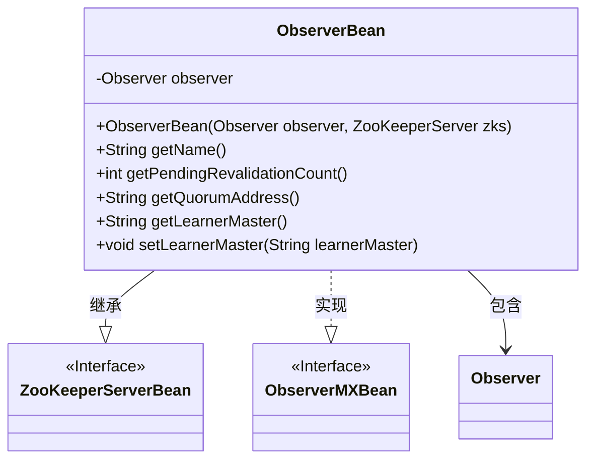
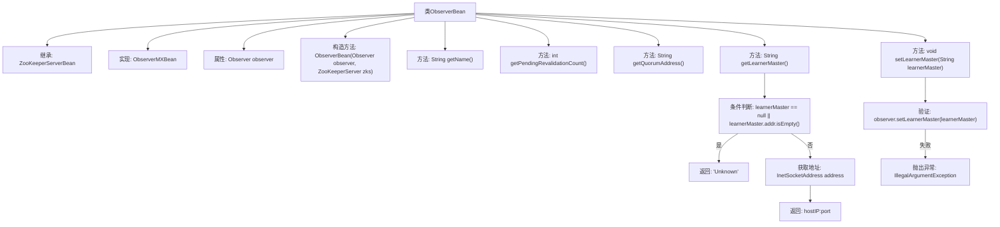

# 基础信息

|      |      |
|------|------|
| 名称 | ObserverBean |
| 编码语言 | .java |
| 代码路径 | zookeeper/zookeeper-server/src/main/java/org/apache/zookeeper/server/ObserverBean.java |
| 包名 | org.apache.zookeeper.server |
| 依赖项 | ['java.net.InetSocketAddress', 'org.apache.zookeeper.server.quorum.Observer', 'org.apache.zookeeper.server.quorum.ObserverMXBean', 'org.apache.zookeeper.server.quorum.QuorumPeer'] |
| 概述说明 | ObserverBean是ZooKeeperServerBean的子类，实现ObserverMXBean接口，用于管理Observer实例。提供获取待验证请求数、仲裁地址和主节点信息的方法，并支持设置主节点。 |

# 说明

ObserverBean是一个继承自ZooKeeperServerBean并实现ObserverMXBean接口的类，用于管理Observer节点的相关信息。它包含一个Observer实例，并通过构造函数初始化。该类提供了获取Observer名称、待验证请求数量、仲裁地址和当前LearnerMaster地址的方法。其中，getName方法返回固定字符串"Observer"，getPendingRevalidationCount返回待验证请求数量，getQuorumAddress返回Observer的套接字地址，getLearnerMaster返回当前LearnerMaster的主机地址和端口，若无效则返回"Unknown"。setLearnerMaster方法用于设置LearnerMaster地址，若无效则抛出异常。

# 类列表 Class Summary

| 名称   | 类型  | 说明 |
|-------|------|-------------|
| ObserverBean | class | ObserverBean类继承ZooKeeperServerBean，实现ObserverMXBean接口，封装Observer对象功能。提供获取名称、待验证计数、仲裁地址和主节点信息的方法，支持设置主节点但需验证有效性。 |

## 类 ObserverBean

|      |      |
|------|------|
| 访问范围 | public |
| 类型 | class |
| 名称 | ObserverBean |
| 说明 | ObserverBean类继承ZooKeeperServerBean，实现ObserverMXBean接口，封装Observer对象功能。提供获取名称、待验证计数、仲裁地址和主节点信息的方法，支持设置主节点但需验证有效性。 |

### UML类图

这段代码展示了一个ObserverBean类，它继承自ZooKeeperServerBean并实现了ObserverMXBean接口。ObserverBean主要用于监控和管理ZooKeeper观察者节点的状态信息，包括获取待验证请求数量、仲裁地址和学习主节点信息，并能设置学习主节点。类图中清晰地展示了继承关系、接口实现和对象组合关系，体现了ObserverBean作为监控组件的职责。

### 内部方法调用关系图

这段代码展示了一个ObserverBean类，它继承自ZooKeeperServerBean并实现了ObserverMXBean接口。主要功能包括获取观察者状态信息（如待验证计数、仲裁地址、当前学习主节点）和设置学习主节点。流程图清晰呈现了类结构、方法调用关系和关键逻辑分支，特别是getLearnerMaster()中的空值检查和setLearnerMaster()的参数验证流程。所有方法都围绕Observer对象的状态操作展开，体现了对ZooKeeper观察者模式的具体实现。

### 字段列表 Field List

| 名称  | 类型  | 说明 |
|-------|-------|------|
| observer | Observer | 声明一个私有观察者对象observer。 |

### 方法列表 Method List

| 名称  | 类型  | 说明 |
|-------|-------|------|
| getLearnerMaster | String | 获取当前LearnerMaster地址，若为空返回"Unknown"，否则返回IP和端口。 |
| getQuorumAddress | String | 该方法返回观察者对象的套接字地址字符串。 |
| getPendingRevalidationCount | int | 该方法返回待重新验证的数量，通过调用观察者的getPendingRevalidationsCount方法实现。 |
| getName | String | 方法返回字符串"Observer"。 |
| setLearnerMaster | void | 方法设置学习主节点，无效时抛出异常。 |

