# 基础信息

|      |      |
|------|------|
| 名称 | PrepRequestProcessor |
| 编码语言 | .java |
| 代码路径 | zookeeper/zookeeper-server/src/main/java/org/apache/zookeeper/server/PrepRequestProcessor.java |
| 包名 | org.apache.zookeeper.server |
| 依赖项 | ['java.io.IOException', 'java.io.StringReader', 'java.util.ArrayList', 'java.util.Collections', 'java.util.HashMap', 'java.util.Iterator', 'java.util.List', 'java.util.Locale', 'java.util.Map', 'java.util.Properties', 'java.util.Set', 'java.util.concurrent.LinkedBlockingQueue', 'org.apache.jute.Record', 'org.apache.zookeeper.CreateMode', 'org.apache.zookeeper.DeleteContainerRequest', 'org.apache.zookeeper.KeeperException', 'org.apache.zookeeper.KeeperException.BadArgumentsException', 'org.apache.zookeeper.KeeperException.Code', 'org.apache.zookeeper.MultiOperationRecord', 'org.apache.zookeeper.Op', 'org.apache.zookeeper.ZooDefs', 'org.apache.zookeeper.ZooDefs.OpCode', 'org.apache.zookeeper.common.PathUtils', 'org.apache.zookeeper.common.StringUtils', 'org.apache.zookeeper.common.Time', 'org.apache.zookeeper.data.ACL', 'org.apache.zookeeper.data.Id', 'org.apache.zookeeper.data.StatPersisted', 'org.apache.zookeeper.proto.CheckVersionRequest', 'org.apache.zookeeper.proto.CreateRequest', 'org.apache.zookeeper.proto.CreateTTLRequest', 'org.apache.zookeeper.proto.DeleteRequest', 'org.apache.zookeeper.proto.ReconfigRequest', 'org.apache.zookeeper.proto.SetACLRequest', 'org.apache.zookeeper.proto.SetDataRequest', 'org.apache.zookeeper.server.ZooKeeperServer.ChangeRecord', 'org.apache.zookeeper.server.ZooKeeperServer.PrecalculatedDigest', 'org.apache.zookeeper.server.auth.ProviderRegistry', 'org.apache.zookeeper.server.auth.ServerAuthenticationProvider', 'org.apache.zookeeper.server.quorum.LeaderZooKeeperServer', 'org.apache.zookeeper.server.quorum.QuorumPeer.QuorumServer', 'org.apache.zookeeper.server.quorum.QuorumPeerConfig', 'org.apache.zookeeper.server.quorum.QuorumPeerConfig.ConfigException', 'org.apache.zookeeper.server.quorum.flexible.QuorumMaj', 'org.apache.zookeeper.server.quorum.flexible.QuorumOracleMaj', 'org.apache.zookeeper.server.quorum.flexible.QuorumVerifier', 'org.apache.zookeeper.txn.CheckVersionTxn', 'org.apache.zookeeper.txn.CloseSessionTxn', 'org.apache.zookeeper.txn.CreateContainerTxn', 'org.apache.zookeeper.txn.CreateSessionTxn', 'org.apache.zookeeper.txn.CreateTTLTxn', 'org.apache.zookeeper.txn.CreateTxn', 'org.apache.zookeeper.txn.DeleteTxn', 'org.apache.zookeeper.txn.ErrorTxn', 'org.apache.zookeeper.txn.MultiTxn', 'org.apache.zookeeper.txn.SetACLTxn', 'org.apache.zookeeper.txn.SetDataTxn', 'org.apache.zookeeper.txn.Txn', 'org.apache.zookeeper.txn.TxnDigest', 'org.apache.zookeeper.txn.TxnHeader', 'org.slf4j.Logger', 'org.slf4j.LoggerFactory'] |
| 概述说明 | PrepRequestProcessor是ZooKeeper的请求预处理线程，继承ZooKeeperCriticalThread并实现RequestProcessor接口。主要功能包括：处理各类操作请求（创建/删除节点、设置数据等），维护变更记录，支持ACL验证和事务处理，处理会话创建/关闭，支持多操作事务，以及摘要计算功能。通过LinkedBlockingQueue接收请求，处理后交给下一处理器。关键方法包括run()循环处理请求、pRequest()核心处理逻辑、pRequest2Txn()将请求转为事务。 |

# 说明

PrepRequestProcessor是ZooKeeper的关键线程类，负责预处理客户端请求并转换为事务操作。主要功能包括：验证请求路径、检查ACL权限、处理多种操作类型（创建/删除节点、设置数据、会话管理等），并维护变更记录。支持多操作事务（multi-op）的原子性执行与回滚，同时处理节点摘要计算与树摘要更新。通过LinkedBlockingQueue接收请求，使用同步机制保证线程安全，并将处理后的请求传递给下一处理器。内置测试标志failCreate用于模拟异常场景，通过度量指标监控队列性能。

# 类列表 Class Summary

| 名称   | 类型  | 说明 |
|-------|------|-------------|
| PrepRequestProcessor | class | PrepRequestProcessor是ZooKeeper的请求预处理器，继承自ZooKeeperCriticalThread并实现RequestProcessor接口。主要功能包括：处理各类操作请求（如创建、删除、设置数据等），验证路径和ACL，维护变更记录，支持多操作事务，计算数据摘要，以及处理会话相关操作。通过队列管理请求，确保线程安全，并将处理后的请求传递给下一个处理器。 |


## 类 PrepRequestProcessor

|      |      |
|------|------|
| 访问范围 | public |
| 类型 | class |
| 名称 | PrepRequestProcessor |
| 说明 | PrepRequestProcessor是ZooKeeper的请求预处理器，继承自ZooKeeperCriticalThread并实现RequestProcessor接口。主要功能包括：处理各类操作请求（如创建、删除、设置数据等），验证路径和ACL，维护变更记录，支持多操作事务，计算数据摘要，以及处理会话相关操作。通过队列管理请求，确保线程安全，并将处理后的请求传递给下一个处理器。 |


### UML类图

```mermaid
classDiagram
    class PrepRequestProcessor {
        -Logger LOG
        -static boolean failCreate
        -LinkedBlockingQueue~Request~ submittedRequests
        -RequestProcessor nextProcessor
        -boolean digestEnabled
        -DigestCalculator digestCalculator
        -ZooKeeperServer zks
        +enum DigestOpCode { NOOP, ADD, REMOVE, UPDATE }
        +PrepRequestProcessor(ZooKeeperServer zks, RequestProcessor nextProcessor)
        +static void setFailCreate(boolean b)
        +void run()
        -ChangeRecord getRecordForPath(String path) throws KeeperException.NoNodeException
        -ChangeRecord getOutstandingChange(String path)
        #void addChangeRecord(ChangeRecord c)
        -Map~String,ChangeRecord~ getPendingChanges(MultiOperationRecord multiRequest)
        -void rollbackPendingChanges(long zxid, Map~String,ChangeRecord~ pendingChangeRecords)
        -String validatePathForCreate(String path, long sessionId) throws BadArgumentsException
        #void pRequest2Txn(int type, long zxid, Request request, Record record) throws KeeperException, IOException, RequestProcessorException
        -void pRequest2TxnCreate(int type, Request request, Record record) throws IOException, KeeperException
        -void validatePath(String path, long sessionId) throws BadArgumentsException
        -String getParentPathAndValidate(String path) throws BadArgumentsException
        -static int checkAndIncVersion(int currentVersion, int expectedVersion, String path) throws KeeperException.BadVersionException
        #void pRequest(Request request) throws RequestProcessorException
        -void pRequestHelper(Request request)
        -static List~ACL~ removeDuplicates(List~ACL~ acls)
        -void validateCreateRequest(String path, CreateMode createMode, Request request, long ttl) throws KeeperException
        +static List~ACL~ fixupACL(String path, List~Id~ authInfo, List~ACL~ acls) throws KeeperException.InvalidACLException
        +void processRequest(Request request)
        +void shutdown()
        -PrecalculatedDigest precalculateDigest(DigestOpCode type, String path, byte[] data, StatPersisted s) throws KeeperException.NoNodeException
        -PrecalculatedDigest precalculateDigest(DigestOpCode type, String path) throws KeeperException.NoNodeException
        -long getCurrentTreeDigest()
        -void setTxnDigest(Request request)
        -void setTxnDigest(Request request, PrecalculatedDigest preCalculatedDigest)
    }

    class RequestProcessor {
        <<Interface>>
        +void processRequest(Request request)
        +void shutdown()
    }

    class ZooKeeperCriticalThread {
        <<Abstract>>
    }

    PrepRequestProcessor --|> ZooKeeperCriticalThread
    PrepRequestProcessor ..|> RequestProcessor

    class ChangeRecord {
        -long zxid
        -String path
        -StatPersisted stat
        -int childCount
        -List~ACL~ acl
        -byte[] data
        -PrecalculatedDigest precalculatedDigest
        +ChangeRecord(long zxid, String path, StatPersisted stat, int childCount, List~ACL~ acl)
        +ChangeRecord duplicate(long zxid)
    }

    class PrecalculatedDigest {
        -long nodeDigest
        -long treeDigest
        +PrecalculatedDigest(long nodeDigest, long treeDigest)
    }

    class Request {
        -int type
        -long sessionId
        -int cxid
        -TxnHeader hdr
        -Record txn
        -List~Id~ authInfo
        -long zxid
        -long prepQueueStartTime
        -long prepStartTime
        -TxnDigest txnDigest
        +Request(int type, long sessionId, int cxid, List~Id~ authInfo)
        +void setHdr(TxnHeader hdr)
        +void setTxn(Record txn)
        +void setTxnDigest(TxnDigest txnDigest)
    }

    PrepRequestProcessor --> ChangeRecord : "uses"
    PrepRequestProcessor --> PrecalculatedDigest : "uses"
    PrepRequestProcessor --> Request : "processes"
```

该代码是ZooKeeper中PrepRequestProcessor类的实现，主要用于预处理客户端请求并转换为事务操作。作为请求处理链的关键环节，它继承自ZooKeeperCriticalThread并实现了RequestProcessor接口，负责请求验证、ACL检查、路径处理、事务转换等核心功能。类中包含对20多种ZooKeeper操作类型的处理逻辑，通过维护outstandingChanges队列跟踪未提交的变更，支持多操作事务的原子性，并提供了摘要计算、会话管理等辅助功能，是保证ZooKeeper数据一致性的重要组件。


### 内部方法调用关系图

```mermaid
graph TD
    A["类PrepRequestProcessor"]
    B["属性: Logger LOG"]
    C["属性: boolean failCreate"]
    D["属性: LinkedBlockingQueue<Request> submittedRequests"]
    E["属性: RequestProcessor nextProcessor"]
    F["属性: boolean digestEnabled"]
    G["属性: DigestCalculator digestCalculator"]
    H["属性: ZooKeeperServer zks"]
    I["枚举: DigestOpCode"]
    J["构造方法: PrepRequestProcessor(ZooKeeperServer zks, RequestProcessor nextProcessor)"]
    K["方法: static void setFailCreate(boolean b)"]
    L["方法: void run()"]
    M["方法: private ChangeRecord getRecordForPath(String path)"]
    N["方法: private ChangeRecord getOutstandingChange(String path)"]
    O["方法: protected void addChangeRecord(ChangeRecord c)"]
    P["方法: private Map<String, ChangeRecord> getPendingChanges(MultiOperationRecord multiRequest)"]
    Q["方法: void rollbackPendingChanges(long zxid, Map<String, ChangeRecord> pendingChangeRecords)"]
    R["方法: private String validatePathForCreate(String path, long sessionId)"]
    S["方法: protected void pRequest2Txn(int type, long zxid, Request request, Record record)"]
    T["方法: private void pRequest2TxnCreate(int type, Request request, Record record)"]
    U["方法: private void validatePath(String path, long sessionId)"]
    V["方法: private String getParentPathAndValidate(String path)"]
    W["方法: private static int checkAndIncVersion(int currentVersion, int expectedVersion, String path)"]
    X["方法: protected void pRequest(Request request)"]
    Y["方法: private void pRequestHelper(Request request)"]
    Z["方法: private static List<ACL> removeDuplicates(final List<ACL> acls)"]
    AA["方法: private void validateCreateRequest(String path, CreateMode createMode, Request request, long ttl)"]
    AB["方法: public static List<ACL> fixupACL(String path, List<Id> authInfo, List<ACL> acls)"]
    AC["方法: public void processRequest(Request request)"]
    AD["方法: public void shutdown()"]
    AE["方法: private PrecalculatedDigest precalculateDigest(DigestOpCode type, String path, byte[] data, StatPersisted s)"]
    AF["方法: private PrecalculatedDigest precalculateDigest(DigestOpCode type, String path)"]
    AG["方法: private long getCurrentTreeDigest()"]
    AH["方法: private void setTxnDigest(Request request)"]
    AI["方法: private void setTxnDigest(Request request, PrecalculatedDigest preCalculatedDigest)"]

    A --> B
    A --> C
    A --> D
    A --> E
    A --> F
    A --> G
    A --> H
    A --> I
    A --> J
    A --> K
    A --> L
    A --> M
    A --> N
    A --> O
    A --> P
    A --> Q
    A --> R
    A --> S
    A --> T
    A --> U
    A --> V
    A --> W
    A --> X
    A --> Y
    A --> Z
    A --> AA
    A --> AB
    A --> AC
    A --> AD
    A --> AE
    A --> AF
    A --> AG
    A --> AH
    A --> AI
```



这段代码是ZooKeeper中PrepRequestProcessor类的实现，主要负责请求的预处理工作。该类继承自ZooKeeperCriticalThread并实现了RequestProcessor接口，作为ZooKeeper请求处理链中的一个关键环节。主要功能包括：验证请求路径、处理ACL权限、创建事务头、维护变更记录、计算数据摘要等。流程图展示了类结构及其35个核心方法/属性的关系，包括请求队列管理、路径验证、版本控制、ACL处理、摘要计算等关键功能模块。该类在ZooKeeper的写请求处理流程中扮演重要角色，确保请求合法性和数据一致性。

### 字段列表 Field List

| 名称  | 类型  | 说明 |
|-------|-------|------|
| zks | ZooKeeperServer | ZooKeeper服务器实例zks。 |
| digestCalculator | DigestCalculator | 声明一个私有变量digestCalculator，类型为DigestCalculator。 |
| failCreate = false | boolean | 私有静态布尔变量failCreate初始值为false。 |
| digestEnabled | boolean | 私有布尔变量digestEnabled，表示是否启用摘要功能。 |
| submittedRequests = new LinkedBlockingQueue<>() | LinkedBlockingQueue<Request> | 创建线程安全的请求队列submittedRequests，基于LinkedBlockingQueue实现。 |
| LOG = LoggerFactory.getLogger(PrepRequestProcessor.class) | Logger | PrepRequestProcessor类中定义了一个私有静态日志记录器LOG。 |
| nextProcessor | RequestProcessor | 私有终态请求处理器nextProcessor。 |

### 方法列表 Method List

| 名称  | 类型  | 说明 |
|-------|-------|------|
| pRequestHelper | void | 私有方法处理请求，根据操作类型转换为事务，支持创建、删除、设置数据等操作，处理多操作事务及异常情况，检查会话有效性。 |
| pRequest2Txn | void | 方法pRequest2Txn处理ZooKeeper请求，根据操作类型执行不同逻辑，包括创建、删除、设置数据、重配置、设置ACL、会话管理等，验证路径、权限和版本，更新记录并处理异常。 |
| setTxnDigest | void | 该方法为请求设置交易摘要，使用摘要计算器版本和当前树摘要创建新摘要对象。 |
| addChangeRecord | void | 方法`addChangeRecord`同步将变更记录`c`添加到队列`outstandingChanges`和路径映射`outstandingChangesForPath`中，并更新指标`OUTSTANDING_CHANGES_QUEUED`。 |
| precalculateDigest | PrecalculatedDigest | 私有方法precalculateDigest，接收DigestOpCode类型和路径参数，可能抛出NoNodeException异常，调用重载方法并返回PrecalculatedDigest对象。 |
| getCurrentTreeDigest | long | 方法getCurrentTreeDigest获取当前树摘要：若无未处理变更则从数据库获取，否则取最新变更的预计算摘要，返回摘要值。 |
| getParentPathAndValidate | String | 方法检查路径有效性并返回父路径：若无斜杠、含空字符或为特殊路径则抛出异常，否则截取最后一个斜杠前的部分。 |
| fixupACL | List<ACL> | 方法fixupACL校验并处理ACL列表：去重后检查非空，验证每个ACL的ID有效性，处理"world"和"auth"类型，无效则抛异常，返回有效ACL列表。 |
| getRecordForPath | ChangeRecord | 私有方法获取路径对应的变更记录。若无记录则从数据库获取节点数据创建新记录，若仍无则抛出无节点异常。支持摘要计算。 |
| pRequest2TxnCreate | void | 私有方法处理ZooKeeper节点创建请求，根据类型（普通、TTL、容器）设置路径、ACL、数据等属性，验证请求并检查配额，最终生成对应事务记录。 |
| setFailCreate | void | 这是一个Java静态方法，用于设置布尔变量failCreate的值。方法接受一个布尔参数b，并将其赋值给静态变量failCreate。 |
| removeDuplicates | List<ACL> | 该方法用于去除ACL列表中的重复项。若输入为空则返回空列表。因ACL的hashcode/equals不支持null值，故使用ArrayList遍历去重而非Set。返回无重复的新列表。 |
| shutdown | void | 方法shutdown执行关闭操作：记录日志，清空请求队列并添加终止请求，最后调用下一处理器的关闭方法。 |
| validateCreateRequest | void | 验证创建请求：检查TTL模式是否支持，验证TTL合法性；临时节点检查会话异常和全局会话，否则检查普通会话。 |
| pRequest | void | 处理请求方法：清空请求头及事务，未限流则调用辅助方法，更新zxid并记录准备和处理时间，最后转交下一处理器。 |
| getOutstandingChange | ChangeRecord | 获取指定路径的未完成变更记录，使用同步锁确保线程安全。 |
| checkAndIncVersion | int | 检查并递增版本号。若期望版本不为-1且与当前版本不符，抛出异常。处理版本号溢出问题：若递增后为-1则返回0，否则返回递增后的值。 |
| processRequest | void | 方法记录请求开始时间，加入处理队列并更新指标计数。 |
| getPendingChanges | Map<String, ChangeRecord> | 获取待处理变更记录，包括路径对应的变更及其父节点变更，确保回滚时顺序节点生成正确。 |
| run | void | PrepRequestProcessor线程启动，循环处理请求队列，记录指标和日志，遇到终止请求或异常时退出循环。 |
| validatePathForCreate | String | 方法验证创建路径的有效性，检查斜杠和空字符，无效则记录日志并抛出异常，有效则返回父路径。 |
| validatePath | void | 验证路径有效性，若非法则记录日志并抛出异常。包含路径、会话ID和错误信息。 |
| rollbackPendingChanges | void | 方法回滚待处理变更：同步操作中，反向遍历并移除指定zxid的记录，清空对应路径变更；若无剩余变更则返回，否则将未完成且zxid不小于首记录的变更重新加入路径映射。 |
| precalculateDigest | PrecalculatedDigest | 方法根据操作类型计算节点和树的摘要。ADD计算新节点摘要，REMOVE清除节点摘要，UPDATE更新节点摘要，NOOP摘要不变。最终返回新节点摘要和更新后的树摘要。 |
| setTxnDigest | void | 方法setTxnDigest根据preCalculatedDigest设置请求的交易摘要，若为空则直接返回。摘要版本和树摘要由digestCalculator提供。 |


