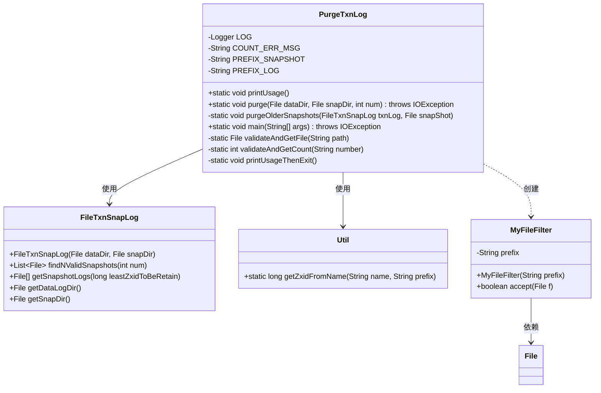
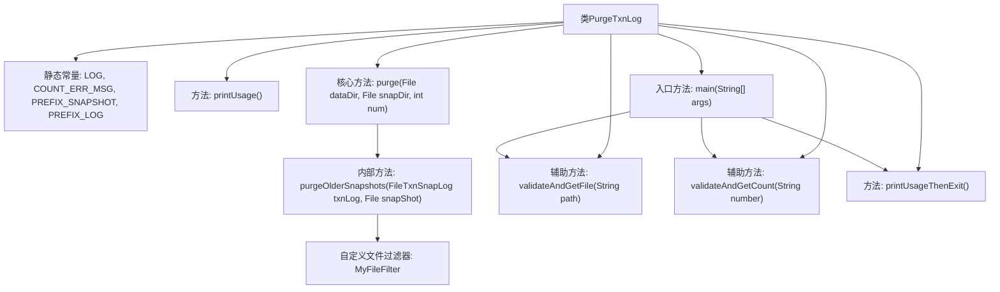
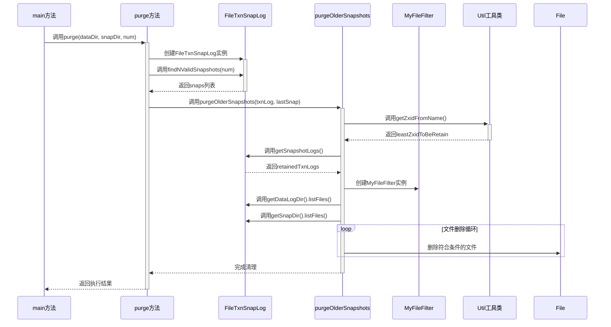

# 基础信息

|      |      |
|------|------|
| 名称 | PurgeTxnLog |
| 编码语言 | .java |
| 代码路径 | zookeeper/zookeeper-server/src/main/java/org/apache/zookeeper/server/PurgeTxnLog.java |
| 包名 | org.apache.zookeeper.server |
| 依赖项 | ['java.io.File', 'java.io.FileFilter', 'java.io.IOException', 'java.text.DateFormat', 'java.util.ArrayList', 'java.util.Arrays', 'java.util.HashSet', 'java.util.List', 'java.util.Set', 'org.apache.yetus.audience.InterfaceAudience', 'org.apache.zookeeper.server.persistence.FileTxnSnapLog', 'org.apache.zookeeper.server.persistence.Util', 'org.apache.zookeeper.util.ServiceUtils', 'org.slf4j.Logger', 'org.slf4j.LoggerFactory'] |
| 概述说明 | PurgeTxnLog类用于清理事务日志和快照，保留指定数量（至少3个）的最新文件。提供命令行工具，需指定日志目录、快照目录及保留数量。 |

# 说明

PurgeTxnLog是一个公共类，用于清理事务日志和快照文件，保留指定数量的最新文件。它要求保留数量至少为3，否则抛出异常。主要功能包括验证输入参数、查找有效快照、保留必要的日志文件以确保快照可恢复性，并删除旧文件。类提供了详细的错误处理和用法说明，通过命令行参数指定数据日志目录、快照目录和保留数量。清理过程会排除正在使用的最新文件，确保系统运行不受影响。

# 类列表 Class Summary

| 名称   | 类型  | 说明 |
|-------|------|-------------|
| PurgeTxnLog | class | PurgeTxnLog类用于清理事务日志和快照，保留指定数量的最新文件。需提供日志目录、快照目录及保留数量（≥3）。通过比较zxid删除旧文件，确保数据可恢复。包含参数验证和错误处理。 |

## 类 PurgeTxnLog

|      |      |
|------|------|
| 访问范围 | @InterfaceAudience.Public;public |
| 类型 | class |
| 名称 | PurgeTxnLog |
| 说明 | PurgeTxnLog类用于清理事务日志和快照，保留指定数量的最新文件。需提供日志目录、快照目录及保留数量（≥3）。通过比较zxid删除旧文件，确保数据可恢复。包含参数验证和错误处理。 |

### UML类图

这段代码实现了一个事务日志清理工具PurgeTxnLog，主要用于删除旧的ZooKeeper快照和日志文件。核心功能包括：验证输入参数、查找需要保留的有效快照、根据ZXID规则过滤需要删除的文件、执行删除操作。类图中展示了PurgeTxnLog与FileTxnSnapLog、Util等辅助类的交互关系，以及内部使用的MyFileFilter文件过滤器。该工具通过比较文件名的ZXID标识来决定哪些旧文件可以被安全删除，同时确保保留足够数量的有效快照和关联日志以保证数据完整性。

### 内部方法调用关系图

这段代码是ZooKeeper中用于清理事务日志和快照文件的工具类。流程图展示了类结构关系，包含核心清理方法、参数校验方法和自定义文件过滤器。时序图详细描述了从main方法触发清理，到获取有效快照、计算保留阈值、过滤待删除文件，最终执行删除的完整过程。该模块通过严格的参数校验和精确的文件过滤机制，确保在分布式系统中安全地清理过期的数据文件，同时保留必要的恢复点。

### 字段列表 Field List

| 名称  | 类型  | 说明 |
|-------|-------|------|
| PREFIX_LOG = "log" | String | 定义日志前缀常量PREFIX_LOG，值为"log"。 |
| COUNT_ERR_MSG = "count should be greater than or equal to 3" | String | 私有静态常量COUNT_ERR_MSG存储错误信息"count应大于等于3"。 |
| PREFIX_SNAPSHOT = "snapshot" | String | 定义私有静态常量PREFIX_SNAPSHOT，值为"snapshot"。 |
| LOG = LoggerFactory.getLogger(PurgeTxnLog.class) | Logger | 类PurgeTxnLog中定义了一个私有静态常量LOG，用于记录日志，通过LoggerFactory获取Logger实例。 |

### 方法列表 Method List

| 名称  | 类型  | 说明 |
|-------|-------|------|
| validateAndGetCount | int | 私有方法验证字符串转为整数，若小于3或非数字则报错并退出，返回有效数值。 |
| printUsageThenExit | void | 私有方法printUsageThenExit调用printUsage后，通过ServiceUtils以非预期错误码请求系统退出。 |
| main | void | Java主函数，检查参数数量，验证文件和数字参数，调用purge方法清理数据。参数错误则打印用法并退出。 |
| printUsage | void | 这是一个Java方法，用于打印PurgeTxnLog工具的使用说明。参数包括事务日志目录、快照目录（可选）和保留旧日志/快照的数量（至少3个）。 |
| purge | void | 清理旧数据快照方法：检查数量需≥3，获取有效快照列表后删除最旧的。含参数校验和异常处理。 |
| purgeOlderSnapshots | void | 该方法用于清理旧的事务日志和快照文件，保留必要文件以确保数据可恢复。通过比较文件名的zxid与最小保留值，筛选并删除旧文件，同时处理日志文件的特殊保留逻辑。删除前记录文件信息，失败时输出错误。 |
| validateAndGetFile | File | 私有静态方法验证路径有效性，若文件不存在则打印错误信息并退出，存在则返回文件对象。 |

