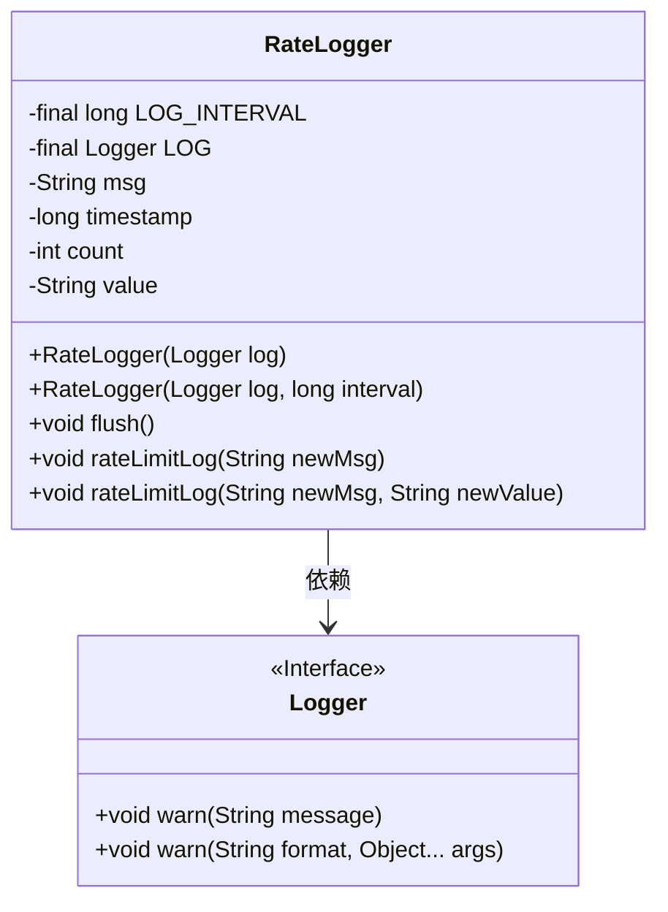
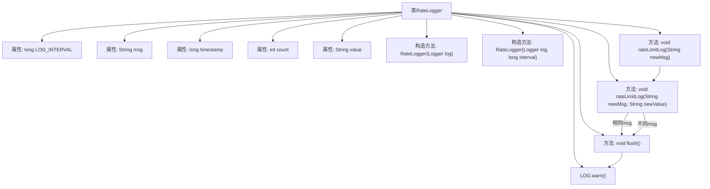
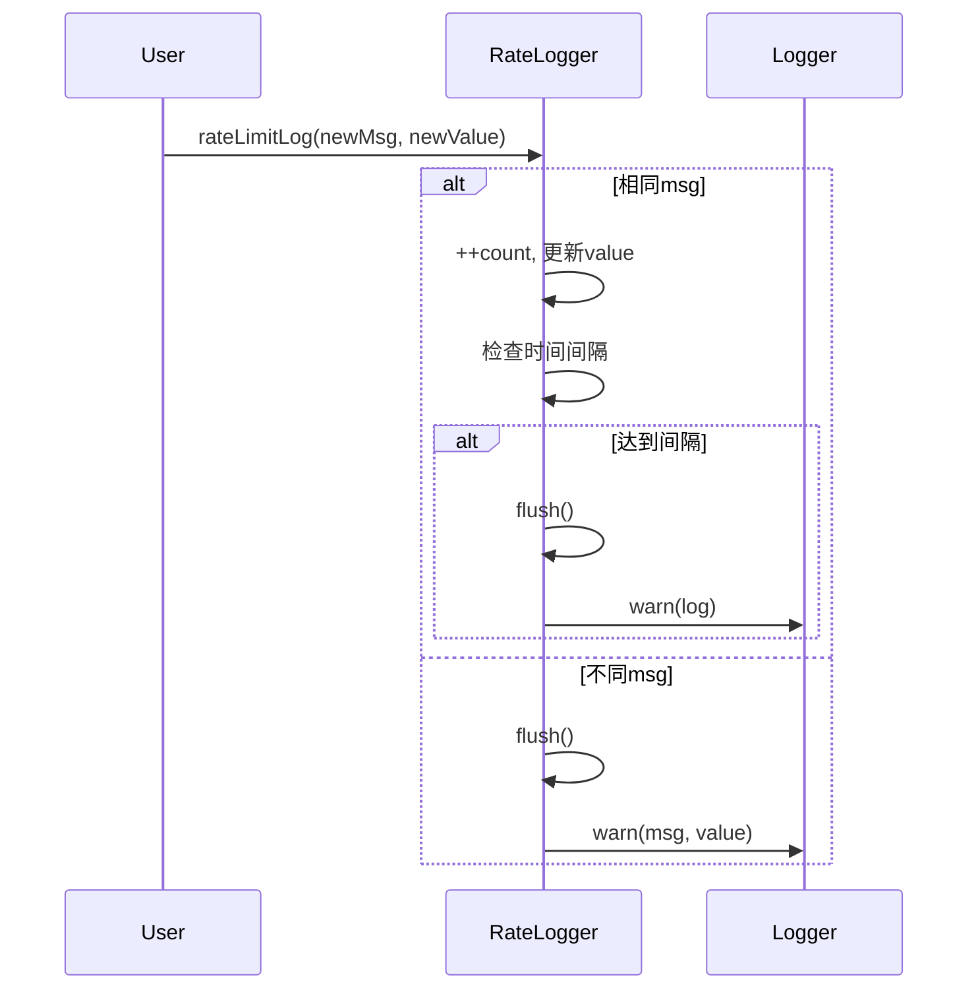

# 基础信息

|      |      |
|------|------|
| 名称 | RateLogger |
| 编码语言 | .java |
| 代码路径 | zookeeper/zookeeper-server/src/main/java/org/apache/zookeeper/server/RateLogger.java |
| 包名 | org.apache.zookeeper.server |
| 依赖项 | ['java.util.Objects', 'org.apache.zookeeper.common.Time', 'org.slf4j.Logger'] |
| 概述说明 | RateLogger类用于限速日志记录，支持消息和值的记录，按时间间隔合并重复日志，提供flush方法强制输出。 |

# 说明

RateLogger是一个用于限速记录日志的类，主要功能是在指定时间间隔内合并相同消息的日志。类包含以下关键属性：LOG_INTERVAL（日志间隔时间，毫秒）、LOG（日志记录器）、msg（当前消息）、timestamp（时间戳）、count（消息重复次数）、value（附加值）。提供两个构造方法，可自定义间隔时间或使用默认值100ms。核心方法rateLimitLog接收新消息和可选值，若消息与当前相同则计数并更新值，超过间隔时间则触发flush输出合并日志；若消息不同则立即输出前一条并记录新消息。flush方法格式化输出日志，包含重复次数、消息和最后的值，然后重置状态。

# 类列表 Class Summary

| 名称   | 类型  | 说明 |
|-------|------|-------------|
| RateLogger | class | RateLogger类用于限速日志记录，支持消息和值，按时间间隔合并重复日志，提供flush方法强制输出。 |

## 类 RateLogger

|      |      |
|------|------|
| 访问范围 | public |
| 类型 | class |
| 名称 | RateLogger |
| 说明 | RateLogger类用于限速日志记录，支持消息和值，按时间间隔合并重复日志，提供flush方法强制输出。 |

### UML类图

该代码实现了一个频率限制日志记录器(RateLogger)，通过LOG_INTERVAL控制相同消息的日志输出频率。核心功能包括：1) 对重复消息进行计数和聚合；2) 达到时间间隔或消息变更时触发flush输出；3) 支持附加值的记录。类依赖Logger接口实现实际日志输出，通过timestamp和count实现基于时间的频率控制，value字段保存最新附加信息。设计上采用状态管理(msg/value/count)和时间判断(now-timestamp)的组合策略。

### 内部方法调用关系图

流程图描述：该流程图展示了RateLogger类的结构和主要方法调用关系。类包含6个私有属性和2个构造方法，核心功能通过flush()和两个重载的rateLimitLog()方法实现。当输入新消息时，会判断是否与当前消息相同：相同则计数并检查时间间隔触发flush，不同则立即flush并记录新消息。flush方法负责聚合日志信息并通过Logger输出。

时序图描述：时序图演示了rateLimitLog方法的两种执行路径。对于相同消息会累加计数并在达到时间间隔时触发flush；对于不同消息会立即flush并记录新消息。两种路径最终都会通过Logger输出警告信息，体现了限流日志的核心机制。

### 字段列表 Field List

| 名称  | 类型  | 说明 |
|-------|-------|------|
| LOG | Logger | 私有日志记录器常量LOG。 |
| timestamp | long | 私有长整型时间戳变量。 |
| value = null | String | 私有字符串变量value初始化为null。 |
| LOG_INTERVAL | long | 私有长整型常量LOG_INTERVAL，用于定义日志记录间隔时间。 |
| msg = null | String | 声明一个私有字符串变量msg，初始值为null。 |
| count = 0 | int | 私有整型变量count初始化为0。 |

### 方法列表 Method List

| 名称  | 类型  | 说明 |
|-------|-------|------|
| flush | void | flush方法：若msg非空且count大于0，生成包含计数和msg的日志，若有value则追加，最后重置变量。 |
| rateLimitLog | void | 方法rateLimitLog接收字符串参数newMsg，调用同名方法并传入null作为第二参数。 |
| rateLimitLog | void | 方法记录限流日志，相同消息累加计数并更新值，超时或消息变更时刷新日志并重置时间戳。 |

