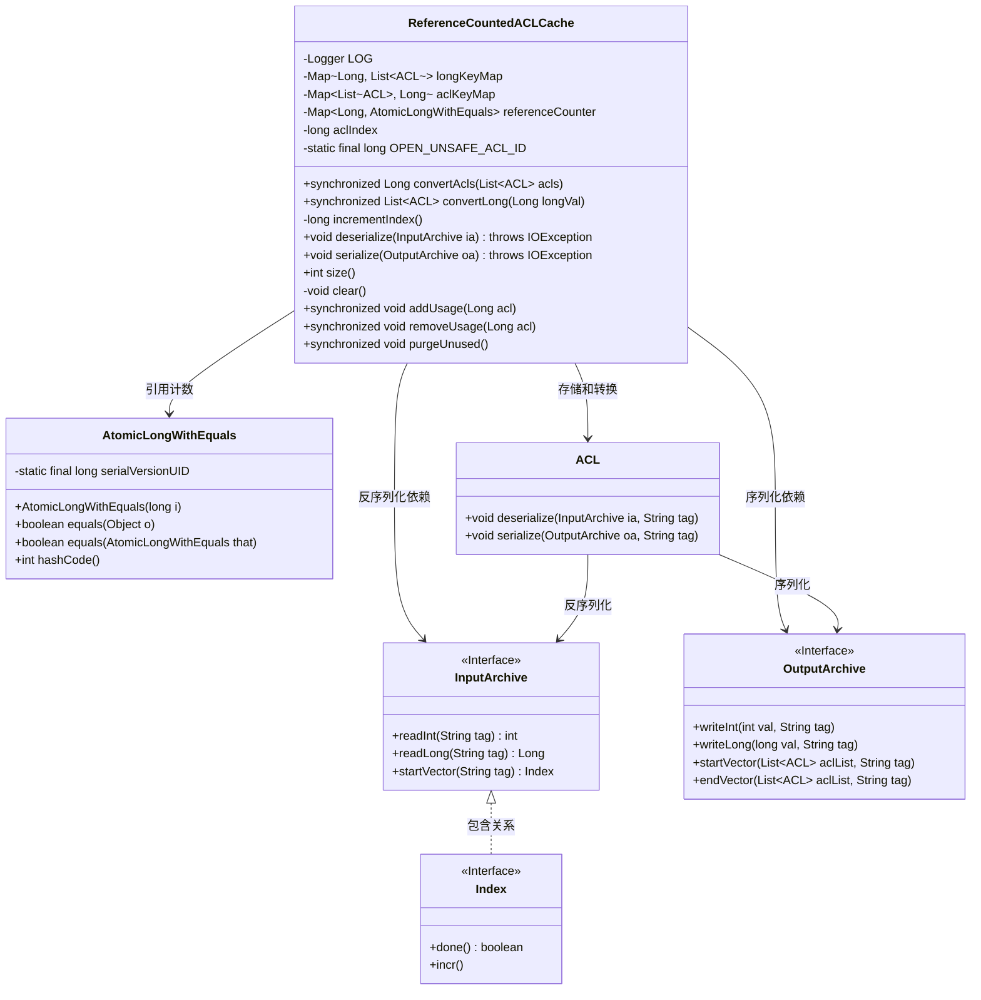

# 基础信息

|      |      |
|------|------|
| 名称 | ReferenceCountedACLCache |
| 编码语言 | .java |
| 代码路径 | zookeeper/zookeeper-server/src/main/java/org/apache/zookeeper/server/ReferenceCountedACLCache.java |
| 包名 | org.apache.zookeeper.server |
| 依赖项 | ['java.io.IOException', 'java.util.ArrayList', 'java.util.HashMap', 'java.util.Iterator', 'java.util.LinkedHashMap', 'java.util.List', 'java.util.Map', 'java.util.concurrent.atomic.AtomicLong', 'org.apache.jute.Index', 'org.apache.jute.InputArchive', 'org.apache.jute.OutputArchive', 'org.apache.zookeeper.ZooDefs', 'org.apache.zookeeper.data.ACL', 'org.slf4j.Logger', 'org.slf4j.LoggerFactory'] |
| 概述说明 | ReferenceCountedACLCache类实现ACL列表与长整型ID的双向映射，支持引用计数、序列化及清理未使用项。使用同步方法确保线程安全，包含OPEN_UNSAFE_ACL_ID特殊处理。 |

# 说明

这是一个引用计数的ACL缓存类，用于管理ACL列表与长整型ID之间的双向映射。主要功能包括：通过convertAcls和convertLong方法实现双向转换；使用referenceCounter跟踪每个ACL的引用计数；提供addUsage和removeUsage方法增减引用；支持序列化与反序列化；包含purgeUnused方法清理无引用ACL。内部使用HashMap存储映射关系，并通过AtomicLongWithEquals实现线程安全的引用计数。

# 类列表 Class Summary

| 名称   | 类型  | 说明 |
|-------|------|-------------|
| ReferenceCountedACLCache | class | ReferenceCountedACLCache类实现ACL列表与长整型ID的双向映射，支持引用计数、序列化及清理未使用项。 |

## 类 ReferenceCountedACLCache

|      |      |
|------|------|
| 访问范围 | public |
| 类型 | class |
| 名称 | ReferenceCountedACLCache |
| 说明 | ReferenceCountedACLCache类实现ACL列表与长整型ID的双向映射，支持引用计数、序列化及清理未使用项。 |

### UML类图

这段代码实现了一个引用计数的ACL缓存系统，主要用于在ZooKeeper中高效管理访问控制列表(ACL)。ReferenceCountedACLCache类通过三个核心Map(longKeyMap/aclKeyMap/referenceCounter)实现ACL与long值的双向映射，并使用AtomicLongWithEquals进行引用计数。它提供了ACL与long值的相互转换、序列化/反序列化、引用计数增减和清理未使用ACL等功能。该设计通过同步方法和引用计数机制确保线程安全，同时优化了ACL的内存使用效率。

### 内部方法调用关系图

```mermaid
graph TD
    A["类ReferenceCountedACLCache"]
    B["属性: Map<Long, List<ACL>> longKeyMap"]
    C["属性: Map<List<ACL>, Long> aclKeyMap"]
    D["属性: Map<Long, AtomicLongWithEquals> referenceCounter"]
    E["属性: long aclIndex"]
    F["方法: Long convertAcls(List<ACL>)"]
    G["方法: List<ACL> convertLong(Long)"]
    H["方法: void deserialize(InputArchive)"]
    I["方法: void serialize(OutputArchive)"]
    J["方法: void addUsage(Long)"]
    K["方法: void removeUsage(Long)"]
    L["方法: void purgeUnused()"]
    M["内部类: AtomicLongWithEquals"]

    A --> B
    A --> C
    A --> D
    A --> E
    A --> F
    A --> G
    A --> H
    A --> I
    A --> J
    A --> K
    A --> L
    A --> M

    F -->|"检查null"| F1["返回OPEN_UNSAFE_ACL_ID"]
    F -->|"查询aclKeyMap"| F2["存在则返回对应Long"]
    F -->|"不存在则生成新索引"| F3["更新longKeyMap/aclKeyMap"]
    F -->|"调用addUsage"| F4["更新引用计数"]

    G -->|"检查null/OPEN_UNSAFE_ACL_ID"| G1["返回null/OPEN_ACL_UNSAFE"]
    G -->|"查询longKeyMap"| G2["存在则返回ACL列表"]
    G -->|"不存在则报错"| G3["抛出RuntimeException"]

    H -->|"清空缓存"| H1["clear()"]
    H -->|"循环读取存档"| H2["构建deserializedMap"]
    H -->|"同步块更新"| H3["合并数据到主缓存"]

    J -->|"检查OPEN_UNSAFE_ACL_ID"| J1["直接返回"]
    J -->|"检查存在性"| J2["不存在则记录日志"]
    J -->|"更新计数器"| J3["新建或递增计数"]

    M -->|"重写equals/hashCode"| M1["基于AtomicLong值比较"]
```

该流程图展示了ReferenceCountedACLCache类的核心结构和主要方法调用链。类通过三个HashMap实现ACL列表与Long值的双向映射，并采用引用计数机制管理缓存生命周期。关键方法包含ACL转换、序列化/反序列化、引用计数维护和缓存清理等功能，内部类AtomicLongWithEquals提供了线程安全的计数器实现。流程重点突出了convertAcls和convertLong方法的条件分支，以及引用计数管理的原子性操作。

### 字段列表 Field List

| 名称  | 类型  | 说明 |
|-------|-------|------|
| aclKeyMap = new HashMap<>() | Map<List<ACL>, Long> | 创建哈希映射aclKeyMap，键为ACL列表，值为长整型。 |
| LOG = LoggerFactory.getLogger(ReferenceCountedACLCache.class) | Logger | 私有静态常量日志对象，用于ReferenceCountedACLCache类的日志记录。 |
| longKeyMap = new HashMap<>() | Map<Long, List<ACL>> | 创建哈希映射，键为长整型，值为ACL列表。 |
| OPEN_UNSAFE_ACL_ID = -1L | long | 私有静态长整型常量OPEN_UNSAFE_ACL_ID值为-1，用于标识不安全访问控制。 |
| referenceCounter = new HashMap<>() | Map<Long, AtomicLongWithEquals> | 创建线程安全的引用计数器，使用HashMap存储键值对，键为Long类型，值为自定义的AtomicLongWithEquals对象。 |
| aclIndex = 0 | long | 定义长整型变量aclIndex并初始化为0。 |

### 方法列表 Method List

| 名称  | 类型  | 说明 |
|-------|-------|------|
| size | int | 该方法返回aclKeyMap的大小。 |
| incrementIndex | long | 私有方法incrementIndex，返回自增后的aclIndex值。 |
| deserialize | void | 方法从输入存档反序列化数据到映射。先读取整数i，循环读取长整型val和ACL列表到临时映射。同步块中更新索引和映射，确保线程安全。 |
| clear | void | 清理方法：清空三个映射表（aclKeyMap、longKeyMap、referenceCounter）。 |
| convertLong | List<ACL> | 同步方法将长整型转为ACL列表：空值返回null，特定值返回开放权限，否则从映射获取，无则报错。 |
| serialize | void | 同步复制longKeyMap后，序列化其内容至输出存档，包括键值对数量和每个键对应的ACL列表。 |
| convertAcls | Long | 方法convertAcls将ACL列表转换为唯一ID。若输入为空返回默认ID，否则查询或生成新ID并记录映射关系，最后增加使用计数返回ID。 |
| addUsage | void | 同步方法addUsage处理ACL使用计数：若ACL为开放不安全则返回；若缓存不存在则记录日志返回；否则创建或递增原子计数器。 |
| removeUsage | void | 同步方法removeUsage移除指定acl的使用计数。若acl不存在或为OPEN_UNSAFE_ACL_ID则忽略。计数减至0时清除相关缓存。 |
| purgeUnused | void | 同步方法purgeUnused清理未使用的条目：遍历引用计数器，移除计数≤0的条目及相关映射。 |

