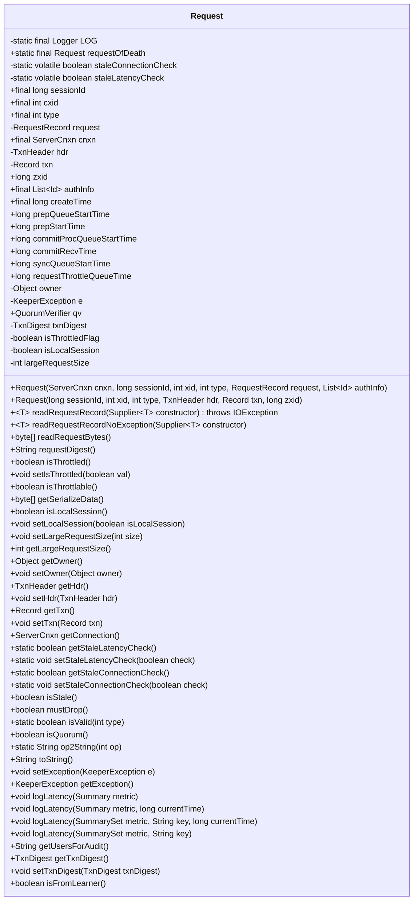

# 基础信息

|      |      |
|------|------|
| 名称 | Request |
| 编码语言 | .java |
| 代码路径 | zookeeper/zookeeper-server/src/main/java/org/apache/zookeeper/server/Request.java |
| 包名 | org.apache.zookeeper.server |
| 依赖项 | ['java.nio.charset.StandardCharsets.UTF_8', 'java.io.IOException', 'java.nio.ByteBuffer', 'java.util.List', 'java.util.function.Supplier', 'org.apache.jute.Record', 'org.apache.zookeeper.KeeperException', 'org.apache.zookeeper.ZooDefs.OpCode', 'org.apache.zookeeper.common.Time', 'org.apache.zookeeper.data.Id', 'org.apache.zookeeper.metrics.Summary', 'org.apache.zookeeper.metrics.SummarySet', 'org.apache.zookeeper.server.persistence.Util', 'org.apache.zookeeper.server.quorum.LearnerHandler', 'org.apache.zookeeper.server.quorum.flexible.QuorumVerifier', 'org.apache.zookeeper.server.util.AuthUtil', 'org.apache.zookeeper.txn.TxnDigest', 'org.apache.zookeeper.txn.TxnHeader', 'org.slf4j.Logger', 'org.slf4j.LoggerFactory'] |
| 概述说明 | ZooKeeper请求类，包含会话ID、请求类型、事务处理、连接状态检查及序列化功能，支持多种操作类型验证和延迟监控。 |

# 说明

该代码定义了一个Request类，用于处理ZooKeeper服务器请求。类包含会话ID、请求类型、事务ID等核心字段，并提供了请求有效性检查、序列化、延迟统计等功能。支持连接和延迟的陈旧性检测，通过系统属性配置默认行为。包含多种请求类型判断方法（如isQuorum）和操作码转换工具（op2String）。类还管理事务头、数据、摘要及权限信息，支持本地会话和大请求标记，提供审计日志所需的用户信息提取功能。

# 类列表 Class Summary

| 名称   | 类型  | 说明 |
|-------|------|-------------|
| Request | class | Request类用于处理ZooKeeper请求，包含会话ID、请求类型、连接信息等属性，支持请求验证、序列化、延迟日志和审计功能。 |

## 类 Request

|      |      |
|------|------|
| 访问范围 | public |
| 类型 | class |
| 名称 | Request |
| 说明 | Request类用于处理ZooKeeper请求，包含会话ID、请求类型、连接信息等属性，支持请求验证、序列化、延迟日志和审计功能。 |

### UML类图

这段代码定义了一个ZooKeeper的Request类，用于封装客户端请求的各种属性和操作。该类包含请求的基本信息（如sessionId、cxid、type）、连接信息（cnxn）、事务数据（hdr、txn、zxid）以及各种状态标记（如isThrottled、isLocalSession）。提供了丰富的静态和实例方法，包括请求有效性检查(isValid)、操作类型转换(op2String)、数据序列化(getSerializeData)和延迟统计(logLatency)等功能。该类还处理了多种边缘情况，如请求过期检查(isStale)和必须丢弃的情况(mustDrop)，体现了对分布式系统请求处理的全面考虑。

### 内部方法调用关系图

```mermaid
graph TD
    A["类Request"]
    B["静态常量: requestOfDeath"]
    C["静态变量: staleConnectionCheck"]
    D["静态变量: staleLatencyCheck"]
    E["构造方法: Request(ServerCnxn, long, int, int, RequestRecord, List<Id>)"]
    F["构造方法: Request(long, int, int, TxnHeader, Record, long)"]
    G["公共字段: sessionId, cxid, type, cnxn, authInfo, createTime"]
    H["私有字段: request, hdr, txn, zxid, owner, e, qv, txnDigest, isThrottledFlag"]
    I["方法: readRequestRecord, readRequestRecordNoException, readRequestBytes"]
    J["方法: requestDigest, isThrottled, setIsThrottled, isThrottlable"]
    K["方法: getSerializeData, isLocalSession, setLocalSession"]
    L["方法: setLargeRequestSize, getLargeRequestSize, getOwner, setOwner"]
    M["方法: getHdr, setHdr, getTxn, setTxn, getConnection"]
    N["静态方法: get/setStaleLatencyCheck, get/setStaleConnectionCheck"]
    O["方法: isStale, mustDrop, isValid, isQuorum, op2String"]
    P["方法: toString, setException, getException"]
    Q["方法: logLatency(重载), getUsersForAudit"]
    R["方法: get/setTxnDigest, isFromLearner"]

    A --> B
    A --> C
    A --> D
    A --> E
    A --> F
    A --> G
    A --> H
    A --> I
    A --> J
    A --> K
    A --> L
    A --> M
    A --> N
    A --> O
    A --> P
    A --> Q
    A --> R
```

这段代码定义了一个ZooKeeper的Request类，用于封装客户端请求的各种属性和操作。该类包含两个构造函数、多个字段访问方法、请求验证方法(isStale/isValid)、操作类型转换方法(op2String)、延迟统计方法(logLatency)等核心功能。特别值得注意的是处理请求过期(stale)的逻辑，包括连接检查和延迟检查两种机制，以及针对不同操作类型(如createSession/closeSession)的特殊处理。类中还包含丰富的状态跟踪字段和审计日志支持功能。

### 字段列表 Field List

| 名称  | 类型  | 说明 |
|-------|-------|------|
| owner | Object | 私有成员变量owner，类型为Object。 |
| requestThrottleQueueTime | long | 请求节流队列时间（毫秒） |
| commitProcQueueStartTime = -1 | long | 定义长整型变量commitProcQueueStartTime，初始值为-1。 |
| type | int | 公开不可变的整型变量type。 |
| qv = null | QuorumVerifier | 公共成员变量qv，类型为QuorumVerifier，初始值为null。 |
| authInfo | List<Id> | 公开不可变列表authInfo，存储Id类型元素。 |
| isLocalSession = false | boolean | 本地会话标识，初始值为false。 |
| staleLatencyCheck = Boolean.parseBoolean(System.getProperty("zookeeper.request_stale_latency_check", "false")) | boolean | 私有静态变量staleLatencyCheck，通过系统属性"zookeeper.request_stale_latency_check"初始化，默认值为false。 |
| cnxn | ServerCnxn | 公开不可变的服务器连接对象cnxn。 |
| commitRecvTime = -1 | long | 定义长整型变量commitRecvTime，初始值为-1，用于记录提交接收时间。 |
| isThrottledFlag = false | boolean | 私有布尔变量，标记是否被限流。 |
| hdr | TxnHeader | 私有事务头对象hdr。 |
| largeRequestSize = -1 | int | 私有整型变量largeRequestSize，默认值为-1。 |
| cxid | int | 公共不可变整型变量cxid。 |
| txnDigest | TxnDigest | 私有交易摘要对象txnDigest |
| zxid = -1 | long | 变量zxid初始值为-1，类型为long。 |
| sessionId | long | 公开不可变长整型会话ID。 |
| requestOfDeath = new Request(null, 0, 0, 0, null, null) | Request | 声明一个名为requestOfDeath的静态最终Request对象，初始化为空值和零参数。 |
| prepStartTime = -1 | long | 定义长整型变量prepStartTime，初始值为-1，用于记录准备开始时间。 |
| LOG = LoggerFactory.getLogger(Request.class) | Logger | 定义请求类的私有静态日志常量。 |
| syncQueueStartTime | long | 同步队列起始时间变量，记录队列开始处理的时间戳。 |
| request | RequestRecord | 私有请求记录对象request。 |
| e | KeeperException | 私有KeeperException异常对象e。 |
| staleConnectionCheck = Boolean.parseBoolean(System.getProperty("zookeeper.request_stale_connection_check", "true")) | boolean | 私有静态变量staleConnectionCheck，通过系统属性zookeeper.request_stale_connection_check解析布尔值，默认true。 |
| prepQueueStartTime = -1 | long | 定义长整型变量prepQueueStartTime，初始值为-1，用于记录队列准备开始时间。 |
| createTime = Time.currentElapsedTime() | long | 声明一个不可变长整型变量createTime，其值为当前已用时间。 |
| txn | Record | 私有记录类型变量txn。 |

### 方法列表 Method List

| 名称  | 类型  | 说明 |
|-------|-------|------|
| setTxnDigest | void | 设置交易摘要方法，将输入参数txnDigest赋值给当前对象的txnDigest属性。 |
| setLocalSession | void | 设置本地会话状态的方法，参数为布尔值isLocalSession，用于更新当前对象的isLocalSession属性。 |
| isThrottled | boolean | 方法isThrottled返回布尔值isThrottledFlag，表示是否被限流。 |
| setTxn | void | 方法setTxn用于设置txn属性，参数为Record类型对象。 |
| getLargeRequestSize | int | 获取大请求尺寸的方法，返回整数值。 |
| setLargeRequestSize | void | 设置大请求尺寸的方法，参数为size。 |
| getUsersForAudit | String | 获取审计用户列表的方法，调用AuthUtil工具类根据authInfo返回用户信息。 |
| getTxnDigest | TxnDigest | 这是一个Java方法，返回名为txnDigest的TxnDigest类型对象。 |
| isValid | boolean | 方法isValid检查type是否有效，notification和check返回false，其他OpCode类型返回true，否则false。 |
| getConnection | ServerCnxn | 该方法返回ServerCnxn类型的连接对象cnxn。 |
| getTxn | Record | 获取交易记录方法，返回txn对象。 |
| setIsThrottled | void | 设置节流状态的方法，将布尔值参数赋给内部标志变量。 |
| isFromLearner | boolean | 检查所有者是否为学习者类型。 |
| getException | KeeperException | 这是一个Java方法，返回KeeperException类型的异常对象e。 |
| logLatency | void | 方法logLatency记录请求延迟：若存在请求头且延迟非负，将当前时间与头时间差存入metric。忽略负延迟（可能因时钟漂移导致）。 |
| setHdr | void | 这是一个Java方法，用于设置事务头对象。方法名为setHdr，接受TxnHeader类型参数hdr，并将其赋值给当前对象的hdr属性。 |
| logLatency | void | 方法logLatency记录延迟：若hdr非空，计算当前时间与hdr时间的差值作为延迟，仅当延迟非负时将其加入metric统计。处理时钟漂移导致的负值情况。 |
| setStaleLatencyCheck | void | 这是一个Java静态方法，用于设置staleLatencyCheck的布尔值参数。方法名为setStaleLatencyCheck，接受一个boolean类型参数check。 |
| logLatency | void | 记录延迟方法，接收SummarySet和key参数，调用带当前时间的logLatency方法。 |
| getOwner | Object | 方法getOwner返回owner对象。 |
| setStaleConnectionCheck | void | 设置陈旧连接检查的静态方法，参数为布尔值check，用于控制是否检查陈旧连接。 |
| readRequestBytes | byte[] | 读取请求字节数据，若请求非空则返回字节数组，否则返回空。 |
| isThrottlable | boolean | 该方法检查操作码类型，若非ping、closeSession或createSession则返回true，表示可限流。 |
| toString | String | 重写toString方法，输出会话ID、操作类型、事务ID、zxid、事务类型及关联路径（若可获取）。路径读取异常时默认输出"n/a"。 |
| isStale | boolean | 检查请求是否过期：连接为空或关闭会话类型则未过期；若启用连接检查且连接无效则过期；若启用延迟检查且请求耗时超过会话超时则过期。 |
| readRequestRecord | T | 方法readRequestRecord读取请求记录，若请求非空则返回构造的记录，否则抛出IO异常提示空指针。 |
| mustDrop | boolean | 方法mustDrop检查连接cnqn是否存在且无效，若都满足则返回true。 |
| logLatency | void | 记录延迟时间，使用当前时间作为默认参数。 |
| getHdr | TxnHeader | 方法`getHdr()`返回类型为`TxnHeader`的成员变量`hdr`。 |
| op2String | String | 该方法将操作码转换为对应的字符串描述，涵盖通知、创建、删除、检查等操作，未匹配时返回未知码。 |
| isQuorum | boolean | 方法isQuorum根据操作类型判断是否需要法定人数：读取操作返回false，写入操作返回true，会话操作取决于是否为本地会话。 |
| isLocalSession | boolean | 该方法返回布尔值，表示是否为本地会话。 |
| setException | void | Java方法setException，用于设置KeeperException类型的异常对象e。 |
| getStaleConnectionCheck | boolean | 这是一个静态方法，返回布尔值staleConnectionCheck，用于检查连接是否过期。 |
| getStaleLatencyCheck | boolean | 这是一个静态方法，返回布尔值staleLatencyCheck的状态。 |
| setOwner | void | 这是一个Java方法，用于设置对象的owner属性。方法接受一个Object类型参数owner，并将其赋值给当前对象的owner字段。 |
| requestDigest | String | 该方法生成请求数据的十六进制摘要。若请求非空，遍历字节数组并格式化为两位十六进制字符串；若为空，返回"request buffer is null"。 |
| readRequestRecordNoException | T | 方法`readRequestRecordNoException`尝试调用`readRequestRecord`构造记录，若发生IO异常则返回null。 |
| getSerializeData | byte[] | 方法getSerializeData检查hdr为空则返回null，否则尝试序列化hdr、txn和txnDigest，失败时记录错误并返回32字节空数组。 |

