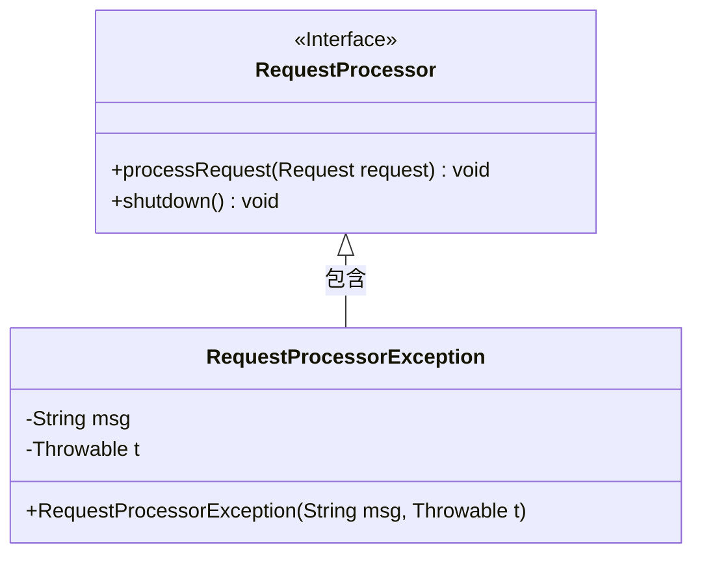
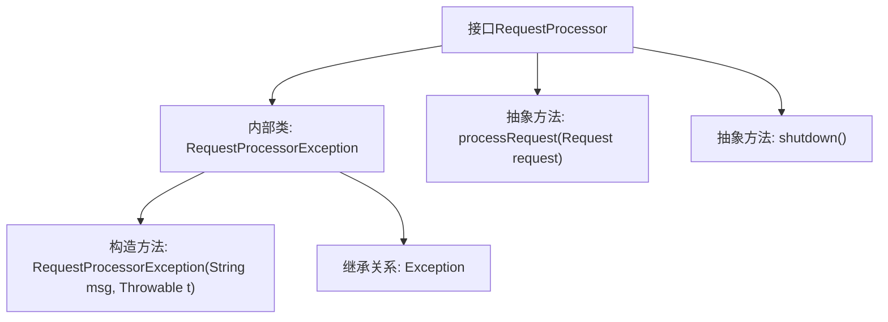

# 基础信息

|      |      |
|------|------|
| 名称 | RequestProcessor |
| 编码语言 | .java |
| 代码路径 | zookeeper/zookeeper-server/src/main/java/org/apache/zookeeper/server/RequestProcessor.java |
| 包名 | org.apache.zookeeper.server |
| 依赖项 | [] |
| 概述说明 | 接口RequestProcessor定义请求处理器，包含处理请求方法processRequest和关闭方法shutdown，处理时可能抛出RequestProcessorException异常。 |

# 说明

该内容定义了一个名为RequestProcessor的公共接口，包含两个核心方法和一个嵌套异常类。接口声明了processRequest方法，接收Request参数并可能抛出RequestProcessorException异常；还声明了无返回值的shutdown方法。嵌套的RequestProcessorException是继承自Exception的异常类，提供带消息和原因参数的构造器。整个结构用于规范请求处理行为，包含异常处理机制和终止功能。

# 类列表 Class Summary

| 名称   | 类型  | 说明 |
|-------|------|-------------|
| RequestProcessor | interface | 接口RequestProcessor定义请求处理器，包含处理请求方法processRequest和关闭方法shutdown，处理异常RequestProcessorException继承自Exception。 |

## 类 RequestProcessor

|      |      |
|------|------|
| 访问范围 | public |
| 类型 | interface |
| 名称 | RequestProcessor |
| 说明 | 接口RequestProcessor定义请求处理器，包含处理请求方法processRequest和关闭方法shutdown，处理异常RequestProcessorException继承自Exception。 |

### UML类图

这段代码定义了一个请求处理器接口`RequestProcessor`及其内部异常类`RequestProcessorException`。接口包含两个方法：处理请求的`processRequest()`和关闭资源的`shutdown()`，其中处理请求可能抛出内部定义的受检异常。异常类继承自`Exception`，提供带原因链的构造方法。类图展示了接口与内部异常类的包含关系，体现了异常处理机制的设计。

### 内部方法调用关系图

这段流程图描述了RequestProcessor接口的结构，包含一个自定义异常内部类RequestProcessorException和两个抽象方法。内部异常类继承自Java标准Exception类，具有带消息和原因的构造方法。接口核心功能是处理请求(processRequest)和关闭处理器(shutdown)，其中请求处理可能抛出自定义异常。该设计体现了异常封装和接口约束的思想。

### 字段列表 Field List

| 名称  | 类型  | 说明 |
|-------|-------|------|

### 方法列表 Method List

| 名称  | 类型  | 说明 |
|-------|-------|------|
| shutdown | void | 关闭系统或终止程序运行。 |
| processRequest | void | 处理请求方法，可能抛出请求处理器异常。 |

