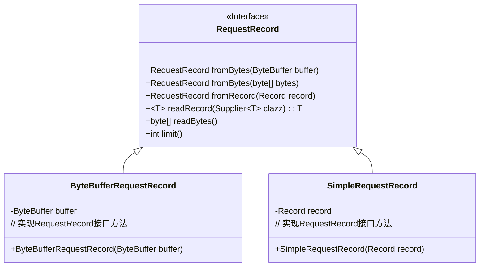
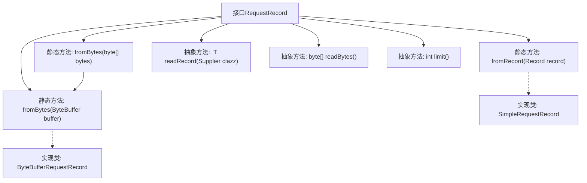

# 基础信息

|      |      |
|------|------|
| 名称 | RequestRecord |
| 编码语言 | .java |
| 代码路径 | zookeeper/zookeeper-server/src/main/java/org/apache/zookeeper/server/RequestRecord.java |
| 包名 | org.apache.zookeeper.server |
| 依赖项 | ['java.io.IOException', 'java.nio.ByteBuffer', 'java.util.function.Supplier', 'org.apache.jute.Record'] |
| 概述说明 | 接口RequestRecord提供静态方法从ByteBuffer、字节数组或Record创建实例，支持读取记录或字节数组，并获取数据长度限制。 |

# 说明

该内容定义了一个名为RequestRecord的公共接口，提供了多种静态工厂方法和实例方法。接口包含三个静态方法：fromBytes(ByteBuffer)和fromBytes(byte[])用于从字节数据创建请求记录，fromRecord(Record)用于从现有记录创建请求记录。实例方法包括readRecord(Supplier<T>)用于读取指定类型的记录，readBytes()用于读取字节数据，limit()用于获取限制值。该接口支持从不同数据源创建请求记录，并提供了读取记录的通用操作。

# 类列表 Class Summary

| 名称   | 类型  | 说明 |
|-------|------|-------------|
| RequestRecord | interface | RequestRecord接口提供静态方法从ByteBuffer、字节数组或Record创建实例，支持读取记录或字节数据，并获取数据长度限制。 |

## 类 RequestRecord

|      |      |
|------|------|
| 访问范围 | public |
| 类型 | interface |
| 名称 | RequestRecord |
| 说明 | RequestRecord接口提供静态方法从ByteBuffer、字节数组或Record创建实例，支持读取记录或字节数据，并获取数据长度限制。 |

### UML类图

这段类图描述了一个请求记录接口`RequestRecord`及其两个实现类`ByteBufferRequestRecord`和`SimpleRequestRecord`。接口定义了从字节缓冲区、字节数组和记录创建请求记录的静态工厂方法，以及读取记录、读取字节和获取限制的核心方法。两个实现类分别通过包装`ByteBuffer`和`Record`对象来实现接口功能，展示了典型的工厂模式和接口编程思想。

### 内部方法调用关系图

这段代码定义了一个RequestRecord接口，包含三个静态工厂方法和三个抽象方法。静态方法fromBytes用于从ByteBuffer或byte数组创建RequestRecord实例，fromRecord用于从Record对象创建实例。抽象方法readRecord用于读取记录，readBytes返回字节数组，limit返回限制大小。流程图展示了接口的结构和实现关系，其中ByteBufferRequestRecord和SimpleRequestRecord是实现类。

### 字段列表 Field List

| 名称  | 类型  | 说明 |
|-------|-------|------|

### 方法列表 Method List

| 名称  | 类型  | 说明 |
|-------|-------|------|
| readBytes | byte[] | 读取字节数组的方法。 |
| readRecord | T | 读取记录的方法，泛型T需继承Record，接收Supplier参数，可能抛出IOException异常。 |
| fromBytes | RequestRecord | 静态方法`fromBytes`接收`ByteBuffer`参数，返回`ByteBufferRequestRecord`实例。 |
| fromRecord | RequestRecord | 静态方法fromRecord接收Record对象，返回包装后的SimpleRequestRecord实例。 |
| fromBytes | RequestRecord | 静态方法RequestRecord.fromBytes接收字节数组，包装为ByteBuffer后调用同名方法处理。 |
| limit | int | 获取限制值。 |

