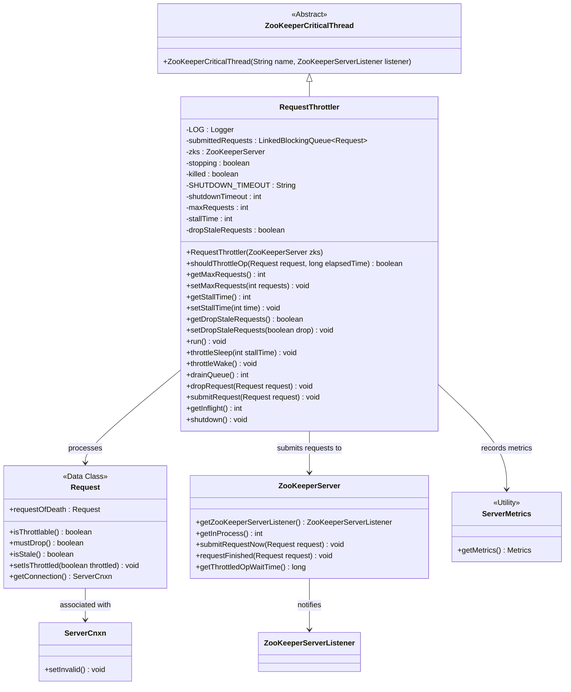
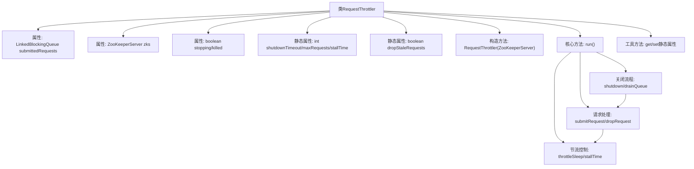

# 基础信息

|      |      |
|------|------|
| 名称 | RequestThrottler |
| 编码语言 | .java |
| 代码路径 | zookeeper/zookeeper-server/src/main/java/org/apache/zookeeper/server/RequestThrottler.java |
| 包名 | org.apache.zookeeper.server |
| 依赖项 | ['edu.umd.cs.findbugs.annotations.SuppressFBWarnings', 'java.util.concurrent.LinkedBlockingQueue', 'org.apache.zookeeper.common.Time', 'org.apache.zookeeper.util.ServiceUtils', 'org.slf4j.Logger', 'org.slf4j.LoggerFactory'] |
| 概述说明 | RequestThrottler是ZooKeeper的请求限流线程，通过队列管理请求提交，支持最大请求数、等待时间和丢弃过期请求等配置，确保系统稳定运行。 |

# 说明

RequestThrottler是ZooKeeperCriticalThread的子类，用于控制请求流量。它通过LinkedBlockingQueue管理提交的请求，支持动态调整最大请求数、等待时间和是否丢弃过期请求。主要功能包括请求节流、过期请求检测和优雅关闭。当请求超过最大限制时，线程会休眠指定时间。关闭时先尝试优雅终止，超时后强制终止并丢弃剩余请求。还提供统计信息，如队列时间和节流操作计数。

# 类列表 Class Summary

| 名称   | 类型  | 说明 |
|-------|------|-------------|
| RequestThrottler | class | RequestThrottler是ZooKeeper的请求限流线程，通过队列管理请求提交，支持最大请求数、等待时间和丢弃过期请求等配置，确保系统稳定运行。 |

## 类 RequestThrottler

|      |      |
|------|------|
| 访问范围 | public |
| 类型 | class |
| 名称 | RequestThrottler |
| 说明 | RequestThrottler是ZooKeeper的请求限流线程，通过队列管理请求提交，支持最大请求数、等待时间和丢弃过期请求等配置，确保系统稳定运行。 |

### UML类图

类图描述：
RequestThrottler继承自ZooKeeperCriticalThread，是一个请求节流控制器，用于管理ZooKeeper服务器的请求流量。它维护一个请求队列(submittedRequests)，通过maxRequests、stallTime等参数控制请求处理速率，支持丢弃过时请求(dropStaleRequests)和节流操作(throttleSleep)。与ZooKeeperServer交互提交请求，使用ServerMetrics记录指标，并通过ServerCnxn管理客户端连接。当关闭时能优雅或强制终止请求处理。

### 内部方法调用关系图

该流程图展示了RequestThrottler类的核心结构和主要行为。这个请求节流控制器继承自ZooKeeperCriticalThread，通过LinkedBlockingQueue管理请求队列，包含完整的生命周期控制（初始化、运行、关闭）和节流策略（请求丢弃、休眠等待、并发控制）。关键功能包括动态节流阈值调整、请求过时检测、优雅关闭超时控制等，通过静态配置参数实现灵活的策略控制，同时与ZooKeeperServer核心组件深度交互。

### 字段列表 Field List

| 名称  | 类型  | 说明 |
|-------|-------|------|
| shutdownTimeout | int | 私有静态整型变量，用于存储关闭超时时间。 |
| SHUTDOWN_TIMEOUT = "zookeeper.request_throttler.shutdownTimeout" | String | 私有静态常量字符串，定义ZooKeeper请求限流器关闭超时参数名。 |
| stopping | boolean | 私有易变布尔变量，标记停止状态。 |
| stallTime = Integer.getInteger("zookeeper.request_throttle_stall_time", 100) | int | 私有静态可变整型变量stallTime，默认值100，通过系统属性"zookeeper.request_throttle_stall_time"可配置。 |
| maxRequests = Integer.getInteger("zookeeper.request_throttle_max_requests", 0) | int | 私有静态变量maxRequests，通过系统属性"zookeeper.request_throttle_max_requests"初始化，默认值为0，用于控制最大请求数。 |
| zks | ZooKeeperServer | 私有成员变量zks，类型为ZooKeeperServer。 |
| dropStaleRequests = Boolean.parseBoolean(System.getProperty("zookeeper.request_throttle_drop_stale", "true")) | boolean | 私有静态变量dropStaleRequests，通过系统属性zookeeper.request_throttle_drop_stale解析布尔值，默认true，控制是否丢弃过时请求。 |
| submittedRequests = new LinkedBlockingQueue<>() | LinkedBlockingQueue<Request> | 私有阻塞队列submittedRequests，用于存储Request对象，基于LinkedBlockingQueue实现。 |
| LOG = LoggerFactory.getLogger(RequestThrottler.class) | Logger | 定义RequestThrottler类的私有静态日志常量LOG。 |
| killed | boolean | 私有易变布尔变量，标记是否终止。 |

### 方法列表 Method List

| 名称  | 类型  | 说明 |
|-------|-------|------|
| getDropStaleRequests | boolean | 这是一个静态方法，返回布尔值dropStaleRequests，用于获取是否丢弃过时请求的状态。 |
| getMaxRequests | int | 这是一个静态方法，返回变量maxRequests的值。 |
| getStallTime | int | 获取停滞时间的静态方法，返回整型变量stallTime。 |
| throttleSleep | void | 方法throttleSleep用于请求限速，增加等待计数并暂停指定时间。 |
| setMaxRequests | void | 这是一个Java静态方法，用于设置最大请求数。方法名为setMaxRequests，接受一个整数参数requests，并将其赋值给静态变量maxRequests。 |
| setDropStaleRequests | void | Java方法：设置是否丢弃过期请求，参数为布尔值drop。 |
| setStallTime | void | 这是一个Java静态方法，用于设置stallTime变量的值。方法名为setStallTime，接收一个int类型参数time，并将其赋值给类静态变量stallTime。 |
| throttleWake | void | 同步方法throttleWake通过notify唤醒线程，忽略NN_NAKED_NOTIFY警告，状态变更由ZooKeeperServer.decInProgress处理。 |
| shouldThrottleOp | boolean | 检查请求是否可限流且耗时超过阈值时返回true，否则false。 |
| run | void | 线程循环处理请求，检查终止标志和过期请求，进行限流控制，记录指标并提交有效请求，异常中断时清空队列。 |
| drainQueue | int | 方法drainQueue清空请求队列，若正常关闭则队列为空，强制关闭时丢弃剩余请求。返回丢弃请求数。 |
| dropRequest | void | 该方法丢弃请求时，标记连接为无效以确保后续请求也被丢弃，维持顺序语义。同时通知ZooKeeperServer更新请求计数和限流状态。 |
| submitRequest | void | 方法submitRequest处理请求：若系统停止中，丢弃请求并记录日志；否则记录请求时间并加入队列。 |
| getInflight | int | 该方法返回当前提交请求的数量。 |
| shutdown | void | 该方法实现优雅关闭和强制终止功能。首先设置停止标志，加入终止请求，等待线程结束。若超时未完成，则强制终止线程，确保请求队列清空。异常时记录警告，必要时强制退出系统。 |

