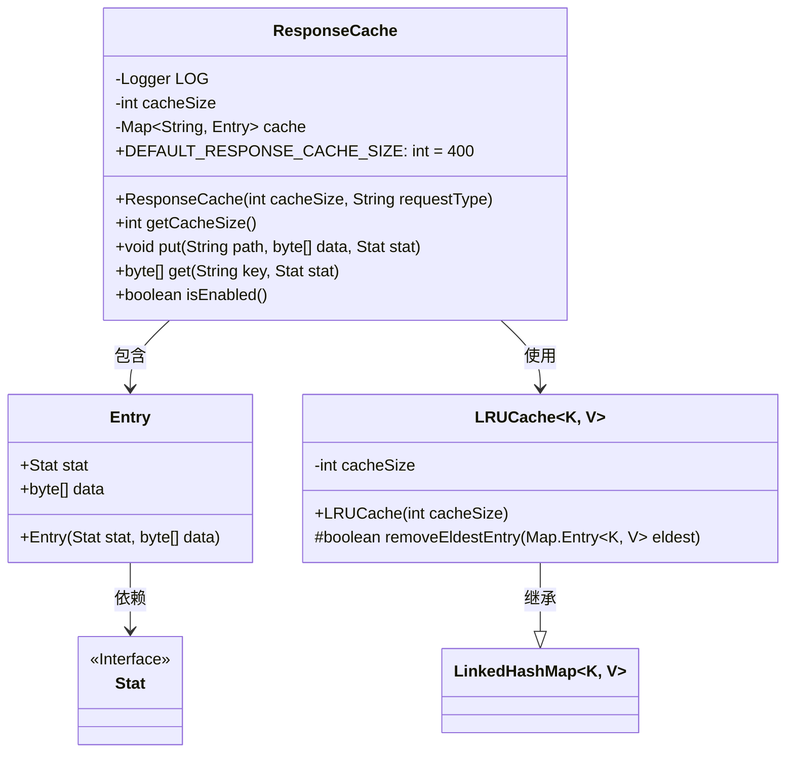
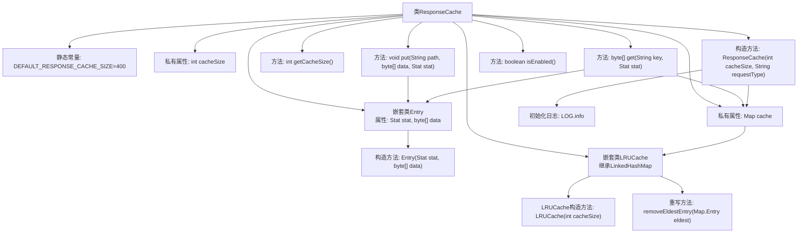

# 基础信息

|      |      |
|------|------|
| 名称 | ResponseCache |
| 编码语言 | .java |
| 代码路径 | zookeeper/zookeeper-server/src/main/java/org/apache/zookeeper/server/ResponseCache.java |
| 包名 | org.apache.zookeeper.server |
| 依赖项 | ['java.util.Collections', 'java.util.LinkedHashMap', 'java.util.Map', 'org.apache.zookeeper.data.Stat', 'org.slf4j.Logger', 'org.slf4j.LoggerFactory'] |
| 概述说明 | 响应缓存类，默认大小400，支持LRU策略，线程安全，可存储路径、数据和状态，状态变更时自动失效。 |

# 说明

ResponseCache类是一个线程安全的响应缓存实现，使用LRU（最近最少使用）策略管理缓存条目。默认缓存大小为400，可通过构造函数自定义。缓存条目包含Stat对象和字节数组数据。提供put方法存储数据，get方法根据键和Stat状态获取数据（状态不匹配时自动失效）。内部使用同步的LinkedHashMap实现LRU逻辑，当缓存达到上限时自动移除最旧条目。包含isEnabled方法检查缓存是否启用（缓存大小大于0时启用）。日志记录缓存初始化信息。

# 类列表 Class Summary

| 名称   | 类型  | 说明 |
|-------|------|-------------|
| ResponseCache | class | ResponseCache类实现基于LRU算法的响应缓存，默认大小400，支持同步操作，包含数据存取和缓存失效功能。 |

## 类 ResponseCache

|      |      |
|------|------|
| 访问范围 | @SuppressWarnings("serial");public |
| 类型 | class |
| 名称 | ResponseCache |
| 说明 | ResponseCache类实现基于LRU算法的响应缓存，默认大小400，支持同步操作，包含数据存取和缓存失效功能。 |

### UML类图

这段代码展示了一个响应缓存系统，核心是ResponseCache类，它使用LRU（最近最少使用）算法管理缓存条目。类图包含四个主要部分：1) ResponseCache作为主类，包含缓存操作方法和内部Entry类；2) Entry类存储缓存数据和状态；3) LRUCache继承LinkedHashMap实现LRU逻辑；4) Stat接口标记状态信息。缓存通过synchronizedMap保证线程安全，当缓存达到上限时会自动移除最旧条目，并支持通过状态检查验证缓存有效性。

### 内部方法调用关系图

流程图描述：该流程图展示了ResponseCache类的完整结构，包含静态常量、私有属性、嵌套类Entry和LRUCache的定义。核心流程包括缓存初始化构造方法、数据存取方法（put/get）和缓存状态检查方法。LRUCache作为内部实现继承LinkedHashMap，通过重写removeEldestEntry实现LRU淘汰策略。所有操作都通过线程安全的同步Map进行，关键操作会触发日志记录。缓存有效性检查与数据版本控制（通过Stat比较）构成了主要业务逻辑。

### 字段列表 Field List

| 名称  | 类型  | 说明 |
|-------|-------|------|
| cache | Map<String, Entry> | 私有缓存映射，键为字符串，值为Entry对象。 |
| LOG = LoggerFactory.getLogger(ResponseCache.class) | Logger | 定义ResponseCache类的私有静态日志对象LOG。 |
| cacheSize | int | 私有整型变量cacheSize，用于存储缓存大小。 |
| DEFAULT_RESPONSE_CACHE_SIZE = 400 | int | 默认响应缓存大小为400。 |

### 方法列表 Method List

| 名称  | 类型  | 说明 |
|-------|-------|------|
| getCacheSize | int | 这是一个Java方法，返回名为cacheSize的整型变量值。 |
| put | void | 方法put将路径、字节数据和状态存入缓存，键为路径，值为包含状态和数据的Entry对象。 |
| get | byte[] | 方法根据键获取缓存数据，若不存在或状态不匹配则返回空并清除缓存，否则返回数据。 |
| isEnabled | boolean | 方法isEnabled检查cacheSize是否大于0，返回布尔值。 |

