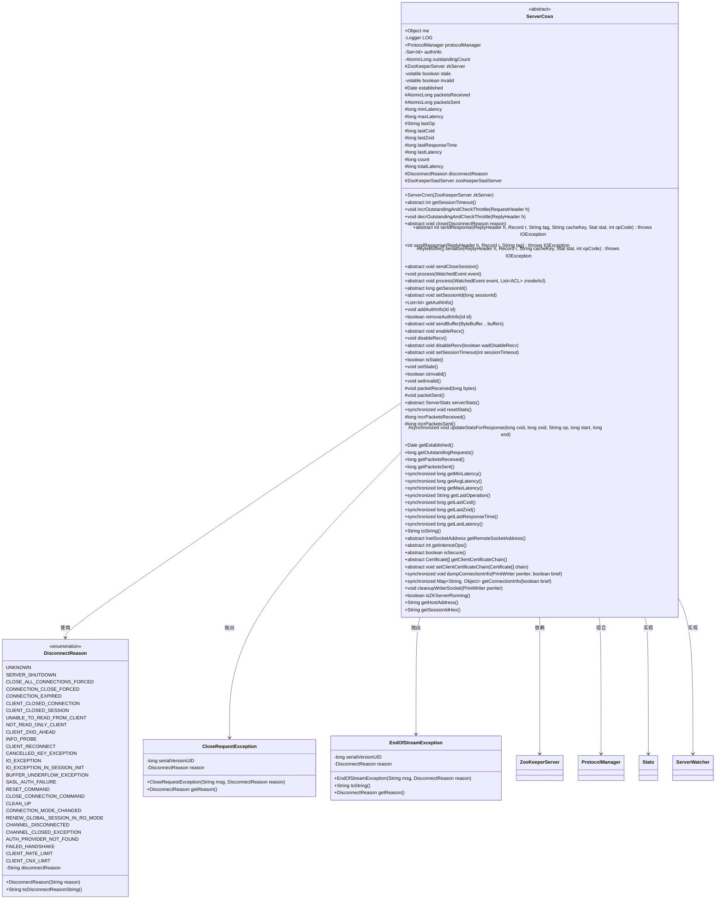

# 基础信息

|      |      |
|------|------|
| 名称 | ServerCnxn |
| 编码语言 | .java |
| 代码路径 | zookeeper/zookeeper-server/src/main/java/org/apache/zookeeper/server/ServerCnxn.java |
| 包名 | org.apache.zookeeper.server |
| 依赖项 | ['java.io.IOException', 'java.io.PrintWriter', 'java.io.StringWriter', 'java.net.InetAddress', 'java.net.InetSocketAddress', 'java.nio.ByteBuffer', 'java.security.cert.Certificate', 'java.util.ArrayList', 'java.util.Collections', 'java.util.Date', 'java.util.LinkedHashMap', 'java.util.List', 'java.util.Map', 'java.util.Set', 'java.util.concurrent.ConcurrentHashMap', 'java.util.concurrent.atomic.AtomicLong', 'org.apache.jute.Record', 'org.apache.zookeeper.Quotas', 'org.apache.zookeeper.WatchedEvent', 'org.apache.zookeeper.ZooDefs.OpCode', 'org.apache.zookeeper.compat.ProtocolManager', 'org.apache.zookeeper.data.ACL', 'org.apache.zookeeper.data.Id', 'org.apache.zookeeper.data.Stat', 'org.apache.zookeeper.metrics.Counter', 'org.apache.zookeeper.proto.ReplyHeader', 'org.apache.zookeeper.proto.RequestHeader', 'org.slf4j.Logger', 'org.slf4j.LoggerFactory'] |
| 概述说明 | ServerCnxn是ZooKeeper服务器连接抽象类，管理连接状态、请求处理、响应缓存及统计信息，支持多种断开原因枚举，提供会话超时、认证、流量控制等功能。 |

# 说明

ServerCnxn是一个抽象类，实现了Stats和ServerWatcher接口，用于管理ZooKeeper服务器连接。它包含协议管理器、认证信息集合、待处理请求计数器等核心字段，并定义了多种连接断开原因枚举。类提供了请求流量控制、响应序列化与缓存、连接统计信息收集等功能，支持详细连接信息输出和安全证书管理。关键方法包括处理请求/响应、更新统计指标、关闭连接等，同时维护了连接状态标志（stale/invalid）以确保请求顺序和节流控制。

# 类列表 Class Summary

| 名称   | 类型  | 说明 |
|-------|------|-------------|
| ServerCnxn | class | ServerCnxn是ZooKeeper服务器连接抽象类，管理连接状态、请求处理、认证信息及统计功能，支持多种断开原因枚举和响应缓存机制。 |

## 类 ServerCnxn

|      |      |
|------|------|
| 访问范围 | public abstract |
| 类型 | class |
| 名称 | ServerCnxn |
| 说明 | ServerCnxn是ZooKeeper服务器连接抽象类，管理连接状态、请求处理、认证信息及统计功能，支持多种断开原因枚举和响应缓存机制。 |

### UML类图

类图描述：
ServerCnxn是一个抽象类，实现了Stats和ServerWatcher接口，用于管理ZooKeeper服务器与客户端之间的连接。它包含连接状态管理、请求/响应处理、认证信息管理、统计信息收集等功能核心逻辑。DisconnectReason枚举定义了28种连接断开原因，CloseRequestException和EndOfStreamException是两种特定的连接异常。该类通过ProtocolManager处理协议相关操作，并依赖ZooKeeperServer进行服务器状态交互。设计上采用抽象方法模式，关键操作如sendResponse、close等需由子类实现。

### 内部方法调用关系图

```mermaid
graph TD
    A["抽象类ServerCnxn"]
    B["静态常量: Object me"]
    C["静态常量: Logger LOG"]
    D["属性: ProtocolManager protocolManager"]
    E["属性: Set<Id> authInfo"]
    F["属性: AtomicLong outstandingCount"]
    G["属性: ZooKeeperServer zkServer"]
    H["枚举: DisconnectReason"]
    I["属性: boolean stale"]
    J["属性: boolean invalid"]
    K["抽象方法: int getSessionTimeout()"]
    L["方法: incrOutstandingAndCheckThrottle()"]
    M["方法: decrOutstandingAndCheckThrottle()"]
    N["抽象方法: close()"]
    O["抽象方法: sendResponse()"]
    P["方法: serialize()"]
    Q["抽象方法: sendCloseSession()"]
    R["方法: process()"]
    S["抽象方法: getSessionId()"]
    T["抽象方法: setSessionId()"]
    U["方法: getAuthInfo()"]
    V["方法: addAuthInfo()"]
    W["方法: removeAuthInfo()"]
    X["抽象方法: sendBuffer()"]
    Y["抽象方法: enableRecv()"]
    Z["方法: disableRecv()"]
    AA["抽象方法: disableRecv(boolean)"]
    AB["抽象方法: setSessionTimeout()"]
    AC["内部类: CloseRequestException"]
    AD["内部类: EndOfStreamException"]
    AE["方法: isStale()"]
    AF["方法: setStale()"]
    AG["方法: isInvalid()"]
    AH["方法: setInvalid()"]
    AI["方法: packetReceived()"]
    AJ["方法: packetSent()"]
    AK["抽象方法: serverStats()"]
    AL["方法: resetStats()"]
    AM["方法: updateStatsForResponse()"]
    AN["方法: dumpConnectionInfo()"]
    AO["方法: getConnectionInfo()"]
    AP["方法: cleanupWriterSocket()"]
    AQ["方法: isZKServerRunning()"]
    AR["方法: getHostAddress()"]
    AS["方法: getSessionIdHex()"]

    A --> B
    A --> C
    A --> D
    A --> E
    A --> F
    A --> G
    A --> H
    A --> I
    A --> J
    A --> K
    A --> L
    A --> M
    A --> N
    A --> O
    A --> P
    A --> Q
    A --> R
    A --> S
    A --> T
    A --> U
    A --> V
    A --> W
    A --> X
    A --> Y
    A --> Z
    Z --> AA
    A --> AB
    A --> AC
    A --> AD
    A --> AE
    A --> AF
    A --> AG
    A --> AH
    A --> AI
    A --> AJ
    A --> AK
    A --> AL
    A --> AM
    A --> AN
    A --> AO
    A --> AP
    A --> AQ
    A --> AR
    A --> AS
```

这段代码定义了一个抽象类ServerCnxn，用于管理ZooKeeper服务器与客户端之间的连接。它包含了连接状态管理、请求处理、统计信息收集、认证信息管理等功能，并通过多个抽象方法定义了子类必须实现的核心操作。流程图展示了类的主要结构和内部方法调用关系，包括属性定义、枚举类型、核心业务方法和内部异常类等组件。该类设计用于处理网络连接、请求/响应处理、会话管理以及连接统计等功能，是ZooKeeper服务器连接处理的核心抽象。

### 字段列表 Field List

| 名称  | 类型  | 说明 |
|-------|-------|------|
| disconnectReason = DisconnectReason.UNKNOWN | DisconnectReason | 声明了一个受保护的断开原因变量，初始值为未知。 |
| me = new Object() | Object | 声明一个公共静态不可变对象实例"me"。 |
| lastResponseTime | long | 保护的最后响应时间变量。 |
| totalLatency | long | 声明一个受保护的长整型变量totalLatency，用于存储总延迟时间。 |
| lastLatency | long | 声明了一个受保护的长整型变量lastLatency。 |
| authInfo = Collections.newSetFromMap(new ConcurrentHashMap<>()) | Set<Id> | 私有并发集合authInfo，使用ConcurrentHashMap实现线程安全，存储Id类型元素。 |
| LOG = LoggerFactory.getLogger(ServerCnxn.class) | Logger | 定义ServerCnxn类的私有静态日志常量LOG。 |
| protocolManager = new ProtocolManager() | ProtocolManager | 声明一个不可变的ProtocolManager实例protocolManager，并通过构造函数初始化。 |
| count | long | 声明一个受保护的长整型变量count。 |
| stale = false | boolean | 私有易变布尔变量stale初始值为false。 |
| outstandingCount = new AtomicLong() | AtomicLong | 私有原子长整型变量outstandingCount，用于线程安全计数。 |
| zkServer | ZooKeeperServer | final ZooKeeperServer zkServer声明了一个不可变的ZooKeeper服务器实例变量。 |
| packetsReceived = new AtomicLong() | AtomicLong | 声明一个受保护的final原子长整型变量packetsReceived，初始值为0，用于线程安全计数。 |
| invalid = false | boolean | 私有易变布尔变量invalid，初始值为false。 |
| zooKeeperSaslServer = null | ZooKeeperSaslServer | ZooKeeperSaslServer对象初始化为空。 |
| established = new Date() | Date | 声明一个受保护的final日期变量，初始化为当前时间。 |
| packetsSent = new AtomicLong() | AtomicLong | 保护类型的AtomicLong变量packetsSent，用于线程安全地记录发送的数据包数量。 |
| lastCxid | long | 保护的长整型变量，记录最后的事务ID。 |
| minLatency | long | 声明一个受保护的长整型变量minLatency。 |
| maxLatency | long | 声明一个受保护的长整型变量maxLatency，用于存储最大延迟值。 |
| lastOp | String | 声明一个受保护的字符串类型变量lastOp。 |
| lastZxid | long | 保护型长整型变量lastZxid。 |

### 方法列表 Method List

| 名称  | 类型  | 说明 |
|-------|-------|------|
| enableRecv | void | 启用接收功能。 |
| getMaxLatency | long | 获取最大延迟的同步方法，返回长整型值maxLatency。 |
| disableRecv | void | 禁用接收功能，参数waitDisableRecv控制是否等待完成。 |
| sendResponse | int | 抽象方法sendResponse，参数包括ReplyHeader、Record、tag、cacheKey、Stat和opCode，返回int，可能抛出IOException异常。 |
| getSessionIdHex | String | 方法返回会话ID的十六进制字符串，前缀为"0x"。 |
| packetSent | void | 方法packetSent增加发送包计数，并更新服务器统计中的发送包数。 |
| getPacketsSent | long | 获取发送数据包数量的方法，返回长整型值。 |
| sendResponse | int | 发送响应方法，参数包括回复头、记录和标签，可抛出IO异常，调用重载方法并返回结果。 |
| sendCloseSession | void | 抽象方法sendCloseSession，无参数无返回值，用于关闭会话。 |
| serverStats | ServerStats | 抽象方法，返回服务器状态统计信息。 |
| isSecure | boolean | 抽象方法isSecure()返回布尔值，判断安全性。 |
| getEstablished | Date | 该方法返回一个日期对象的副本，确保外部修改不影响原始数据。 |
| resetStats | void | 同步方法resetStats重置统计信息：断开原因设为RESET_COMMAND，收发包数、延迟极值、最后操作、响应时间等归零或初始化。 |
| getClientCertificateChain | Certificate[] | 获取客户端证书链的抽象方法。 |
| cleanupWriterSocket | void | 清理PrintWriter资源的方法，先刷新并关闭pwriter，捕获异常记录日志，最后关闭连接并处理可能的错误。 |
| getConnectionInfo | Map<String, Object> | 同步方法返回连接信息，包含远程地址、操作状态、请求数、收发包数；非简要模式额外提供会话ID、超时、最后操作、延迟等详细数据。 |
| decrOutstandingAndCheckThrottle | void | 该方法检查回复头Xid，若无效则返回；否则减少未处理请求计数并检查限流，未超限则启用接收。 |
| setClientCertificateChain | void | 抽象方法，设置客户端证书链，参数为证书数组。 |
| setStale | void | 方法setStale将stale变量设为true。 |
| isInvalid | boolean | 该方法返回布尔值invalid，表示对象是否无效。 |
| close | void | 抽象方法close，参数为DisconnectReason类型reason，无返回值。 |
| serialize | ByteBuffer[] | 序列化方法处理响应头和记录数据，根据操作码选择缓存策略，命中则读取缓存数据，未命中则序列化并更新缓存，最后返回包含长度、头和数据的字节缓冲区数组。 |
| getHostAddress | String | 获取远程套接字地址的主机IP，若地址为空则返回空字符串。 |
| getLastZxid | long | 同步方法返回lastZxid值。 |
| getSessionTimeout | int | 获取会话超时时间的方法，返回整数类型值。 |
| dumpConnectionInfo | void | 同步方法dumpConnectionInfo输出连接信息，包括远程地址、操作状态、请求数、收发包数。非简要模式时还输出会话ID、最后操作、建立时间、超时、最后事务ID、响应时间及延迟统计。 |
| process | void | 处理事件的方法，调用带参数的process方法，事件对象为唯一参数。 |
| incrOutstandingAndCheckThrottle | void | 
方法检查请求头XID，若大于0则增加计数并判断是否限流，若需限流则禁用接收。 |
| process | void | 抽象方法process，接收WatchedEvent事件和ACL列表参数，无返回值。 |
| incrPacketsReceived | long | 这是一个Java方法，用于原子性地增加并返回接收到的数据包计数。方法名为incrPacketsReceived，使用AtomicLong保证线程安全。 |
| sendBuffer | void | 发送一个或多个ByteBuffer缓冲区的数据。 |
| getSessionId | long | 获取会话ID的抽象方法。 |
| packetReceived | void | 方法处理接收的数据包：增加接收计数，更新服务器统计和接收字节数。 |
| incrPacketsSent | long | Java方法：原子递增并返回发送包数。 |
| isZKServerRunning | boolean | 检查ZK服务器是否运行，返回服务器非空且运行中的状态。 |
| removeAuthInfo | boolean | 删除指定ID的认证信息，返回操作是否成功。 |
| setSessionId | void | 设置会话ID的方法，参数为长整型sessionId。 |
| getPacketsReceived | long | 获取接收数据包数量的方法，返回长整型值。 |
| updateStatsForResponse | void | 同步方法更新响应统计：记录客户端操作ID、事务ID、操作类型、响应时间和延迟，更新最小、最大延迟及总延迟计数。 |
| toString | String | 重写toString方法，使用StringWriter和PrintWriter输出连接信息，返回字符串形式。 |
| getAuthInfo | List<Id> | 该方法返回一个不可修改的授权信息列表副本，确保数据安全性。 |
| addAuthInfo | void | 方法`addAuthInfo`将传入的`Id`对象添加到`authInfo`集合中。 |
| getOutstandingRequests | long | 该方法返回当前未完成请求的数量，类型为长整型。 |
| getLastResponseTime | long | 同步方法返回最后响应时间。 |
| getLastCxid | long | 这是一个同步方法，返回lastCxid的值。 |
| getMinLatency | long | 同步方法返回最小延迟值，若未初始化则返回0。 |
| getRemoteSocketAddress | InetSocketAddress | 获取远程套接字地址的抽象方法。 |
| getAvgLatency | long | 这是一个同步方法，计算并返回平均延迟时间。若无数据则返回0，否则用总延迟除以计数。 |
| getInterestOps | int | 抽象方法，返回感兴趣的操作事件集。 |
| disableRecv | void | 禁用接收功能，调用disableRecv(true)实现。 |
| getLastOperation | String | 这是一个同步方法，返回最后操作的值。 |
| setSessionTimeout | void | 设置会话超时时间的方法，参数为整型的sessionTimeout。 |
| getLastLatency | long | 同步方法返回最后延迟时间。 |
| setInvalid | void | 方法setInvalid将对象标记为无效。若当前有效且未过期，则发送关闭会话请求，最后更新状态为无效。 |
| isStale | boolean | 检查对象是否过时，返回布尔值stale状态。 |

