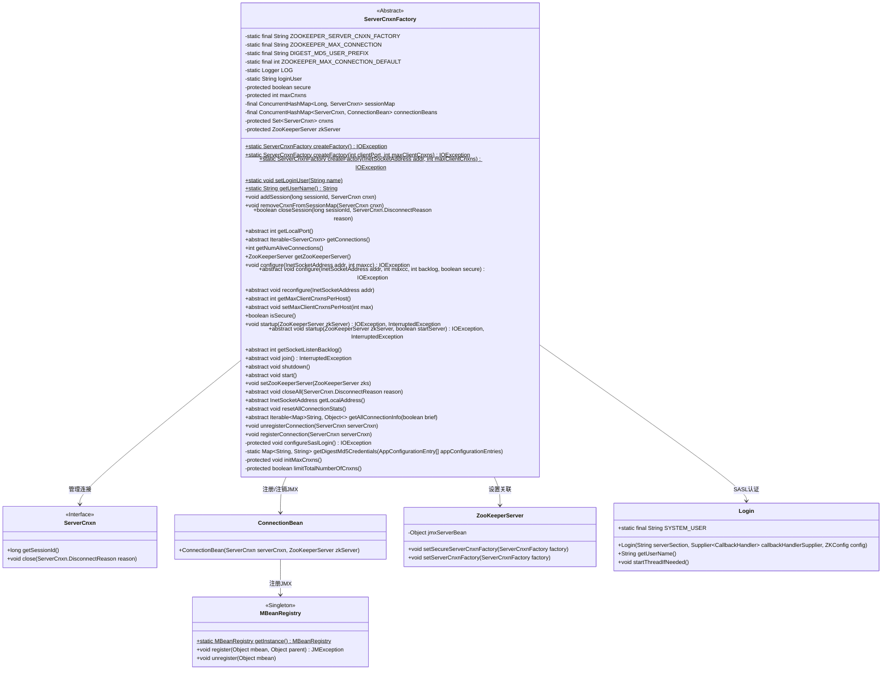
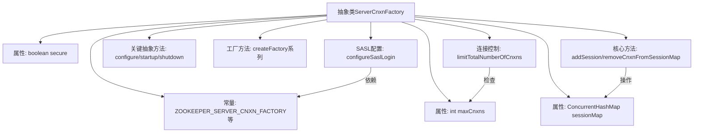

# 基础信息

|      |      |
|------|------|
| 名称 | ServerCnxnFactory |
| 编码语言 | .java |
| 代码路径 | zookeeper/zookeeper-server/src/main/java/org/apache/zookeeper/server/ServerCnxnFactory.java |
| 包名 | org.apache.zookeeper.server |
| 依赖项 | ['java.io.IOException', 'java.net.InetSocketAddress', 'java.nio.ByteBuffer', 'java.util.Collections', 'java.util.HashMap', 'java.util.Map', 'java.util.Set', 'java.util.concurrent.ConcurrentHashMap', 'java.util.function.Supplier', 'javax.management.JMException', 'javax.security.auth.callback.CallbackHandler', 'javax.security.auth.login.AppConfigurationEntry', 'javax.security.auth.login.Configuration', 'javax.security.auth.login.LoginException', 'org.apache.zookeeper.Environment', 'org.apache.zookeeper.Login', 'org.apache.zookeeper.common.ZKConfig', 'org.apache.zookeeper.jmx.MBeanRegistry', 'org.apache.zookeeper.server.auth.SaslServerCallbackHandler', 'org.slf4j.Logger', 'org.slf4j.LoggerFactory'] |
| 概述说明 | ServerCnxnFactory是ZooKeeper服务器连接工厂抽象类，管理连接数限制、会话映射、SSL配置及SASL认证，提供连接创建、配置和关闭功能。 |

# 说明

ServerCnxnFactory是ZooKeeper服务器连接管理的抽象基类，负责处理客户端连接、会话管理和安全认证。核心功能包括：通过sessionMap管理会话连接，支持SSL安全配置，限制最大连接数（maxCnxns），提供工厂方法创建实例，支持JMX监控连接状态，集成SASL认证（通过JAAS配置获取Digest-MD5凭证）。关键操作含启动/关闭服务、配置监听地址、重置连接统计及强制关闭会话。通过ConcurrentHashMap和并发集合实现线程安全，默认连接数0表示无限制，含端口控制、反向兼容接口及主机级连接数限制等扩展点。

# 类列表 Class Summary

| 名称   | 类型  | 说明 |
|-------|------|-------------|
| ServerCnxnFactory | class | ServerCnxnFactory是ZooKeeper服务器连接工厂抽象类，管理连接数、会话和安全配置，支持SSL和SASL认证，提供连接创建、配置和关闭功能。 |

## 类 ServerCnxnFactory

|      |      |
|------|------|
| 访问范围 | public abstract |
| 类型 | class |
| 名称 | ServerCnxnFactory |
| 说明 | ServerCnxnFactory是ZooKeeper服务器连接工厂抽象类，管理连接数、会话和安全配置，支持SSL和SASL认证，提供连接创建、配置和关闭功能。 |

### UML类图

这段代码描述了一个ZooKeeper服务器连接工厂的抽象类`ServerCnxnFactory`，它负责管理客户端连接、会话和认证。该类通过`sessionMap`和`cnxns`集合维护活跃连接，提供连接配置、SASL认证、JMX监控等功能。作为抽象工厂，它定义了连接管理的核心接口，具体实现由子类完成。类图中展示了与`ServerCnxn`、`ZooKeeperServer`等组件的协作关系，体现了连接生命周期管理和安全认证的核心机制。

### 内部方法调用关系图

该流程图展示了ZooKeeper服务器连接工厂的核心结构。抽象类ServerCnxnFactory通过常量定义配置参数，维护连接会话映射表(sessionMap)，提供连接管理的基础方法(addSession/removeCnxn)。工厂包含关键抽象方法用于服务器配置(configure)和生命周期管理(startup/shutdown)，通过createFactory静态方法实现多态创建。特别包含SASL安全认证配置流程(configureSaslLogin)和连接数控制机制(limitTotalNumberOfCnxns)，形成完整的连接管理框架。

### 字段列表 Field List

| 名称  | 类型  | 说明 |
|-------|-------|------|
| cnxns = Collections.newSetFromMap(new ConcurrentHashMap<>()) | Set<ServerCnxn> | Java代码：使用并发安全的ConcurrentHashMap存储ServerCnxn连接的线程安全集合。 |
| sessionMap = new ConcurrentHashMap<>() | ConcurrentHashMap<Long, ServerCnxn> | 创建线程安全的ConcurrentHashMap，键为Long类型，值为ServerCnxn对象，用于存储会话映射。 |
| closeConn = ByteBuffer.allocate(0) | ByteBuffer | 静态常量ByteBuffer closeConn初始化为空缓冲区。 |
| ZOOKEEPER_MAX_CONNECTION = "zookeeper.maxCnxns" | String | 私有静态常量字符串ZOOKEEPER_MAX_CONNECTION，值为"zookeeper.maxCnxns"。 |
| connectionBeans = new ConcurrentHashMap<>() | ConcurrentHashMap<ServerCnxn, ConnectionBean> | 私有并发哈希映射，存储服务器连接与对应连接Bean的键值对。 |
| login | Login | 公开登录方法login。 |
| ZOOKEEPER_MAX_CONNECTION_DEFAULT = 0 | int | ZOOKEEPER默认最大连接数为0。 |
| ZOOKEEPER_SERVER_CNXN_FACTORY = "zookeeper.serverCnxnFactory" | String | 该代码定义了一个静态常量字符串，表示ZooKeeper服务器连接工厂的配置键名。 |
| secure | boolean | 声明一个受保护的布尔类型变量secure，用于表示安全状态。 |
| zkServer | ZooKeeperServer | 受保护的ZooKeeper服务器实例变量zkServer。 |
| loginUser = Login.SYSTEM_USER | String | 私有静态字符串变量loginUser初始化为Login类的SYSTEM_USER值。 |
| maxCnxns | int | 保护类型整型变量maxCnxns，用于最大连接数限制。 |
| DIGEST_MD5_USER_PREFIX = "user_" | String | 私有静态常量字符串，前缀为"user_"，用于MD5摘要处理。 |
| LOG = LoggerFactory.getLogger(ServerCnxnFactory.class) | Logger | 声明ServerCnxnFactory类的私有静态日志常量LOG。 |

### 方法列表 Method List

| 名称  | 类型  | 说明 |
|-------|-------|------|
| createFactory | ServerCnxnFactory | 静态方法createFactory接收端口和最大连接数参数，返回ServerCnxnFactory实例，内部调用重载方法并抛出IO异常。 |
| start | void | 抽象方法start()，无返回值，需子类实现具体逻辑。 |
| isSecure | boolean | 这是一个Java方法，返回布尔值secure，表示安全状态。 |
| join | void | 抽象方法join()，可能抛出InterruptedException异常。 |
| createFactory | ServerCnxnFactory | 创建服务器连接工厂方法，接收端口、最大连接数和积压数，返回工厂实例，可能抛出IO异常。 |
| shutdown | void | 抽象方法shutdown，无返回值，需子类实现。 |
| setMaxClientCnxnsPerHost | void | 设置单个客户端主机的最大连接数限制。 |
| getLocalAddress | InetSocketAddress | 获取本地套接字地址的抽象方法。 |
| getSocketListenBacklog | int | 获取套接字监听队列最大长度的方法。 |
| closeAll | void | 关闭所有服务器连接，指定断开原因。 |
| getAllConnectionInfo | Iterable<Map<String, Object>> | 获取所有连接信息，返回可迭代的键值对集合，参数brief控制是否简要信息。 |
| setZooKeeperServer | void | 设置ZooKeeper服务器实例，根据安全状态配置连接工厂。若服务器非空且安全，设为安全连接工厂，否则设为普通连接工厂。 |
| getNumAliveConnections | int | 获取当前存活的连接数量，返回连接集合的大小。 |
| getMaxCnxns | int | 这是一个Java方法，返回maxCnxns的值。 |
| createFactory | ServerCnxnFactory | 创建服务器连接工厂，配置地址、最大客户端连接数和待处理连接队列长度后返回实例。 |
| addSession | void | 方法`addSession`将`sessionId`和`ServerCnxn`对象存入`sessionMap`中。 |
| resetAllConnectionStats | void | 抽象方法resetAllConnectionStats，用于重置所有连接统计信息。 |
| startup | void | 这是一个Java方法，名为startup，接受ZooKeeperServer参数，可能抛出IO和中断异常。它调用另一个startup方法并传入true参数。 |
| configure | void | 这是一个Java方法，用于配置网络地址和最大连接数，内部调用另一个配置方法并传入默认超时值-1。可能抛出IOException异常。 |
| getLocalPort | int | 获取本地端口号的抽象方法。 |
| configure | void | Java方法：配置网络地址、最大连接数和待处理连接数，默认不重用地址，可能抛出IO异常。 |
| createFactory | ServerCnxnFactory | 创建ServerCnxnFactory实例，默认使用NIOServerCnxnFactory，若系统属性指定则按指定类名创建，失败时抛出IOException。 |
| startup | void | 抽象方法startup，启动ZooKeeper服务器，参数zkServer和startServer，可能抛出IO异常和中断异常。 |
| getMaxClientCnxnsPerHost | int | 获取每个客户端的最大连接数限制。 |
| getUserName | String | 这是一个Java静态方法，返回当前登录用户的用户名。方法名为getUserName，返回类型为String，直接返回变量loginUser的值。 |
| getZooKeeperServer | ZooKeeperServer | 这是一个Java方法，返回ZooKeeperServer类型的私有成员变量zkServer。方法声明为public final，确保线程安全且不可重写。 |
| removeCnxnFromSessionMap | void | 该方法从会话映射中移除指定连接。若连接会话ID非零，则根据该ID删除对应会话。 |
| getConnections | Iterable<ServerCnxn> | 获取服务器连接的抽象方法，返回可迭代的连接集合。 |
| reconfigure | void | 抽象方法reconfigure，参数为InetSocketAddress类型地址addr。 |
| closeSession | boolean | 关闭指定会话ID的连接，移除会话映射并处理异常。成功返回true，失败返回false。 |
| createFactory | ServerCnxnFactory | 静态方法createFactory创建ServerCnxnFactory实例，接收地址和最大连接数参数，可抛出IO异常。 |
| configure | void | 抽象方法，配置网络地址、最大连接数、待处理连接数和安全设置，可能抛出IO异常。 |
| unregisterConnection | void | 方法unregisterConnection移除指定服务器连接的JMX注册。若存在对应ConnectionBean，则从MBeanRegistry注销该Bean。 |
| registerConnection | void | 注册服务器连接，创建JMX连接Bean并注册到MBeanRegistry，异常时记录日志。 |
| configureSaslLogin | void | 方法配置SASL登录，检查JAAS配置。若无配置且用户要求SASL则报错；若有配置则创建登录处理器并启动线程。异常时抛出IO异常。 |
| initMaxCnxns | void | 初始化最大连接数方法：读取配置值，若为负则使用默认值并警告；若未配置则用默认值并警告；否则记录配置值。 |
| getDigestMd5Credentials | Map<String, String> | 从JAAS配置的"Server"部分提取DIGEST-MD5用户密码对，以"user_"前缀识别用户名，返回用户密码映射。 |
| setLoginUser | void | 静态方法setLoginUser用于设置静态变量loginUser，避免实例方法修改静态变量引发的FindBugs警告。 |
| limitTotalNumberOfCnxns | boolean | 检查当前活跃连接数是否超过最大限制。若未设置限制或未超限返回false；超限则记录错误并返回true。 |

