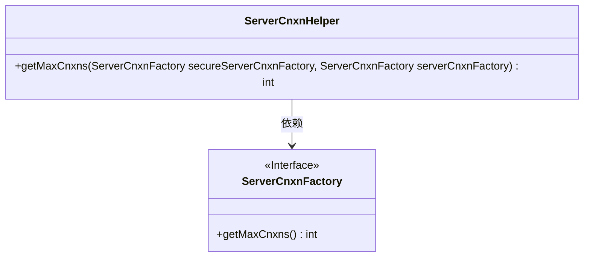
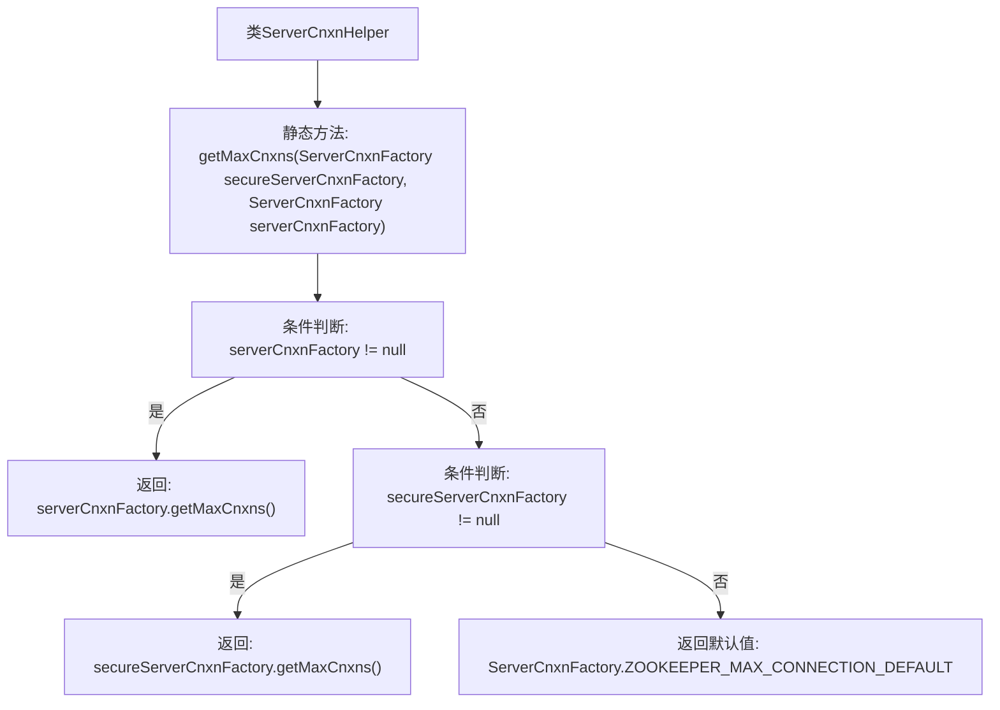

# 基础信息

|      |      |
|------|------|
| 名称 | ServerCnxnHelper |
| 编码语言 | .java |
| 代码路径 | zookeeper/zookeeper-server/src/main/java/org/apache/zookeeper/server/ServerCnxnHelper.java |
| 包名 | org.apache.zookeeper.server |
| 依赖项 | [] |
| 概述说明 | ServerCnxnHelper类提供获取ZooKeeper最大连接数的方法，优先检查普通连接工厂，其次安全连接工厂，默认返回预设值。 |

# 说明

ServerCnxnHelper类提供了一个静态方法getMaxCnxns，用于获取ZooKeeper服务器的最大连接数。该方法接收两个ServerCnxnFactory类型的参数：secureServerCnxnFactory和serverCnxnFactory。首先检查serverCnxnFactory是否非空，若存在则返回其最大连接数；否则检查secureServerCnxnFactory是否非空，若存在则返回其最大连接数。若两者均为空，则返回默认值ZOOKEEPER_MAX_CONNECTION_DEFAULT。该方法确保了无论是否存在安全连接工厂，都能获取到有效的最大连接数设置。

# 类列表 Class Summary

| 名称   | 类型  | 说明 |
|-------|------|-------------|
| ServerCnxnHelper | class | ServerCnxnHelper类提供获取ZooKeeper最大连接数的方法，优先检查普通连接工厂，其次安全连接工厂，最后返回默认值。 |

## 类 ServerCnxnHelper

|      |      |
|------|------|
| 访问范围 | public |
| 类型 | class |
| 名称 | ServerCnxnHelper |
| 说明 | ServerCnxnHelper类提供获取ZooKeeper最大连接数的方法，优先检查普通连接工厂，其次安全连接工厂，最后返回默认值。 |

### UML类图

这段代码展示了一个工具类`ServerCnxnHelper`，它通过静态方法`getMaxCnxns`从两个可能的`ServerCnxnFactory`实例（安全或非安全）中获取最大连接数。类图中明确显示了`ServerCnxnHelper`对`ServerCnxnFactory`接口的依赖关系，该接口定义了获取最大连接数的方法。代码逻辑会优先检查非安全工厂，再检查安全工厂，最后返回默认值，体现了清晰的优先级处理机制。

### 内部方法调用关系图

这段代码流程图展示了ServerCnxnHelper类中getMaxCnxns方法的逻辑流程。该方法首先检查非安全连接工厂参数是否为空，若非空则返回其最大连接数；若为空则检查安全连接工厂参数，同样非空时返回其最大连接数。若两个参数均为空，则返回ZooKeeper的默认最大连接数常量。流程图清晰呈现了这种优先级判断和默认值回退机制。

### 字段列表 Field List

| 名称  | 类型  | 说明 |
|-------|-------|------|

### 方法列表 Method List

| 名称  | 类型  | 说明 |
|-------|-------|------|
| getMaxCnxns | int | 获取最大连接数的方法：优先返回非安全工厂的最大连接数，若无则返回安全工厂的，默认使用ZooKeeper预设值。 |

