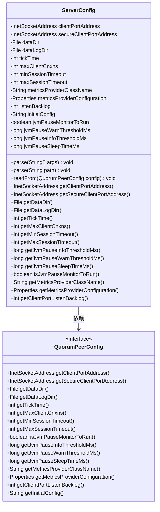
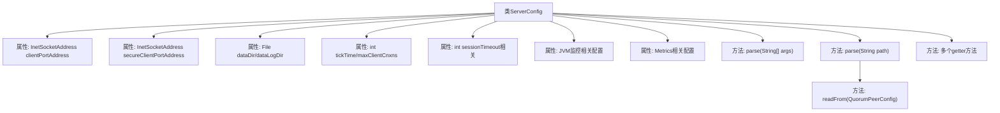

# 基础信息

|      |      |
|------|------|
| 名称 | ServerConfig |
| 编码语言 | .java |
| 代码路径 | zookeeper/zookeeper-server/src/main/java/org/apache/zookeeper/server/ServerConfig.java |
| 包名 | org.apache.zookeeper.server |
| 依赖项 | ['java.io.File', 'java.net.InetSocketAddress', 'java.util.Arrays', 'java.util.Properties', 'org.apache.yetus.audience.InterfaceAudience', 'org.apache.zookeeper.metrics.impl.DefaultMetricsProvider', 'org.apache.zookeeper.server.quorum.QuorumPeerConfig', 'org.apache.zookeeper.server.quorum.QuorumPeerConfig.ConfigException'] |
| 概述说明 | ServerConfig类用于配置ZooKeeper服务器参数，包括端口地址、数据目录、会话超时、JVM监控阈值等。提供解析命令行参数和配置文件的方法，并支持从QuorumPeerConfig读取配置。包含多个getter方法获取配置值。 |

# 说明

ServerConfig类是一个公开的配置类，用于管理服务器配置参数。它包含多个受保护的成员变量，如客户端端口地址、安全客户端端口地址、数据目录、日志目录、会话超时时间、最大客户端连接数等。类提供了两个解析方法：parse(String[] args)用于解析命令行参数，parse(String path)用于解析配置文件。此外，readFrom方法用于从QuorumPeerConfig对象读取配置属性。类还提供了多个getter方法用于获取配置参数的值。配置参数包括JVM暂停监控相关设置、指标提供者类名和配置、监听积压数等。

# 类列表 Class Summary

| 名称   | 类型  | 说明 |
|-------|------|-------------|
| ServerConfig | class | 
ServerConfig类用于配置ZooKeeper服务器参数，包括端口地址、数据目录、会话超时、连接数限制及JVM监控设置，支持从参数或配置文件解析配置。 |

## 类 ServerConfig

|      |      |
|------|------|
| 访问范围 | @InterfaceAudience.Public;public |
| 类型 | class |
| 名称 | ServerConfig |
| 说明 | 
ServerConfig类用于配置ZooKeeper服务器参数，包括端口地址、数据目录、会话超时、连接数限制及JVM监控设置，支持从参数或配置文件解析配置。 |

### UML类图

这段代码描述了一个ZooKeeper服务器的配置类`ServerConfig`，它包含网络地址、数据目录、会话超时等配置参数，并提供了从命令行参数或配置文件解析配置的方法。该类依赖于`QuorumPeerConfig`接口来读取配置信息，支持客户端连接管理、JVM监控指标等高级功能，是一个典型的服务端配置管理实现。

### 内部方法调用关系图

该流程图展示了ServerConfig类的核心结构和主要方法调用关系。类包含网络地址、文件目录、超时参数、JVM监控和Metrics等配置属性，提供两种配置解析方式：直接参数解析(parse(String[]))和配置文件解析(parse(String))，后者通过QuorumPeerConfig读取配置。所有属性都配有对应的getter方法，整体设计采用配置集中管理模式，支持从不同来源初始化服务器参数。

### 字段列表 Field List

| 名称  | 类型  | 说明 |
|-------|-------|------|
| jvmPauseInfoThresholdMs | long | JVM暂停信息阈值（毫秒），用于监控长时间停顿。 |
| listenBacklog = -1 | int | protected修饰的整型变量listenBacklog，初始值为-1。 |
| dataDir | File | 声明一个受保护的文件类型变量dataDir。 |
| clientPortAddress | InetSocketAddress | 受保护的客户端端口地址变量。 |
| metricsProviderClassName = DefaultMetricsProvider.class.getName() | String | 代码定义了一个受保护的字符串变量metricsProviderClassName，其值为DefaultMetricsProvider类的全限定名。 |
| tickTime = ZooKeeperServer.DEFAULT_TICK_TIME | int | ZooKeeper服务器默认心跳间隔时间，受保护整型变量tickTime。 |
| secureClientPortAddress | InetSocketAddress | 受保护的InetSocketAddress类型变量secureClientPortAddress，用于安全客户端端口地址。 |
| maxSessionTimeout = -1 | int | 声明一个受保护的整型变量maxSessionTimeout，初始值为-1。 |
| jvmPauseSleepTimeMs | long | 声明一个受保护的长整型变量jvmPauseSleepTimeMs，用于存储JVM暂停睡眠时间（毫秒）。 |
| minSessionTimeout = -1 | int | 受保护的整型变量minSessionTimeout，默认值为-1。 |
| initialConfig | String | 声明一个受保护的字符串变量initialConfig。 |
| jvmPauseWarnThresholdMs | long | JVM暂停警告阈值（毫秒）。 |
| maxClientCnxns | int | 受保护的整型变量maxClientCnxns，用于限制客户端连接数。 |
| jvmPauseMonitorToRun = false | boolean | 保护布尔变量jvmPauseMonitorToRun初始值为false。 |
| metricsProviderConfiguration = new Properties() | Properties | 声明并初始化一个受保护的Properties对象metricsProviderConfiguration。 |
| dataLogDir | File | 声明一个受保护的文件类型变量dataLogDir。 |

### 方法列表 Method List

| 名称  | 类型  | 说明 |
|-------|-------|------|
| getDataLogDir | File | 获取数据日志目录的方法，返回dataLogDir对象。 |
| getMaxSessionTimeout | int | 方法返回最大会话超时时间。 |
| getDataDir | File | 这是一个Java方法，返回名为dataDir的文件对象。 |
| getClientPortAddress | InetSocketAddress | 方法getClientPortAddress返回客户端端口地址的InetSocketAddress对象。 |
| readFrom | void | 从QuorumPeerConfig读取配置项，包括端口地址、目录路径、超时设置、JVM监控参数、度量提供者和初始配置等。 |
| getSecureClientPortAddress | InetSocketAddress | 获取安全客户端端口地址的方法，返回InetSocketAddress类型值。 |
| parse | void | 解析路径参数并读取配置，初始化QuorumPeerConfig对象，处理可能抛出的ConfigException异常。 |
| parse | void | 解析命令行参数：检查参数数量（2-4个），设置客户端端口、数据目录、心跳间隔和最大连接数，参数无效时抛出异常。 |
| getTickTime | int | 方法getTickTime返回整型变量tickTime的值。 |
| getMinSessionTimeout | int | 获取最小会话超时时间的方法，返回整型变量minSessionTimeout的值。 |
| getMaxClientCnxns | int | 方法返回最大客户端连接数maxClientCnxns。 |
| getJvmPauseInfoThresholdMs | long | 获取JVM暂停信息阈值毫秒值的方法。 |
| getJvmPauseWarnThresholdMs | long | 方法返回JVM暂停警告阈值毫秒值。 |
| getJvmPauseSleepTimeMs | long | 获取JVM暂停睡眠时间（毫秒）。 |
| isJvmPauseMonitorToRun | boolean | 方法返回布尔值，表示是否运行JVM暂停监控。 |
| getMetricsProviderClassName | String | 方法返回metricsProviderClassName字符串值。 |
| getMetricsProviderConfiguration | Properties | 获取metricsProvider配置属性的公共方法。 |
| getClientPortListenBacklog | int | 方法返回监听端口积压队列大小。 |

