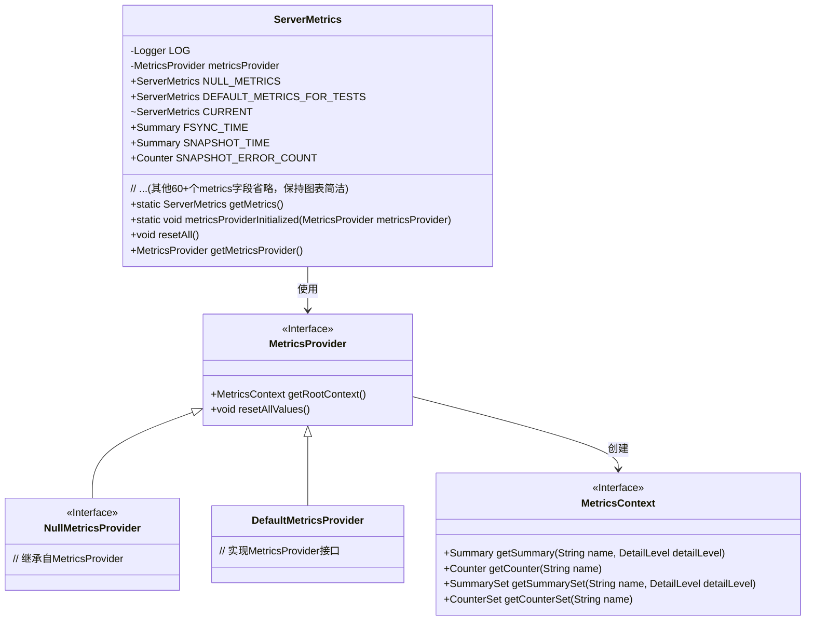
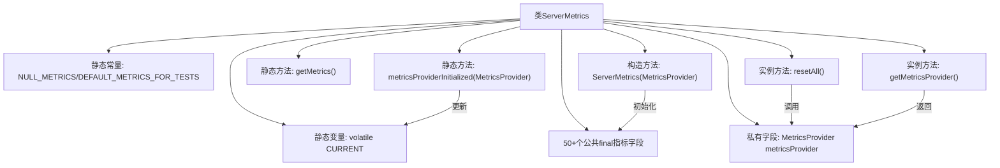

# 基础信息

|      |      |
|------|------|
| 名称 | ServerMetrics |
| 编码语言 | .java |
| 代码路径 | zookeeper/zookeeper-server/src/main/java/org/apache/zookeeper/server/ServerMetrics.java |
| 包名 | org.apache.zookeeper.server |
| 依赖项 | ['org.apache.zookeeper.metrics.Counter', 'org.apache.zookeeper.metrics.CounterSet', 'org.apache.zookeeper.metrics.MetricsContext', 'org.apache.zookeeper.metrics.MetricsContext.DetailLevel', 'org.apache.zookeeper.metrics.MetricsProvider', 'org.apache.zookeeper.metrics.Summary', 'org.apache.zookeeper.metrics.SummarySet', 'org.apache.zookeeper.metrics.impl.DefaultMetricsProvider', 'org.apache.zookeeper.metrics.impl.NullMetricsProvider', 'org.apache.zookeeper.server.util.QuotaMetricsUtils', 'org.slf4j.Logger', 'org.slf4j.LoggerFactory'] |
| 概述说明 | ServerMetrics类用于跟踪服务器端性能指标，包含各类计数器、时间统计和状态监控，如读写延迟、快照时间、连接数等，支持测试实例和动态初始化。 |

# 说明

ServerMetrics类是一个用于跟踪服务器端指标的公共类，包含大量性能监控和统计指标。它提供了静态实例NULL_METRICS和DEFAULT_METRICS_FOR_TESTS用于测试，以及CURRENT实例用于实际运行时的指标收集。类中定义了超过100个不同类型的指标，包括时间统计（如FSYNC_TIME、READ_LATENCY）、计数器（如SNAPSHOT_ERROR_COUNT、CONNECTION_REJECTED）和集合统计（如WRITE_PER_NAMESPACE）。这些指标涵盖了服务器各个方面的运行状态，包括请求处理、同步、选举、连接管理、缓存、观察者模式等。类还提供了resetAll方法重置所有指标值，以及getMetricsProvider方法获取底层的MetricsProvider。

# 类列表 Class Summary

| 名称   | 类型  | 说明 |
|-------|------|-------------|
| ServerMetrics | class | ServerMetrics类用于跟踪服务器端性能指标，包含读写延迟、快照时间、连接统计、处理器队列状态等关键指标，支持测试实例和动态初始化。 |

## 类 ServerMetrics

|      |      |
|------|------|
| 访问范围 | public final |
| 类型 | class |
| 名称 | ServerMetrics |
| 说明 | ServerMetrics类用于跟踪服务器端性能指标，包含读写延迟、快照时间、连接统计、处理器队列状态等关键指标，支持测试实例和动态初始化。 |

### UML类图

这段代码定义了一个ServerMetrics类，用于收集和跟踪ZooKeeper服务器的各种性能指标和运行时数据。该类包含100多个不同类型的metrics字段（图表中省略部分字段），通过MetricsProvider接口获取底层指标数据。主要功能包括：1) 提供静态方法访问当前metrics实例；2) 支持metrics初始化；3) 提供reset功能；4) 封装各种服务器操作的统计信息（如读写延迟、队列大小、错误计数等）。设计上采用单例模式，通过volatile的CURRENT字段保证线程安全，并使用接口隔离具体metrics实现。

### 内部方法调用关系图

这段代码是ZooKeeper服务器的指标监控系统核心类，采用单例模式管理50+种性能指标。主要功能包括：1) 通过MetricsProvider获取各类运行时指标(如延迟、计数器等)；2) 提供NULL和DEFAULT两种测试用实例；3) 支持运行时动态切换指标提供者；4) 包含重置所有指标的方法。所有指标字段均为final类型，确保线程安全，涵盖网络、存储、请求处理等全维度监控数据。

### 字段列表 Field List

| 名称  | 类型  | 说明 |
|-------|-------|------|
| UPDATE_LATENCY | Summary | 公共常量UPDATE_LATENCY用于总结更新延迟。 |
| LEARNER_REQUEST_PROCESSOR_QUEUE_SIZE | Summary | 公共常量LEARNER_REQUEST_PROCESSOR_QUEUE_SIZE，用于定义学习者请求处理器队列大小。 |
| CURRENT = DEFAULT_METRICS_FOR_TESTS | ServerMetrics | 私有静态可变ServerMetrics变量CURRENT初始化为测试用的默认度量值。 |
| COMMITS_QUEUED | Counter | 公共计数器COMMITS_QUEUED，用于统计提交队列数量。 |
| COMMITS_QUEUED_IN_COMMIT_PROCESSOR | Summary | 公共常量COMMITS_QUEUED_IN_COMMIT_PROCESSOR，表示提交处理器中排队的提交数量。 |
| SKIP_LEARNER_REQUEST_TO_NEXT_PROCESSOR_COUNT | Counter | 计数器SKIP_LEARNER_REQUEST_TO_NEXT_PROCESSOR_COUNT用于统计跳转至下一处理器的学习请求次数。 |
| SOCKET_CLOSING_TIME | Summary | 公共常量SOCKET_CLOSING_TIME表示套接字关闭时间。 |
| REQUESTS_NOT_FORWARDED_TO_COMMIT_PROCESSOR | Counter | 计数器记录未转发至提交处理器的请求数量。 |
| WATCH_BYTES | Counter | 公共计数器WATCH_BYTES，用于监控字节数。 |
| JVM_PAUSE_TIME | Summary | JVM暂停时间监控指标，用于记录虚拟机停顿时长。 |
| QUOTA_EXCEEDED_ERROR_PER_NAMESPACE | CounterSet | 公共计数器集QUOTA_EXCEEDED_ERROR_PER_NAMESPACE，用于记录每个命名空间的配额超限错误。 |
| metricsProvider | MetricsProvider | 私有不可变的MetricsProvider实例。 |
| NETTY_QUEUED_BUFFER | Summary | 公共静态常量NETTY_QUEUED_BUFFER，表示Netty框架中的队列缓冲区。 |
| WRITES_QUEUED_IN_COMMIT_PROCESSOR | Summary | 公共常量WRITES_QUEUED_IN_COMMIT_PROCESSOR表示提交处理器中排队的写入操作。 |
| BYTES_RECEIVED_COUNT | Counter | 公共计数器，用于统计接收的字节数。 |
| LARGE_REQUESTS_REJECTED | Counter | 公共计数器LARGE_REQUESTS_REJECTED，记录被拒绝的大型请求数量。 |
| INFLIGHT_SNAP_COUNT | Summary | 公共常量INFLIGHT_SNAP_COUNT用于统计进行中的快照数量。 |
| READS_ISSUED_IN_COMMIT_PROC | Summary | 公共常量Summary READS_ISSUED_IN_COMMIT_PROC表示提交过程中发出的读取操作汇总。 |
| READS_QUEUED_IN_COMMIT_PROCESSOR | Summary | 公共常量 READS_QUEUED_IN_COMMIT_PROCESSOR 表示提交处理器中排队的读取操作。 |
| SNAP_COUNT | Counter | 声明一个不可变计数器SNAP_COUNT。 |
| REQUEST_THROTTLE_WAIT_COUNT | Counter | 公共计数器REQUEST_THROTTLE_WAIT_COUNT，用于统计请求限流等待次数。 |
| INFLIGHT_DIFF_COUNT | Summary | 飞行差异计数总结常量。 |
| NODE_CREATED_WATCHER | Summary | 公共最终变量NODE_CREATED_WATCHER用于监视节点创建。 |
| QUIT_LEADING_DUE_TO_DISLOYAL_VOTER | Counter | 计数器QUIT_LEADING_DUE_TO_DISLOYAL_VOTER记录因不忠诚投票导致退出领导的事件次数。 |
| LEADER_UNAVAILABLE_TIME | Summary | 领导者不可用时间统计。 |
| RESTORE_ERROR_COUNT | Counter | 公共不可变计数器RESTORE_ERROR_COUNT，用于记录恢复错误次数。 |
| CONNECTION_REJECTED | Counter | 公共计数器CONNECTION_REJECTED记录被拒绝的连接数。 |
| SESSIONLESS_CONNECTIONS_EXPIRED | Counter | 公共计数器：无会话连接过期数 |
| REQUEST_THROTTLE_QUEUE_TIME | Summary | 请求节流队列时间统计。 |
| WRITE_BATCH_TIME_IN_COMMIT_PROCESSOR | Summary | 公共常量WRITE_BATCH_TIME_IN_COMMIT_PROCESSOR用于记录提交处理器中的批量写入时间。 |
| UNRECOVERABLE_ERROR_COUNT | Counter | 不可恢复错误计数器，用于统计无法修复的错误数量。 |
| NODE_DELETED_WATCHER | Summary | 节点删除监视器。 |
| PROPAGATION_LATENCY | Summary | 该代码定义了一个不可变常量PROPAGATION_LATENCY，用于表示传播延迟的摘要信息。 |
| ACK_LATENCY | SummarySet | 公共不可变集合ACK_LATENCY。 |
| OBSERVER_SYNC_TIME | Summary | 公共不可变变量OBSERVER_SYNC_TIME，用于同步观察者时间。 |
| TIME_WAITING_EMPTY_POOL_IN_COMMIT_PROCESSOR_READ | Summary | 等待提交处理器读取池为空的时间统计。 |
| WRITES_ISSUED_IN_COMMIT_PROC | Summary | 提交过程中发出的写入操作摘要。 |
| SNAPSHOT_ERROR_COUNT | Counter | 公开不可变计数器SNAPSHOT_ERROR_COUNT用于统计快照错误次数。 |
| QUORUM_ACK_LATENCY | Summary | 公开常量QUORUM_ACK_LATENCY，用于记录仲裁确认延迟的摘要信息。 |
| SESSION_QUEUES_DRAINED | Summary | 会话队列已清空。 |
| READ_PER_NAMESPACE | SummarySet | 公开常量READ_PER_NAMESPACE，类型为SummarySet。 |
| LOG = LoggerFactory.getLogger(ServerMetrics.class) | Logger | 声明一个私有静态常量LOG，用于ServerMetrics类的日志记录，通过LoggerFactory获取实例。 |
| ENSEMBLE_AUTH_FAIL | Counter | 公开的最终计数器ENSEMBLE_AUTH_FAIL，用于记录认证失败次数。 |
| PREP_PROCESSOR_QUEUE_TIME | Summary | 预处理队列时间统计。 |
| ENSEMBLE_AUTH_SUCCESS | Counter | 定义了一个不可变的计数器ENSEMBLE_AUTH_SUCCESS，用于统计认证成功次数。 |
| BATCH_SIZE | Summary | 公共常量BATCH_SIZE，表示批量处理的大小。 |
| RESTORE_TIME | Summary | 公共最终变量RESTORE_TIME用于存储恢复时间。 |
| READ_ISSUED_FROM_SESSION_QUEUE | Summary | 从会话队列读取已发布摘要。 |
| CONCURRENT_REQUEST_PROCESSING_IN_COMMIT_PROCESSOR | Summary | 并发请求在提交处理器中的处理总结。 |
| PROPOSAL_LATENCY | Summary | 公开不可变的摘要变量PROPOSAL_LATENCY。 |
| CONNECTION_DROP_COUNT | Counter | 公共计数器，用于统计连接断开次数。 |
| LOOKING_COUNT | Counter | 公开的最终计数器LOOKING_COUNT。 |
| WRITE_FINAL_PROC_TIME | Summary | 公共最终摘要变量WRITE_FINAL_PROC_TIME，用于记录最终处理时间。 |
| SYNC_PROCESS_TIME | Summary | 公共常量SYNC_PROCESS_TIME用于记录同步处理时间。 |
| PROPOSAL_COUNT | Counter | 公开的最终计数器PROPOSAL_COUNT。 |
| READS_AFTER_WRITE_IN_SESSION_QUEUE | Summary | 公共常量 READS_AFTER_WRITE_IN_SESSION_QUEUE，用于会话队列中的写后读操作。 |
| CONNECTION_REVALIDATE_COUNT | Counter | 公开静态计数器，用于统计连接重新验证次数。 |
| PREP_PROCESSOR_QUEUE_SIZE | Summary | 公共常量PREP_PROCESSOR_QUEUE_SIZE用于定义预处理队列大小。 |
| ENSEMBLE_AUTH_SKIP | Counter | 声明一个不可变的计数器变量ENSEMBLE_AUTH_SKIP。 |
| READ_FINAL_PROC_TIME | Summary | 公共最终摘要变量READ_FINAL_PROC_TIME。 |
| FOLLOWER_SYNC_TIME | Summary | 公共常量FOLLOWER_SYNC_TIME用于记录同步时间。 |
| SYNC_PROCESSOR_FLUSH_TIME | Summary | 公共常量SYNC_PROCESSOR_FLUSH_TIME用于记录同步处理器刷新时间。 |
| SNAPSHOT_RATE_LIMITED_COUNT | Counter | 公开的最终计数器SNAPSHOT_RATE_LIMITED_COUNT，用于限制快照速率。 |
| NODE_CHANGED_WATCHER | Summary | 公共常量NODE_CHANGED_WATCHER用于节点变更监听。 |
| DIFF_COUNT | Counter | 公开不可变的计数器DIFF_COUNT。 |
| PREP_PROCESSOR_QUEUED | Counter | 声明一个不可变的计数器变量PREP_PROCESSOR_QUEUED，用于统计预处理队列中的任务数量。 |
| RESTORE_RATE_LIMITED_COUNT | Counter | 公共计数器RESTORE_RATE_LIMITED_COUNT，用于记录限流恢复次数。 |
| LEARNER_HANDLER_QP_TIME | SummarySet | 公开常量LEARNER_HANDLER_QP_TIME用于设置学习处理器查询超时时间。 |
| RESPONSE_PACKET_GET_CHILDREN_CACHE_MISSING | Counter | 公共计数器记录响应包获取子节点缓存缺失次数。 |
| OUTSTANDING_CHANGES_QUEUED | Counter | 公共计数器OUTSTANDING_CHANGES_QUEUED，用于跟踪排队中的待处理变更数量。 |
| LEARNER_HANDLER_QP_SIZE | SummarySet | 公共常量LEARNER_HANDLER_QP_SIZE用于定义学习处理器队列大小。 |
| COMMIT_PROCESS_TIME | Summary | 公共常量COMMIT_PROCESS_TIME用于记录提交处理时间。 |
| CLOSE_SESSION_PREP_TIME | Summary | 关闭会话准备时间的最终摘要。 |
| NULL_METRICS = new ServerMetrics(NullMetricsProvider.INSTANCE) | ServerMetrics | 定义了一个不可变的空服务度量实例NULL_METRICS，使用NullMetricsProvider的单例INSTANCE初始化。 |
| RESPONSE_PACKET_GET_CHILDREN_CACHE_HITS | Counter | 公共计数器记录响应包获取子节点缓存命中次数。 |
| OUTSTANDING_CHANGES_REMOVED | Counter | 公共计数器OUTSTANDING_CHANGES_REMOVED，用于追踪移除的未完成变更。 |
| SYNC_PROCESSOR_QUEUE_AND_FLUSH_TIME | Summary | 同步处理器队列与刷新时间统计。 |
| REVALIDATE_COUNT | Counter | 公开的最终计数器REVALIDATE_COUNT。 |
| NODE_CHILDREN_WATCHER | Summary | 监视节点子变化的终结观察器。 |
| CONNECTION_REQUEST_COUNT | Counter | 公开的最终计数器CONNECTION_REQUEST_COUNT，用于统计连接请求次数。 |
| STALE_REQUESTS | Counter | 公共计数器STALE_REQUESTS，用于记录过期请求数量。 |
| CNXN_CLOSED_WITHOUT_ZK_SERVER_RUNNING | Counter | 计数器记录未运行ZK服务器时关闭的连接数。 |
| SERVER_WRITE_COMMITTED_TIME | Summary | 公开常量SERVER_WRITE_COMMITTED_TIME，用于记录服务器写入提交时间。 |
| STALE_SESSIONS_EXPIRED | Counter | 公共计数器STALE_SESSIONS_EXPIRED用于记录过期会话数。 |
| REQUESTS_IN_SESSION_QUEUE | Summary | 公共常量REQUESTS_IN_SESSION_QUEUE用于表示会话队列中的请求数量。 |
| PREP_PROCESS_TIME | Summary | 公共最终变量PREP_PROCESS_TIME，用于记录预处理时间。 |
| PROPOSAL_PROCESS_TIME | Summary | 提案处理时间 |
| SNAPSHOT_TIME | Summary | 公共最终摘要变量SNAPSHOT_TIME。 |
| STARTUP_TXNS_LOAD_TIME | Summary | 启动事务加载时间统计。 |
| SYNC_PROCESSOR_QUEUE_SIZE | Summary | 公共常量SYNC_PROCESSOR_QUEUE_SIZE用于定义同步处理器队列大小。 |
| FSYNC_TIME | Summary | 公共最终摘要变量FSYNC_TIME。 |
| DEFAULT_METRICS_FOR_TESTS = new ServerMetrics(new DefaultMetricsProvider()) | ServerMetrics | 测试用默认服务器指标实例，使用默认指标提供器创建。 |
| TLS_HANDSHAKE_EXCEEDED | Counter | 公共计数器TLS握手超时次数统计。 |
| LOCAL_WRITE_COMMITTED_TIME | Summary | 公共常量LOCAL_WRITE_COMMITTED_TIME用于记录本地写入提交时间。 |
| RESPONSE_PACKET_CACHE_HITS | Counter | 公共计数器RESPONSE_PACKET_CACHE_HITS用于记录响应包缓存命中次数。 |
| STARTUP_TXNS_LOADED | Summary | 公共常量STARTUP_TXNS_LOADED用于记录启动时加载的事务。 |
| COMMIT_COUNT | Counter | 公开不可变的计数器COMMIT_COUNT，用于统计提交次数。 |
| INSECURE_ADMIN | Counter | 声明一个不可变的计数器变量INSECURE_ADMIN，用于统计不安全管理员操作。 |
| WRITE_COMMITPROC_TIME | Summary | 公共最终摘要变量WRITE_COMMITPROC_TIME。 |
| OM_PROPOSAL_PROCESS_TIME | Summary | 公共不可变变量OM_PROPOSAL_PROCESS_TIME用于存储提案处理时间摘要。 |
| DEAD_WATCHERS_CLEANER_LATENCY | Summary | 监控清理延迟统计 |
| ELECTION_TIME | Summary | 公开常量ELECTION_TIME用于存储选举时间。 |
| LEARNER_COMMIT_RECEIVED_COUNT | Counter | 公开计数器LEARNER_COMMIT_RECEIVED_COUNT，用于统计接收到的学习者提交次数。 |
| READ_LATENCY | Summary | 公开不可变的摘要变量READ_LATENCY。 |
| UNSUCCESSFUL_HANDSHAKE | Counter | 公共计数器UNSUCCESSFUL_HANDSHAKE，用于记录失败握手次数。 |
| STALE_REQUESTS_DROPPED | Counter | 公共计数器STALE_REQUESTS_DROPPED用于统计被丢弃的过期请求数量。 |
| DEAD_WATCHERS_CLEARED | Counter | 计数器DEAD_WATCHERS_CLEARED用于记录被清除的失效监视器数量。 |
| READ_COMMITPROC_TIME | Summary | 公共常量READ_COMMITPROC_TIME用于记录提交处理时间。 |
| LEARNER_PROPOSAL_RECEIVED_COUNT | Counter | 计数器LEARNER_PROPOSAL_RECEIVED_COUNT用于记录接收到的学习者提案数量，定义为公共不可变类型。 |
| PROPOSAL_ACK_CREATION_LATENCY | Summary | 公开常量PROPOSAL_ACK_CREATION_LATENCY用于记录提案确认创建的延迟时间。 |
| SYNC_PROCESSOR_QUEUED | Counter | 公共计数器SYNC_PROCESSOR_QUEUED，用于记录同步处理器队列中的任务数量。 |
| STARTUP_SNAP_LOAD_TIME | Summary | 启动快照加载时间常量。 |
| UNAVAILABLE_TIME | Summary | 不可用时间的最终摘要信息。 |
| OM_COMMIT_PROCESS_TIME | Summary | 公共常量OM_COMMIT_PROCESS_TIME用于记录提交处理时间。 |
| SYNC_PROCESSOR_QUEUE_TIME | Summary | 同步处理器队列时间统计。 |
| PENDING_SESSION_QUEUE_SIZE | Summary | 待处理会话队列大小。 |
| DEAD_WATCHERS_QUEUED | Counter | 声明了一个不可变的计数器变量DEAD_WATCHERS_QUEUED，用于统计排队中的失效监视器数量。 |
| RESPONSE_PACKET_CACHE_MISSING | Counter | 公共计数器RESPONSE_PACKET_CACHE_MISSING，用于统计响应包缓存缺失情况。 |
| THROTTLED_OPS | Counter | 公开的最终计数器THROTTLED_OPS，用于记录被限制的操作次数。 |
| STALE_REPLIES | Counter | 公开静态计数器STALE_REPLIES，用于统计过期回复数量。 |
| DIGEST_MISMATCHES_COUNT | Counter | 公开计数器DIGEST_MISMATCHES_COUNT用于统计摘要不匹配次数。 |
| COMMIT_PROPAGATION_LATENCY | Summary | 公共常量COMMIT_PROPAGATION_LATENCY用于测量提交传播延迟。 |
| WRITE_PER_NAMESPACE | SummarySet | 公共常量SummarySet WRITE_PER_NAMESPACE，表示每个命名空间的写入操作汇总。 |
| CONNECTION_TOKEN_DEFICIT | Summary | 公共常量CONNECTION_TOKEN_DEFICIT表示连接令牌不足。 |
| DB_INIT_TIME | Summary | 数据库初始化时间记录。 |
| ADD_DEAD_WATCHER_STALL_TIME | Counter | 计数器ADD_DEAD_WATCHER_STALL_TIME用于记录死监视器停滞时间。 |
| RESPONSE_BYTES | Counter | 公共计数器RESPONSE_BYTES，用于统计响应字节数。 |

### 方法列表 Method List

| 名称  | 类型  | 说明 |
|-------|-------|------|
| metricsProviderInitialized | void | 方法metricsProviderInitialized初始化ServerMetrics，记录日志并使用传入的MetricsProvider创建新实例。 |
| getMetrics | ServerMetrics | 获取当前服务器指标的方法，返回静态变量CURRENT的值。 |
| resetAll | void | 重置所有指标值。 |
| getMetricsProvider | MetricsProvider | 获取metricsProvider的方法，返回类型为MetricsProvider。 |

