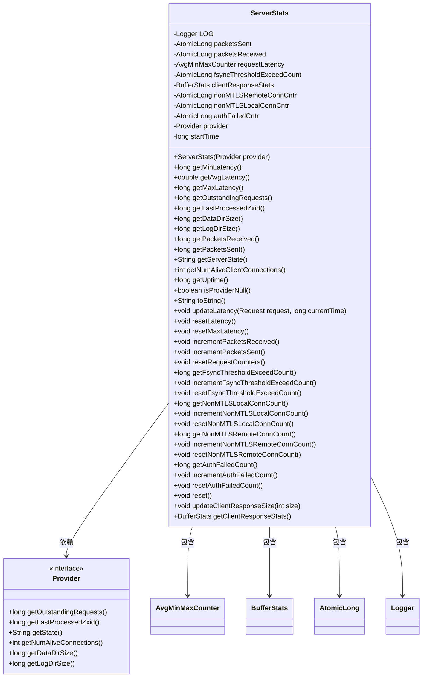

# 基础信息

|      |      |
|------|------|
| 名称 | ServerStats |
| 编码语言 | .java |
| 代码路径 | zookeeper/zookeeper-server/src/main/java/org/apache/zookeeper/server/ServerStats.java |
| 包名 | org.apache.zookeeper.server |
| 依赖项 | ['java.util.concurrent.atomic.AtomicLong', 'org.apache.zookeeper.common.Time', 'org.apache.zookeeper.server.metric.AvgMinMaxCounter', 'org.apache.zookeeper.server.quorum.BufferStats', 'org.slf4j.Logger', 'org.slf4j.LoggerFactory'] |
| 概述说明 | ServerStats类用于统计服务器性能数据，包括收发数据包、请求延迟、连接数、认证失败等指标，并提供获取和重置方法。 |

# 说明

ServerStats类是一个用于监控服务器性能的统计工具，包含多个原子计数器来跟踪数据包收发、请求延迟、非MTLS连接、认证失败等指标。通过Provider接口获取服务器状态、活跃连接数、数据目录大小等信息。提供方法更新延迟统计、重置计数器、递增各类事件计数，并支持生成包含延迟、收发数据包、连接数等信息的字符串摘要。内置BufferStats用于客户端响应统计，同时与ServerMetrics集成以记录读写延迟。

# 类列表 Class Summary

| 名称   | 类型  | 说明 |
|-------|------|-------------|
| ServerStats | class | ServerStats类用于统计服务器性能数据，包括收发数据包、请求延迟、连接数、认证失败等指标，并提供获取和重置方法。 |

## 类 ServerStats

|      |      |
|------|------|
| 访问范围 | public |
| 类型 | class |
| 名称 | ServerStats |
| 说明 | ServerStats类用于统计服务器性能数据，包括收发数据包、请求延迟、连接数、认证失败等指标，并提供获取和重置方法。 |

### UML类图

这段代码定义了一个`ServerStats`类，用于统计和监控服务器运行时的各种指标，包括网络包收发、请求延迟、连接数、认证失败等。该类通过`Provider`接口获取服务器核心状态，并使用多个原子计数器(`AtomicLong`)和自定义统计类(`AvgMinMaxCounter`、`BufferStats`)来维护和更新统计数据。提供了丰富的getter方法和统计更新方法，能够全面反映服务器运行状态，适用于分布式系统中的性能监控场景。

### 内部方法调用关系图

```mermaid
graph TD
    A["类ServerStats"]
    B["属性: AtomicLong packetsSent"]
    C["属性: AtomicLong packetsReceived"]
    D["属性: AvgMinMaxCounter requestLatency"]
    E["属性: AtomicLong fsyncThresholdExceedCount"]
    F["属性: BufferStats clientResponseStats"]
    G["属性: AtomicLong nonMTLSRemoteConnCntr"]
    H["属性: AtomicLong nonMTLSLocalConnCntr"]
    I["属性: AtomicLong authFailedCntr"]
    J["属性: Provider provider"]
    K["属性: long startTime"]
    L["接口: Provider"]
    M["构造方法: ServerStats(Provider)"]
    N["方法组: getMinLatency/getAvgLatency/getMaxLatency"]
    O["方法组: getOutstandingRequests/getLastProcessedZxid"]
    P["方法组: getDataDirSize/getLogDirSize"]
    Q["方法组: getPacketsReceived/getPacketsSent"]
    R["方法组: getServerState/getNumAliveClientConnections"]
    S["方法组: getUptime/isProviderNull"]
    T["方法: toString"]
    U["核心方法: updateLatency"]
    V["方法组: resetLatency/resetMaxLatency"]
    W["方法组: incrementPacketsReceived/incrementPacketsSent"]
    X["方法: resetRequestCounters"]
    Y["方法组: fsync阈值相关方法"]
    Z["方法组: nonMTLS连接计数方法"]
    AA["方法组: authFailed计数方法"]
    AB["方法: reset"]
    AC["方法组: clientResponseStats操作"]

    A --> B
    A --> C
    A --> D
    A --> E
    A --> F
    A --> G
    A --> H
    A --> I
    A --> J
    A --> K
    A --> L
    A --> M
    A --> N
    A --> O
    A --> P
    A --> Q
    A --> R
    A --> S
    A --> T
    A --> U
    A --> V
    A --> W
    A --> X
    A --> Y
    A --> Z
    A --> AA
    A --> AB
    A --> AC
    L -->|实现| J
    U --> D
    U -->|条件分支| ServerMetrics
    T -->|聚合调用| N
    T -->|聚合调用| Q
    T -->|聚合调用| R
    T -->|条件调用| O
```

该流程图展示了ServerStats类的完整结构，包含11个核心属性、1个Provider接口和28个主要方法。类核心功能分为四部分：1) 网络包统计(packetsSent/Received)；2) 请求延迟统计(requestLatency)；3) 各类连接计数器(MTLS/认证等)；4) 通过Provider接口获取的服务器状态数据。关键方法updateLatency实现了请求延迟的双路径统计(读写请求)，而toString方法综合了所有核心指标。所有计数器都采用AtomicLong保证线程安全，并通过分组方法提供完整的CRUD操作能力。

### 字段列表 Field List

| 名称  | 类型  | 说明 |
|-------|-------|------|
| clientResponseStats = new BufferStats() | BufferStats | 私有终态变量clientResponseStats初始化为BufferStats实例。 |
| nonMTLSRemoteConnCntr = new AtomicLong(0) | AtomicLong | 非MTLS远程连接计数器，使用AtomicLong初始化为0。 |
| nonMTLSLocalConnCntr = new AtomicLong(0) | AtomicLong | 私有原子长整型变量nonMTLSLocalConnCntr，初始值为0。 |
| authFailedCntr = new AtomicLong(0) | AtomicLong | 声明一个原子长整型变量authFailedCntr，初始值为0，用于线程安全地统计认证失败次数。 |
| requestLatency = new AvgMinMaxCounter("request_latency") | AvgMinMaxCounter | 私有最终变量requestLatency，使用AvgMinMaxCounter类统计请求延迟，指标名为request_latency。 |
| LOG = LoggerFactory.getLogger(ServerStats.class) | Logger | 定义ServerStats类的私有静态日志对象LOG，使用LoggerFactory创建。 |
| packetsReceived = new AtomicLong() | AtomicLong | 私有原子长整型变量packetsReceived，用于线程安全地统计接收包数。 |
| startTime = Time.currentElapsedTime() | long | 记录当前时间的起始点，用于后续计算耗时。 |
| provider | Provider | 私有不可变的Provider实例。 |
| packetsSent = new AtomicLong() | AtomicLong | 私有原子长整型变量packetsSent，用于线程安全地统计发送的数据包数量。 |
| fsyncThresholdExceedCount = new AtomicLong(0) | AtomicLong | 私有原子长整型变量，记录超过同步阈值的次数，初始值为0。 |

### 方法列表 Method List

| 名称  | 类型  | 说明 |
|-------|-------|------|
| resetLatency | void | 重置请求延迟统计。 |
| incrementFsyncThresholdExceedCount | void | 方法incrementFsyncThresholdExceedCount用于原子性增加fsyncThresholdExceedCount计数器的值。 |
| resetNonMTLSLocalConnCount | void | 重置非MTLS本地连接计数器为0。 |
| getFsyncThresholdExceedCount | long | 获取文件同步超阈值次数的长整型数值。 |
| incrementAuthFailedCount | void | 方法incrementAuthFailedCount用于原子性地增加认证失败计数器authFailedCntr的值。 |
| getMaxLatency | long | 该方法返回请求延迟的最大值。 |
| getNumAliveClientConnections | int | 该方法返回当前存活的客户端连接数，通过调用provider的getNumAliveConnections实现。 |
| getAuthFailedCount | long | 获取认证失败次数的Java方法，返回长整型数值。 |
| getOutstandingRequests | long | 获取未完成请求数量，调用provider的getOutstandingRequests方法返回长整型结果。 |
| incrementPacketsReceived | void | 方法incrementPacketsReceived通过原子操作增加packetsReceived计数器。 |
| getPacketsSent | long | 获取发送的数据包数量。 |
| updateClientResponseSize | void | 更新客户端响应大小，设置最后缓冲区大小为指定值。 |
| getClientResponseStats | BufferStats | 获取客户端响应统计数据的BufferStats对象。 |
| incrementPacketsSent | void | 该方法用于原子性地增加已发送数据包的计数。 |
| getMinLatency | long | 获取最小延迟时间的方法，返回请求延迟的最小值。 |
| incrementNonMTLSRemoteConnCount | void | 方法incrementNonMTLSRemoteConnCount用于非MTLS远程连接计数器的原子递增操作。 |
| isProviderNull | boolean | 检查provider是否为null，是则返回true，否则返回false。 |
| reset | void | 方法reset()用于重置状态：清除延迟、请求计数器、客户端响应统计和服务端指标。 |
| getLogDirSize | long | 获取日志目录大小的方法，调用provider的getLogDirSize返回结果。 |
| getNonMTLSRemoteConnCount | long | 获取非MTLS远程连接数的方法，返回计数器值。 |
| updateLatency | void | 方法updateLatency计算请求延迟，若延迟非负则记录数据点，并根据请求类型（更新或读取）分别统计到不同指标中。 |
| getLastProcessedZxid | long | 获取最后处理的Zxid值，调用provider的对应方法返回结果。 |
| resetNonMTLSRemoteConnCount | void | 重置非MTLS远程连接计数器为0。 |
| getServerState | String | 该方法返回服务器状态，调用provider的getState()获取结果。 |
| resetRequestCounters | void | 重置请求计数器：将接收和发送的数据包计数归零。 |
| getDataDirSize | long | 获取数据目录大小的方法，调用provider的getDataDirSize实现。 |
| getNonMTLSLocalConnCount | long | 获取非MTLS本地连接数的方法，返回长整型数值。 |
| resetFsyncThresholdExceedCount | void | 重置文件同步超限计数。将计数器fsyncThresholdExceedCount归零。 |
| incrementNonMTLSLocalConnCount | void | 方法`incrementNonMTLSLocalConnCount`通过原子操作递增非MTLS本地连接计数器。 |
| getPacketsReceived | long | 获取接收数据包数量的方法，返回长整型值。 |
| toString | String | 重写toString方法，输出延迟、收发包数、连接数，可选输出待处理请求和Zxid，最后显示服务器模式。 |
| getAvgLatency | double | 获取请求平均延迟的方法，返回值为双精度浮点数。 |
| getUptime | long | 该方法返回系统当前运行时间，通过当前时间减去启动时间计算得出。 |
| resetAuthFailedCount | void | 重置认证失败计数器，将计数值设为0。 |
| resetMaxLatency | void | 重置请求延迟的最大值。 |

