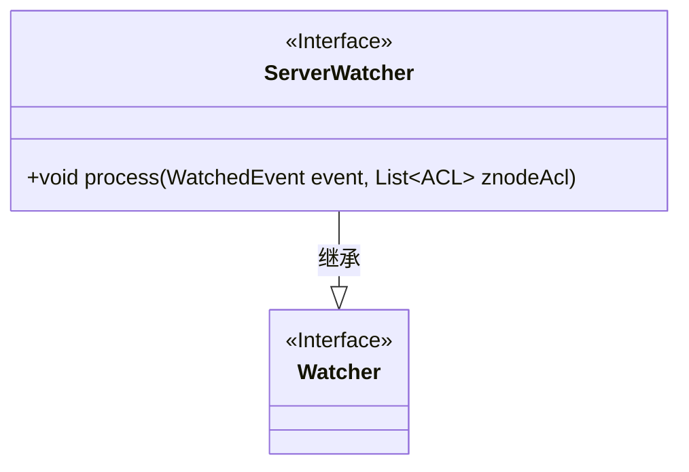
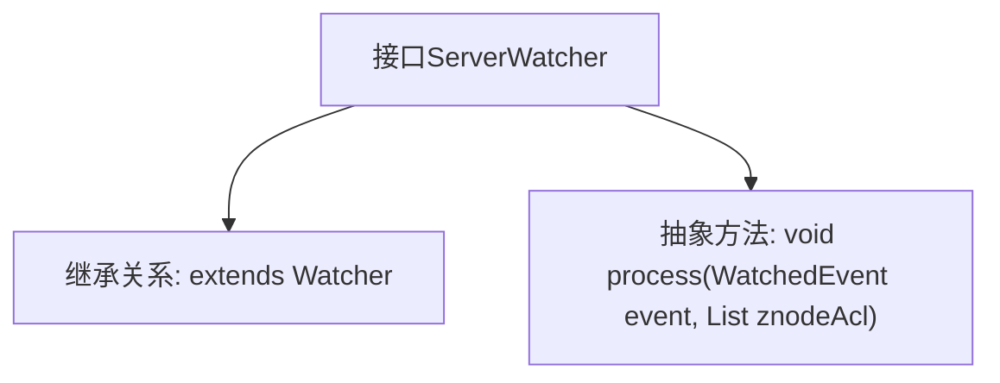

# 基础信息

|      |      |
|------|------|
| 名称 | ServerWatcher |
| 编码语言 | .java |
| 代码路径 | zookeeper/zookeeper-server/src/main/java/org/apache/zookeeper/server/ServerWatcher.java |
| 包名 | org.apache.zookeeper.server |
| 依赖项 | ['java.util.List', 'org.apache.zookeeper.WatchedEvent', 'org.apache.zookeeper.Watcher', 'org.apache.zookeeper.data.ACL'] |
| 概述说明 | 接口ServerWatcher扩展Watcher，定义方法process，接收WatchedEvent和ACL列表参数。 |

# 说明

该内容定义了一个名为ServerWatcher的公共接口，继承自Watcher接口。该接口包含一个方法process，接受两个参数：WatchedEvent类型的event和List<ACL>类型的znodeAcl。方法无返回值，用于处理监视事件和节点访问控制列表。

# 类列表 Class Summary

| 名称   | 类型  | 说明 |
|-------|------|-------------|
| ServerWatcher | interface | 接口ServerWatcher扩展Watcher，定义方法process，接收WatchedEvent和ACL列表参数。 |

## 类 ServerWatcher

|      |      |
|------|------|
| 访问范围 | public |
| 类型 | interface |
| 名称 | ServerWatcher |
| 说明 | 接口ServerWatcher扩展Watcher，定义方法process，接收WatchedEvent和ACL列表参数。 |

### UML类图

这段代码定义了一个ServerWatcher接口，该接口继承自Watcher接口。ServerWatcher接口包含一个process方法，该方法接收WatchedEvent事件对象和一个ACL列表作为参数，用于处理服务器相关的事件通知。类图清晰地展示了接口间的继承关系，其中ServerWatcher作为子接口扩展了父接口Watcher的功能，特别添加了针对ZooKeeper节点ACL权限列表的处理能力。

### 内部方法调用关系图

该流程图展示了ServerWatcher接口的结构，它继承自Watcher接口并定义了一个process抽象方法。process方法接收WatchedEvent事件对象和ACL列表作为参数，用于处理服务器监控事件。这种设计模式常见于ZooKeeper等分布式系统的回调机制，通过接口强制实现类定义事件处理逻辑，同时保留Watcher接口的原有功能扩展性。

### 字段列表 Field List

| 名称  | 类型  | 说明 |
|-------|-------|------|

### 方法列表 Method List

| 名称  | 类型  | 说明 |
|-------|-------|------|
| process | void | 
处理WatchedEvent事件和znode的ACL列表。 |

