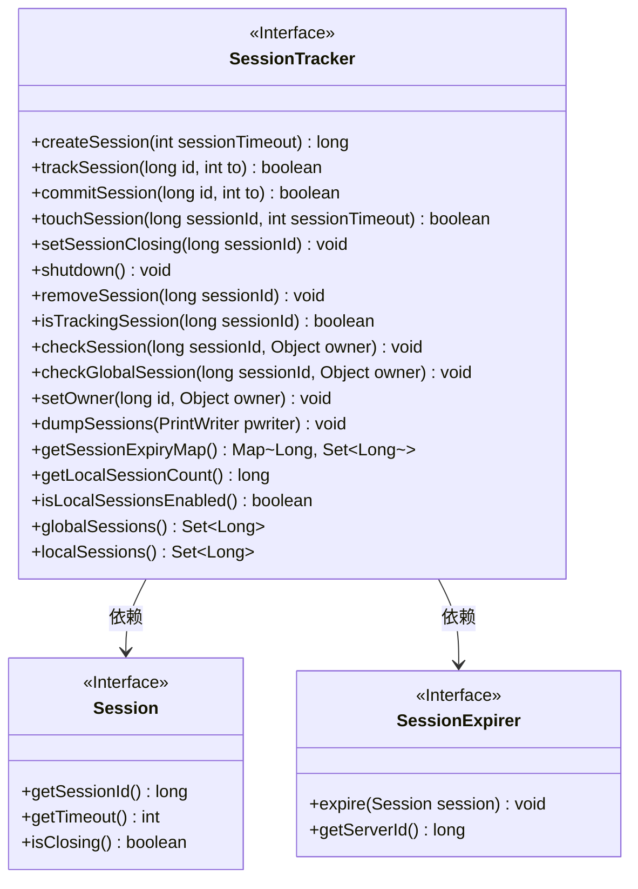

# 基础信息

|      |      |
|------|------|
| 名称 | SessionTracker |
| 编码语言 | .java |
| 代码路径 | zookeeper/zookeeper-server/src/main/java/org/apache/zookeeper/server/SessionTracker.java |
| 包名 | org.apache.zookeeper.server |
| 依赖项 | ['java.io.PrintWriter', 'java.util.Map', 'java.util.Set', 'org.apache.zookeeper.KeeperException', 'org.apache.zookeeper.KeeperException.SessionExpiredException'] |
| 概述说明 | SessionTracker接口用于管理会话，包括创建、跟踪、提交、关闭和检查会话状态，支持本地和全局会话，提供会话超时和所有权设置功能。 |

# 说明

SessionTracker接口定义了会话跟踪功能，包含会话创建、跟踪、提交、触摸、关闭和移除等操作。Session接口提供会话ID、超时时间和关闭状态查询。SessionExpirer接口处理会话过期和服务器ID获取。支持本地和全局会话管理，包括会话状态检查、所有者设置、会话信息转储和过期时间映射查询。还提供会话计数、启用状态检查及会话ID集合获取功能。异常处理包括会话过期、移动和未知会话等情况。

# 类列表 Class Summary

| 名称   | 类型  | 说明 |
|-------|------|-------------|
| SessionTracker | interface | SessionTracker接口用于管理会话，包括创建、跟踪、提交、关闭和检查会话状态，支持本地和全局会话，提供会话超时和所有权管理功能。 |

## 类 SessionTracker

|      |      |
|------|------|
| 访问范围 | public |
| 类型 | interface |
| 名称 | SessionTracker |
| 说明 | SessionTracker接口用于管理会话，包括创建、跟踪、提交、关闭和检查会话状态，支持本地和全局会话，提供会话超时和所有权管理功能。 |

### UML类图

这段类图描述了ZooKeeper中的会话跟踪机制。SessionTracker接口定义了会话管理的核心功能，包括创建/跟踪/提交会话、检查会话状态、设置所有者等操作。它依赖于两个嵌套接口：Session表示会话的基本信息（ID/超时/关闭状态），SessionExpirer处理会话过期逻辑。该设计支持本地和全局会话管理，提供会话状态检查、过期映射和调试信息输出等功能，是ZooKeeper集群会话管理的核心抽象。

### 内部方法调用关系图

```mermaid
graph TD
    A["接口SessionTracker"]
    B["嵌套接口Session"]
    C["嵌套接口SessionExpirer"]
    D["方法: long createSession(int sessionTimeout)"]
    E["方法: boolean trackSession(long id, int to)"]
    F["方法: boolean commitSession(long id, int to)"]
    G["方法: boolean touchSession(long sessionId, int sessionTimeout)"]
    H["方法: void setSessionClosing(long sessionId)"]
    I["方法: void shutdown()"]
    J["方法: void removeSession(long sessionId)"]
    K["方法: boolean isTrackingSession(long sessionId)"]
    L["方法: void checkSession(long sessionId, Object owner)"]
    M["方法: void checkGlobalSession(long sessionId, Object owner)"]
    N["方法: void setOwner(long id, Object owner)"]
    O["方法: void dumpSessions(PrintWriter pwriter)"]
    P["方法: Map<Long, Set<Long>> getSessionExpiryMap()"]
    Q["方法: long getLocalSessionCount()"]
    R["方法: boolean isLocalSessionsEnabled()"]
    S["方法: Set<Long> globalSessions()"]
    T["方法: Set<Long> localSessions()"]

    A --> B
    A --> C
    A --> D
    A --> E
    A --> F
    A --> G
    A --> H
    A --> I
    A --> J
    A --> K
    A --> L
    A --> M
    A --> N
    A --> O
    A --> P
    A --> Q
    A --> R
    A --> S
    A --> T

    B --> B1["方法: long getSessionId()"]
    B --> B2["方法: int getTimeout()"]
    B --> B3["方法: boolean isClosing()"]

    C --> C1["方法: void expire(Session session)"]
    C --> C2["方法: long getServerId()"]
```

该流程图展示了SessionTracker接口及其嵌套接口Session和SessionExpirer的完整结构。SessionTracker定义了会话管理的核心功能，包括创建/跟踪/提交会话、会话状态检查、过期处理等18个关键方法。嵌套接口Session提供会话元数据访问，SessionExpirer处理会话过期逻辑。图中清晰呈现了接口间的层级关系和方法调用路径，反映了ZooKeeper会话管理系统的核心架构设计。

### 字段列表 Field List

| 名称  | 类型  | 说明 |
|-------|-------|------|

### 方法列表 Method List

| 名称  | 类型  | 说明 |
|-------|-------|------|
| setSessionClosing | void | 设置会话关闭时间，参数为会话ID。 |
| touchSession | boolean | 方法touchSession用于更新会话有效期，参数为会话ID和超时时间，返回布尔值表示操作是否成功。 |
| checkGlobalSession | void | 检查全局会话有效性，参数为会话ID和所有者，可能抛出会话过期或转移异常。 |
| commitSession | boolean | 函数commitSession提交会话，参数为长整型id和整型to，返回布尔值。 |
| trackSession | boolean | 函数trackSession接收长整型id和整型to参数，返回布尔值，用于追踪会话状态。 |
| isTrackingSession | boolean | 检查指定会话ID是否被追踪。 |
| getLocalSessionCount | long | 获取本地会话数量的长整型方法。 |
| removeSession | void | 删除指定ID的会话。 |
| checkSession | void | 检查会话有效性，可能抛出会话过期、转移或未知异常。 |
| dumpSessions | void | 函数dumpSessions将当前会话数据输出到指定的PrintWriter对象。 |
| createSession | long | 创建会话，设置超时时间并返回会话ID。 |
| shutdown | void | 关闭系统或终止程序运行。 |
| setOwner | void | 设置对象所有者，参数为ID和所有者对象，可能抛出会话过期异常。 |
| getSessionExpiryMap | Map<Long, Set<Long>> | 获取会话过期映射，键为长整型，值为长整型集合。 |
| isLocalSessionsEnabled | boolean | 检查是否启用本地会话功能。 |
| globalSessions | Set<Long> | 这是一个返回长整型集合的方法，用于获取全局会话信息。 |
| localSessions | Set<Long> | 返回本地会话的唯一标识符集合。 |

