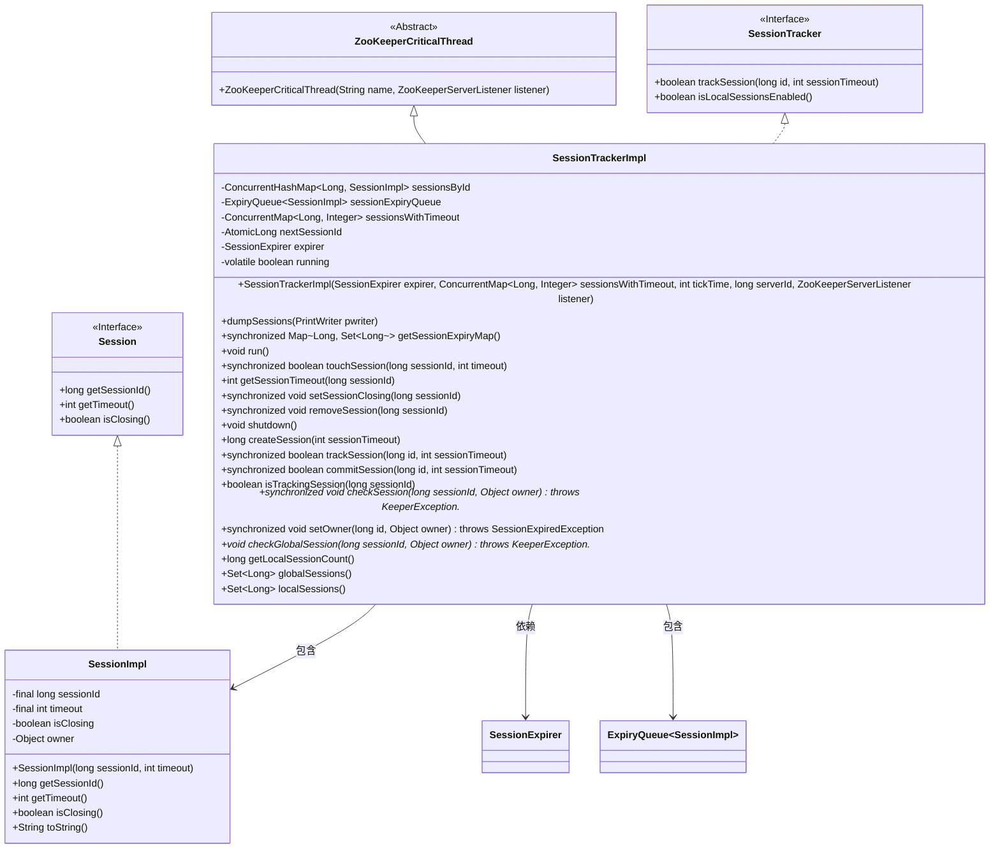
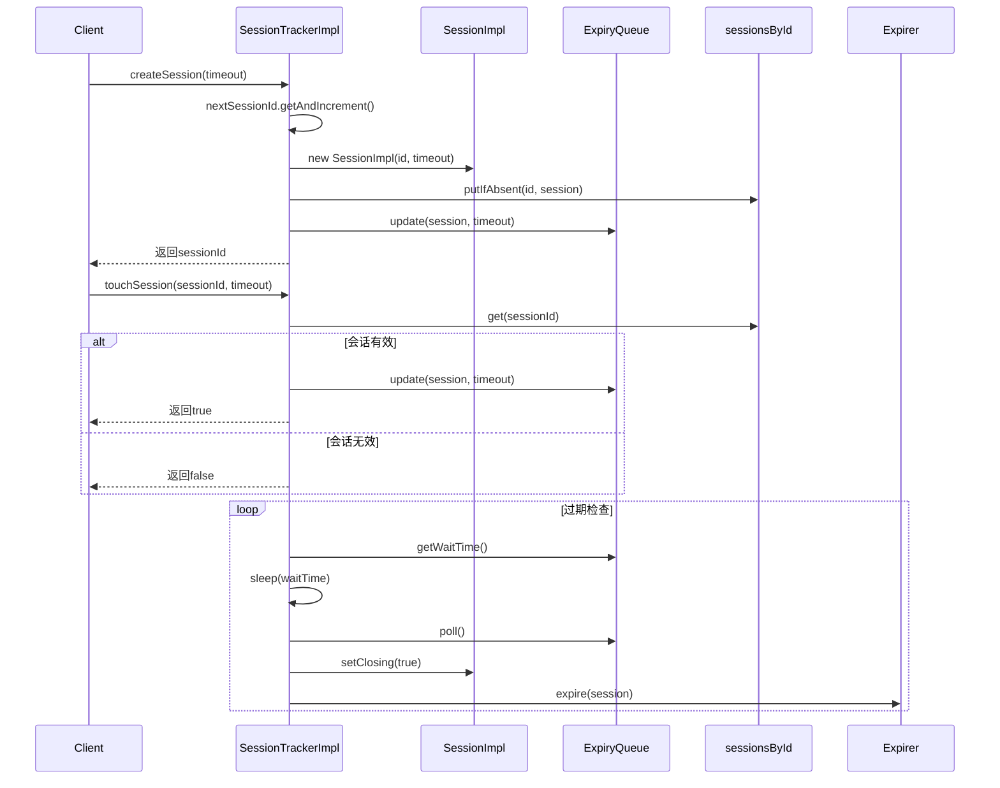

# 基础信息

|      |      |
|------|------|
| 名称 | SessionTrackerImpl |
| 编码语言 | .java |
| 代码路径 | zookeeper/zookeeper-server/src/main/java/org/apache/zookeeper/server/SessionTrackerImpl.java |
| 包名 | org.apache.zookeeper.server |
| 依赖项 | ['java.io.PrintWriter', 'java.io.StringWriter', 'java.text.MessageFormat', 'java.util.Collections', 'java.util.HashSet', 'java.util.Map', 'java.util.Map.Entry', 'java.util.Set', 'java.util.TreeMap', 'java.util.concurrent.ConcurrentHashMap', 'java.util.concurrent.ConcurrentMap', 'java.util.concurrent.atomic.AtomicLong', 'org.apache.zookeeper.KeeperException', 'org.apache.zookeeper.KeeperException.SessionExpiredException', 'org.apache.zookeeper.common.Time', 'org.slf4j.Logger', 'org.slf4j.LoggerFactory'] |
| 概述说明 | SessionTrackerImpl是ZooKeeper的会话跟踪实现，管理会话生命周期，包括创建、更新、过期和移除。使用ConcurrentHashMap存储会话，ExpiryQueue处理过期。支持会话ID生成、超时设置和状态检查。 |

# 说明

SessionTrackerImpl是ZooKeeperCriticalThread的子类，负责管理会话生命周期。核心功能包括会话创建、跟踪、过期处理和状态维护。使用ConcurrentHashMap存储会话数据，ExpiryQueue管理过期时间。提供touchSession更新会话活跃状态，removeSession删除会话，checkSession验证会话有效性。会话ID由服务器ID和时间戳生成，确保唯一性。支持全局会话管理，但不支持本地会话。通过同步方法确保线程安全，并集成日志和监控指标。

# 类列表 Class Summary

| 名称   | 类型  | 说明 |
|-------|------|-------------|
| SessionTrackerImpl | class | SessionTrackerImpl是ZooKeeper的会话跟踪实现，管理会话生命周期，包括创建、更新、过期和移除。使用ConcurrentHashMap存储会话，ExpiryQueue处理过期，支持会话超时和所有者检查。 |

## 类 SessionTrackerImpl

|      |      |
|------|------|
| 访问范围 | public |
| 类型 | class |
| 名称 | SessionTrackerImpl |
| 说明 | SessionTrackerImpl是ZooKeeper的会话跟踪实现，管理会话生命周期，包括创建、更新、过期和移除。使用ConcurrentHashMap存储会话，ExpiryQueue处理过期，支持会话超时和所有者检查。 |

### UML类图

这段代码实现了一个ZooKeeper会话跟踪器，主要功能包括会话创建、维护、过期检测和清理。SessionTrackerImpl继承自ZooKeeperCriticalThread并实现了SessionTracker接口，使用ConcurrentHashMap存储会话，ExpiryQueue管理会话过期。它通过原子操作生成会话ID，提供会话状态检查、触摸（续约）、关闭等功能，同时支持会话过期回调。内部类SessionImpl表示具体会话实例，包含会话ID、超时时间和状态标志。整个设计采用线程安全的数据结构，确保在多线程环境下的正确性。

### 内部方法调用关系图

```mermaid
graph TD
    A["类SessionTrackerImpl"]
    B["属性: ConcurrentHashMap<Long, SessionImpl> sessionsById"]
    C["属性: ExpiryQueue<SessionImpl> sessionExpiryQueue"]
    D["属性: ConcurrentMap<Long, Integer> sessionsWithTimeout"]
    E["属性: AtomicLong nextSessionId"]
    F["内部类: SessionImpl"]
    G["构造方法: SessionTrackerImpl"]
    H["关键方法: run"]
    I["关键方法: touchSession"]
    J["关键方法: trackSession"]
    K["关键方法: removeSession"]
    L["关键方法: createSession"]
    M["关键方法: checkSession"]

    A --> B
    A --> C
    A --> D
    A --> E
    A --> F
    A --> G
    A --> H
    A --> I
    A --> J
    A --> K
    A --> L
    A --> M

    F --> N["属性: long sessionId"]
    F --> O["属性: int timeout"]
    F --> P["属性: boolean isClosing"]
    F --> Q["方法: getSessionId"]
    F --> R["方法: getTimeout"]
    F --> S["方法: isClosing"]

    H --> T["循环检查会话过期"]
    H --> U["调用expirer.expire"]
    I --> V["验证会话有效性"]
    I --> W["更新会话过期时间"]
    J --> X["创建/更新会话记录"]
    K --> Y["清理会话数据"]
    L --> Z["生成新会话ID"]
    M --> AA["验证会话状态"]
```

这段代码实现了一个ZooKeeper会话跟踪系统，核心功能包括会话生命周期管理、过期检测和状态维护。流程图展示了类结构和主要方法调用关系，时序图则具体描述了会话创建、心跳更新和过期处理的交互过程。系统通过ConcurrentHashMap存储活动会话，ExpiryQueue管理过期队列，采用原子操作生成会话ID，并提供了线程安全的会话状态检查机制，能够高效处理数千个并发会话的跟踪需求。

### 字段列表 Field List

| 名称  | 类型  | 说明 |
|-------|-------|------|
| running = true | boolean | 声明一个易变的布尔变量running，初始值为true。 |
| nextSessionId = new AtomicLong() | AtomicLong | 私有原子长整型变量nextSessionId，用于生成唯一会话ID。 |
| sessionsWithTimeout | ConcurrentMap<Long, Integer> | 保护型并发映射，键为长整型，值为整型，存储会话及超时时间。 |
| LOG = LoggerFactory.getLogger(SessionTrackerImpl.class) | Logger | 类SessionTrackerImpl中定义了一个私有静态常量LOG，用于记录日志。 |
| sessionsById = new ConcurrentHashMap<>() | ConcurrentHashMap<Long, SessionImpl> | 保护型并发哈希映射，键为长整型，值为SessionImpl对象，用于线程安全存储会话。 |
| sessionExpiryQueue | ExpiryQueue<SessionImpl> | 私有最终过期队列，用于管理SessionImpl会话的过期处理。 |
| expirer | SessionExpirer | 私有不可变的会话过期器实例。 |

### 方法列表 Method List

| 名称  | 类型  | 说明 |
|-------|-------|------|
| getLocalSessionCount | long | 该方法返回本地会话数量，当前固定返回0。 |
| touchSession | boolean | 同步方法touchSession更新会话有效期，若会话不存在或关闭返回false，否则更新并返回true。 |
| createSession | long | 创建会话方法：生成唯一ID，跟踪会话超时并返回ID。 |
| isLocalSessionsEnabled | boolean | Java方法重写，禁用本地会话，返回false。 |
| setOwner | void | 同步方法`setOwner`用于设置会话所有者，检查会话存在且未关闭，否则抛出`SessionExpiredException`。参数为ID和所有者对象。 |
| logTraceTouchInvalidSession | void | 方法logTraceTouchInvalidSession记录无效会话的跟踪信息，调用logTraceTouchSession并传入会话ID、超时时间和"invalid"标记。 |
| getSessionTimeout | int | 获取指定会话ID的超时时间，返回对应值。 |
| updateSessionExpiry | void | 更新会话过期时间：记录日志并调整会话队列中的超时设置。 |
| run | void | 线程循环检查会话过期队列，等待到期后处理过期会话并触发清理，异常时记录日志。 |
| dumpSessions | void | 方法dumpSessions将"Session "和sessionExpiryQueue内容输出到PrintWriter。 |
| commitSession | boolean | 同步方法commitSession接收会话ID和超时时间，将ID和超时存入映射，返回是否新增记录。 |
| setSessionClosing | void | 同步方法setSessionClosing设置会话关闭状态，记录日志并标记指定ID会话为关闭中。若会话不存在则直接返回。 |
| removeSession | void | 同步方法removeSession移除指定ID的会话，从sessionsById和sessionsWithTimeout中删除记录，若存在则从sessionExpiryQueue移除，并记录日志。 |
| shutdown | void | 方法shutdown用于停止运行，设置running为false，并记录日志信息。 |
| getSessionExpiryMap | Map<Long, Set<Long>> | 同步方法getSessionExpiryMap将时间到会话的映射转换为时间到会话ID的映射，返回TreeMap结构。 |
| isTrackingSession | boolean | 检查会话ID是否存在。 |
| checkSession | void | 检查会话状态：根据sessionId获取会话，若不存在、已关闭或所有者不匹配则抛出对应异常；否则更新所有者。 |
| trackSession | boolean | 同步方法跟踪会话，若不存在则创建并记录日志，更新过期时间，返回是否新增。 |
| logTraceTouchClosingSession | void | 记录跟踪触摸关闭会话，调用logTraceTouchSession方法，参数为会话ID、超时时间和"closing "字符串。 |
| checkGlobalSession | void | 检查全局会话，验证会话ID和所有者。若会话未知则抛出过期异常。 |
| toString | String | 重写toString方法，使用StringWriter和PrintWriter输出会话信息，返回字符串结果。 |
| logTraceTouchSession | void | 记录跟踪会话触摸信息，包括会话ID、超时时间和状态，用于调试。 |
| initializeNextSessionId | long | 静态方法通过时间戳左移24位无符号右移8位生成基础ID，再与输入ID左移56位的结果进行或运算合成最终会话ID。若结果等于特定常量则自增1以避免冲突。返回合成后的ID。 |
| globalSessions | Set<Long> | 该方法返回全局会话ID集合，直接获取sessionsById的键集。 |
| localSessions | Set<Long> | 该方法返回一个空的Long类型Set集合，表示当前没有本地会话。 |

