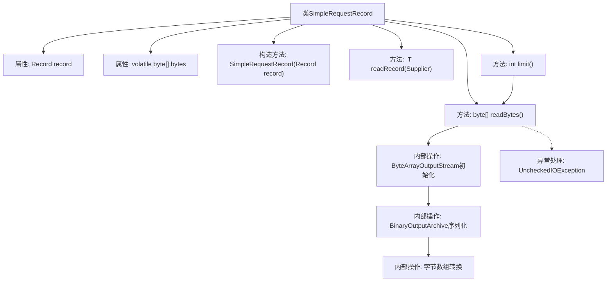

# 基础信息

|      |      |
|------|------|
| 名称 | SimpleRequestRecord |
| 编码语言 | .java |
| 代码路径 | zookeeper/zookeeper-server/src/main/java/org/apache/zookeeper/server/SimpleRequestRecord.java |
| 包名 | org.apache.zookeeper.server |
| 依赖项 | ['edu.umd.cs.findbugs.annotations.SuppressFBWarnings', 'java.io.ByteArrayOutputStream', 'java.io.IOException', 'java.io.UncheckedIOException', 'java.nio.ByteBuffer', 'java.util.function.Supplier', 'org.apache.jute.BinaryOutputArchive', 'org.apache.jute.Record'] |
| 概述说明 | SimpleRequestRecord类实现了RequestRecord接口，封装Record对象并提供读取记录、字节数组及限制大小的方法。通过序列化Record生成字节数组，处理IO异常并返回结果。 |

# 说明

SimpleRequestRecord类实现了RequestRecord接口，用于处理请求记录。它包含一个Record类型的私有字段record和一个volatile修饰的字节数组bytes。构造函数接收Record对象初始化。提供了三个方法：readRecord方法通过构造器参数返回泛型记录；readBytes方法将记录序列化为字节数组并缓存，处理IO异常；limit方法返回字节数组的缓冲区限制。类中使用了注解抑制警告，并处理了潜在的IO异常。

# 类列表 Class Summary

| 名称   | 类型  | 说明 |
|-------|------|-------------|
| SimpleRequestRecord | class | SimpleRequestRecord类实现RequestRecord接口，封装Record对象并提供读取方法。readRecord直接返回原始Record，readBytes将Record序列化为字节数组并缓存，limit返回字节数组的缓冲区限制。 |


## 类 SimpleRequestRecord

|      |      |
|------|------|
| 访问范围 | public |
| 类型 | class |
| 名称 | SimpleRequestRecord |
| 说明 | SimpleRequestRecord类实现RequestRecord接口，封装Record对象并提供读取方法。readRecord直接返回原始Record，readBytes将Record序列化为字节数组并缓存，limit返回字节数组的缓冲区限制。 |


### UML类图

```mermaid
classDiagram
    class SimpleRequestRecord {
        -Record record
        -volatile byte[] bytes
        +SimpleRequestRecord(Record record)
        +~T~ readRecord(Supplier~T~ constructor) ~T~
        +byte[] readBytes()
        +int limit()
        <<Interface>> {
            +~T~ readRecord(Supplier~T~ constructor) ~T~
            +byte[] readBytes()
            +int limit()
        }
    }

    class Record {
        +serialize(BinaryOutputArchive boa, String request)
    }

    class BinaryOutputArchive {
        +static getArchive(ByteArrayOutputStream baos)
    }

    class ByteArrayOutputStream {
        +ByteArrayOutputStream(int size)
        +toByteArray() byte[]
    }

    class ByteBuffer {
        +static wrap(byte[] bytes) ByteBuffer
        +limit() int
    }

    SimpleRequestRecord --> Record : 包含
    SimpleRequestRecord --> BinaryOutputArchive : 使用
    SimpleRequestRecord --> ByteArrayOutputStream : 使用
    SimpleRequestRecord --> ByteBuffer : 使用
```

这段代码展示了一个实现`RequestRecord`接口的`SimpleRequestRecord`类，主要用于处理记录数据的序列化和字节操作。类中包含核心的`Record`对象和字节数组缓存，通过`readBytes()`方法将记录序列化为字节数组，并使用`ByteBuffer`计算数据限制。接口定义了泛型读取、字节读取和限制检查三个核心方法，类与多个工具类（如二进制归档和字节缓冲）存在明确的依赖关系。


### 内部方法调用关系图



流程图展示了SimpleRequestRecord类的核心结构和数据流。该类封装了Record对象的序列化操作，通过readBytes()方法实现懒加载的字节数组转换，使用BinaryOutputArchive进行序列化并缓存结果。limit()方法依赖readBytes()获取缓冲区的限制值，整个过程包含异常处理逻辑。类设计体现了线程安全（volatile缓存）和资源管理（try-with-resources）的最佳实践。

### 字段列表 Field List

| 名称  | 类型  | 说明 |
|-------|-------|------|
| bytes | byte[] | 私有可变字节数组，使用volatile确保线程可见性。 |
| record | Record | 私有不可变的Record类型变量record。 |

### 方法列表 Method List

| 名称  | 类型  | 说明 |
|-------|-------|------|
| limit | int | 重写limit方法，读取字节数组后通过ByteBuffer返回其限制值。 |
| readBytes | byte[] | 方法读取字节数据，若缓存存在直接返回，否则序列化记录到字节数组并缓存。异常时抛出未检查IO异常。 |
| readRecord | T | 方法重写，使用泛型读取记录，返回指定类型实例。 |


