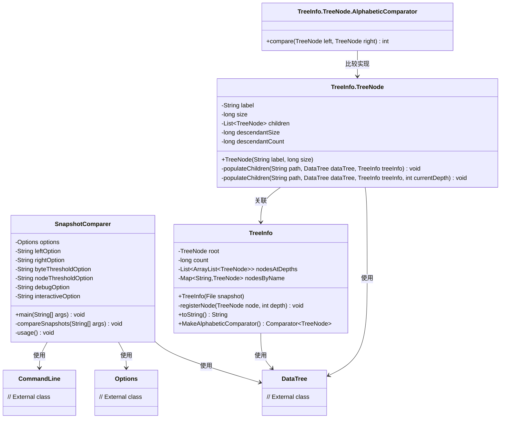
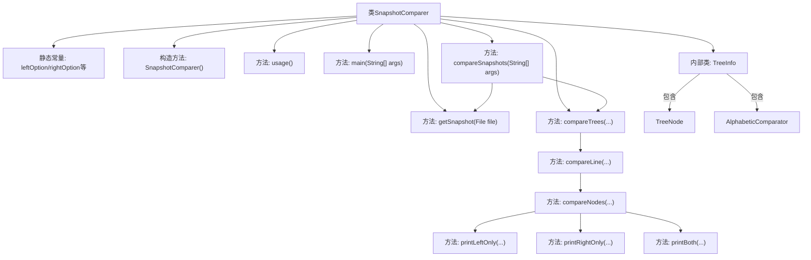
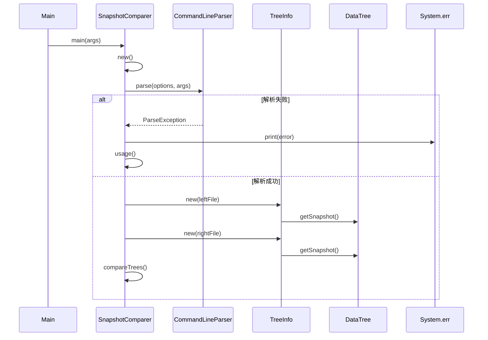

# 基础信息

|      |      |
|------|------|
| 名称 | SnapshotComparer |
| 编码语言 | .java |
| 代码路径 | zookeeper/zookeeper-server/src/main/java/org/apache/zookeeper/server/SnapshotComparer.java |
| 包名 | org.apache.zookeeper.server |
| 依赖项 | ['java.io.File', 'java.io.Serializable', 'java.util.ArrayList', 'java.util.Collections', 'java.util.Comparator', 'java.util.HashMap', 'java.util.List', 'java.util.Map', 'java.util.Scanner', 'java.util.zip.CheckedInputStream', 'org.apache.commons.cli.CommandLine', 'org.apache.commons.cli.DefaultParser', 'org.apache.commons.cli.HelpFormatter', 'org.apache.commons.cli.Option', 'org.apache.commons.cli.Options', 'org.apache.commons.cli.ParseException', 'org.apache.jute.BinaryInputArchive', 'org.apache.jute.InputArchive', 'org.apache.zookeeper.server.persistence.FileSnap', 'org.apache.zookeeper.server.persistence.SnapStream', 'org.apache.zookeeper.util.ServiceUtils'] |
| 概述说明 | SnapshotComparer类用于比较两个Zookeeper快照文件，支持字节和节点数阈值过滤，提供交互式或批量分析模式，输出差异节点信息。 |

# 说明

SnapshotComparer是一个用于比较Zookeeper快照文件的Java工具类。它通过命令行参数接收左右两个快照文件路径，以及字节和节点数的比较阈值。核心功能包括：解析快照文件构建树形结构，按深度或路径比较节点差异，支持交互式操作和调试输出。比较时会计算每个节点的子节点总数和总字节大小，输出超过阈值的差异节点。工具提供两种模式：自动遍历所有深度或交互式逐层查看。树节点信息包含标签、大小、子节点列表及后代统计。快照解析使用Zookeeper的FileSnap类，性能数据会被记录。

# 类列表 Class Summary

| 名称   | 类型  | 说明 |
|-------|------|-------------|
| SnapshotComparer | class | SnapshotComparer类用于比较两个Zookeeper快照文件，支持字节和节点数阈值过滤，提供交互模式和调试输出。 |

## 类 SnapshotComparer

|      |      |
|------|------|
| 访问范围 | public |
| 类型 | class |
| 名称 | SnapshotComparer |
| 说明 | SnapshotComparer类用于比较两个Zookeeper快照文件，支持字节和节点数阈值过滤，提供交互模式和调试输出。 |

### UML类图

这段代码实现了一个Zookeeper快照比较工具SnapshotComparer，主要功能是通过命令行参数接收两个快照文件，比较它们的树形结构差异。核心类包括：SnapshotComparer（主控类）、TreeInfo（树结构分析类）及其内部类TreeNode（树节点）和AlphabeticComparator（排序比较器）。程序通过解析命令行参数、构建树结构、比较节点差异等步骤，输出字节大小或子节点数量超过阈值的差异节点。支持交互式模式和调试输出，适用于分析Zookeeper数据存储的结构变化。

### 内部方法调用关系图

该流程图展示了SnapshotComparer类的核心结构和调用关系，主要功能是解析命令行参数、加载Zookeeper快照文件并进行树结构差异比较。时序图详细描述了从main方法启动到完成树比较的完整流程，包括参数解析、快照文件加载和树比较三个关键阶段。类结构包含选项配置、树信息处理和差异分析三大模块，通过阈值控制输出差异显著的节点信息，支持交互式和批处理两种模式。

### 字段列表 Field List

| 名称  | 类型  | 说明 |
|-------|-------|------|
| debugOption = "debug" | String | 定义私有静态常量字符串debugOption，值为"debug"。 |
| leftOption = "left" | String | 定义私有静态常量字符串leftOption，值为"left"。 |
| options | Options | 私有不可变选项对象。 |
| byteThresholdOption = "bytes" | String | 定义私有静态常量字符串变量byteThresholdOption，值为"bytes"。 |
| interactiveOption = "interactive" | String | 私有静态常量字符串，值为"interactive"。 |
| nodeThresholdOption = "nodes" | String | 定义私有静态常量字符串nodeThresholdOption，值为"nodes"。 |
| rightOption = "right" | String | 私有静态常量字符串rightOption值为"right"。 |

### 方法列表 Method List

| 名称  | 类型  | 说明 |
|-------|-------|------|
| printNode | void | 静态方法printNode输出节点的后代大小和数量，格式为"Descendant size: X. Descendant count: Y"。 |
| printLeftOnly | void | 方法printLeftOnly检查节点大小或数量是否超过阈值，若超过则输出节点信息，否则在调试或交互模式下输出过滤信息。 |
| main | void | Java主方法，创建SnapshotComparer实例并调用compareSnapshots方法处理参数。 |
| compareNodes | void | 比较两个树节点列表，按字母顺序排序后逐个对比标签，输出差异或相同信息，支持调试和交互模式。 |
| compareLine | void | 比较左右树指定深度的节点列表，若深度超出范围则用空列表，最后调用节点比较方法。 |
| compareTrees | void | 比较两棵树结构的方法，支持非交互式逐层对比和交互式深度跳转或节点路径分析，输出各层或指定节点的差异信息。 |
| getSnapshot | DataTree | 从文件反序列化数据树并记录耗时。创建DataTree和会话映射，读取输入流，测量反序列化时间，最后返回数据树。 |
| compareSubtree | void | 比较左右子树节点，若路径不存在则提示，否则调用compareNodes比较子节点列表。 |
| printRightOnly | void | 方法printRightOnly检查节点大小或数量是否超过阈值，若超过则输出节点信息；否则在调试或交互模式下输出过滤信息。 |
| printThresholdInfo | void | 打印节点差异分析条件：字节差超过设定值或节点数差超过设定值。 |
| printBoth | void | 静态方法printBoth比较两树节点差异，若字节或子节点数超过阈值则输出差异，否则在调试或交互模式下输出过滤信息。 |
| usage | void | 该代码定义了一个私有方法usage，使用HelpFormatter打印帮助信息，包括类路径和选项说明。 |
| compareSnapshots | void | 比较两个文件快照的方法，解析命令行参数，处理异常，提取左右文件路径、字节和节点阈值，调试和交互标志，输出解析成功信息，创建并打印树信息，最后比较两棵树。 |

