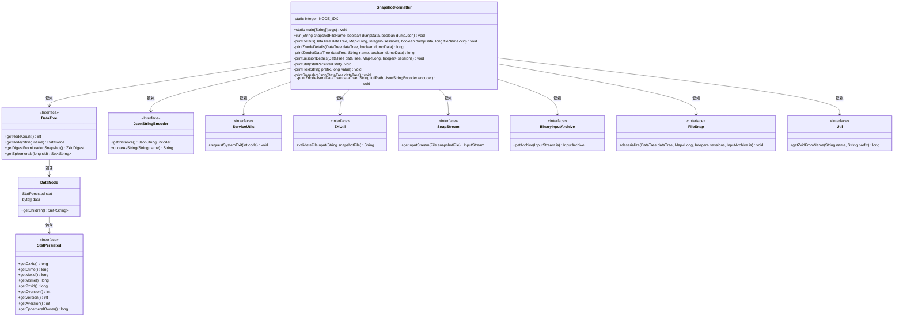
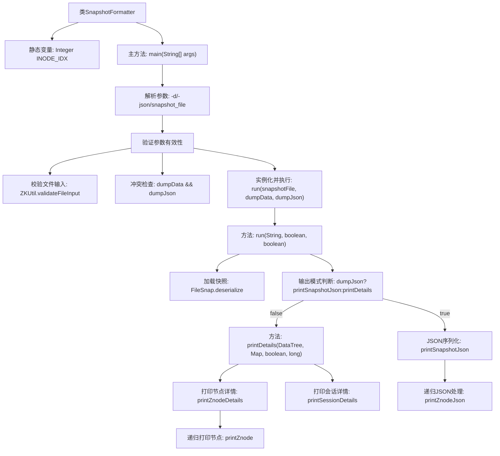

# 基础信息

|      |      |
|------|------|
| 名称 | SnapshotFormatter |
| 编码语言 | .java |
| 代码路径 | zookeeper/zookeeper-server/src/main/java/org/apache/zookeeper/server/SnapshotFormatter.java |
| 包名 | org.apache.zookeeper.server |
| 依赖项 | ['org.apache.zookeeper.server.persistence.FileSnap.SNAPSHOT_FILE_PREFIX', 'com.fasterxml.jackson.core.io.JsonStringEncoder', 'java.io.File', 'java.io.IOException', 'java.io.InputStream', 'java.util.Base64', 'java.util.Date', 'java.util.HashMap', 'java.util.Map', 'java.util.Set', 'org.apache.jute.BinaryInputArchive', 'org.apache.jute.InputArchive', 'org.apache.yetus.audience.InterfaceAudience', 'org.apache.zookeeper.ZKUtil', 'org.apache.zookeeper.data.StatPersisted', 'org.apache.zookeeper.server.persistence.FileSnap', 'org.apache.zookeeper.server.persistence.SnapStream', 'org.apache.zookeeper.server.persistence.Util', 'org.apache.zookeeper.util.ServiceUtils'] |
| 概述说明 | SnapshotFormatter类用于处理ZooKeeper快照文件，支持命令行参数-d和-json分别输出节点数据和JSON格式信息，包含节点详情、会话统计及数据校验功能。 |

# 说明

SnapshotFormatter是一个公开类，用于处理ZooKeeper快照文件。它支持命令行参数-d（转储节点数据）和-json（JSON格式输出）。主方法验证输入参数和文件有效性，防止同时使用-d和-json。核心功能通过run方法实现：读取快照文件，反序列化数据树和会话信息，根据参数选择输出格式。printDetails方法输出节点详情（包括zxid、会话数据等），printSnapshotJson方法生成JSON格式的节点树结构。工具会校验文件有效性，并在参数错误时退出。输出包含节点统计信息、会话详情及数据摘要。

# 类列表 Class Summary

| 名称   | 类型  | 说明 |
|-------|------|-------------|
| SnapshotFormatter | class | SnapshotFormatter类用于解析ZooKeeper快照文件，支持命令行参数-d和-json分别输出节点数据和JSON格式信息。 |

## 类 SnapshotFormatter

|      |      |
|------|------|
| 访问范围 | @InterfaceAudience.Public;public |
| 类型 | class |
| 名称 | SnapshotFormatter |
| 说明 | SnapshotFormatter类用于解析ZooKeeper快照文件，支持命令行参数-d和-json分别输出节点数据和JSON格式信息。 |

### UML类图

这段代码定义了一个SnapshotFormatter类，用于处理ZooKeeper快照文件的格式化输出。该类提供了两种输出模式：详细文本格式和JSON格式，支持数据转储选项。主要功能包括验证输入文件、解析快照数据、遍历数据树结构并生成相应格式的输出。类图中展示了与多个工具类和接口的依赖关系，体现了模块化设计思想。核心数据结构DataTree和DataNode用于存储和操作ZooKeeper节点数据，而各种工具类则提供了文件处理、序列化、格式转换等辅助功能。

### 内部方法调用关系图

该流程图展示了ZooKeeper快照格式化工具的核心处理流程。从参数解析开始，经过多重验证后进入数据处理阶段，根据参数选择JSON或详细模式输出。详细模式会递归遍历数据树打印节点和会话信息，JSON模式则构建嵌套的JSON结构。流程中特别处理了参数冲突检测、文件有效性校验等边界情况，并通过同步块保证线程安全，最终形成两种可选的标准化输出格式。

### 字段列表 Field List

| 名称  | 类型  | 说明 |
|-------|-------|------|
| INODE_IDX = 1000 | Integer | 私有静态整型变量INODE_IDX初始值为1000。 |

### 方法列表 Method List

| 名称  | 类型  | 说明 |
|-------|-------|------|
| printZnodeJson | void | 方法printZnodeJson从DataTree获取指定路径节点，若不存在则报错退出。生成包含名称、数据大小等信息的JSON字符串，处理子节点递归输出。 |
| printZnodeDetails | long | 方法打印ZNode详情，输出节点总数，遍历根节点并返回zxid。 |
| printDetails | void | 方法打印数据树详情：输出节点详情、会话信息，检查并显示目标zxid摘要，最后输出最大zxid值。 |
| printHex | void | 私有方法printHex接收前缀字符串和长整型值，按格式输出带0x前缀的16位十六进制值。 |
| printSessionDetails | void | 打印会话详情：输出会话ID、超时时间和临时节点数量，格式为16进制ID、超时值、临时节点数。 |
| main | void | Java程序解析命令行参数，支持-d和-json选项，验证输入文件后调用SnapshotFormatter处理快照文件，参数冲突或无效时退出。 |
| printZnode | long | 该方法递归打印ZooKeeper节点信息，包括节点名、状态、数据（或长度）及子节点，返回最大事务ID。同步块确保线程安全。 |
| run | void | 方法从快照文件读取数据，反序列化到DataTree和sessions映射。根据参数决定输出JSON格式或详细数据，包括文件名的ZXID信息。处理中自动管理输入流资源。 |
| printStat | void | 打印节点统计信息，包括创建/修改事务ID、时间戳、版本号及临时所有者。 |
| printSnapshotJson | void | 方法printSnapshotJson输出JSON格式快照，包含程序名、版本、时间戳及数据树内容。 |

