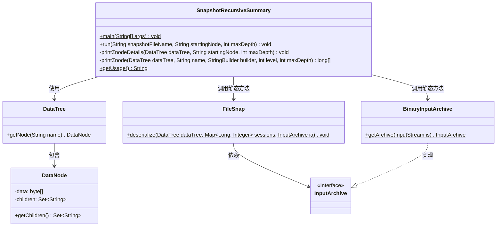
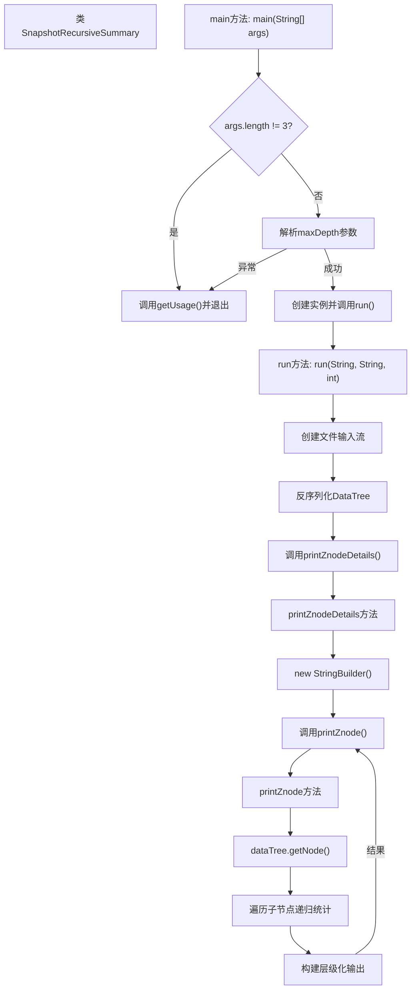

# 基础信息

|      |      |
|------|------|
| 名称 | SnapshotRecursiveSummary |
| 编码语言 | .java |
| 代码路径 | zookeeper/zookeeper-server/src/main/java/org/apache/zookeeper/server/SnapshotRecursiveSummary.java |
| 包名 | org.apache.zookeeper.server |
| 依赖项 | ['java.io.File', 'java.io.IOException', 'java.io.InputStream', 'java.util.Collections', 'java.util.HashMap', 'java.util.Map', 'java.util.Set', 'org.apache.jute.BinaryInputArchive', 'org.apache.jute.InputArchive', 'org.apache.yetus.audience.InterfaceAudience', 'org.apache.zookeeper.server.persistence.FileSnap', 'org.apache.zookeeper.server.persistence.SnapStream'] |
| 概述说明 | 公开类SnapshotRecursiveSummary用于递归统计Zookeeper快照数据。通过指定起始节点和最大深度，输出节点路径、子节点数和数据量。使用方式：SnapshotRecursiveSummary 快照文件 起始节点 最大深度。 |

# 说明

SnapshotRecursiveSummary是一个公开类，用于递归分析ZooKeeper快照文件中的节点数据。主方法接收三个参数：快照文件路径、起始节点路径和最大深度限制。程序首先验证参数有效性，然后读取快照文件并反序列化数据树结构。核心功能是递归遍历指定节点及其子节点，统计每个节点的子节点数量和数据总量。输出格式包含层级缩进，显示节点路径、子节点数和数据大小。最大深度参数控制输出详细程度，0表示无限制，1仅显示起始节点及其直接子节点。该工具不改变原始数据，仅用于分析计算。

# 类列表 Class Summary

| 名称   | 类型  | 说明 |
|-------|------|-------------|
| SnapshotRecursiveSummary | class | 公开类SnapshotRecursiveSummary用于递归统计Zookeeper快照数据。通过命令行参数指定快照文件、起始节点和最大深度，输出节点路径、子节点数量和数据总大小。深度参数控制输出详细程度，0表示无限制。 |

## 类 SnapshotRecursiveSummary

|      |      |
|------|------|
| 访问范围 | @InterfaceAudience.Public public |
| 类型 | class |
| 名称 | SnapshotRecursiveSummary |
| 说明 | 公开类SnapshotRecursiveSummary用于递归统计Zookeeper快照数据。通过命令行参数指定快照文件、起始节点和最大深度，输出节点路径、子节点数量和数据总大小。深度参数控制输出详细程度，0表示无限制。 |

### UML类图

这段代码实现了一个ZooKeeper快照递归统计工具，主要功能是分析ZooKeeper数据树的结构和存储数据量。核心类SnapshotRecursiveSummary通过main方法接收参数，调用run方法处理快照文件，使用DataTree和DataNode遍历节点树，printZnode方法递归计算子节点数量和总数据大小，并根据maxDepth参数控制输出层级。类图中清晰地展示了各组件间的依赖关系，包括文件反序列化、数据树操作和输出生成等关键流程。

### 内部方法调用关系图

流程图描述：该流程图展示了SnapshotRecursiveSummary类的主要执行流程。程序从main方法开始，首先验证参数有效性，然后解析深度参数并创建实例。run方法负责读取ZooKeeper快照文件并反序列化数据树，printZnodeDetails通过递归调用printZnode方法构建节点统计信息，最终输出格式化结果。整个过程包含严格的参数校验、文件操作和递归树遍历逻辑。

### 字段列表 Field List

| 名称  | 类型  | 说明 |
|-------|-------|------|

### 方法列表 Method List

| 名称  | 类型  | 说明 |
|-------|-------|------|
| run | void | 方法`run`读取快照文件，反序列化数据到`DataTree`和会话映射，然后打印指定起始节点及其子节点的详细信息，深度不超过`maxDepth`。处理中可能抛出`IOException`。 |
| printZnodeDetails | void | 递归打印ZooKeeper节点详情，从指定节点开始，限制最大深度，结果输出到控制台。 |
| printZnode | long[] | 方法printZnode递归遍历DataTree节点，统计子节点数和数据长度，按层级格式输出节点信息。同步访问节点数据确保线程安全。 |
| getUsage | String | 这是一个Java方法，返回工具使用说明。说明包含命令格式和三个参数：snapshot_file（Zookeeper快照路径）、starting_node（遍历起始节点路径）、max_depth（控制输出详细层级，0无限制）。仅影响显示，不影响计算。 |
| main | void | Java主方法检查参数数量及格式，若无效则打印用法并退出；有效时解析参数并执行递归快照汇总。 |

