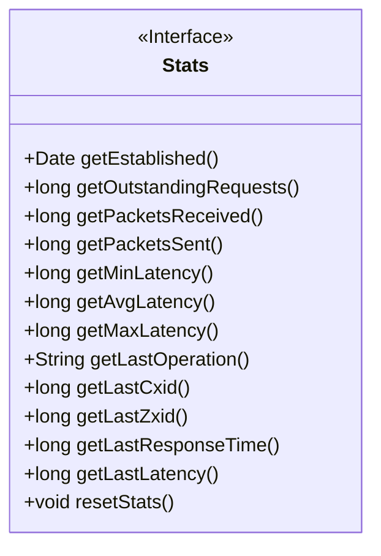

# 基础信息

|      |      |
|------|------|
| 名称 | Stats |
| 编码语言 | .java |
| 代码路径 | zookeeper/zookeeper-server/src/main/java/org/apache/zookeeper/server/Stats.java |
| 包名 | org.apache.zookeeper.server |
| 依赖项 | ['java.util.Date'] |
| 概述说明 | Stats接口提供连接统计信息，包括建立时间、请求数、收发包数、延迟数据、最后操作及响应时间等，支持重置计数器。 |

# 说明

Stats接口定义了连接统计信息，包含以下方法：获取连接建立时间、未响应请求数、收发数据包数、最小/平均/最大延迟、最后操作描述、最后cxid/zxid值、最后响应时间及延迟。提供重置统计计数器功能。部分方法自3.3.0版本引入。

# 类列表 Class Summary

| 名称   | 类型  | 说明 |
|-------|------|-------------|
| Stats | interface | Stats接口提供连接统计信息，包括建立时间、请求数、收发包数、延迟数据、最后操作及响应时间等，支持重置计数器。 |

## 类 Stats

|      |      |
|------|------|
| 访问范围 | None |
| 类型 | interface |
| 名称 | Stats |
| 说明 | Stats接口提供连接统计信息，包括建立时间、请求数、收发包数、延迟数据、最后操作及响应时间等，支持重置计数器。 |

### UML类图

这段代码定义了一个名为`Stats`的接口，该接口主要用于统计和监控连接相关的各项指标。接口包含多个方法，用于获取连接建立时间、未完成请求数、收发数据包数量、延迟统计（最小、平均、最大）、最后操作信息、最后事务ID、最后响应时间等数据，并提供了重置统计计数器的方法。所有方法均为公有抽象方法，需要由实现该接口的类具体实现。该接口设计适用于需要监控网络连接状态的场景，如分布式系统中的连接管理模块。

### 内部方法调用关系图

```mermaid
graph TD
    A["接口Stats"]
    B["方法: Date getEstablished()"]
    C["方法: long getOutstandingRequests()"]
    D["方法: long getPacketsReceived()"]
    E["方法: long getPacketsSent()"]
    F["方法: long getMinLatency()"]
    G["方法: long getAvgLatency()"]
    H["方法: long getMaxLatency()"]
    I["方法: String getLastOperation()"]
    J["方法: long getLastCxid()"]
    K["方法: long getLastZxid()"]
    L["方法: long getLastResponseTime()"]
    M["方法: long getLastLatency()"]
    N["方法: void resetStats()"]

    A --> B
    A --> C
    A --> D
    A --> E
    A --> F
    A --> G
    A --> H
    A --> I
    A --> J
    A --> K
    A --> L
    A --> M
    A --> N
```

这段代码定义了一个名为Stats的接口，该接口包含多个方法用于获取和重置连接统计信息。接口中的方法可以分为三类：获取连接基本信息（如建立时间、未完成请求数）、获取网络数据统计（如收发数据包数量）、获取性能指标（如延迟相关数据）。所有方法都是抽象方法，需要由实现该接口的类具体实现。resetStats()方法用于重置统计计数器，其他方法分别返回不同类型的连接状态数据。

### 字段列表 Field List

| 名称  | 类型  | 说明 |
|-------|-------|------|

### 方法列表 Method List

| 名称  | 类型  | 说明 |
|-------|-------|------|
| getMaxLatency | long | 获取最大延迟值的方法。 |
| getPacketsSent | long | 获取发送的数据包数量。 |
| getEstablished | Date | 获取建立日期的方法。 |
| getMinLatency | long | 获取最小延迟时间的方法。 |
| getLastOperation | String | 获取最后一次操作的方法。 |
| getPacketsReceived | long | 获取接收数据包数量的长整型方法。 |
| getAvgLatency | long | 获取平均延迟时间的方法。 |
| getLastCxid | long | 获取最后变更的事务ID。 |
| getOutstandingRequests | long | 获取未完成请求的数量。 |
| getLastZxid | long | 获取最后的事务ID。 |
| getLastResponseTime | long | 获取最后响应时间的函数，返回长整型数值。 |
| getLastLatency | long | 获取最新延迟时间的方法。 |
| resetStats | void | 重置统计信息。 |

