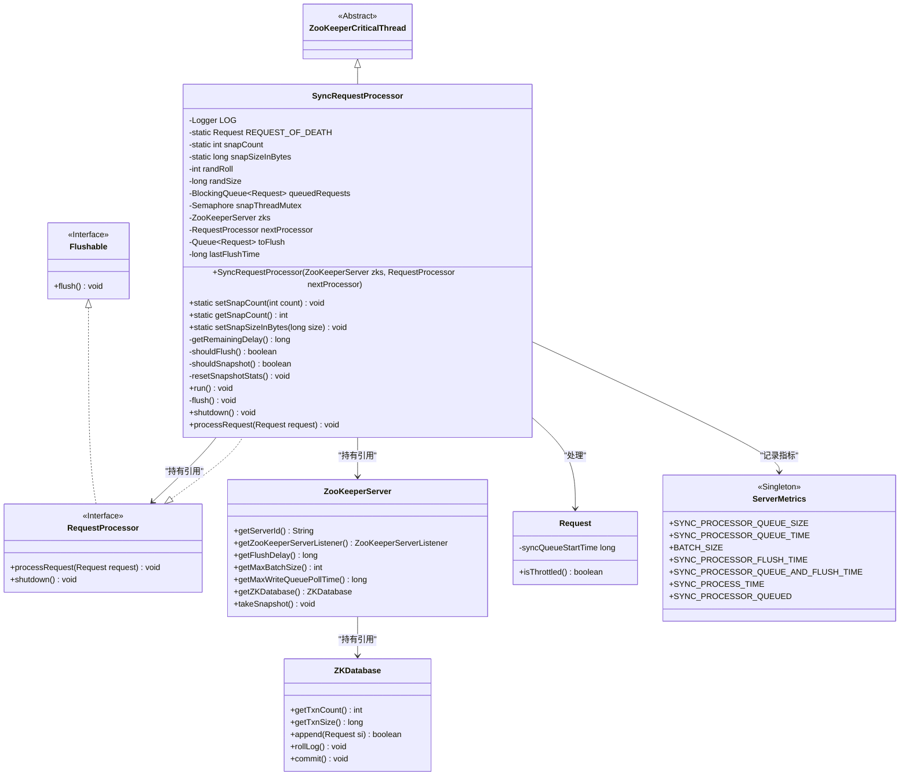

# 基础信息

|      |      |
|------|------|
| 名称 | SyncRequestProcessor |
| 编码语言 | .java |
| 代码路径 | zookeeper/zookeeper-server/src/main/java/org/apache/zookeeper/server/SyncRequestProcessor.java |
| 包名 | org.apache.zookeeper.server |
| 依赖项 | ['java.io.Flushable', 'java.io.IOException', 'java.util.ArrayDeque', 'java.util.Objects', 'java.util.Queue', 'java.util.concurrent.BlockingQueue', 'java.util.concurrent.LinkedBlockingQueue', 'java.util.concurrent.Semaphore', 'java.util.concurrent.ThreadLocalRandom', 'java.util.concurrent.TimeUnit', 'org.apache.zookeeper.common.Time', 'org.slf4j.Logger', 'org.slf4j.LoggerFactory'] |
| 概述说明 | SyncRequestProcessor是ZooKeeper的请求处理线程，负责日志同步和快照生成。它管理请求队列，根据日志条目数或大小触发快照，并控制批量写入磁盘。支持延迟刷新和批量处理优化，确保数据一致性。 |

# 说明

SyncRequestProcessor是ZooKeeperCriticalThread的子类，实现了RequestProcessor接口，用于处理ZooKeeper服务器的请求同步和快照生成。它维护一个请求队列queuedRequests，通过阻塞队列处理请求。核心功能包括：根据snapCount和snapSizeInBytes判断是否生成快照，使用随机数避免集群同时快照；通过flushDelay和maxBatchSize控制批量刷新磁盘；支持异步快照线程，通过snapThreadMutex防止并发冲突。它还管理toFlush队列，优化读写负载，将非写入请求直接传递给nextProcessor。提供了shutdown方法安全终止线程，并包含丰富的性能指标统计。

# 类列表 Class Summary

| 名称   | 类型  | 说明 |
|-------|------|-------------|
| SyncRequestProcessor | class | SyncRequestProcessor是ZooKeeper的请求处理线程，负责日志同步和快照生成。它管理请求队列，根据日志条目数或大小触发快照，并控制批量刷新到磁盘。支持延迟刷新和批量处理优化，确保数据一致性。 |

## 类 SyncRequestProcessor

|      |      |
|------|------|
| 访问范围 | public |
| 类型 | class |
| 名称 | SyncRequestProcessor |
| 说明 | SyncRequestProcessor是ZooKeeper的请求处理线程，负责日志同步和快照生成。它管理请求队列，根据日志条目数或大小触发快照，并控制批量刷新到磁盘。支持延迟刷新和批量处理优化，确保数据一致性。 |

### UML类图

类图描述：该图展示了ZooKeeper中SyncRequestProcessor的核心结构，它是一个继承自ZooKeeperCriticalThread并实现RequestProcessor接口的关键线程类，负责处理事务请求的同步和快照。类图中包含与ZooKeeperServer、ZKDatabase的关联关系，以及处理请求时的度量指标记录。SyncRequestProcessor通过队列管理请求，根据条件触发刷盘和快照操作，同时支持可刷新的下游处理器链。

### 内部方法调用关系图

```mermaid
graph TD
    A["类SyncRequestProcessor"]
    B["属性: Logger LOG"]
    C["属性: Request REQUEST_OF_DEATH"]
    D["属性: int snapCount"]
    E["属性: long snapSizeInBytes"]
    F["属性: int randRoll"]
    G["属性: long randSize"]
    H["属性: BlockingQueue<Request> queuedRequests"]
    I["属性: Semaphore snapThreadMutex"]
    J["属性: ZooKeeperServer zks"]
    K["属性: RequestProcessor nextProcessor"]
    L["属性: Queue<Request> toFlush"]
    M["属性: long lastFlushTime"]
    N["构造方法: SyncRequestProcessor(ZooKeeperServer zks, RequestProcessor nextProcessor)"]
    O["静态方法: setSnapCount(int count)"]
    P["静态方法: getSnapCount()"]
    Q["私有方法: getRemainingDelay()"]
    R["私有方法: shouldFlush()"]
    S["静态方法: setSnapSizeInBytes(long size)"]
    T["私有方法: shouldSnapshot()"]
    U["私有方法: resetSnapshotStats()"]
    V["重写方法: run()"]
    W["私有方法: flush()"]
    X["方法: shutdown()"]
    Y["方法: processRequest(Request request)"]

    A --> B
    A --> C
    A --> D
    A --> E
    A --> F
    A --> G
    A --> H
    A --> I
    A --> J
    A --> K
    A --> L
    A --> M
    A --> N
    A --> O
    A --> P
    A --> Q
    A --> R
    A --> S
    A --> T
    A --> U
    A --> V
    A --> W
    A --> X
    A --> Y

    V --> U
    V --> Q
    V --> R
    V --> W
    V --> T
    V --> Y
    W --> Q
    W --> R
    X --> W
    Y --> H
```

流程图描述了SyncRequestProcessor类的结构和主要方法调用关系。该类是ZooKeeper服务器中处理请求的核心组件，负责将事务日志写入磁盘并触发快照。流程从run()方法开始，通过轮询队列处理请求，根据条件判断是否执行flush或快照操作。关键方法包括shouldFlush()和shouldSnapshot()用于决策，flush()负责批量提交事务，shutdown()处理关闭流程。所有方法围绕请求队列和状态检查展开，确保数据一致性和性能平衡。

### 字段列表 Field List

| 名称  | 类型  | 说明 |
|-------|-------|------|
| snapThreadMutex = new Semaphore(1) | Semaphore | 私有信号量snapThreadMutex初始值为1，用于线程同步控制。 |
| queuedRequests = new LinkedBlockingQueue<>() | BlockingQueue<Request> | 私有阻塞队列queuedRequests，使用LinkedBlockingQueue存储Request对象。 |
| LOG = LoggerFactory.getLogger(SyncRequestProcessor.class) | Logger | 声明SyncRequestProcessor类的私有静态日志常量LOG，使用LoggerFactory创建。 |
| REQUEST_OF_DEATH = Request.requestOfDeath | Request | 私有静态常量REQUEST_OF_DEATH初始化为Request类的requestOfDeath值。 |
| snapCount = ZooKeeperServer.getSnapCount() | int | 私有静态变量snapCount，初始值为ZooKeeperServer的getSnapCount方法返回值。 |
| zks | ZooKeeperServer | 私有成员变量zks，类型为ZooKeeperServer。 |
| lastFlushTime | long | 私有长整型变量，记录最后一次刷新时间。 |
| nextProcessor | RequestProcessor | 私有成员变量nextProcessor，类型为RequestProcessor，用于链式处理请求。 |
| randSize | long | 声明一个私有长整型变量randSize。 |
| toFlush | Queue<Request> | 私有队列toFlush，存储Request类型元素。 |
| snapSizeInBytes = ZooKeeperServer.getSnapSizeInBytes() | long | 私有静态变量snapSizeInBytes通过ZooKeeperServer的getSnapSizeInBytes方法获取快照大小字节数。 |
| randRoll | int | 私有整型变量randRoll。 |

### 方法列表 Method List

| 名称  | 类型  | 说明 |
|-------|-------|------|
| getSnapCount | int | 公开静态方法getSnapCount返回整型变量snapCount的值。 |
| setSnapCount | void | 设置静态变量snapCount的值，参数为整数count。 |
| shouldFlush | boolean | 检查是否应刷新数据：延迟为零或待刷新数据量达到最大批次大小时返回真。 |
| processRequest | void | 处理请求方法：检查请求非空后记录开始时间，加入队列并更新指标。 |
| setSnapSizeInBytes | void | 这是一个Java静态方法，用于设置snapSizeInBytes变量的值。方法接受一个long类型参数size，并将其赋值给类静态变量snapSizeInBytes。 |
| shouldSnapshot | boolean | 检查是否应创建快照：若事务日志数量超过阈值一半加随机值，或日志大小超过阈值一半加随机值，则返回真。 |
| resetSnapshotStats | void | 重置快照统计信息：随机生成roll值（snapCount/2范围内）和size值（snapSizeInBytes/2范围内）。 |
| getRemainingDelay | long | 计算剩余延迟时间：获取当前与上次刷新时间差，若小于预设延迟则返回差值，否则返回0。 |
| run | void | 这是一个ZooKeeper同步请求处理器的运行方法，主要功能包括：处理队列请求、批量写入日志、按条件触发快照和日志滚动，优化读写负载，并在异常时处理错误。 |
| flush | void | flush方法处理待刷新请求：若无请求则返回；记录批次大小；提交数据库并记录耗时；若有下一处理器则传递请求并记录延迟，否则清空队列；最后记录刷新时间。 |
| shutdown | void | 该方法用于关闭请求处理器，添加终止请求后等待线程结束并刷新数据。若出现中断、IO或处理器异常会记录日志。最后递归关闭下一个处理器。 |

