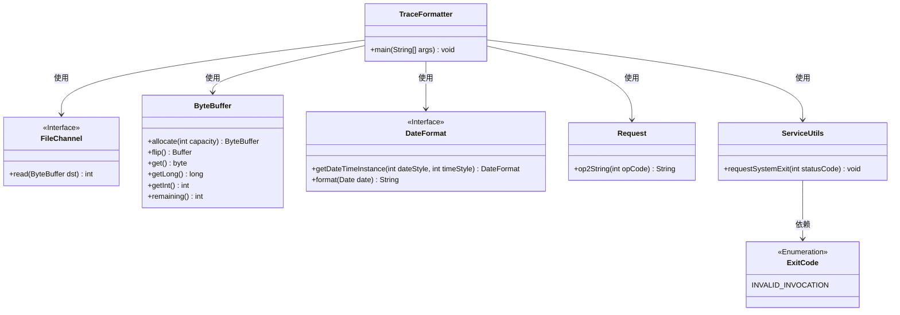
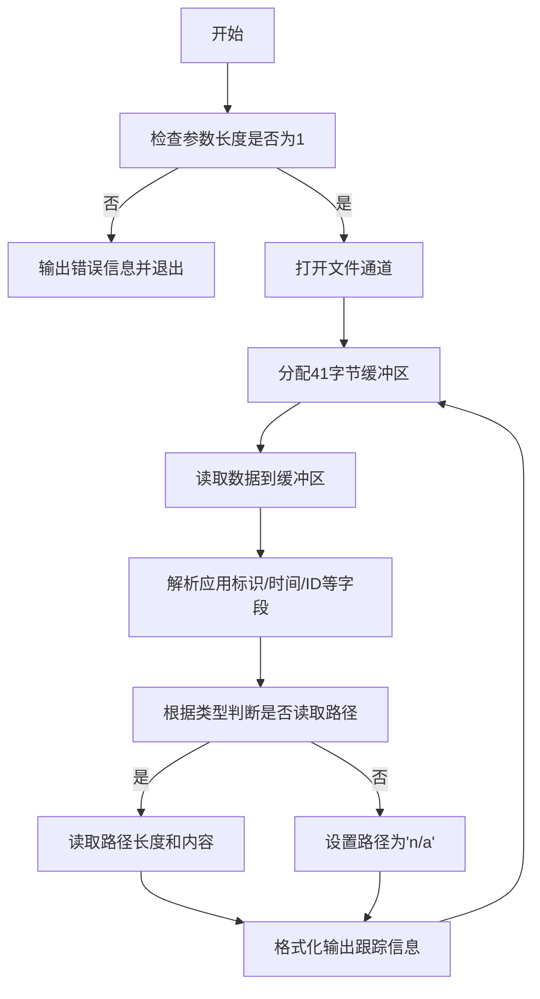
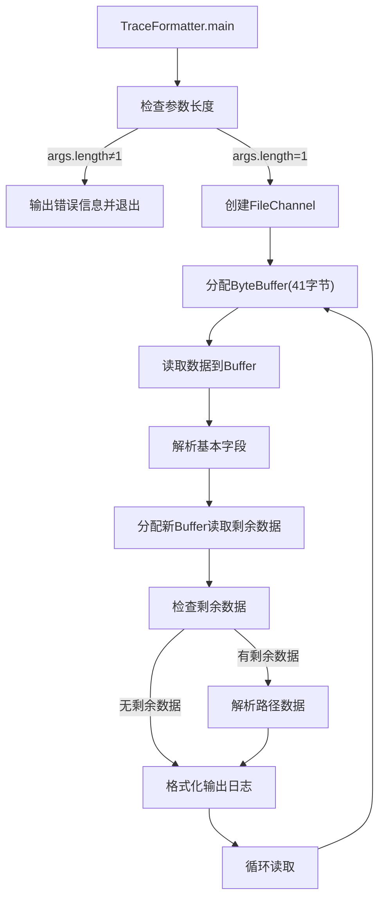

# 基础信息

|      |      |
|------|------|
| 名称 | TraceFormatter |
| 编码语言 | .java |
| 代码路径 | zookeeper/zookeeper-server/src/main/java/org/apache/zookeeper/server/TraceFormatter.java |
| 包名 | org.apache.zookeeper.server |
| 依赖项 | ['java.io.FileInputStream', 'java.io.IOException', 'java.nio.ByteBuffer', 'java.nio.channels.FileChannel', 'java.text.DateFormat', 'java.util.Date', 'org.apache.zookeeper.ZooDefs.OpCode', 'org.apache.zookeeper.util.ServiceUtils'] |
| 概述说明 | Java类TraceFormatter用于解析和格式化跟踪文件，读取二进制数据并输出包含时间、ID、操作类型等信息的日志。需传入一个文件路径参数，否则报错退出。 |

# 说明

该Java程序是一个跟踪日志格式化工具，用于解析和显示二进制格式的跟踪文件内容。程序首先检查命令行参数，要求输入一个跟踪文件路径。然后通过文件通道逐字节读取数据，解析出应用程序标识、时间戳、事务ID、客户端ID、ZooKeeper事务ID、事务类型、操作类型等元数据。对于特定操作类型（非创建会话），还会解析路径信息。最后将解析结果格式化为易读的字符串输出，包含时间、应用标识、各ID的十六进制表示、操作类型、事务类型、数据长度和路径等信息。程序采用无限循环持续读取文件内容，直到文件结束。

# 类列表 Class Summary

| 名称   | 类型  | 说明 |
|-------|------|-------------|
| TraceFormatter | class | Java类TraceFormatter用于解析和格式化跟踪文件，读取二进制数据并输出包含时间、ID、操作类型等信息的可读字符串。 |

## 类 TraceFormatter

|      |      |
|------|------|
| 访问范围 | public |
| 类型 | class |
| 名称 | TraceFormatter |
| 说明 | Java类TraceFormatter用于解析和格式化跟踪文件，读取二进制数据并输出包含时间、ID、操作类型等信息的可读字符串。 |

### UML类图

这段代码实现了一个跟踪日志格式化工具，主要功能是从二进制跟踪文件中读取并解析操作记录，然后以可读格式输出。核心类TraceFormatter通过FileChannel读取文件，使用ByteBuffer处理二进制数据，借助DateFormat格式化时间戳，调用Request转换操作码，并在参数错误时通过ServiceUtils退出程序。流程图展示了持续读取-解析-输出的循环过程，特别注意了对不同操作类型（如createSession）的特殊处理逻辑。

### 内部方法调用关系图

该流程图展示了TraceFormatter类的日志处理流程。程序首先验证输入参数，然后通过FileChannel循环读取二进制日志数据。每次读取先解析41字节的固定头部信息，再根据数据长度动态读取剩余内容，特别处理路径字段的解析，最后将所有字段格式化为可读字符串输出。整个过程构成一个持续读取的循环，直到文件结束或程序终止。

### 字段列表 Field List

| 名称  | 类型  | 说明 |
|-------|-------|------|

### 方法列表 Method List

| 名称  | 类型  | 说明 |
|-------|-------|------|
| main | void | Java程序读取二进制日志文件，解析并格式化输出每条记录的详细内容，包括时间、ID、操作类型等关键信息。若参数错误则提示并退出。 |

