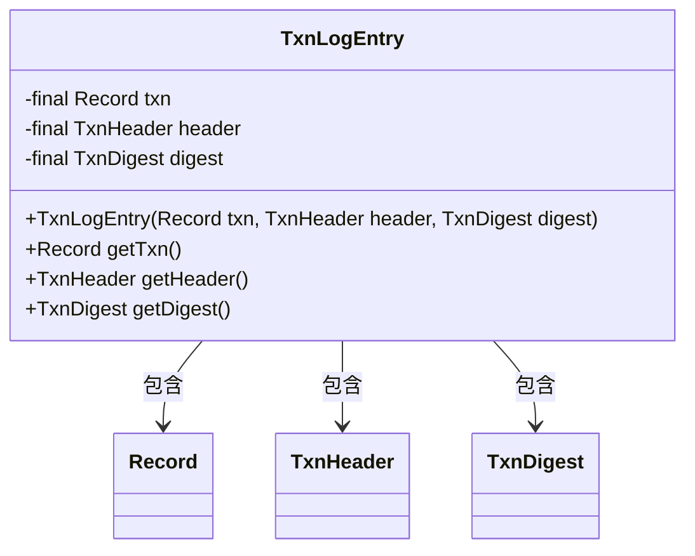
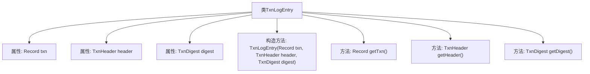

# 基础信息

|      |      |
|------|------|
| 名称 | TxnLogEntry |
| 编码语言 | .java |
| 代码路径 | zookeeper/zookeeper-server/src/main/java/org/apache/zookeeper/server/TxnLogEntry.java |
| 包名 | org.apache.zookeeper.server |
| 依赖项 | ['org.apache.jute.Record', 'org.apache.zookeeper.txn.TxnDigest', 'org.apache.zookeeper.txn.TxnHeader'] |
| 概述说明 | TxnLogEntry类包含交易记录、头部和摘要，提供对应getter方法。 |

# 说明

这是一个名为TxnLogEntry的公共不可变类，用于封装交易日志条目。该类包含三个私有不可变成员变量：txn（交易记录）、header（交易头信息）和digest（交易摘要）。通过构造函数初始化这三个字段，并提供了对应的getter方法（getTxn、getHeader、getDigest）来获取这些字段的值。该类设计为不可变，确保线程安全和数据一致性。

# 类列表 Class Summary

| 名称   | 类型  | 说明 |
|-------|------|-------------|
| TxnLogEntry | class | TxnLogEntry是final类，包含交易记录、头信息和摘要，提供对应getter方法。 |

## 类 TxnLogEntry

|      |      |
|------|------|
| 访问范围 | public final |
| 类型 | class |
| 名称 | TxnLogEntry |
| 说明 | TxnLogEntry是final类，包含交易记录、头信息和摘要，提供对应getter方法。 |

### UML类图

该图展示了TxnLogEntry类结构，它是一个不可变类（final修饰），包含三个私有final成员：txn（Record类型）、header（TxnHeader类型）和digest（TxnDigest类型）。类提供构造方法和三个getter方法用于访问成员，通过箭头明确表示了与三个成员类的包含关系。整体设计体现了事务日志条目数据的封装性和不可变性。

### 内部方法调用关系图

该流程图展示了TxnLogEntry类的完整结构，这是一个不可变类(final)，包含三个final属性：txn(交易记录)、header(交易头)和digest(交易摘要)。类通过构造函数初始化这三个属性，并提供了对应的getter方法获取属性值。流程图清晰呈现了类成员之间的从属关系，所有方法都直接关联到主类，没有嵌套调用关系。这种设计模式确保了对象创建后的不可变性，适合需要线程安全的交易日志场景。

### 字段列表 Field List

| 名称  | 类型  | 说明 |
|-------|-------|------|
| txn | Record | 私有不可变交易记录对象txn。 |
| digest | TxnDigest | 私有最终交易摘要对象digest。 |
| header | TxnHeader | 私有成员变量header，类型为TxnHeader。 |

### 方法列表 Method List

| 名称  | 类型  | 说明 |
|-------|-------|------|
| getTxn | Record | 获取事务记录的公共方法，返回txn对象。 |
| getHeader | TxnHeader | 方法返回TxnHeader类型的header对象。 |
| getDigest | TxnDigest | 这是一个Java方法，返回类型为TxnDigest的digest变量值。 |

