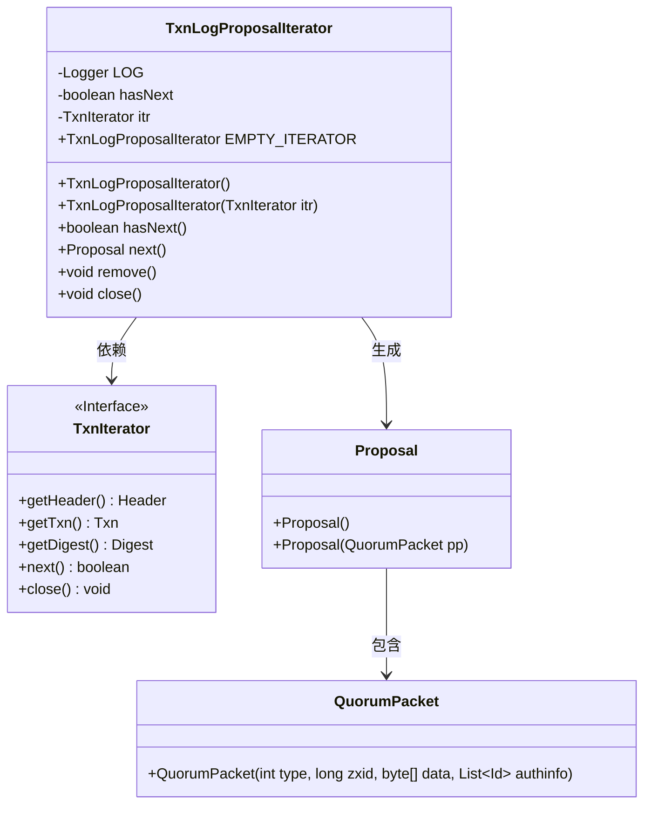
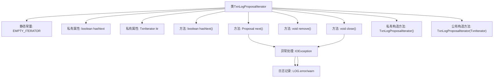

# 基础信息

|      |      |
|------|------|
| 名称 | TxnLogProposalIterator |
| 编码语言 | .java |
| 代码路径 | zookeeper/zookeeper-server/src/main/java/org/apache/zookeeper/server/TxnLogProposalIterator.java |
| 包名 | org.apache.zookeeper.server |
| 依赖项 | ['java.io.IOException', 'java.util.Iterator', 'org.apache.zookeeper.server.persistence.TxnLog.TxnIterator', 'org.apache.zookeeper.server.persistence.Util', 'org.apache.zookeeper.server.quorum.Leader', 'org.apache.zookeeper.server.quorum.Leader.Proposal', 'org.apache.zookeeper.server.quorum.QuorumPacket', 'org.slf4j.Logger', 'org.slf4j.LoggerFactory'] |
| 概述说明 | TxnLogProposalIterator是用于迭代事务日志提案的类，实现Iterator接口。主要功能包括检查是否有下一个提案(hasNext)、获取下一个提案(next)并关闭资源(close)。提案的请求部分为null，不用于跟随者同步。处理IO异常并记录错误。不支持remove操作。构造函数初始化迭代器状态。 |

# 说明

TxnLogProposalIterator是一个实现Iterator接口的类，用于迭代Proposal对象。它包含一个静态空迭代器实例EMPTY_ITERATOR，以及一个TxnIterator成员itr用于遍历事务记录。hasNext方法返回布尔值表示是否有下一个元素。next方法读取事务数据并构造Proposal对象，处理IO异常时返回空Proposal。remove方法抛出UnsupportedOperationException。close方法释放资源并关闭文件迭代器。构造函数支持空构造和传入TxnIterator初始化。该类主要用于从磁盘读取事务日志并生成Proposal，但不支持删除操作。

# 类列表 Class Summary

| 名称   | 类型  | 说明 |
|-------|------|-------------|
| TxnLogProposalIterator | class | TxnLogProposalIterator是迭代Proposal的类，通过TxnIterator读取事务日志。next()方法返回不含请求的Proposal，处理IO异常时标记无后续项。提供关闭资源方法，构造时需传入非空迭代器。不支持remove操作。 |

## 类 TxnLogProposalIterator

|      |      |
|------|------|
| 访问范围 | public |
| 类型 | class |
| 名称 | TxnLogProposalIterator |
| 说明 | TxnLogProposalIterator是迭代Proposal的类，通过TxnIterator读取事务日志。next()方法返回不含请求的Proposal，处理IO异常时标记无后续项。提供关闭资源方法，构造时需传入非空迭代器。不支持remove操作。 |

### UML类图

类图描述：TxnLogProposalIterator是一个实现了Iterator接口的迭代器类，主要用于处理事务日志提案的遍历。它依赖于TxnIterator接口来获取事务数据，并通过next()方法生成包含QuorumPacket的Proposal对象。类中包含对IO异常的处理逻辑，并提供close()方法释放资源。私有成员hasNext用于控制迭代状态，EMPTY_ITERATOR提供空迭代器实例。整个设计体现了事务日志处理的封装性和异常安全性。

### 内部方法调用关系图

这段代码展示了一个事务日志提案迭代器(TxnLogProposalIterator)的实现，主要用于迭代处理ZooKeeper中的事务提案。核心功能包括检查是否有下一个元素(hasNext)、获取下一个提案(next)、不支持删除操作(remove)以及关闭资源(close)。代码特别注重异常处理，在读取事务日志和关闭资源时都会捕获IO异常并记录日志。通过两个构造方法实现了空迭代器和带事务迭代器的初始化，其中next()方法会将事务数据序列化为提案对象，是唯一可能抛出IO异常的地方。

### 字段列表 Field List

| 名称  | 类型  | 说明 |
|-------|-------|------|
| itr | TxnIterator | 私有事务迭代器变量itr。 |
| EMPTY_ITERATOR = new TxnLogProposalIterator() | TxnLogProposalIterator | 定义了一个公共静态常量EMPTY_ITERATOR，它是TxnLogProposalIterator类的空实例。 |
| hasNext = false | boolean | 私有布尔变量hasNext，初始值为false。 |
| LOG = LoggerFactory.getLogger(TxnLogProposalIterator.class) | Logger | 声明一个私有静态不可变日志对象LOG，用于TxnLogProposalIterator类的日志记录。 |

### 方法列表 Method List

| 名称  | 类型  | 说明 |
|-------|-------|------|
| hasNext | boolean | 重写hasNext方法，返回布尔值hasNext。 |
| next | Proposal | Java方法next()处理事务日志迭代，序列化数据并创建Proposal对象，捕获IO异常时返回空Proposal。 |
| remove | void | 重写remove方法，抛出UnsupportedOperationException异常表示不支持该操作。 |
| close | void | 关闭文件迭代器，捕获并记录可能出现的IO异常。 |

