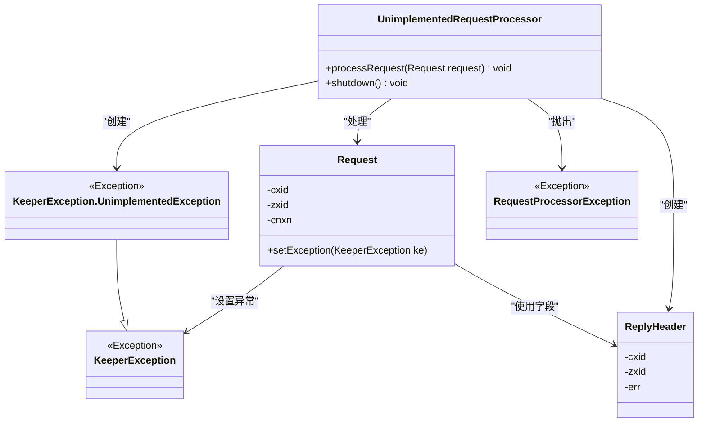
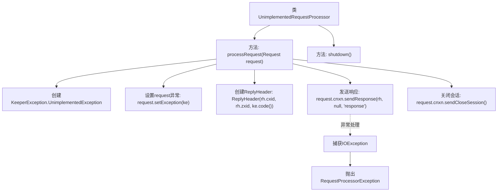

# 基础信息

|      |      |
|------|------|
| 名称 | UnimplementedRequestProcessor |
| 编码语言 | .java |
| 代码路径 | zookeeper/zookeeper-server/src/main/java/org/apache/zookeeper/server/UnimplementedRequestProcessor.java |
| 包名 | org.apache.zookeeper.server |
| 依赖项 | ['java.io.IOException', 'org.apache.zookeeper.KeeperException', 'org.apache.zookeeper.proto.ReplyHeader'] |
| 概述说明 | 未实现的请求处理器类，处理请求时设置未实现异常并发送响应，若失败则抛出异常，最后关闭会话。shutdown方法为空。 |

# 说明

该代码定义了一个名为UnimplementedRequestProcessor的类，实现了RequestProcessor接口。主要功能是处理未实现的请求，流程如下：当接收到请求时，会创建一个UnimplementedException异常并设置到请求对象中，随后构建包含异常信息的响应头。尝试通过连接发送响应，若失败则抛出RequestProcessorException。无论成功与否，最终都会发送关闭会话的指令。该类还包含一个空的shutdown方法。整个过程专注于异常处理和响应发送，不包含实际业务逻辑实现。

# 类列表 Class Summary

| 名称   | 类型  | 说明 |
|-------|------|-------------|
| UnimplementedRequestProcessor | class | 未实现请求处理器类，处理请求时抛出未实现异常，发送响应后关闭会话。shutdown方法为空。 |

## 类 UnimplementedRequestProcessor

|      |      |
|------|------|
| 访问范围 | public |
| 类型 | class |
| 名称 | UnimplementedRequestProcessor |
| 说明 | 未实现请求处理器类，处理请求时抛出未实现异常，发送响应后关闭会话。shutdown方法为空。 |

### UML类图

该代码展示了一个未实现的请求处理器类，主要功能是处理请求时返回未实现异常。类图清晰地呈现了核心类之间的关系：UnimplementedRequestProcessor通过处理Request对象，创建并关联KeeperException和ReplyHeader，在异常情况下抛出RequestProcessorException。图中包含了继承关系（KeeperException.UnimplementedException继承自KeeperException）和各类之间的依赖关系，完整展现了异常处理流程和请求响应机制。

### 内部方法调用关系图

这段代码流程图展示了UnimplementedRequestProcessor类的核心处理逻辑。当调用processRequest方法时，会先创建未实现异常并设置到请求对象，然后构建响应头并尝试发送响应，若出现IO异常则包装抛出。无论成功与否都会触发会话关闭操作。shutdown方法为空实现，表示该类不需要特殊关闭逻辑。整个流程清晰地体现了请求异常处理和资源清理的完整路径。

### 字段列表 Field List

| 名称  | 类型  | 说明 |
|-------|-------|------|

### 方法列表 Method List

| 名称  | 类型  | 说明 |
|-------|-------|------|
| shutdown | void | 方法shutdown()为空实现，无具体功能。 |
| processRequest | void | 处理请求时抛出未实现异常，设置异常信息并生成响应头。尝试发送响应，失败则抛出处理异常。最后发送关闭会话指令。 |

