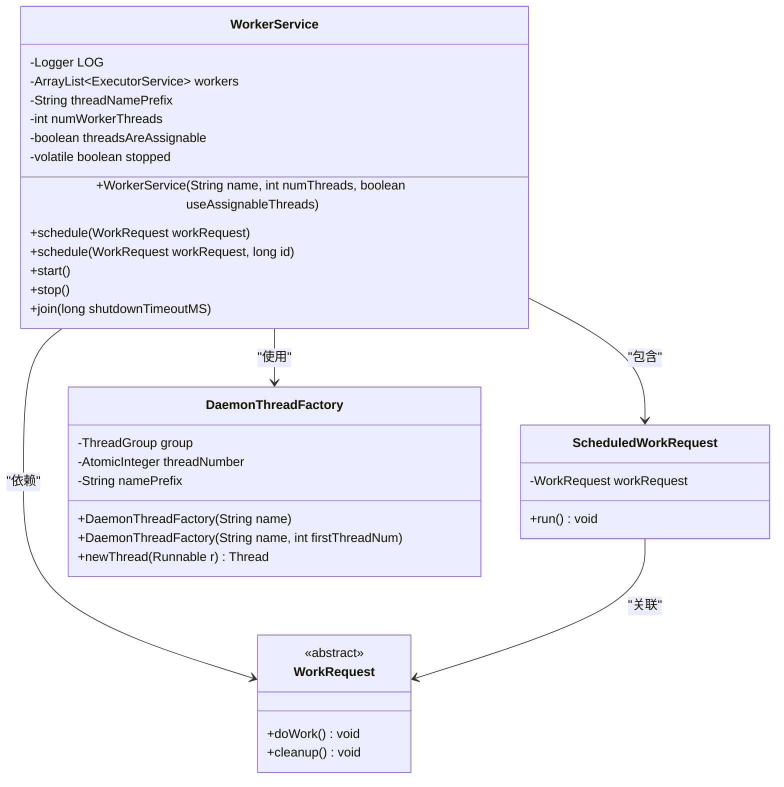
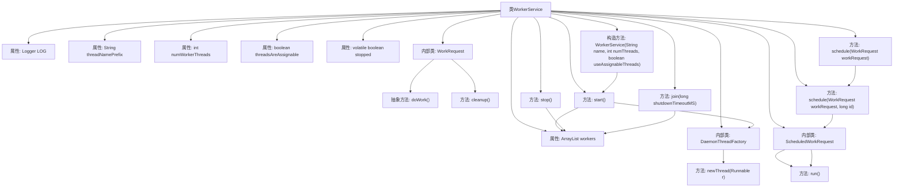

# 基础信息

|      |      |
|------|------|
| 名称 | WorkerService |
| 编码语言 | .java |
| 代码路径 | zookeeper/zookeeper-server/src/main/java/org/apache/zookeeper/server/WorkerService.java |
| 包名 | org.apache.zookeeper.server |
| 依赖项 | ['java.util.ArrayList', 'java.util.concurrent.ExecutorService', 'java.util.concurrent.Executors', 'java.util.concurrent.RejectedExecutionException', 'java.util.concurrent.ThreadFactory', 'java.util.concurrent.TimeUnit', 'java.util.concurrent.atomic.AtomicInteger', 'org.apache.zookeeper.common.Time', 'org.slf4j.Logger', 'org.slf4j.LoggerFactory'] |
| 概述说明 | WorkerService管理可配置数量的工作线程，支持直接执行或线程池调度任务。提供任务调度、优雅停止及超时控制功能，支持可分配线程或共享线程池模式。 |

# 说明

WorkerService是一个多线程工作调度服务，支持可分配和不可分配两种线程模式。构造函数接收线程名前缀、线程数量和是否可分配标志。核心功能通过schedule方法提交WorkRequest抽象类的实现，支持直接执行或线程池调度。内部使用DaemonThreadFactory创建守护线程，确保服务关闭时线程不会阻塞。提供start、stop和join方法管理生命周期，stop触发优雅关闭，join支持超时强制终止。当线程池满或服务停止时自动调用请求的cleanup方法进行资源清理。

# 类列表 Class Summary

| 名称   | 类型  | 说明 |
|-------|------|-------------|
| WorkerService | class | WorkerService管理线程池执行WorkRequest任务，支持可分配线程和直接执行，提供启动、停止和等待终止功能。 |

## 类 WorkerService

|      |      |
|------|------|
| 访问范围 | public |
| 类型 | class |
| 名称 | WorkerService |
| 说明 | WorkerService管理线程池执行WorkRequest任务，支持可分配线程和直接执行，提供启动、停止和等待终止功能。 |

### UML类图

WorkerService是一个多线程任务调度服务，核心功能包括：通过构造器配置线程参数，使用WorkRequest抽象类定义任务模板，通过schedule()方法分配任务到线程池。包含内部类ScheduledWorkRequest实现Runnable接口来执行具体任务，以及DaemonThreadFactory定制守护线程。支持优雅停止(join)和强制停止(stop)机制，能根据配置创建可分配或共享线程池。

### 内部方法调用关系图

这段代码展示了一个WorkerService类，用于管理工作线程池。它包含构造方法初始化线程前缀和数量，内部抽象类WorkRequest定义工作请求，schedule方法分配任务到线程池，DaemonThreadFactory创建守护线程，以及start/stop/join方法控制线程生命周期。流程图清晰展示了类结构、属性关系和方法调用链，特别是线程池管理和任务调度的核心逻辑。

### 字段列表 Field List

| 名称  | 类型  | 说明 |
|-------|-------|------|
| stopped = true | boolean | 私有易变布尔变量stopped初始值为true。 |
| threadNamePrefix | String | 私有字符串变量threadNamePrefix，用于线程名前缀。 |
| workers = new ArrayList<>() | ArrayList<ExecutorService> | 私有成员变量workers，类型为ArrayList<ExecutorService>，初始化为空列表。 |
| LOG = LoggerFactory.getLogger(WorkerService.class) | Logger | WorkerService类中定义了一个私有静态常量LOG，用于记录日志。 |
| numWorkerThreads | int | 私有整型变量numWorkerThreads，用于记录工作线程数量。 |
| threadsAreAssignable | boolean | 私有布尔变量，标识线程是否可分配。 |

### 方法列表 Method List

| 名称  | 类型  | 说明 |
|-------|-------|------|
| schedule | void | 这是一个Java方法，用于调度工作请求，默认延迟时间为0。方法重载了另一个带延迟参数的schedule方法。 |
| schedule | void | 方法schedule处理工作请求：若服务停止则清理请求；否则创建调度请求。有线程池时分配请求到指定线程执行，异常时清理；无线程池则直接执行请求。 |
| start | void | 启动方法：根据线程数创建守护线程池，若可分配则每线程独立池，否则共用池，标记运行状态。 |
| stop | void | 停止方法设置标志并优雅关闭所有工作线程。 |
| join | void | 方法join等待所有worker线程终止，超时后强制关闭。循环检查每个worker是否在指定时间内终止，若未终止则调用shutdownNow。忽略中断异常。 |

