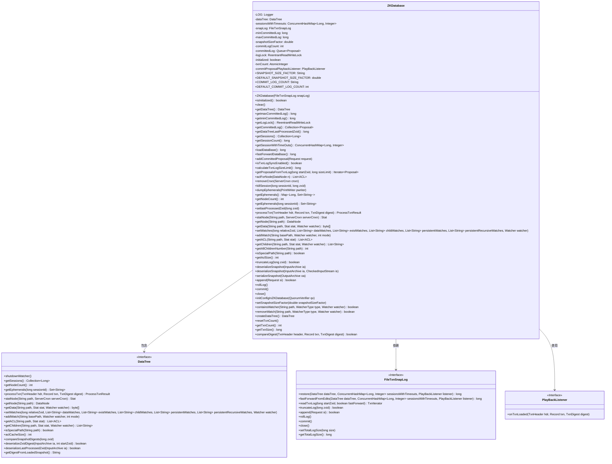

# 基础信息

|      |      |
|------|------|
| 名称 | ZKDatabase |
| 编码语言 | .java |
| 代码路径 | zookeeper/zookeeper-server/src/main/java/org/apache/zookeeper/server/ZKDatabase.java |
| 包名 | org.apache.zookeeper.server |
| 依赖项 | ['java.nio.charset.StandardCharsets.UTF_8', 'java.io.File', 'java.io.IOException', 'java.io.PrintWriter', 'java.util.ArrayDeque', 'java.util.ArrayList', 'java.util.Collection', 'java.util.Collections', 'java.util.Iterator', 'java.util.List', 'java.util.Map', 'java.util.Queue', 'java.util.Set', 'java.util.concurrent.ConcurrentHashMap', 'java.util.concurrent.atomic.AtomicInteger', 'java.util.concurrent.locks.ReentrantReadWriteLock', 'java.util.concurrent.locks.ReentrantReadWriteLock.ReadLock', 'java.util.concurrent.locks.ReentrantReadWriteLock.WriteLock', 'java.util.zip.CheckedInputStream', 'org.apache.jute.InputArchive', 'org.apache.jute.OutputArchive', 'org.apache.jute.Record', 'org.apache.zookeeper.KeeperException', 'org.apache.zookeeper.KeeperException.NoNodeException', 'org.apache.zookeeper.Watcher', 'org.apache.zookeeper.Watcher.WatcherType', 'org.apache.zookeeper.ZooDefs', 'org.apache.zookeeper.common.Time', 'org.apache.zookeeper.data.ACL', 'org.apache.zookeeper.data.Stat', 'org.apache.zookeeper.server.DataTree.ProcessTxnResult', 'org.apache.zookeeper.server.persistence.FileSnap', 'org.apache.zookeeper.server.persistence.FileTxnSnapLog', 'org.apache.zookeeper.server.persistence.FileTxnSnapLog.PlayBackListener', 'org.apache.zookeeper.server.persistence.SnapStream', 'org.apache.zookeeper.server.persistence.TxnLog.TxnIterator', 'org.apache.zookeeper.server.quorum.Leader.Proposal', 'org.apache.zookeeper.server.quorum.Leader.PureRequestProposal', 'org.apache.zookeeper.server.quorum.flexible.QuorumVerifier', 'org.apache.zookeeper.server.util.SerializeUtils', 'org.apache.zookeeper.txn.TxnDigest', 'org.apache.zookeeper.txn.TxnHeader', 'org.slf4j.Logger', 'org.slf4j.LoggerFactory'] |
| 概述说明 | ZKDatabase是ZooKeeper的核心数据库类，负责管理数据树、会话和事务日志。主要功能包括初始化、清理、加载/保存快照、处理事务、维护提交日志、管理ACL和监视器。支持事务日志同步、快速同步和截断操作，并提供数据节点、会话和子节点查询接口。通过FileTxnSnapLog处理磁盘持久化，确保数据一致性和高效恢复。 |

# 说明

ZKDatabase是一个ZooKeeper数据库实现类，主要用于管理数据树、事务日志和会话信息。它包含核心成员如DataTree、ConcurrentHashMap会话超时记录、FileTxnSnapLog事务快照日志，以及最小/最大提交日志ID。提供数据库初始化、清空、加载、快照序列化、事务处理等核心功能，支持事务日志截断、快速同步、ACL管理、节点监控等特性。通过读写锁保证线程安全，可配置快照大小因子和提交日志数量，内置指标统计和错误处理机制，完整实现了ZooKeeper数据库的所有关键操作。

# 类列表 Class Summary

| 名称   | 类型  | 说明 |
|-------|------|-------------|
| ZKDatabase | class | ZKDatabase类管理ZooKeeper数据存储，包含DataTree、会话超时映射和事务日志。支持快照、事务处理、会话管理及数据同步，提供ACL、节点操作和监控功能。 |

## 类 ZKDatabase

|      |      |
|------|------|
| 访问范围 | public |
| 类型 | class |
| 名称 | ZKDatabase |
| 说明 | ZKDatabase类管理ZooKeeper数据存储，包含DataTree、会话超时映射和事务日志。支持快照、事务处理、会话管理及数据同步，提供ACL、节点操作和监控功能。 |

### UML类图

这段代码定义了一个ZKDatabase类，它是ZooKeeper数据库的核心实现，负责管理数据树、会话、事务日志和快照。ZKDatabase通过FileTxnSnapLog处理持久化存储，使用DataTree维护内存中的节点层次结构，并通过PlayBackListener回调处理事务回放。该类提供了完整的CRUD操作、ACL管理、监视机制和事务处理功能，同时支持数据库的初始化、清理、序列化和故障恢复。其设计充分考虑了并发控制和性能优化，是ZooKeeper实现一致性和高可用的关键组件。

### 内部方法调用关系图

```mermaid
graph TD
    A["类ZKDatabase"]
    B["属性: DataTree dataTree"]
    C["属性: ConcurrentHashMap<Long, Integer> sessionsWithTimeouts"]
    D["属性: FileTxnSnapLog snapLog"]
    E["属性: long minCommittedLog, maxCommittedLog"]
    F["属性: double snapshotSizeFactor"]
    G["属性: int commitLogCount"]
    H["属性: Queue<Proposal> committedLog"]
    I["属性: ReentrantReadWriteLock logLock"]
    J["属性: AtomicInteger txnCount"]
    K["构造方法: ZKDatabase(FileTxnSnapLog snapLog)"]
    L["方法: boolean isInitialized()"]
    M["方法: void clear()"]
    N["方法: DataTree getDataTree()"]
    O["方法: long getmaxCommittedLog()"]
    P["方法: long getminCommittedLog()"]
    Q["方法: ReentrantReadWriteLock getLogLock()"]
    R["方法: Collection<Proposal> getCommittedLog()"]
    S["方法: long loadDataBase()"]
    T["方法: long fastForwardDataBase()"]
    U["方法: void addCommittedProposal(Request request)"]
    V["方法: boolean isTxnLogSyncEnabled()"]
    W["方法: long calculateTxnLogSizeLimit()"]
    X["方法: Iterator<Proposal> getProposalsFromTxnLog()"]
    Y["方法: boolean truncateLog(long zxid)"]
    Z["方法: void deserializeSnapshot(InputArchive ia)"]

    A --> B
    A --> C
    A --> D
    A --> E
    A --> F
    A --> G
    A --> H
    A --> I
    A --> J
    A --> K
    A --> L
    A --> M
    A --> N
    A --> O
    A --> P
    A --> Q
    A --> R
    A --> S
    A --> T
    A --> U
    A --> V
    A --> W
    A --> X
    A --> Y
    A --> Z
```

这段代码是ZooKeeper数据库的核心实现类ZKDatabase，主要负责管理内存数据树(DataTree)、会话超时映射、事务日志和快照。通过流程图可以看到其核心功能包括：1) 初始化时加载配置参数；2) 提供数据树和会话的CRUD操作；3) 管理事务日志的提交、截断和回放；4) 处理快照的序列化/反序列化；5) 维护提交日志队列和读写锁控制。类中使用了多种同步机制保证线程安全，并提供了丰富的监控指标和日志记录。

### 字段列表 Field List

| 名称  | 类型  | 说明 |
|-------|-------|------|
| commitProposalPlaybackListener = new PlayBackListener() {        public void onTxnLoaded(TxnHeader hdr, Record txn, TxnDigest digest) {            addCommittedProposal(hdr, txn, digest);        }    } | PlayBackListener | 定义私有监听器commitProposalPlaybackListener，在事务加载时调用addCommittedProposal方法处理事务头、记录和摘要。 |
| DEFAULT_COMMIT_LOG_COUNT = 500 | int | 常量DEFAULT_COMMIT_LOG_COUNT定义为500，表示默认提交日志数量。 |
| COMMIT_LOG_COUNT = "zookeeper.commitLogCount" | String | 这是一个静态常量字符串，定义ZooKeeper提交日志计数的配置键名。 |
| maxCommittedLog | long | 声明了两个受保护的长整型变量：minCommittedLog和maxCommittedLog。 |
| sessionsWithTimeouts | ConcurrentHashMap<Long, Integer> | 受保护的并发哈希映射，键为长整型，值为整型，用于存储带超时的会话。 |
| commitLogCount | int | 变量commitLogCount记录提交日志数量，类型为公共整型。 |
| initialized = false | boolean | 声明一个私有易变布尔变量initialized，初始值为false。 |
| DEFAULT_SNAPSHOT_SIZE_FACTOR = 0.33 | double | 定义静态常量DEFAULT_SNAPSHOT_SIZE_FACTOR，默认值为0.33。 |
| logLock = new ReentrantReadWriteLock() | ReentrantReadWriteLock | 创建可重入读写锁实例logLock用于线程同步。 |
| SNAPSHOT_SIZE_FACTOR = "zookeeper.snapshotSizeFactor" | String | 定义静态常量SNAPSHOT_SIZE_FACTOR，值为zookeeper.snapshotSizeFactor。 |
| snapLog | FileTxnSnapLog | 该代码定义了一个受保护的FileTxnSnapLog类型变量snapLog，用于事务日志和快照管理。 |
| txnCount = new AtomicInteger(0) | AtomicInteger | 定义原子整型变量txnCount，初始值为0，用于线程安全计数。 |
| LOG = LoggerFactory.getLogger(ZKDatabase.class) | Logger | ZKDatabase类中定义了一个私有静态常量LOG，用于日志记录。 |
| committedLog = new ArrayDeque<>() | Queue<Proposal> | 声明一个受保护的队列committedLog，用于存储Proposal对象，初始化为ArrayDeque实例。 |
| snapshotSizeFactor | double | 私有双精度浮点变量，用于存储快照大小因子。 |
| dataTree | DataTree | 声明一个受保护的DataTree类型变量dataTree。 |

### 方法列表 Method List

| 名称  | 类型  | 说明 |
|-------|-------|------|
| processTxn | ProcessTxnResult | 处理交易的方法，调用dataTree的processTxn执行交易并返回结果。 |
| createDataTree | DataTree | 创建一个返回新DataTree实例的方法。 |
| getminCommittedLog | long | 获取最小已提交日志值的方法。 |
| rollLog | void | 方法rollLog()调用snapLog.rollLog()滚动日志并重置事务计数，可能抛出IOException。 |
| getNodeCount | int | 该方法返回数据树的节点数量。 |
| aclForNode | List<ACL> | 方法`aclForNode`接收`DataNode`参数，返回该节点的ACL列表。调用`dataTree.getACL(n)`获取结果。 |
| getACL | List<ACL> | 获取指定路径的ACL列表，若无节点则抛出异常。 |
| isTxnLogSyncEnabled | boolean | 方法isTxnLogSyncEnabled检查snapshotSizeFactor是否非负，是则启用磁盘事务同步并记录日志，否则禁用并记录。返回布尔值表示状态。 |
| commit | void | Java方法`commit()`调用`snapLog.commit()`，可能抛出`IOException`异常。 |
| dumpEphemerals | void | 该方法将临时节点数据通过PrintWriter输出，调用dataTree的dumpEphemerals实现。 |
| close | void | 关闭snapLog资源，可能抛出IOException异常。 |
| getCommittedLog | Collection<Proposal> | 同步方法获取已提交日志副本，若当前线程未持有读锁则加锁复制，返回不可修改的集合。 |
| getmaxCommittedLog | long | 获取最大提交日志值的方法。 |
| getSessionWithTimeOuts | ConcurrentHashMap<Long, Integer> | 方法返回一个线程安全的ConcurrentHashMap，键为Long类型，值为Integer类型，存储会话及超时信息。 |
| fastForwardDataBase | long | 方法fastForwardDataBase通过snapLog快速回放编辑日志更新dataTree和sessionsWithTimeouts，设置initialized为true后返回zxid。 |
| getEphemerals | Map<Long, Set<String>> | 获取临时节点数据，返回键为长整型、值为字符串集合的映射。 |
| getAclSize | int | 该方法返回数据树中ACL缓存的大小。 |
| addCommittedProposal | void | 私有方法addCommittedProposal接收事务头、记录和摘要，创建请求对象并设置摘要后提交。 |
| addWatch | void | Java方法`addWatch`在`dataTree`上添加监视器，参数包括路径`basePath`、监视器`watcher`和模式`mode`。 |
| truncateLog | boolean | 该方法用于截断日志，先清空数据，然后尝试截断到指定zxid。若截断失败返回false，成功则重新加载数据库并返回true。 |
| getData | byte[] | 获取指定路径的数据，返回字节数组，可更新节点状态并设置监视器，若无节点则抛出异常。 |
| setWatches | void | 方法setWatches用于设置多种类型的监视器，包括数据、存在性、子节点、持久及递归持久监视器，通过dataTree实现。 |
| getAllChildrenNumber | int | 这是一个Java方法，用于获取指定路径下所有子节点的数量。如果路径不存在，会抛出KeeperException.NoNodeException异常。方法调用dataTree的getAllChildrenNumber实现功能。 |
| resetTxnCount | void | 重置事务计数和日志大小：将txnCount设为0，snapLog的总日志大小设为0。 |
| getTxnCount | int | 方法返回事务计数器的当前值。 |
| getTxnSize | long | 该方法返回事务日志总大小，调用snapLog的getTotalLogSize()实现。 |
| compareDigest | boolean | 方法compareDigest比较事务头、记录和摘要，调用dataTree的compareDigest方法返回结果。 |
| deserializeSnapshot | void | 方法`deserializeSnapshot`从输入流反序列化快照：先清空数据，反序列化数据树并检查完整性；接着处理zxid摘要和最后处理的zxid，均验证完整性；最后比较摘要确保一致性，完成初始化。 |
| statNode | Stat | 检查路径节点状态，若无节点则抛出异常。 |
| getDataTreeLastProcessedZxid | long | 获取数据树最后处理的ZXID值。 |
| containsWatcher | boolean | 检查指定路径是否存在特定类型的监听器。调用dataTree的containsWatcher方法实现。 |
| getNode | DataNode | 获取指定路径的DataNode节点。 |
| isInitialized | boolean | 检查是否已初始化，返回布尔值initialized状态。 |
| deserializeSnapshot | void | 方法deserializeSnapshot从输入存档反序列化快照数据，清空当前状态后加载数据树和会话超时设置，最后标记为已初始化。 |
| getEphemerals | Set<String> | 获取指定会话ID的临时节点集合。方法调用dataTree的getEphemerals接口，返回字符串集合。 |
| addCommittedProposal | void | 方法addCommittedProposal处理请求提案：获取写锁后，若日志超限则移除最早条目并更新最小ZXID。若日志为空，初始化最小和最大ZXID为请求ZXID。添加新提案并更新最大ZXID，最后释放锁。 |
| getDataTree | DataTree | 这是一个Java方法，返回当前对象的dataTree属性。方法名为getDataTree，返回类型为DataTree。 |
| append | boolean | Java方法：追加请求到日志，成功时计数并返回true，失败返回false。 |
| isSpecialPath | boolean | 检查路径是否为特殊路径，调用dataTree的isSpecialPath方法判断。 |
| getSessions | Collection<Long> | 获取会话集合的方法，返回dataTree中的会话列表。 |
| removeCnxn | void | 该方法移除指定服务器连接，调用dataTree的removeCnxn方法实现。 |
| removeWatch | boolean | 删除指定路径的监视器，返回操作结果。 |
| serializeSnapshot | void | 序列化快照数据到输出存档，处理超时会话和IO异常。 |
| killSession | void | 方法killSession用于终止指定会话，调用dataTree的killSession处理。参数为sessionId和zxid。 |
| getLogLock | ReentrantReadWriteLock | 方法getLogLock返回ReentrantReadWriteLock类型的logLock对象。 |
| setSnapshotSizeFactor | void | 设置快照大小因子的方法，参数为双精度浮点数。 |
| getChildren | List<String> | 这是一个Java方法，用于获取指定路径下的子节点列表。方法接受路径、状态和监视器参数，可能抛出无节点异常。内部调用dataTree的getChildren方法实现功能。 |
| getSessionCount | long | 获取当前会话数量，返回带超时会话集合的大小。 |
| calculateTxnLogSizeLimit | long | 计算事务日志大小限制：获取最新快照文件大小，若存在则乘以系数返回，出错时记录错误。 |
| setlastProcessedZxid | void | 设置最后处理的Zxid值，更新dataTree中的lastProcessedZxid字段。 |
| loadDataBase | long | 方法loadDataBase加载数据库，记录开始时间，恢复数据树和会话，标记初始化完成，计算耗时并记录指标，最后返回最高zxid。 |
| clear | void | 方法clear()重置日志和数据：清空提交日志范围，重建数据树，清除会话超时，加锁清空已提交日志，标记未初始化。 |
| getProposalsFromTxnLog | Iterator<Proposal> | 方法从事务日志获取提案，检查大小限制和起始zxid有效性，失败返回空迭代器，成功返回提案迭代器。 |
| initConfigInZKDatabase | void | 同步方法initConfigInZKDatabase用于初始化ZK数据库配置。检查配置节点是否存在，不存在则创建。将配置数据写入节点，处理异常情况。测试或升级时可能跳过。 |

